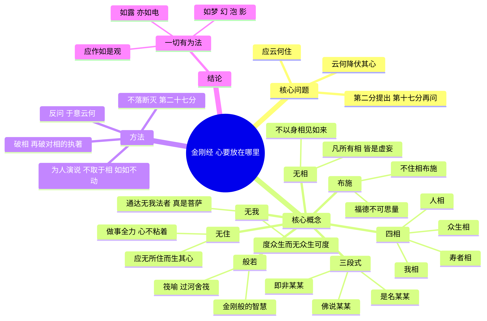

# 读得进，用得上

难读的经典，写成现在的人能读完、也能拿来用的书。

## 这些版本好在哪里

- 原文站得住，句子读得顺：史诗是小说化重写，佛经是核对过的原文加上逐分导读。
- 著名的原句还在。玫瑰色手指的黎明、捷足的阿喀琉斯、我的名字叫“无人”、应无所住而生其心，都留在正文里。
- 导读配有思维导图，并把经文接到现代哲学与科学（龙树、维特根斯坦、休谟、帕菲特、预测加工、接纳承诺疗法等），类比会标明。
- 有虚构的生活案例，也有能当场做的小练习。
- 底本写清楚。荷马沿史诗情节；《金刚经》用鸠摩罗什译、大正藏 T0235，对过 SAT 与江味农本。

## 书目

| 书 | 类型 | 篇幅 | 阅读 |
| --- | --- | --- | --- |
| 《伊利亚特》 | 小说化重写 | 34,210 字 | [阅读](荷马史诗/伊利亚特_现代版.txt) |
| 《奥德赛》 | 小说化重写 | 33,462 字 | [阅读](荷马史诗/奥德赛_现代版.txt) |
| 《金刚经》 | 原文+导读 | 导读 55,197 字 · 经文 5,460 字 | [导读](金刚经/金刚经_现代导读.md) · [原文](金刚经/金刚经_原文.txt) |
| 《道德经》 | 原文+逐章导读 | 导读 93,811 字 · 经文 5,287 字 | [导读](道德经/道德经_现代导读.md) · [原文](道德经/道德经_原文.txt) |

史诗先读《伊利亚特》，再读《奥德赛》。《金刚经》和《道德经》可以单独打开。

## 来许愿

下一本写哪部，由你来点。

**[📚 许愿重写一本](https://github.com/HannibalWangLecter/Books/issues/new?template=book-request.yml)**

先看看[已经许过的书](https://github.com/HannibalWangLecter/Books/issues?q=is%3Aissue+is%3Aopen+label%3Abook-request)。同一本已经有人提过，就在那条 issue 下面点 👍，不必再开一条。👍 多的优先写。

发现错字、断句或和底本不符的引文，请开一条[勘误](https://github.com/HannibalWangLecter/Books/issues/new?template=correction.yml)。挑选和引用的标准写在 [CONTRIBUTING.md](CONTRIBUTING.md)。

## 摘一句

**《伊利亚特》**

> 歌唱吧，女神，歌唱珀琉斯之子阿喀琉斯的愤怒。

**《奥德赛》**

> 我的名字叫“无人”，我的父母和所有的同伴都叫我“无人”。

**《金刚经》**

> 一部五千多字的古经，只回答一个问题：心，要放在哪里，才能既全力以赴，又不被困住？

**《道德经》**

> 一部五千多字的小书，反复讲一件事：在一个人人都想更强、更多、更快的世界里，柔软、留白、退一步，为什么反而走得更远？

## English

Hard classics, rewritten so modern readers can finish them and use them. Faithful plots and famous lines stay; the prose is contemporary Chinese. Epics are novella-length retellings. The Diamond Sutra is the verified Kumārajīva text plus a section-by-section guide (mind map, philosophy and science as labeled analogies, fictional cases, short exercises). The *Tao Te Ching* is the verified Wang Bi text plus an 81-chapter guide.

[Request a book](https://github.com/HannibalWangLecter/Books/issues/new?template=book-request.yml). If someone already asked, add a 👍 on that issue — the most 👍 come first.

Public-domain originals stay public domain. Rewrites and commentary are [CC BY 4.0](LICENSE).

## 关键词

荷马史诗，伊利亚特，奥德赛，特洛伊战争，希腊神话，白话，现代版，Homer，Iliad，Odyssey，Greek mythology，Chinese retelling，金刚经，金刚般若波罗蜜经，佛经白话，般若，空性，正念，哲学，Diamond Sutra，Buddhism，Prajnaparamita，philosophy，道德经，老子，道家，无为，Tao Te Ching，Laozi，Taoism。

## 授权

荷马史诗、鸠摩罗什译《金刚经》与王弼本《道德经》是公有领域文本。本仓库的小说化重写、导读解说和思维导图采用 [CC BY 4.0](LICENSE)。转载或改编这些新写的部分时，请署名并链接本仓库与许可协议；改动了的，请标明。
