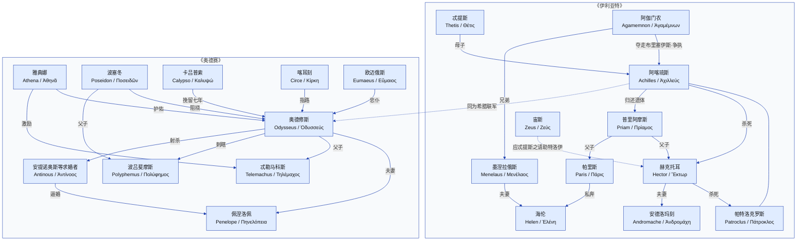

# 荷马史诗 · 关系简图

GitHub 可直接渲染下列 mermaid。总览图见 [荷马史诗_关系简图.png](./荷马史诗_关系简图.png)；更完整的人物网见 [人物关系全图.md](./人物关系全图.md)。

## 故事衔接

```mermaid
flowchart LR
  A["《伊利亚特》<br/>阿喀琉斯（Achilles / Ἀχιλλεύς）的愤怒"]:::one --> B["后记：阿喀琉斯之死"]:::one
  B --> C["木马破城<br/>特洛伊陷落"]:::one
  C --> D["《奥德赛》<br/>海上十年 → 归家"]:::one
  classDef one fill:#e0ecff,stroke:#1e40af,color:#111,stroke-width:1px
  linkStyle default stroke:#1e40af,stroke-width:1.2px
```

## 核心人物关系

实线为直接关系，虚线为间接关系；所有节点统一配色。

```mermaid
flowchart TB
  subgraph IL["《伊利亚特》"]
    Ach["阿喀琉斯<br/>Achilles / Ἀχιλλεύς"]:::one --- Pat["帕特洛克罗斯<br/>Patroclus / Πάτροκλος"]:::one
    The["忒提斯<br/>Thetis / Θέτις"]:::one -->|"母子"| Ach
    Aga["阿伽门农<br/>Agamemnon / Ἀγαμέμνων"]:::one -->|"夺走布里塞伊斯·争执"| Ach
    Aga -->|"兄弟"| Men["墨涅拉俄斯<br/>Menelaus / Μενέλαος"]:::one
    Men -->|"夫妻"| Hel["海伦<br/>Helen / Ἑλένη"]:::one
    Par["帕里斯<br/>Paris / Πάρις"]:::one -->|"私奔"| Hel
    Hec["赫克托耳<br/>Hector / Ἕκτωρ"]:::one -->|"杀死"| Pat
    Ach -->|"杀死"| Hec
    Pri["普里阿摩斯<br/>Priam / Πρίαμος"]:::one -->|"父子"| Hec
    Pri -->|"父子"| Par
    Hec -->|"夫妻"| And["安德洛玛刻<br/>Andromache / Ἀνδρομάχη"]:::one
    Ach -->|"归还遗体"| Pri
    Zeu["宙斯<br/>Zeus / Ζεύς"]:::one -.->|"应忒提斯之请助特洛伊"| Hec
  end
  subgraph OD["《奥德赛》"]
    Ody["奥德修斯<br/>Odysseus / Ὀδυσσεύς"]:::one -->|"夫妻"| Pen["佩涅洛佩<br/>Penelope / Πηνελόπεια"]:::one
    Ody -->|"父子"| Tel["忒勒马科斯<br/>Telemachus / Τηλέμαχος"]:::one
    Ath["雅典娜<br/>Athena / Ἀθηνᾶ"]:::one -->|"护佑"| Ody
    Ath -->|"激励"| Tel
    Pos["波塞冬<br/>Poseidon / Ποσειδῶν"]:::one -->|"阻挠"| Ody
    Pos -->|"父子"| Pol["波吕斐摩斯<br/>Polyphemus / Πολύφημος"]:::one
    Ody -->|"刺瞎"| Pol
    Cal["卡吕普索<br/>Calypso / Καλυψώ"]:::one -->|"挽留七年"| Ody
    Cir["喀耳刻<br/>Circe / Κίρκη"]:::one -->|"指路"| Ody
    Eum["欧迈俄斯<br/>Eumaeus / Εὔμαιος"]:::one -->|"忠仆"| Ody
    Ant["安提诺奥斯等求婚者<br/>Antinous / Ἀντίνοος"]:::one -->|"逼婚"| Pen
    Ody -->|"射杀"| Ant
  end
  Ach -.->|"同为希腊联军"| Ody
  style IL fill:#f8fafc,stroke:#1e40af
  style OD fill:#f8fafc,stroke:#1e40af
  classDef one fill:#e0ecff,stroke:#1e40af,color:#111,stroke-width:1px
  linkStyle default stroke:#1e40af,stroke-width:1.2px
```
