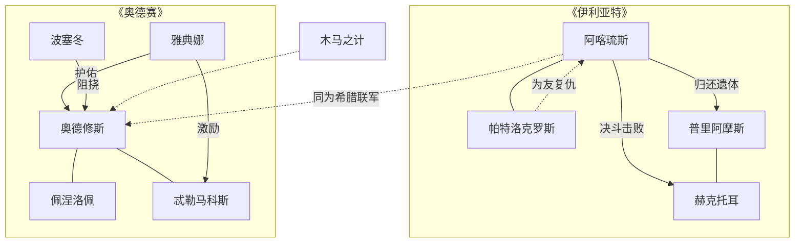

# 荷马史诗 · 关系简图

GitHub 可直接渲染下列 mermaid。总览图见 [荷马史诗_关系简图.png](./荷马史诗_关系简图.png)。

## 故事衔接

```mermaid
flowchart LR
  A["《伊利亚特》<br/>阿喀琉斯的愤怒"] --> B["后记：阿喀琉斯之死"]
  B --> C["木马破城<br/>特洛伊陷落"]
  C --> D["《奥德赛》<br/>海上十年 → 归家"]
```

## 核心人物关系

```mermaid
flowchart TB
  subgraph IL["《伊利亚特》"]
    Ach["阿喀琉斯"] --- Pat["帕特洛克罗斯"]
    Ach -->|"决斗击败"| Hec["赫克托耳"]
    Pat -.->|"为友复仇"| Ach
    Pri["普里阿摩斯"] --- Hec
    Ach -->|"归还遗体"| Pri
  end

  subgraph OD["《奥德赛》"]
    Ody["奥德修斯"] --- Pen["佩涅洛佩"]
    Ody --- Tel["忒勒马科斯"]
    Ath["雅典娜"] -->|"护佑"| Ody
    Ath -->|"激励"| Tel
    Pos["波塞冬"] -->|"阻挠"| Ody
  end

  Ach -.->|"同为希腊联军"| Ody
  C2["木马之计"] -.-> Ody
```
