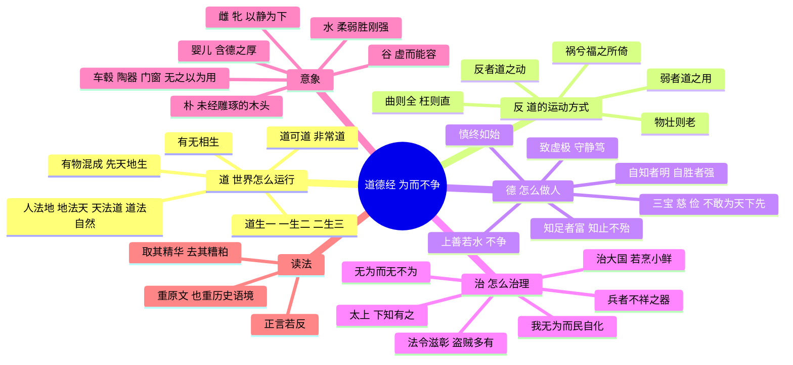
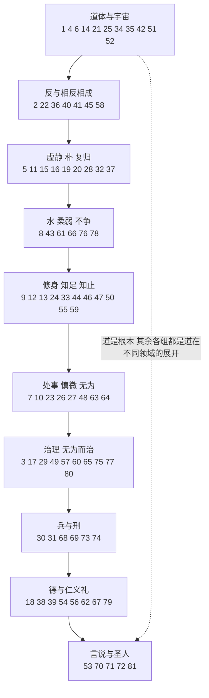
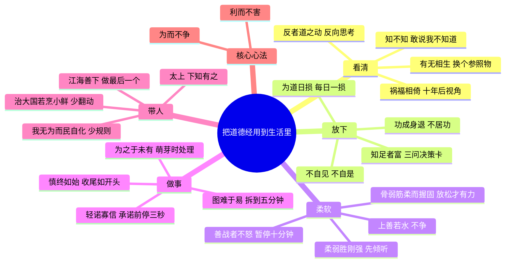

# 为而不争：《道德经》原文与现代导读

> 一部五千多字的小书，反复讲一件事：在一个人人都想更强、更多、更快的世界里，柔软、留白、退一步，为什么反而走得更远？

<!-- 本文件由脚本拼装，原文部分直接取自核对稿 道德经_原文.txt -->

**底本说明**：本书原文采用通行的王弼注本，以楼宇烈《老子道德经注校释》所依的华亭张之象本系统为准，分八十一章，繁体转为简体。原文和维基文库王弼本、《四库全书》本王弼注、光绪十九年鸿文书局本逐章对勘过，凡有改动都列在书末[附录：底本与校勘说明](#附录底本与校勘说明)里。正文中提到马王堆帛书本、郭店楚简本的异文时，只写有据可查的那些。

## 目录

- [开篇 这本书是什么](#开篇-这本书是什么)
- [全书思维导图](#全书思维导图)
  - [八十一章主题分组图](#八十一章主题分组图)
- [核心概念速查表](#核心概念速查表)
- 八十一章逐章导读
   1. [第一章 道可道](#第一章-道可道)
   2. [第二章 天下皆知美之为美](#第二章-天下皆知美之为美)
   3. [第三章 不尚贤](#第三章-不尚贤)
   4. [第四章 道冲](#第四章-道冲)
   5. [第五章 天地不仁](#第五章-天地不仁)
   6. [第六章 谷神不死](#第六章-谷神不死)
   7. [第七章 天长地久](#第七章-天长地久)
   8. [第八章 上善若水](#第八章-上善若水)
   9. [第九章 持而盈之](#第九章-持而盈之)
   10. [第十章 载营魄抱一](#第十章-载营魄抱一)
   11. [第十一章 三十辐共一毂](#第十一章-三十辐共一毂)
   12. [第十二章 五色令人目盲](#第十二章-五色令人目盲)
   13. [第十三章 宠辱若惊](#第十三章-宠辱若惊)
   14. [第十四章 视之不见](#第十四章-视之不见)
   15. [第十五章 古之善为士者](#第十五章-古之善为士者)
   16. [第十六章 致虚极](#第十六章-致虚极)
   17. [第十七章 太上](#第十七章-太上)
   18. [第十八章 大道废](#第十八章-大道废)
   19. [第十九章 绝圣弃智](#第十九章-绝圣弃智)
   20. [第二十章 绝学无忧](#第二十章-绝学无忧)
   21. [第二十一章 孔德之容](#第二十一章-孔德之容)
   22. [第二十二章 曲则全](#第二十二章-曲则全)
   23. [第二十三章 希言自然](#第二十三章-希言自然)
   24. [第二十四章 企者不立](#第二十四章-企者不立)
   25. [第二十五章 有物混成](#第二十五章-有物混成)
   26. [第二十六章 重为轻根](#第二十六章-重为轻根)
   27. [第二十七章 善行无辙迹](#第二十七章-善行无辙迹)
   28. [第二十八章 知其雄](#第二十八章-知其雄)
   29. [第二十九章 将欲取天下](#第二十九章-将欲取天下)
   30. [第三十章 以道佐人主](#第三十章-以道佐人主)
   31. [第三十一章 夫佳兵者](#第三十一章-夫佳兵者)
   32. [第三十二章 道常无名](#第三十二章-道常无名)
   33. [第三十三章 知人者智](#第三十三章-知人者智)
   34. [第三十四章 大道泛兮](#第三十四章-大道泛兮)
   35. [第三十五章 执大象](#第三十五章-执大象)
   36. [第三十六章 将欲歙之](#第三十六章-将欲歙之)
   37. [第三十七章 道常无为](#第三十七章-道常无为)
   38. [第三十八章 上德不德](#第三十八章-上德不德)
   39. [第三十九章 昔之得一者](#第三十九章-昔之得一者)
   40. [第四十章 反者道之动](#第四十章-反者道之动)
   41. [第四十一章 上士闻道](#第四十一章-上士闻道)
   42. [第四十二章 道生一](#第四十二章-道生一)
   43. [第四十三章 天下之至柔](#第四十三章-天下之至柔)
   44. [第四十四章 名与身孰亲](#第四十四章-名与身孰亲)
   45. [第四十五章 大成若缺](#第四十五章-大成若缺)
   46. [第四十六章 天下有道](#第四十六章-天下有道)
   47. [第四十七章 不出户](#第四十七章-不出户)
   48. [第四十八章 为学日益](#第四十八章-为学日益)
   49. [第四十九章 圣人无常心](#第四十九章-圣人无常心)
   50. [第五十章 出生入死](#第五十章-出生入死)
   51. [第五十一章 道生之](#第五十一章-道生之)
   52. [第五十二章 天下有始](#第五十二章-天下有始)
   53. [第五十三章 使我介然有知](#第五十三章-使我介然有知)
   54. [第五十四章 善建者不拔](#第五十四章-善建者不拔)
   55. [第五十五章 含德之厚](#第五十五章-含德之厚)
   56. [第五十六章 知者不言](#第五十六章-知者不言)
   57. [第五十七章 以正治国](#第五十七章-以正治国)
   58. [第五十八章 其政闷闷](#第五十八章-其政闷闷)
   59. [第五十九章 治人事天](#第五十九章-治人事天)
   60. [第六十章 治大国](#第六十章-治大国)
   61. [第六十一章 大国者下流](#第六十一章-大国者下流)
   62. [第六十二章 道者万物之奥](#第六十二章-道者万物之奥)
   63. [第六十三章 为无为](#第六十三章-为无为)
   64. [第六十四章 其安易持](#第六十四章-其安易持)
   65. [第六十五章 古之善为道者](#第六十五章-古之善为道者)
   66. [第六十六章 江海所以能为百谷王](#第六十六章-江海所以能为百谷王)
   67. [第六十七章 天下皆谓我道大](#第六十七章-天下皆谓我道大)
   68. [第六十八章 善为士者不武](#第六十八章-善为士者不武)
   69. [第六十九章 用兵有言](#第六十九章-用兵有言)
   70. [第七十章 吾言甚易知](#第七十章-吾言甚易知)
   71. [第七十一章 知不知](#第七十一章-知不知)
   72. [第七十二章 民不畏威](#第七十二章-民不畏威)
   73. [第七十三章 勇于敢则杀](#第七十三章-勇于敢则杀)
   74. [第七十四章 民不畏死](#第七十四章-民不畏死)
   75. [第七十五章 民之饥](#第七十五章-民之饥)
   76. [第七十六章 人之生也柔弱](#第七十六章-人之生也柔弱)
   77. [第七十七章 天之道其犹张弓](#第七十七章-天之道其犹张弓)
   78. [第七十八章 天下莫柔弱于水](#第七十八章-天下莫柔弱于水)
   79. [第七十九章 和大怨](#第七十九章-和大怨)
   80. [第八十章 小国寡民](#第八十章-小国寡民)
   81. [第八十一章 信言不美](#第八十一章-信言不美)
- [结语 把八十一章收成一句话](#结语-把八十一章收成一句话)
  - [实践清单](#把道德经用到生活里实践清单)
  - [第二张思维导图](#第二张思维导图从原文到生活)
  - [哪些是本书的现代说法](#哪些是本书的现代说法哪些是道德经原意)
- [延伸阅读](#延伸阅读)
- [附录：底本与校勘说明](#附录底本与校勘说明)

---

## 开篇 这本书是什么

### 一本人人都能引两句、很少人读完的书

“上善若水”“千里之行，始于足下”“祸兮福之所倚”“知足者富”“天网恢恢，疏而不失”……这些话你多半听过，有的已经成了成语，挂在客厅、印在茶杯上。可要是问《道德经》到底讲了什么，很多人会卡住：它好像什么都谈，宇宙、修身、治国、打仗；又好像什么都没说透。“道可道，非常道”，第一句就告诉你说不清。

其实它的骨架并不复杂。五千多字里，老子一再回到同一个洞见：**世界上的事，常常朝相反的方向运动（“反者道之动”）；越是用力去抓、去争、去控制，越容易失去；而柔软的、低处的、空着的东西，反而有长久的力量（“弱者道之用”）。** 这个洞见被他用在三个地方：怎么看世界（道），怎么做人（德），怎么治理（无为）。

这本导读的目标很朴素：陪你把八十一章一章一章读下来，读懂每一句，再看看它们在今天的生活里还能不能用、怎么用、哪里不能用。

### 老子其人：一个连司马迁都说不准的人

关于老子最早、最重要的记载，是司马迁《史记·老子韩非列传》。它的说法大致是：老子是楚国苦县厉乡曲仁里人，姓李，名耳，字聃，做过周王室的“守藏室之史”（大致相当于国家图书档案的管理者）。孔子曾经向他问礼。老子看到周朝衰落，就离开了；到了关口，关令尹喜请他著书，于是“著书上下篇，言道德之意五千余言而去，莫知其所终”。

有意思的是，司马迁写完这段，自己也不太确定。他接着记下了两个“或曰”：有人说老莱子就是老子，他也是楚人，著书十五篇；又有人说孔子死后一百多年的周太史儋就是老子，“或曰儋即老子，或曰非也，世莫知其然否”。最后他只好说：“老子，隐君子也。”还记下了“盖老子百有六十余岁，或言二百余岁”的传说。

所以，老子究竟是谁、生活在什么年代，从汉代起就是一个谜。本书采取一个稳妥的态度：**“老子”首先是这部书的作者名，至于他与孔子同时还是更晚，我们存疑。** 这不影响读书，就像我们不完全清楚荷马是谁，照样可以读《奥德赛》。

### 成书：不是一个下午写成的

传说中老子出关前一气呵成写下五千言，这个画面很美，但现代研究大多认为，《道德经》的文本经历了一个较长的形成和整理过程。

二十世纪二三十年代，梁启超、钱穆、冯友兰、胡适等学者围绕“老子年代”有过激烈争论，相关文章不少收进了《古史辨》。有人主张老子在孔子之前，有人认为《老子》成书在战国中晚期。这场争论没有完全结束，但出土文献给了它新的材料：

- **郭店楚简本**：1993 年湖北荆门郭店一号楚墓出土，竹简《老子》分甲、乙、丙三组，约两千字，大约相当于今本的五分之二。墓葬年代一般认为在战国中期偏晚（约公元前 300 年前后）。这说明至少在那时，相当一部分《老子》文字已经流传；但它没有今本第一章、第四十二章等内容，章序也和今本很不一样。郭店本是“节选本”还是“早期形态”，学界争论至今。
- **马王堆帛书本**：1973 年湖南长沙马王堆三号汉墓出土，有甲、乙两种抄本。它们已经和今本大体相当，但有两个显著特点：**《德经》在前，《道经》在后**；有些章的次序和今本不同。甲本不避汉高祖刘邦的讳，“邦”字照写；乙本把“邦”改作“国”。
- **北大汉简本**：2009 年北京大学获赠的一批西汉竹简中，有一部《老子》，简背题“老子上经”“老子下经”，上经相当于《德经》，全书分七十七章，整理者认为抄写于西汉中期，2012 年出版。（这批竹简在 2016 年前后曾有关于真伪的公开争论，多数整理研究者认为其可信。）

这些发现告诉我们：今天读到的“八十一章、道经在前”的样子，是在汉代以后逐步定型的。

### 版本：为什么用王弼本

传世的《老子》主要有几个系统：

- **王弼注本**：三国魏的王弼（226—249）只活了二十多岁，却留下了影响最大的《老子注》，是魏晋玄学的代表作。王弼本文字较为精练，后世最为通行。
- **河上公章句本**：托名西汉“河上丈人”，成书年代有争议，注文常把治国和养身合起来讲，在道教和民间影响很大。
- **傅奕本**：唐初傅奕校定的《道德经古本篇》，据说参考了出土的古本。
- 还有敦煌出土的《老子想尔注》残卷、唐玄宗御注本等等。

本书以王弼本为底本，因为它是今天最通行、注本最多的系统，读者手边的绝大多数版本都和它一致。但凡帛书或郭店本在重要章节中有明显不同、并且能帮助理解的，我们会在“导读解析”里点出来；那些只是字形不同的细小差别，就不打扰你了。

### 影响：从汉初黄老到海德格尔

- **治国**：汉初推崇“黄老之术”，与民休息，史家常把它和“文景之治”联系起来。唐玄宗、宋徽宗、明太祖都给《老子》作过注。
- **思想**：《韩非子》有《解老》《喻老》两篇，是现存最早系统解释《老子》的文字；《庄子》把老子的思想推向更自由、更奇诡的境界；魏晋玄学以“三玄”（《老子》《庄子》《周易》）为核心；宋明理学家虽然批评老子，却深受其影响。
- **宗教**：东汉以后道教兴起，尊老子为“太上老君”，奉《道德经》为根本经典。需要分清的是，**道家哲学和道教宗教虽然有渊源，却不是一回事**。本书讲的是作为思想著作的《道德经》，不讲修炼、内丹和养生术。
- **世界**：十九世纪以后，《道德经》被大量译成西方语言，理雅各（James Legge）、韦利（Arthur Waley）等人的译本影响很大。哲学家海德格尔曾经和中国学者萧师毅一起尝试翻译《老子》的部分章节；经济学家哈耶克在演讲中引用过第五十七章。这些交流的细节，我们放在相关章节里讲。

### 这本书怎么读

1. **原文先行，不必畏难。** 每章开头是完整的原文，紧跟着是白话译文。第一遍可以先读白话，再回头读原文。老子的文字押韵、对仗，很多句子读几遍就能背下来。
2. **抓住三把钥匙。** 读《道德经》，有三个反复出现的思维方式：
   - **相反相成**：有无、难易、长短、高下相互依存（第二章），祸福相倚（第五十八章）。
   - **反向运动**：“反者道之动”（第四十章），事物到了极点就会转向反面。
   - **正言若反**：很多话听起来是反话（第七十八章），比如“柔弱胜刚强”“大巧若拙”“无为而无不为”。遇到“不合常理”的句子，不妨多问一句：它在什么意义上是对的？
3. **重点章节读深，其余章节读通。** 第一、二、八、十一、十六、二十二、二十五、三十三、三十七、四十、四十二、四十四、四十八、五十七、六十、六十三、六十四、七十六、七十八、八十一章写得比较详细，其他章节点到为止。
4. **区分“原意”和“今用”。** 每章的“导读解析”尽量贴着原文和古注讲；“现代视角”是我们把它和今天的心理学、哲学、管理学放在一起看，会标明相似与不同，不硬套。书末专门有一节[哪些是现代说法，哪些是原意](#哪些是本书的现代说法哪些是道德经原意)。
5. **案例是虚构的。** 每章的“生活案例”都是为说明道理而编写的故事，人物和情节均为虚构，标题里也都注明了。
6. **取其精华，去其糟粕。** 《道德经》是两千多年前的书，里面有些政治主张（比如“使民无知无欲”“将以愚之”“小国寡民”）放在今天并不合适。我们会把它们放回历史语境里解释，既不回避，也不美化。

---

## 全书思维导图

先看全景。下面这张图，把《道德经》压缩成“一个根本、一种运动、三个落点、一组意象”。

### 八十一章主题分组图

《道德经》并没有自带严格的结构，章与章之间常常跳跃。下面按主题把八十一章分成十组，**这是本书为了方便阅读而做的分组，不是原书的结构**；很多章同时涉及几个主题，这里只按其最突出的一面归类，每章只出现一次。图中的数字是章号。

---

## 核心概念速查表

读到卡住的词，回来查这里。“现代对应”一栏是帮助理解的**近似类比**，不是严格对等。

| 概念 | 白话解释 | 主要章节 | 现代对应（类比，非等同） |
|---|---|---|---|
| 道 | 万物生成和运行的根本，说不尽、看不见，却无处不在 | 1、25、42 | 宇宙的根本秩序；但老子的道不是人格神，也不是物理定律 |
| 德 | 道在具体事物和人身上的体现，“得道”之“得” | 21、38、51 | 品格；内在的力量（与儒家道德义有别） |
| 无 / 有 | 无：未成形的、空的；有：已成形的、实的。二者相生 | 1、2、11、40 | 结构中的“空间”；留白；冗余 |
| 无为 | 不妄为、不强为，顺应事物的自然；不是什么都不做 | 37、48、57、63 | 不过度干预；“为而不争” |
| 自然 | “自己如此”，事物本来的样子；不是今天说的“大自然” | 17、25、51、64 | 自发秩序；内在动机 |
| 反 | 一说“相反”，一说“返回”；事物向对立面转化、向根本回归 | 16、25、40 | 均值回归、物极必反（类比） |
| 柔弱 | 柔韧、有弹性、有生机；不是软弱 | 36、43、76、78 | 韧性；心理灵活性 |
| 不争 | 不与人争夺，不以自我为中心 | 8、22、66、81 | 合作；仆人式领导（类比） |
| 朴 | 未经雕琢的原木，比喻本真、淳朴 | 19、28、32、37、57 | 本色；未被规训的状态 |
| 虚 / 静 | 心无成见、不躁动 | 16、26、45 | 正念中的“觉察”；冷静（类比） |
| 玄 | 幽深、难以测度 | 1、6、10、51、56 | 深层的、难以言说的 |
| 谷 / 牝 | 山谷、雌性，比喻虚而能容、静而能生 | 6、28、61 | 包容；接纳 |
| 婴儿 | 柔软、纯粹、充满生机的状态 | 10、20、28、55 | 初心；开放的学习者 |
| 知足 / 知止 | 知道满足、知道停止 | 32、33、44、46 | 适度；“够了”的智慧 |
| 啬 / 俭 | 爱惜、积蓄、不浪费 | 59、67 | 余裕；冗余；可持续 |
| 圣人 | 老子理想中的得道者，常指理想的统治者 | 2、49、81 等 | 有道的领导者（注意：并非儒家意义上的道德圣贤） |
| 仁义礼 | 儒家推崇的德目；老子认为是“大道废”后的补救 | 18、19、38 | 规范与制度（老子对其有批评） |
| 正言若反 | 正确的话听起来像反话 | 78 | 悖论式表达 |

---

# 八十一章逐章导读

## 第一章 道可道

*全书的大门：能说出来的“道”，就不是那个恒常的道——先学会对语言保持谦虚。*

> **【原文】**
>
> 道可道，非常道，名可名，非常名。无名，天地之始，有名，万物之母。故常无欲，以观其妙；常有欲，以观其徼。此两者，同出而异名，同谓之玄。玄之又玄，众妙之门。

### 白话译文

能够用言语说出来的“道”，就不是那恒常不变的道；能够用名称叫出来的“名”，就不是那恒常不变的名。

“无名”，是天地的开端；“有名”，是万物的母亲。

所以，要常常处在“无欲”的状态，用来观照道的精微奥妙；常常处在“有欲”的状态，用来观照道的边际和归宿。

这两者，出自同一个来源，只是名称不同，都可以叫作“玄”——幽深难测。幽深而又幽深，那是一切奥妙的总门。

### 导读解析

**一、开篇第一句，先拆自己的台。** 一本书开头就说“我接下来说的，都不是那个真正的东西”，这在古今中外都少见。老子不是在故弄玄虚，而是在提前打一剂预防针：后面五千言里的“道”“德”“无为”“自然”，都只是手指，不是月亮。你若把手指当成月亮，抱着几个词去背、去辩、去崇拜，恰恰离道最远。

这里的两个“道”字意思不同：第一个“道”是名词，指作者要讲的那个根本；第二个“道”是动词，“说”的意思（这是先秦常见用法）。“常”是恒常、不变。所以“道可道，非常道”是说：凡是能被言说、被定义的道，都已经是被切割过、被固定过的“某一种道”，而不是那贯通一切、生生不息的根本。

**二、“常”原来是“恒”：一个避讳的故事。** 1973 年湖南长沙马王堆三号汉墓出土了两种帛书《老子》（学界称甲本、乙本），这一句写作“道，可道也，非恒道也；名，可名也，非恒名也”。今本的“常”，学界一般认为是汉代为避汉文帝刘恒的名讳而改的。“恒”与“常”意思接近，但“恒”更有“持久贯通”的味道。下文“常无欲”“常有欲”，帛书也作“恒无欲也”“恒有欲也”。顺便说一句，帛书这里还写作“无名，万物之始也”，今本作“无名，天地之始”。

**三、“无名”与“有名”：从混沌到命名。** 王弼注说：“凡有皆始于无，故未形、无名之时，则为万物之始；及其有形、有名之时，则长之、育之、亭之、毒之，为其母也。”意思是，同一个道，在万物还没有形状、没有名字的时候，是它们的“开始”；等万物有了形、有了名，道又像母亲一样养育它们。“始”和“母”不是两个东西，是同一个道在不同阶段的两种面貌——这就是下文的“同出而异名”。

**四、一个著名的断句之争。** 这句也可以断成“故常无，欲以观其妙；常有，欲以观其徼”。王弼读作“常无欲”“常有欲”，把“欲”理解为人的欲求：心虚静无欲时，能看到道生万物的精微开端；心有所向时，只能看到事物的边界和结果。宋代王安石、司马光等人主张以“常无”“常有”断句，把“无”“有”当作哲学概念。帛书作“恒无欲也，以观其眇（妙）”，有“也”字隔开，更支持王弼的读法。本书译文依王弼，但两种读法都值得知道。

**五、“玄之又玄”：不是越说越玄，而是不停在任何一层。** “玄”本义是赤黑色，引申为幽深。王弼认为：称它为“玄”，已经是勉强的说法；如果把“玄”也当成一个固定概念抓住，又失去了它，所以要“玄之又玄”——连“玄”也要再往深处放下。这和《金刚经》“法尚应舍，何况非法”有异曲同工之处：不仅要放下具体的名，连那个描述“不可名”的名也不要抓死。

**六、第一章在全书的位置。** 王弼本以此章开篇，属上篇《道经》。但帛书甲乙本都是《德》篇在前、《道》篇在后，也就是说，汉初有一种流行本子是从“上德不德”（今本第三十八章）开始读的。哪种顺序更早，学界仍有争论。另外，年代更早的郭店楚简《老子》（约战国中期，1993 年出土）里，目前没有发现与第一章对应的文字。这提醒我们：这段最有名的开头，并不一定是《老子》最初的“开头”。

### 现代视角

**1. 维特根斯坦：“凡不可说的，必须保持沉默。”** 《逻辑哲学论》以这句话结尾（命题 7），前面还说“确实有不可说的东西，它们显示自身，这就是神秘的东西”（6.522）。这与“道可道，非常道”很容易被并列。相似之处：两者都在为语言划界，都承认有比语言更深的东西。不同之处也很重要：维特根斯坦划界的依据是逻辑形式和命题的意义条件，他关心的是“什么话有意义”；老子关心的是“如何与万物的根本相处”，他并没有沉默，而是写了五千言，用比喻、反语、诗句去“指”。如果借后期维特根斯坦《哲学研究》的说法，可以说老子在玩一种特殊的“语言游戏”：用语言提醒你别困在语言里。

**2. 地图不是领土。** 语义学家阿尔弗雷德·科日布斯基有一句流传很广的话：“地图不是领土。”（The map is not the territory.）你给一种感受命名为“焦虑”，给一个人贴上“难相处”的标签，给自己定义为“失败者”——名字一旦出现，就开始替代真实。名字是有用的（“有名，万物之母”），没有名字我们无法沟通、协作、积累知识；但名字也会遮蔽（“非常名”）。老子的提醒不是“别用名字”，而是“别忘了名字只是名字”。

**3. 认知科学里的“概念化”。** 心理学研究常提到一个现象：人们一旦给事物分类、命名，就会倾向于按类别去看它，忽略细节差异。这是高效的，也是代价。“常无欲以观其妙”可以被现代读者理解为一种练习：暂时放下“我要从中得到什么”“它属于哪类”的心，重新看见事物本身（这是本书的现代说法，不是老子原意）。

### 生活案例（虚构）

**案例一：被一个词困住的年轻人。** 小林二十八岁，在互联网公司做运营，连续两次绩效评级为“待改进”。从那以后，他在心里给自己贴了一个标签：“我就是不行的人。”每次开会，他都先想“我说的会不会又很蠢”，于是越来越少说话，评级也就越来越差。

一位前辈跟他聊天时说：“‘待改进’是 HR 系统里的一个字段，不是你这个人。你把一个名字当成了你的全部。”这句话让小林愣了很久。名可名，非常名——那个评级是一个“可名之名”，它说明了某个季度、某些指标上的情况，但它说不尽一个人。小林后来把那次评级拆成三条具体反馈，一条一条去改。半年后评级回到了“符合预期”，但更大的变化是：他不再把任何一个评价当成对自己的最终定义。

**案例二：说不清的爱。** 一对结婚十年的夫妻吵架。妻子说：“你根本不爱我，你从来不说。”丈夫憋了半天：“我每天接送孩子、修家里的东西……这不就是吗？”两个人都在用自己的“名”去定义“爱”：一个认为爱就是说出来，一个认为爱就是做出来。

“道可道，非常道”在这里有一个温柔的用法：承认爱这件事比任何一种定义都大。咨询之后，他们约定各自学一点对方的“语言”——丈夫每周说一次具体的感谢，妻子留意那些“没说出口的爱”。

### 马上可用的小练习

**“撕标签”两分钟**：写下你最近给自己（或某个人）贴得最牢的一个标签，比如“我拖延”“他自私”“我不擅长社交”。然后在下面写三条**不用这个标签**、只描述具体事实的句子（时间、地点、发生了什么）。写完对比一下：哪一个更接近真实？哪一个让你更有办法行动？

[↑ 回到目录](#目录)

---

## 第二章 天下皆知美之为美

*美与丑、难与易，彼此成全；所以做成了事，也别把功劳攥在手里。*

> **【原文】**
>
> 天下皆知美之为美，斯恶已。皆知善之为善，斯不善已。故有无相生，难易相成，长短相较，高下相倾，音声相和，前后相随。是以圣人处无为之事，行不言之教；万物作焉而不辞，生而不有，为而不恃，功成而弗居。夫唯弗居，是以不去。

### 白话译文

天下人都知道美之所以为美，丑就已经同时出现了；都知道善之所以为善，不善也就同时出现了。

所以，有和无相互生成，难和易相互成就，长和短相互比较而显现，高和下相互依靠而存在，音和声相互应和，前和后相互跟随。

因此，圣人用“无为”的方式处事，用“不言”的方式教化：任万物兴起而不加干涉，生养万物而不据为己有，成就万物而不自恃其能，功业成就而不居功自傲。正因为不居功，功劳反而不会离开他。

### 导读解析

**一、标准一立，对立面就同时诞生。** “天下皆知美之为美，斯恶已”，这里的“恶”是丑，与“美”相对。老子的意思不是“美就是丑”，而是：当整个社会都在高举某一种“美”的标准时，不符合这个标准的东西就立刻被打上了“丑”的标签。王弼注说：“美恶，犹喜怒也；善不善，犹是非也。喜怒同根，是非同门，故不可得偏举也。”——你没法只要一半。

**二、六组相对概念：世界是关系构成的。** 有无、难易、长短、高下、音声、前后，每一对都不是孤立存在的，而是依靠对方才显现出来。“长短相较”的“较”（帛书作“刑”，即形，“显现”的意思）说的就是：没有短，就谈不上长。这是老子辩证思维的第一次集中出场，后面“反者道之动”（第四十章）、“祸兮福之所倚”（第五十八章）都从这里生长出来。帛书在“前后相随”后面还有“恒也”二字，意思是“这是恒常的道理”。

**三、从认识论直接跳到行动论。** 前半章讲世界的结构，后半章立刻讲“所以该怎么做”。既然一切都在相互依存、相互转化中，那么执著于一端、强行推动，就注定失衡。于是有了“处无为之事，行不言之教”。注意，这里是“处事”“行教”，有事要做、有教要行，只是方式不同：不强加，不说教。

**四、“生而不有，为而不恃，功成而弗居”：三个“不”是全书反复出现的品格。** 这组句子（或相近的说法）在第十章、第五十一章、第七十七章还会出现。它描述的是一种“做了却不占有”的姿态：父母生养孩子而不把孩子当私产，管理者做成事情而不把团队当工具，老师教出学生而不以“恩师”自居。最后一句“夫唯弗居，是以不去”非常妙：正因为不抓着功劳，功劳才真正留下来。王弼注：“使功在己，则功不可久也。”

### 现代视角

**1. 对比效应与“锚定”。** 心理学中有大量研究表明，人对事物的判断常常依赖对比：同一件衣服，旁边放一件更贵的，它就显得“划算”；同一份工资，听说同事比你多，它就显得“少”。“长短相较，高下相倾”在这里有了现代回声：我们的大多数“好坏判断”都是相对的、被参照物塑造的。意识到这一点，你就能问自己：“我现在的不满，是因为事情本身不好，还是因为我选了一个让自己痛苦的参照物？”

**2. 社交媒体上的“美之为美”。** 当某种身材、某种生活方式、某种成功模式被算法放大、被千万人点赞时，“斯恶已”的效应就非常明显：不符合这个标准的普通人，会自动觉得自己“不够好”。老子不会告诉你“标准都是错的”，但他会提醒你：标准是被立起来的，它一立，就同时制造了自卑。

**3. 功劳归属与团队心理安全。** 管理学里常讨论“心理安全感”（艾米·埃德蒙森 Amy Edmondson 的研究）：成员敢于说出问题、承认错误、提出想法的团队，往往学得更快。一个总把功劳揽在自己身上的领导，会让团队成员减少主动投入。“功成而弗居”的现代版本，大概就是：把功劳给团队，把责任留给自己。（这是类比，老子说的是圣人与万物的关系，不是现代企业管理。）

### 生活案例（虚构）

**案例一：“别人家的孩子”。** 周女士的女儿上初二，数学考了 85 分。周女士本来挺高兴，晚上在家长群里看到好几个家长晒 98、100，心里一下子沉了，第二天就给女儿加报了补习班。女儿委屈地说：“妈，昨天你还说我进步了。”

85 分没变，变的是参照物。美之为美，斯恶已。周女士后来跟女儿约定：成绩只跟“上一次的自己”比，不跟群里比。

**案例二：项目上线后的庆功会。** 老郑带的团队完成了一个难度很大的系统迁移。庆功会上，老板说“这次多亏老郑”。老郑接过话，把每一个关键节点的负责人都点了名，说了他们具体解决了什么问题。会后，一个平时不太说话的工程师给他发消息：“谢谢你记得我做的那部分。”第二年，这个团队几乎没有人离职。

功成而弗居，夫唯弗居，是以不去。

### 马上可用的小练习

**“换参照物”练习**：下一次你因为比较而不开心时（工资、房子、孩子成绩、身材、粉丝数），停下来写三个字：“跟谁比？”然后换两个参照物再比一次：一个是“三年前的自己”，一个是“一个处境比我更难的人”。不是为了自我安慰，而是为了看清：让你痛苦的，常常是参照物的选择，而不是事实本身。

[↑ 回到目录](#目录)

---

## 第三章 不尚贤

*不标榜、不炫耀、不刺激欲望——一段古代治国主张，以及它今天还能给我们什么。*

> **【原文】**
>
> 不尚贤，使民不争；不贵难得之货，使民不为盗；不见可欲，使民心不乱。是以圣人之治，虚其心，实其腹，弱其志，强其骨。常使民无知无欲。使夫智者不敢为也。为无为，则无不治。

### 白话译文

不推崇所谓的“贤能”，使百姓不争名夺位；不珍视难得的财货，使百姓不去做盗贼；不炫耀那些能引起贪欲的东西，使民心不被扰乱。

所以圣人治理天下：让人们的心思简单，让人们的肚子吃饱；减弱人们争强好胜的心志，强健人们的筋骨。常使百姓没有机巧之心、没有贪求之欲，使那些自以为聪明的人不敢妄为。按照“无为”的原则去做，就没有治理不好的。

### 导读解析

**一、这是一章“治国方案”，先看清它的历史语境。** 老子所处的春秋战国之际，诸侯争霸，各国竞相招揽“贤士”，奢侈品与权力交织，贵族们的欲望不断被刺激、被比较。老子看到的是：越标榜“贤”，人们越去表演贤；越抬高宝物的价格，越多人铤而走险。所以他开出的药方是“不尚贤”“不贵难得之货”“不见可欲”——从源头上减少刺激。

王弼注解释得很细：“尚贤显名，荣过其任，为而常校能相射；贵货过用，贪者竞趣，穿窬探箧，没命而盗。”意思是：推崇贤名，名誉超过了实际的职责，人们就会互相较量、互相攻击；财货被抬高到超过它的用处，贪心的人就会争先恐后，甚至冒死去偷。

**二、“虚其心，实其腹，弱其志，强其骨”：今天读来不舒服的地方。** 这几句，加上“常使民无知无欲”，常被批评为“愚民政策”。这个批评有它的道理：从统治者的角度规定百姓“不要有知识、不要有志向”，在今天看来是不能接受的。现代社会以教育普及、个体自主、公民参与为基本价值，“使民无知”与这些价值直接冲突。

但也要看到古代注家的理解：王弼把“无知”解释为“守其真”，把“智者”解释为“知为”——即“只知道钻营造作的人”。也就是说，老子反对的“知”，主要是机巧、算计、为争夺而生的聪明，而不是今天意义上的知识与教育。即使如此，这一章的立场依然是“治者”对“民”的安排，带有明显的时代局限。

**三、取其内核：减少刺激，而不是压制人。** 如果把主语从“圣人治民”换成“我管理自己”，这一章就变得非常现代：不被虚名驱动（不尚贤），不被稀缺品绑架（不贵难得之货），不把诱惑摆在眼前（不见可欲）；心思简单一点（虚其心），身体照顾好（实其腹，强其骨），好胜心放下一些（弱其志）。这种读法是本书的“转用”，不是老子原意，但它是这一章今天最有用的地方。

### 现代视角

**1. 环境设计胜过意志力。** 行为科学中有一个反复被验证的经验：与其靠意志力抵抗诱惑，不如改变环境，让诱惑不出现在眼前。理查德·塞勒和卡斯·桑斯坦在《助推》（*Nudge*）中讨论了“选择架构”如何影响人们的行为。“不见可欲，使心不乱”可以看作一种古老的环境设计思想。

**2. 古德哈特定律：当指标变成目标。** 经济学家查尔斯·古德哈特提出过一个观察，后来被概括为：“当一个测量指标变成目标，它就不再是好的指标。”“尚贤”而“使民争”，正是这个道理：一旦某种“贤”被明码标价，人们就会去优化那个标签，而不是真正去做好事情。

**3. 消费社会与“难得之货”。** 限量款、饥饿营销、稀缺性定价……现代商业非常懂得“贵难得之货”的力量。这不是说消费本身是坏事，而是提醒：当你想要一样东西，最好分辨一下，是“我需要它”，还是“它被制造得让我想要”。

### 生活案例（虚构）

**案例一：被“优秀员工榜”撕裂的团队。** 一家门店引入“每周销售之星”排名，前三名有奖金。一个月后，店员开始抢客户、互相“截单”，新人根本插不上手，老顾客也被推销得不胜其烦。店长后来改成团队整体目标奖励，再加上顾客满意度回访。抢单现象明显减少。

“不尚贤，使民不争”放在今天，不是说不要激励，而是：别让激励制度把人推向互相争夺。

**案例二：卸载购物 App 的一个月。** 小唐发现自己每天晚上睡前都会刷购物 App，“看看而已”，结果每月账单都超支。她试着把 App 删掉，只保留电脑端，并关掉所有推送。第一个星期很难受，第三周开始，她发现自己真正想买的东西其实很少。

不见可欲，使心不乱——她没有跟欲望硬碰硬，只是让它少出现一点。

### 马上可用的小练习

**“诱惑清单”**：写下最常让你分心或冲动消费的三样东西（某个 App、某类推送、某个货架）。给每一样设计一个“看不见”的方法：移到第二屏、关闭通知、换一条下班路线。一周后看看，你的心是不是安静了一点。

[↑ 回到目录](#目录)

---

## 第四章 道冲

*道像一只空碗，怎么用也装不满——锋芒收一收，光亮调一调。*

> **【原文】**
>
> 道冲而用之或不盈，渊兮似万物之宗；挫其锐，解其纷，和其光，同其尘，湛兮似或存。吾不知谁之子，象帝之先。

### 白话译文

道是空虚的，可是它的作用却无穷无尽，永远不会盈满。它深远啊，好像是万物的宗主。它收敛锋芒，化解纷扰，调和光芒，混同于尘垢。它幽隐啊，似无而又实存。我不知道它是谁的孩子，好像在天帝出现之前就已经有了。

### 导读解析

**一、“冲”：空，所以能用。** “冲”古义通“盅”，指器物空虚。道像一个空的容器，正因为空，才能不断容纳、不断被使用，“用之或不盈”——怎么用都用不满。这和第十一章“当其无，有车之用”是同一个思路：空不是缺陷，空是功能。

**二、“挫其锐，解其纷，和其光，同其尘”。** 这四句在第五十六章还会原样出现。它描写的是道（以及体道者）的样子：不尖锐、不纠缠、不刺眼、不清高。后来“和光同尘”成为成语，形容一个人有光芒却不炫耀、能融入人群而不失本色。需要注意：“同其尘”不是同流合污，王弼注说“其体同尘而不渝其真”——外表与众人相同，内里的真并不改变。

**三、“象帝之先”：一个大胆的说法。** “帝”在殷周宗教中指至上神。老子说道“好像在帝之前”，这在当时是一个相当激进的思想：把世界的根源从人格化的神，推到一个非人格的“道”上。这是中国思想史上一次重要的“去神话化”。

### 现代视角

**留白的力量。** 设计领域常说“负空间”（negative space），一幅海报、一个界面，空白和内容一样重要；日程管理里也有“留白时间”的说法，一天排满的人，没有能力应对任何意外。道“冲而用之或不盈”，提示我们：给自己、给关系、给组织保留一点“空”，它不是浪费，是弹性。

### 生活案例（虚构）

**会议室里最锋利的人。** 阿凯能力很强，开会时总是第一个指出别人方案的漏洞，一针见血。可一年下来，他发现大家越来越不愿意在他面前提想法。一位老同事提醒他：“你的意见是对的，但你每次都像在打赢一场辩论。”后来阿凯试着先问“你这个想法最想解决什么问题”，再提自己的看法。锐还在，只是挫了一挫。

### 马上可用的小练习

**“给日历留白”**：在接下来一周的日程里，每天划出 30 分钟空白，不安排任何事。看看这段“冲”的时间，被你用在了什么地方。

[↑ 回到目录](#目录)

---

## 第五章 天地不仁

*“天地不仁”不是冷酷，而是不偏私；风箱越空，风越多。*

> **【原文】**
>
> 天地不仁，以万物为刍狗；圣人不仁，以百姓为刍狗。天地之间，其犹橐籥乎？虚而不屈，动而愈出。多言数穷，不如守中。

### 白话译文

天地无所偏爱，把万物当作祭祀用的草扎的狗一样对待；圣人无所偏爱，把百姓也当作草扎的狗一样对待。

天地之间，不就像一只风箱吗？空虚而不会穷竭，越鼓动风越多。言论越多，越容易陷入困穷，不如守住虚静的中道。

### 导读解析

**一、“刍狗”是什么？** 刍狗是用草扎成的狗，古代祭祀时用。祭祀之前，人们对它恭敬有加；祭祀结束，就随手丢弃、践踏。（《庄子·天运》里有一段描述刍狗“已陈”之后被践踏、被拿去烧火的情形。）老子用这个比喻，说的不是天地“残忍”，而是天地对万物没有私爱，也没有私恨，一切按自然的规律来去。

**二、“不仁”的真正含义。** “仁”是儒家的核心价值，有亲疏远近、有恩惠施与。王弼注说：“天地任自然，无为无造，万物自相治理，故不仁也。仁者必造立施化，有恩有为。”他还打了个比方：“地不为兽生刍，而兽食刍；不为人生狗，而人食狗。”大地长草不是为了喂野兽，可野兽自然有草吃。不刻意施恩，反而人人有份。

**三、橐籥：空的风箱。** “橐籥”是古代冶炼鼓风用的风箱。它中间是空的，“虚而不屈，动而愈出”——越拉，风越多。天地像风箱一样，正因为空，才能生生不息。

**四、“多言数穷，不如守中”。** “数”通“速”，意为很快；也有人读作“术数”“理数”。“中”有人理解为“中道”，也有人理解为“盅”，空虚。总之是说：话越多、政令越繁，越快走到尽头，不如保持内在的虚静。帛书作“多闻数穷”，意思又不同（听得多、学得杂，反而困穷）。

### 现代视角

**“不偏私”的公正。** 哲学家约翰·罗尔斯在《正义论》中提出“无知之幕”的思想实验：设计社会规则时，假设你不知道自己将处于什么位置。这样设计出的规则才会公正。“天地不仁”与此有一点相通：好的规则不偏爱任何人。区别在于，罗尔斯的正义理论关心的是如何保护弱者，而老子的“不仁”更多是在描述一种自然的、无为的状态。

### 生活案例（虚构）

**偏心的父母。** 一位妈妈总觉得大儿子懂事、小儿子调皮，不自觉地对大儿子更温和，对小儿子更严厉。小儿子越来越叛逆。家庭咨询师建议她：规则对两个孩子一致，爱也尽量不比较。“不仁”在家里的用法，不是不爱，而是不偏心。

### 马上可用的小练习

**“少说一句”**：今天在一次讨论或争执中，当你很想再补充一句、再解释一遍时，试着停下来。看看沉默的那几秒，会发生什么。

[↑ 回到目录](#目录)

---

## 第六章 谷神不死

*山谷般空虚的神妙力量永不消亡——用之不尽，因为它从不用力过猛。*

> **【原文】**
>
> 谷神不死，是谓玄牝。玄牝之门，是谓天地根。绵绵若存，用之不勤。

### 白话译文

山谷般空虚而神妙的力量永不消亡，这叫作“玄牝”——幽深的母性。玄牝的门户，就是天地的根源。它绵绵不绝，若有若无，作用却无穷无尽。

### 导读解析

**一、谷与牝：两个“空”的意象。** 山谷空虚而能容纳万水；“牝”是雌性，能孕育生命。老子用这两个意象来形容道：它不是一个坚硬的实体，而是一个空的、接纳的、能生养的源头。王弼注：“谷神，谷中央无谷也，无形无影，无逆无违，处卑不动，守静不衰。”

**二、老子与“母性”。** 全书多次推崇雌、母、柔、下：“知其雄，守其雌”（第二十八章），“天下之牝”（第六十一章），“食母”（第二十章）。这在以力量和征服为主导的时代是非常独特的视角。不过要注意，老子并不是在讨论现代意义上的性别平等，他是借雌柔的意象来说明一种处世原则。

**三、“用之不勤”。** “勤”在这里是“尽”或“劳”的意思。道的作用持续不断，却从不劳累，因为它不用力过猛。后世道教把这一章发挥为养生、内丹的理论，那是后来的宗教发展，不是本章原意。

### 现代视角

**可持续的节奏。** 运动科学里讲“有氧区间”：长跑者不是靠冲刺跑完全程，而是用一个能持续的配速。心理学研究也发现，长期的高强度工作而缺乏恢复，与职业倦怠有关。“绵绵若存，用之不勤”像是在描述一种可持续的生命节奏：不爆发，不枯竭。

### 生活案例（虚构）

**冲刺型创业者。** 阿宁创业头两年，每天工作十五个小时，第三年身体垮了，住院一个月。出院后他改了作息：每周一天完全不碰工作，每天晚上十一点后不看手机。他说：“以前我以为自己是一台发动机，后来才明白，应该做一条河。”

### 马上可用的小练习

**找到你的“配速”**：回想你精力最好、最能持续工作的一周，那一周你几点睡、工作几小时、做了哪些恢复？把它写下来，作为你的“可持续配速”。

[↑ 回到目录](#目录)

---

## 第七章 天长地久

*不只为自己活，反而活得长久；把自己往后放，反而站到了前面。*

> **【原文】**
>
> 天长地久。天地所以能长且久者，以其不自生，故能长生。是以圣人后其身而身先；外其身而身存。非以其无私邪，故能成其私。

### 白话译文

天长地久。天地之所以能长久，是因为它们不为自己而生存，所以能长久生存。

因此，圣人把自己放在后面，反而能站到前面；把自身置之度外，反而能保全自身。这不正是因为他没有私心吗？所以反而成就了他自己。

### 导读解析

**一、“不自生”：不为自己而活。** 天地养育万物，从不为自己索取。王弼注：“自生则与物争，不自生则物归也。”——总为自己打算，就会和万物争夺；不为自己打算，万物反而归附。

**二、“后其身而身先”：一个辩证的处世法则。** 这是老子“反者道之动”在人事上的具体应用。退让不是软弱，而是一种更深的力量。第六十六章“欲先民，必以身后之”说的也是这个道理。

**三、“以其无私，故能成其私”：坦率得惊人。** 这句话有人读出一点“权谋”味：好像无私只是成私的手段。也可以读作：真正的“私”（自身的保全与成就）恰恰在无私中自然实现。王弼的解释偏向后者：“无私者，无为于身也。身先身存，故曰能成其私也。”本书认为后一种读法更可取：如果“无私”只是手段，那它就不是真的无私，也很难持久。

### 现代视角

**亚当·格兰特的“给予者”研究。** 组织心理学家亚当·格兰特在《给予与索取》（*Give and Take*）中区分了“给予者”“索取者”“互利者”。他的观察是：给予者既可能处在成功阶梯的最底层（被利用、被耗尽），也可能处在最顶层。区别在于，成功的给予者懂得在给予的同时保护自己的边界。这与“外其身而身存”有相通之处，也提供了一个现代补充：无私不等于无底线。

### 生活案例（虚构）

**总帮别人的程序员。** 小吴是团队里最愿意帮新人解决问题的人，有时候自己的任务都会推迟。几年后，团队扩张需要新的组长，大家几乎一致推荐了他。但他也吃过亏：有一阵子帮得太多，自己累到崩溃。后来他学会了每天固定一个小时“答疑时间”，其他时间专心做自己的事。

### 马上可用的小练习

**“后其身”的一件小事**：今天在一个可以争先的场合（开会发言、排队、抢功劳），有意识地让一次。观察：你失去了什么？得到了什么？

[↑ 回到目录](#目录)

---

## 第八章 上善若水

*全书最温柔也最有力量的一章：最好的善，像水一样。*

> **【原文】**
>
> 上善若水。水善利万物而不争，处众人之所恶，故几于道。居善地，心善渊，与善仁，言善信，正善治，事善能，动善时。夫唯不争，故无尤。

### 白话译文

最高的善就像水一样。水善于滋润万物而不与万物相争，停留在众人都厌恶的低洼之处，所以最接近于道。

（最善的人）居处，善于选择低下的地方；心胸，善于保持深沉宁静；待人，善于真诚仁爱；说话，善于恪守信用；为政，善于治理有序；做事，善于发挥所长；行动，善于把握时机。

正因为他不与人争，所以没有过失，也没有怨咎。

### 导读解析

**一、为什么是水？** 老子在全书中反复用水作比喻：“天下莫柔弱于水，而攻坚强者莫之能胜”（第七十八章），“江海所以能为百谷王者，以其善下之”（第六十六章）。水有几个特点，恰好是老子最看重的品质：

- **利万物**：滋养一切，不挑选对象；
- **不争**：遇到石头就绕过去，遇到坑就填满它；
- **处下**：总是流向低处，人人嫌弃的地方，它都愿意去；
- **柔而有力**：看似最软，却能穿石、能载舟也能覆舟。

王弼注只说了一句：“道无水有，故曰几也。”道是无形的，水是有形的，所以水只能“几于道”——接近道，但不就是道。这个区分很重要：水是道的一个最好的比喻，而不是道本身。

**二、“处众人之所恶”。** 这是本章最容易被忽略的一句。人往高处走，水往低处流。老子要人效法的，恰恰是大多数人不愿意做的那部分：去做没人愿意做的事，待在不起眼的位置，承担别人回避的责任。这需要一种真正的谦卑，而不是表演出来的谦虚。

**三、“七善”：水德在人身上的样子。** 居善地、心善渊、与善仁、言善信、正善治、事善能、动善时——这七句从水的品性推出人的品格：

- **居善地**：像水一样安于低处，找到适合自己的位置；
- **心善渊**：像深潭一样沉静，不被表面波澜带走；
- **与善仁**：与人交往，像水滋养万物一样真诚（这一句帛书乙本作“予善天”，甲本作“予善信”，与今本都有出入）；
- **言善信**：像潮汐一样守信；
- **正善治**：“正”通“政”，为政像水一样使万物各得其所；
- **事善能**：像水一样，方则方、圆则圆，能适应各种形状；
- **动善时**：像水随季节涨落一样，把握时机。

有意思的是，这里的“仁”“信”都是儒家色彩很浓的词，老子并不总是反对它们，而是要它们像水一样自然流出，而不是被标榜出来（对比第十八章“大道废，有仁义”）。

**四、“夫唯不争，故无尤”。** “尤”是过错，也有怨恨的意思。不争，所以不犯错，也不招怨。这里的“不争”需要准确理解：水不是不作为，它一刻不停地流动、滋养、冲刷；它只是不在“谁占上风”这件事上较劲。

**五、帛书的一个惊人异文。** 马王堆帛书甲本这一句作“水善利万物而有静”，乙本作“水善利万物而有争”。“有争”与今本的“不争”恰好相反，学者们对此解释不一：有人认为“争”应读作“静”（甲本即作“静”），有人认为是抄写之误。这种异文提醒我们，《老子》的文本在流传中经历过不少变化，我们读到的通行本，是一个历史的结果。

### 现代视角

**1. 李小龙的“像水一样”。** 武术家李小龙在 1971 年接受加拿大电视节目采访时说过一段很有名的话：“清空你的心，像水一样无形无相。把水倒进杯子，它就成了杯子的形状……水能流动，也能撞击。像水一样吧，我的朋友。”（Be water, my friend.）这段话显然受到道家思想的影响，但它强调的是适应性和流动性，更接近“事善能”“动善时”，而不是“处众人之所恶”。

**2. 仆人式领导。** 罗伯特·格林里夫（Robert K. Greenleaf）1970 年在《仆人式领导者》（*The Servant as Leader*）一文中提出“仆人式领导”的理念：最好的领导者首先是一个服务者，他关心的是被领导者是否成长、是否变得更健康、更自主。“上善若水”“处众人之所恶”与此有明显的共鸣。不同之处在于：格林里夫的理念有基督教伦理背景和现代组织语境，老子的语境则是“圣人”与“天下”。

**3. 适应性与韧性。** 心理学中的“心理韧性”（resilience）研究发现，面对逆境时，能灵活调整策略、而不是一味死扛的人，往往恢复得更好。水遇石则绕，遇坑则盈，不是因为软弱，而是因为它始终知道自己要往哪里流。

**4. 与斯多葛主义的一个对照。** 古罗马哲学家马可·奥勒留在《沉思录》中多次用“岬角”自喻：海浪不断拍打，它屹立不动，平息周围的浪涛。有趣的是，斯多葛与老子都追求内心的安宁，却选择了相反的意象：一个做礁石，一个做水。礁石的力量在于“不动”，水的力量在于“不争而无所不至”。两种意象可以互补：守住内心的原则像礁石，处理外部的冲突像水。

### 生活案例（虚构）

**案例一：没人愿意接的项目。** 公司有一个遗留系统，代码混乱、文档缺失，谁接谁倒霉。新来的工程师小艾主动接了。半年里，她一点一点梳理，把文档补齐，把最危险的部分重构。这个系统后来成为公司核心业务的底座，而她成了最懂这个系统的人。她说：“当时没人抢，所以我才有机会。”

处众人之所恶，故几于道。不是说要专门去吃苦，而是：别人回避的地方，往往藏着真正的价值。

**案例二：婆媳之间的“水”。** 小陈的妈妈和妻子在育儿观念上常有冲突。小陈以前总想“讲道理”，结果两边都不满意。后来他换了做法：不争论谁对谁错，而是分别听两边的担心，在具体的事情上找各自都能接受的做法。妈妈担心孩子着凉，他就买了一件更保暖的外套；妻子担心孩子被过度保护，他就和妻子约定周末带孩子去户外。家里的气氛慢慢缓和了。

夫唯不争，故无尤。他不是没有立场，只是不在“谁赢”上较劲。

**案例三：被拒绝后的创业者。** 阿乐的产品连续被十几家投资人拒绝。他没有去争辩“你们看不懂”，而是把每一次拒绝的理由都记下来，慢慢调整产品方向。两年后，产品找到了真实的用户群，投资人反过来找他。动善时——水不跟石头较劲，它等雨季。

### 马上可用的小练习

**“七善”自查表**：拿一张纸，写下七个词——居、心、与、言、正、事、动。在每个词后面，打一个 1 到 5 的分（5 分是最像水），并写一句具体的例子。挑分数最低的那一个，作为你这周的练习方向。比如“言”只有 2 分，就从“答应别人的事，今天之内给一个明确的回复”开始。

[↑ 回到目录](#目录)

---

## 第九章 持而盈之

*杯子满了就会溢，刀磨得太利就会卷——成功之后，懂得收手。*

> **【原文】**
>
> 持而盈之，不如其已；揣而棁之，不可长保。金玉满堂，莫之能守；富贵而骄，自遗其咎。功遂身退，天之道。

### 白话译文

把持着而要使它满盈，不如适可而止；把刀刃捶磨得尖利，锋芒难以长久保持。满屋的金玉，没有人能永远守住；富贵而骄横，是给自己留下祸根。功业完成了，就收敛退身，这是天的规律。

### 导读解析

**一、“持而盈之，不如其已”。** 古代有一种“宥坐之器”（见《荀子·宥坐》），据说空着时倾斜，装一半水时端正，装满水时就翻倒。孔子曾借此讲“满则覆”的道理。老子这句话说的是同一个经验：任何东西推到极致，就会走向反面。

**二、“功遂身退，天之道”。** 这不是叫人“做完就跑”或“辞职归隐”，而是说：功成之后，不要把自己固定在功劳上。王弼注：“四时更运，功成则移。”春天完成了它的事，就让位给夏天。“退”是一种节律，不是一种逃避。历史上常被拿来对照的是范蠡帮助越王勾践复国后功成身退、而文种留下来最终被赐死的故事（见《史记·越王勾践世家》），这当然是后人引申的例子。

### 现代视角

**边际效用递减与“过度优化”。** 经济学的边际效用递减告诉我们：第一块蛋糕最香，第五块可能就腻了。在工作中，“过度优化”也很常见：一个已经足够好的方案，再花一倍时间可能只提升 2%，却错过了更重要的事。“不如其已”是一个提醒：知道什么时候“够了”。

### 生活案例（虚构）

**巅峰时的退场。** 一位知名主持人在节目收视最好的时候宣布离开，很多人不理解。几年后他转型做纪录片，说：“如果等到观众厌倦了我才走，我就不会有勇气重新开始。”

### 马上可用的小练习

**“够了”的标准**：选一件你正在做的事（一份报告、一次装修、一个计划），在开始前写下“做到什么程度就算够了”。完成到那个程度，就停下来。

[↑ 回到目录](#目录)

---

## 第十章 载营魄抱一

*六个连续的追问：你能不能像婴儿一样柔和，像镜子一样清澈？*

> **【原文】**
>
> 载营魄抱一，能无离乎？专气致柔，能婴儿乎？涤除玄览，能无疵乎？爱民治国，能无知乎？天门开阖，能为雌乎？明白四达，能无为乎？生之，畜之。生而不有，为而不恃，长而不宰，是谓玄德。

### 白话译文

精神和形体合一，能不分离吗？聚结精气、达到柔和，能像婴儿一样吗？洗净内心的镜子，能没有一点瑕疵吗？爱护百姓、治理国家，能不用机巧智谋吗？感官与外界开合交接，能保持柔静、像雌性一样吗？通达明白、洞察四方，能不妄为吗？

生养万物，畜育万物；生养而不占有，作为而不自恃，引导而不主宰——这叫作最深远的德。

### 导读解析

**一、一连串反问，不是答案，是功课。** 这一章全用“能……乎”的句式，像一位老师一项一项地问学生：你做到了吗？营魄（魂魄、形神）合一，专气致柔，涤除玄览——这些是修身；爱民治国、天门开阖、明白四达——这些是处世与治理。修身与治世，在老子这里是一体的。

**二、“涤除玄览”：心是一面镜子。** “玄览”一说为“玄鉴”（帛书乙本作“玄监”，“监”即古“鉴”字，镜子），指内心像一面幽深的镜子。“涤除”就是擦拭镜子上的尘垢。这个意象后来在中国思想中非常重要，禅宗神秀“时时勤拂拭”的偈子，也用了相似的意象。

**三、一个版本问题。** “天门开阖，能为雌乎”，四库本作“能无雌乎”，王弼的注文则作“能为雌乎”，本书据注文取“为”。另外，“爱民治国”一句，有的传本作“爱国治民”。这些异文不影响大意。

**四、“玄德”。** 本章结尾的“生而不有，为而不恃，长而不宰”，是老子对理想德性的经典描述，第五十一章还会再次出现。“长而不宰”尤其值得玩味：引导它成长，却不主宰它。

### 现代视角

**自我决定理论与“长而不宰”。** 心理学家爱德华·德西和理查德·瑞安提出的自我决定理论认为，人有三种基本心理需要：自主、胜任、关系。大量研究显示，支持自主的教养和管理方式（提供理由、给予选择、承认对方感受），比控制型方式更能激发持久的内在动机。“长而不宰”可以说是这种“自主支持”的古典表达（类比，非等同）。

### 生活案例（虚构）

**想替孩子规划一切的爸爸。** 老何给儿子选好了兴趣班、规划好了大学专业，儿子却越来越沉默。直到儿子高二时说“我想学设计”，老何才意识到自己从没问过他想要什么。后来他学着把“我替你决定”换成“你怎么想？需要我帮什么？”——长而不宰。

### 马上可用的小练习

**把命令改成提问**：今天和孩子、下属或伴侣说话时，试着把一句“你应该……”改成“你觉得……怎么样？”记录对方的反应。

[↑ 回到目录](#目录)

---

## 第十一章 三十辐共一毂

*车轮、陶碗、房间：真正起作用的，往往是那个“空”。*

> **【原文】**
>
> 三十辐共一毂，当其无，有车之用。埏埴以为器，当其无，有器之用。凿户牖以为室，当其无，有室之用。故有之以为利，无之以为用。

### 白话译文

三十根辐条汇集到一个车毂上，正因为毂中间是空的，才有车的作用。揉和陶土做成器皿，正因为器皿中间是空的，才有器皿的作用。开凿门窗建造房屋，正因为屋里是空的，才有房屋的作用。

所以，“有”给人带来便利，“无”才发挥了真正的作用。

### 导读解析

**一、三个日常的例子。** 这一章没有任何玄奥的词，只举了三样每个人都见过的东西：车轮、陶罐、房屋。

- **车毂**：车轮中心那个圆木，三十根辐条插在它的周围，中间是空的，好让车轴穿过去。没有那个“空”，轮子就转不起来。（“三十辐”据说是古代车轮常见的辐条数，也有人认为它与一个月约三十日相应，这只是一种解释。）
- **陶器**：“埏埴”是揉和陶土。碗之所以能盛水，是因为它中间是空的。
- **房屋**：“户”是门，“牖”是窗。房子能住人，是因为四壁之间是空的；门窗之所以有用，是因为墙上开了洞。

**二、“有之以为利，无之以为用”。** 这是全章的结论，也是老子关于“有”与“无”最清晰的一次说明。“利”是便利、条件；“用”是作用、功能。墙壁、陶土、辐条是“有”，它们提供了条件；中间的“无”，才使功能得以实现。王弼注：“木、埴、壁所以成三者，而皆以无为用也。言无者，有之所以为利，皆赖无以为用也。”

注意，老子并没有说“有”不重要。没有陶土，就没有碗中的空。“有”与“无”是一起工作的，就像第二章说的“有无相生”。现代人往往只看见“有”——房子的面积、车的配置、简历上的头衔——而忘了真正让生活运转的，是那些看不见的“空”。

**三、这里的“无”，不同于第一章的“无”。** 第一章的“无”是形而上的，指道生万物之前的状态；这一章的“无”是具体的“空间”“空隙”。二者有联系，但层次不同。读老子，要注意同一个字在不同章节的不同意义。

### 现代视角

**1. 海德格尔与“壶”：一段有文献可考的关联。** 德国哲学家马丁·海德格尔与《老子》之间有一些确凿的文献联系：

- 1943 年，他在《诗人的独一性》（*Die Einzigkeit des Dichters*）一文的结尾，完整引用了《老子》第十一章的德语译文。
- 1946 年夏天，他与中国学者萧师毅（Paul Shih-yi Hsiao）尝试合作把《老子》译成德文，据萧师毅的回忆（《海德格尔与我们的〈道德经〉翻译》，收于 Graham Parkes 编《海德格尔与亚洲思想》，1987），他们只译完了前八章左右，没有继续下去。
- 1949 年至 1950 年，海德格尔在演讲《物》（*Das Ding*）中，以一只壶（Krug）为例讨论“物”：壶之所以为壶，不在于壶壁和壶底，而在于那个能够容纳的“空”（die Leere）。

很多学者（如莱因哈德·梅 Reinhard May 在《海德格尔的隐秘来源》中）认为，海德格尔对壶之“空”的思考受到了《老子》第十一章的影响。但海德格尔在《物》这篇演讲里并没有直接引用老子，所以这是一种很有说服力的推测，而不是作者本人的明确声明。

两者的相似处很明显：都从一个器皿的“空”出发，翻转了“实体优先”的常识。不同处也很明显：海德格尔的壶指向他晚期的“天、地、神、人”四重整体（das Geviert），讨论的是物如何“聚集”世界；老子的车、器、室更朴素，主要是说明“无”的作用，为“无为”“虚静”的人生态度提供依据。

**2. 设计中的“负空间”与“少即是多”。** 建筑师密斯·凡·德·罗以“少即是多”（Less is more）闻名。好的设计常常不是加东西，而是留空间：一页排版的留白，一个产品去掉不必要的按钮，一间房子少一件家具。日本美学中“间”（ma）的观念也常被拿来讨论空隙的价值。这些都与“无之以为用”相通，但它们是审美与设计的原则，老子讲的则更宽：人生、心灵、治理都需要“空”。

**3. 心理上的“空”：余裕。** 行为经济学家森德希尔·穆来纳森和埃尔德·沙菲尔在《稀缺》（*Scarcity*）中讨论过一个现象：当人长期处于时间或金钱的极度紧张中，认知“带宽”会被占满，判断力和自控力都会下降。他们用“余裕”（slack）来描述那种留有余地的状态。一颗被塞满的心，就像一只装满的碗——再好的东西也放不进去了。

### 生活案例（虚构）

**案例一：排满的日程。** 张经理的日程表从早上八点到晚上十点，每半小时一个会。他自认为“效率很高”，可团队成员说找他商量事情要提前一周预约。有一次一个紧急问题没能及时处理，造成了不小的损失。复盘时，他自己写了一句话：“我把日程填满了，却没给真正重要的事留一个空。”从那以后，他每天下午留出一个小时的“空档”，不安排任何会议。

**案例二：会说话的沉默。** 心理咨询师在和来访者交谈时，有时会刻意停顿，不急着接话。很多来访者就在这几秒钟的沉默里，说出了真正想说的话。好的倾听，就像碗中的空——它不说什么，但它让对方有地方放下自己。

**案例三：断舍离之后。** 一对年轻夫妻搬进新家，起初把每个角落都塞满了家具和收纳盒。一年后他们清理掉三分之一的东西，客厅空出一块地方。孩子在那里搭积木，夫妻俩在那里做瑜伽，周末朋友来了也有地方坐。他们说：“这块地方什么都没放，却是家里用得最多的地方。”

### 马上可用的小练习

**找到你生活里的“毂中之空”**：写下三个你生活中“看起来什么都没有、其实最有用”的空间或时间——比如通勤路上不看手机的十分钟、书桌上空出来的一块地方、和伴侣睡前不说话的片刻。问问自己：这些“空”，最近是不是被填满了？如果是，选一个，把它重新空出来。

[↑ 回到目录](#目录)

---

## 第十二章 五色令人目盲

*五色令人目盲：刺激越多，感受力越钝。*

> **【原文】**
>
> 五色令人目盲，五音令人耳聋，五味令人口爽，驰骋畋猎令人心发狂，难得之货令人行妨。是以圣人为腹不为目，故去彼取此。

### 白话译文

缤纷的色彩使人眼花缭乱，纷繁的音乐使人听觉迟钝，丰盛的美味使人味觉败坏，纵情狩猎使人心神放荡发狂，稀有的财货使人行为不轨。所以圣人只求吃饱肚子，不追逐耳目之欲，因此舍弃后者而选取前者。

### 导读解析

**一、“五色”“五音”“五味”。** 这是古代对色彩（青赤黄白黑）、音阶（宫商角徵羽）、味道（酸苦甘辛咸）的概括，这里泛指一切感官享受。“口爽”的“爽”是“差失”，指味觉失灵。

**二、“为腹不为目”。** 王弼注说得很透彻：“为腹者以物养己，为目者以物役己。”吃饱肚子，是用物来养自己；追逐耳目之欲，是让自己被物奴役。区别不在于“享受”本身，而在于你是主人还是奴隶。

**三、这不是禁欲主义。** 老子并没有说要闭上眼睛、塞住耳朵，而是反对“过度”。需要被满足，欲望却可能永无止境。

### 现代视角

**享乐适应与选择过载。** 心理学家菲利普·布里克曼和唐纳德·坎贝尔在 1971 年提出“享乐跑步机”的说法：人会很快适应新的快乐，于是需要更强的刺激。巴里·施瓦茨在《选择的悖论》（*The Paradox of Choice*）中讨论了选择过多带来的焦虑。短视频、无限滚动、算法推荐，在某种意义上就是“五色”“五音”的现代加强版。

### 生活案例（虚构）

**吃不出味道的美食博主。** 小雅做美食探店三年，每天吃三四家餐厅。她渐渐发现自己吃什么都“差不多”，只能靠越来越辣、越来越甜的东西刺激味觉。一次生病后，她喝了一碗白粥，突然觉得“好香”。那一刻她明白了什么叫“五味令人口爽”。

### 马上可用的小练习

**“低刺激一小时”**：今晚留一个小时，不看屏幕、不听音乐、不吃零食。只是散步、喝水、发呆。结束时问问自己：五官是不是比平时更灵敏了一点？

[↑ 回到目录](#目录)

---

## 第十三章 宠辱若惊

*被夸和被骂，都让人心惊——因为我们把“身”看得太重，又看得太轻。*

> **【原文】**
>
> 宠辱若惊，贵大患若身。何谓宠辱若惊？宠为下，得之若惊，失之若惊，是谓宠辱若惊。何谓贵大患若身？吾所以有大患者，为吾有身，及吾无身，吾有何患？故贵以身为天下，若可寄天下；爱以身为天下，若可托天下。

### 白话译文

受宠和受辱都让人惊恐不安，重视大的祸患就像重视自身一样。

什么叫“宠辱若惊”？受宠本身就是卑下的，得到它时心惊，失去它时也心惊，这就叫宠辱若惊。

什么叫“贵大患若身”？我之所以会有大的祸患，是因为我有这个身体（和由此而来的种种牵挂）；如果我没有这个身，我还有什么祸患呢？

所以，能像珍重自身一样去珍重天下的人，才可以把天下寄托给他；能像爱惜自身一样去爱惜天下的人，才可以把天下托付给他。

### 导读解析

**一、“宠为下”：得宠本身就意味着处在低位。** 被别人宠爱，意味着你的荣辱取决于别人的给予。得到了怕失去，失去了又惶恐。宠与辱，看似相反，实际上是同一种依赖。王弼注：“宠必有辱，荣必有患。”

**二、“及吾无身，吾有何患”：不是要人轻生。** 这句话容易被误解为“只要没有身体就没有烦恼”。结合全章看，老子的意思更可能是：我们的忧患来自对“身”（以及身外的名利）的过度执著。后半章立即说“贵以身为天下”，恰恰是肯定身体的珍贵。合起来理解是：珍惜生命，但不被身外之物绑架；能这样珍惜自己的人，才能真正珍惜天下。

### 现代视角

**依恋外部认可与“随因自尊”。** 心理学家珍妮弗·克罗克等人研究过“随因自尊”（contingent self-worth）：当一个人的自我价值高度依赖外部评价（外貌、成绩、他人认可），他的情绪就会随着评价剧烈波动。“宠辱若惊”几乎是对这种状态的精确描述。

### 生活案例（虚构）

**点赞焦虑。** 小美发了一条朋友圈，一小时内收到二十个赞，她很开心；第二条只有三个赞，她开始怀疑自己是不是哪里说错了。她意识到，自己的心情已经被一个数字牵着走。她开始练习：发完内容就放下手机，两小时后再看。

### 马上可用的小练习

**“宠辱日记”三天**：连续三天，记录一次让你特别高兴的表扬和一次让你特别难受的批评。第三天比较一下：它们是不是都来自同一种东西——别人的评价？

[↑ 回到目录](#目录)

---

## 第十四章 视之不见

*看不见、听不到、摸不着——如何谈论一个无法被感官抓住的东西？*

> **【原文】**
>
> 视之不见名曰夷，听之不闻名曰希，搏之不得名曰微。此三者，不可致诘，故混而为一。其上不皦，其下不昧。绳绳不可名，复归于无物。是谓无状之状，无物之象，是谓惚恍。迎之不见其首，随之不见其后。执古之道，以御今之有。能知古始，是谓道纪。

### 白话译文

看它看不见，叫作“夷”；听它听不到，叫作“希”；摸它摸不着，叫作“微”。这三者无法追问到底，所以它们混而为一。

它上面并不光亮，下面也不昏暗；绵绵不绝而无法命名，最终又回到无形无物的状态。这叫作没有形状的形状，没有物体的形象，这叫作“惚恍”。迎着它，看不见它的头；跟着它，看不见它的尾。

把握自古就存在的道，来驾驭今天的具体事物。能够认识远古的开端，这就叫作道的纲纪。

### 导读解析

**一、夷、希、微：三个否定的名字。** 老子用感官的失败来描述道：视觉、听觉、触觉都抓不住它。这是一种“否定式”的描述方法，在很多哲学和宗教传统中都能找到类似的进路。

**二、一段有趣的学术轶事。** 19 世纪法国汉学家雷慕沙（Jean-Pierre Abel-Rémusat）曾提出，“夷、希、微”三字的读音（他读作 I-Hi-Wei）可能与希伯来语的上帝之名“耶和华”有关。黑格尔在《哲学史讲演录》讲到中国哲学时也提到了这一说法。这一猜测后来被学界普遍否定，但它显示了早期欧洲人理解老子时的好奇与误读。

**三、“执古之道，以御今之有”。** 道虽然无形，却不是空谈：把握那个根本的规律，就能应对当下的具体事务。这一句把形而上的讨论拉回了现实。

### 现代视角

**“否定神学”与谦卑的认知。** 西方中世纪有一种“否定神学”传统（如托名狄奥尼修斯的著作），认为只能说上帝“不是什么”，而不能说上帝“是什么”。老子的“夷希微”在方法上与之有相似之处，但老子的道不是人格神，也不是信仰的对象。

### 生活案例（虚构）

**说不清的“团队氛围”。** 一位新上任的经理想知道为什么团队士气低落，做了很多问卷，数据都“正常”。后来他每天和不同的人吃午饭，慢慢感觉到一些问卷测不出来的东西：几次不公平的晋升、一个被冷落的老员工。有些东西，视之不见，但它真实存在。

### 马上可用的小练习

**“三感”观察**：找一个你熟悉的地方（办公室、家里客厅），闭上眼睛一分钟，只用听觉和触觉感受它。然后睁眼，写下你以前从来没注意到的一样东西。

[↑ 回到目录](#目录)

---

## 第十五章 古之善为士者

*浑浊的水，静下来就会慢慢变清——海德格尔书房里挂着的两句话。*

> **【原文】**
>
> 古之善为士者，微妙玄通，深不可识。夫唯不可识，故强为之容。豫焉若冬涉川，犹兮若畏四邻，俨兮其若容，涣兮若冰之将释，敦兮其若朴，旷兮其若谷，混兮其若浊。孰能浊以静之徐清？孰能安以久动之徐生？保此道者不欲盈，夫唯不盈，故能蔽不新成。

### 白话译文

古代善于行道的人，精微玄妙而通达，深刻得难以认识。正因为难以认识，所以只能勉强形容他：

他小心谨慎，像冬天赤脚过河；他警惕戒备，像提防四邻的围攻；他恭敬庄重，像去做客；他舒展洒脱，像冰凌将要融化；他淳厚质朴，像未经雕琢的原木；他心胸开阔，像空旷的山谷；他浑朴随和，像浑浊的水。

谁能使浑浊的水安静下来，慢慢变清？谁能使安定的东西长久地动起来，慢慢生长？保持这种道的人不求满盈。正因为不求满盈，所以能够守旧而不急于求新。

### 导读解析

**一、七个比喻：一个人的“气质画像”。** 豫、犹、俨、涣、敦、旷、混——这七个形容词描绘了一个体道者的样子。有意思的是，这些描述有的相互矛盾：既谨慎又洒脱，既庄重又随和。这恰恰说明，真正有修养的人不是单一的性格标签，而是能够根据情境自然地呈现不同的面貌。

**二、“孰能浊以静之徐清？孰能安以久动之徐生？”** 这是全章的核心。浑浊的水，你越去搅它越浑；只要让它静下来，泥沙就会慢慢沉淀。“徐”字非常关键：慢慢地。清澈不是一下子得来的，生长也不是一下子完成的。

**三、海德格尔书房里的对联。** 据萧师毅回忆及海德格尔友人佩策特（Heinrich Wiegand Petzet）的记述，海德格尔非常喜爱这两句，曾请萧师毅逐字讲解，并用毛笔写成一副对联，萧师毅又加了一个横批“天道”。这副字后来挂在海德格尔的书房里。1947 年海德格尔给萧师毅的一封信中，也曾引用这两句的德语意译。这是西方哲学与《老子》相遇的一个有确切记载的细节。

**四、“蔽不新成”。** 这句异说很多。王弼注：“蔽，覆盖也。”一种理解是：能够守住旧的、被覆盖的东西，而不急于求新；也有学者认为“不”字是“而”字之误，读作“蔽而新成”（去旧更新）。本书译文依字面理解。

### 现代视角

**“慢慢变清”与情绪调节。** 心理学研究常提到，强烈情绪往往会随时间自然减退，而反复压抑或反刍反而可能延长它。正念训练中常用“雪花球”的比喻：摇晃后雪花纷飞，静置一会儿，雪花自然落下。这几乎就是“浊以静之徐清”的现代版本。

### 生活案例（虚构）

**吵架后的二十分钟。** 一对夫妻常常在气头上越吵越凶。后来他们约定：一旦有一方说“我需要静一静”，双方各自离开二十分钟，再回来谈。他们发现，很多话二十分钟后根本就不想说了，剩下的部分也能平静地谈清楚。

### 马上可用的小练习

**“静水”三分钟**：当你感到心烦意乱时，倒一杯水，看着它静止下来。在这三分钟里，什么也不做，只是呼吸，看着水。然后问自己：现在最需要做的一件事是什么？

[↑ 回到目录](#目录)

---

## 第十六章 致虚极

*致虚极，守静笃：万物纷纷扰扰，最终都要回到根上去。*

> **【原文】**
>
> 致虚极，守静笃。万物并作，吾以观复。夫物芸芸，各复归其根。归根曰静，是谓复命。复命曰常，知常曰明。不知常，妄作凶。知常容，容乃公，公乃王，王乃天，天乃道，道乃久，没身不殆。

### 白话译文

让心灵的虚空达到极致，坚定地守住清静。万物一起蓬勃生长，我从中观察它们的循环往复。

万物纷纷芸芸，最后各自回归到它们的根本。回归根本叫作“静”，静叫作回复本性。回复本性叫作“常”（恒常的规律），认识恒常的规律叫作“明”。不认识这个规律而轻举妄动，就会招致凶险。

认识了恒常规律的人能包容一切，能包容一切就能大公无私，大公无私才能周全天下（成为王者），周全天下才能合于天，合于天才能合于道，合于道才能长久，终身不会遭遇危险。

### 导读解析

**一、“致虚极，守静笃”：功夫在先，观察在后。** 这六个字是全章的起点，也是后世修养功夫论中最常被引用的文字之一。“致”是推到极致，“笃”是坚定。注意顺序：先“虚”和“静”，然后才能“观”。一个塞满了念头、躁动不安的心，看不清任何东西——这正是第十五章“浊以静之徐清”的延续。帛书作“至虚极也，守静督也”。

**二、“万物并作，吾以观复”：从生长中看见回归。** 普通人看万物，看到的是“作”：发芽、开花、扩张、繁荣。老子看到的是“复”：落叶归根，潮起潮落，一切兴起的东西最终都会回去。王弼注：“凡有起于虚，动起于静，故万物虽并动作，卒复归于虚静，是物之极笃也。”

这个“复”字，是理解老子的一把钥匙。它和第二十五章的“远曰反”、第四十章的“反者道之动”相互呼应：道的运动是循环的、回返的，而不是一条直线向前。

**三、归根—静—复命—常—明：一条认识的阶梯。** 这一串概念环环相扣：

- **归根**：回到根本；
- **静**：回到根本就是静；
- **复命**：“命”可理解为本性、生命的本来状态，复命就是回复本性；
- **常**：回复本性，就合于恒常的规律；
- **明**：认识这个恒常规律，就叫“明”——真正的明白。

后面紧接一句警告：“不知常，妄作凶。”不了解规律而乱来，必有凶险。这就是“无为”的认识论基础：无为不是什么都不做，而是不“妄作”。

**四、“公乃王，王乃天”：一个异文。** 本书所据的王弼本系统作“公乃王，王乃天”。有学者（如近人劳健）认为“王”应是“全”字之误，一些今注今译本据此改作“公乃全，全乃天”。王弼的注文“荡然公平，则乃至于无所不周普也”，用“周普”来解释，意思也接近“全”。无论作“王”还是“全”，大意都是：越能包容，越能公正；越公正，越能周全——最终与天道相合。

**五、“没身不殆”。** “没身”即终身。这是全章的落脚点：认识规律、顺应规律的人，一生都不会陷入危险。

### 现代视角

**1. 坐不住的现代人。** 2014 年，心理学家蒂莫西·威尔逊等人在《科学》杂志发表的一项研究中，让参与者独自待在房间里 6 到 15 分钟，什么也不做，只是思考。很多人觉得很难受；在一个实验中，相当一部分参与者宁愿按下按钮给自己一次轻微电击，也不愿意只是安静地坐着。帕斯卡尔在《思想录》里早就感叹：人类的一切不幸，都源于不能安静地待在自己的房间里。“守静笃”在今天可能比在任何时代都更难，也更重要。

**2. 走神的心是不快乐的心。** 2010 年，马修·基林斯沃思和丹尼尔·吉尔伯特在《科学》上发表了一项基于手机采样的研究，结论是：人们清醒时有相当大比例的时间在走神，而走神时通常比专注于当下时更不快乐。这项研究的标题就是“走神的心是不快乐的心”（A Wandering Mind Is an Unhappy Mind）。“致虚极，守静笃”不是让人发呆，而是让心有一个安住的地方。

**3. 生态学中的循环。** 生态系统中的物质是循环的：落叶被分解，养分回到土壤，又被树根吸收。“各复归其根”在这里几乎是字面意义上的真实。复杂系统研究也告诉我们，许多系统在扰动之后有回到稳态的倾向。当然，老子的“复”是一种哲学观照，不是生态学理论，但这种类比能帮助我们理解：成长与回归是同一个过程的两面。

**4. 与黑格尔辩证法的区别。** 黑格尔的辩证运动是螺旋上升的，每一次“回到自身”都是更高层次的综合，历史有方向、有目的。老子的“复”更像四季循环，强调回到根本，而不是走向某个终点。这一区别很重要，下文第四十章还会细讲。

### 生活案例（虚构）

**案例一：裁员后的三个月。** 老秦四十五岁被裁员。前一个月，他每天投二十份简历，焦虑得睡不着。第二个月，他开始每天早上去公园走一圈，不带手机。他说：“走着走着，我想明白了一件事：我这二十年真正擅长的不是那个职位，而是帮人把复杂的事情理清楚。”第三个月，他接到了第一个咨询项目。

他没有找到“新方向”，而是回到了“根”上。归根曰静，静曰复命。

**案例二：一个母亲的“静”。** 林女士的儿子进入青春期，常常摔门、顶嘴。她以前总是立刻回击，母子关系越来越僵。后来她给自己定了一个规则：儿子发脾气时，她先不说话，深呼吸十次，等自己的心静下来再开口。她发现，很多时候儿子自己就会平静下来，甚至会回来道歉。不知常，妄作凶——她以前的回击，正是一种“妄作”。

**案例三：创业公司的“回到第一性”。** 一家快速扩张的公司在第三年陷入混乱：产品线太多，团队目标不一致，用户投诉增多。创始人带着核心团队闭门两天，只讨论一个问题：“我们最初为什么要做这个产品？”他们砍掉了一半的项目，重新聚焦核心用户。一年后，公司恢复了增长。万物并作，吾以观复。

### 马上可用的小练习

**“守静”五分钟**：每天找一个固定时间（比如起床后或午饭后），坐下来，设一个五分钟的计时器。不看手机，不听音乐，只是坐着，观察呼吸，观察念头的起落。念头来了，不追它；念头走了，不留它。一开始你会坐立不安——这很正常，威尔逊的实验告诉我们，大多数人都是这样的。坚持一周，看看第七天和第一天有什么不同。

**进阶：“观复”日记。** 每晚写下一件今天“起来了”的事（一个情绪、一个冲突、一个兴奋的想法），再写下它现在“回到了哪里”。慢慢地，你会对“万物并作，吾以观复”有切身的体会。

[↑ 回到目录](#目录)

---

## 第十七章 太上

*最好的领导，人们只知道有他；事成之后，大家说“我们本来就是这样”。*

> **【原文】**
>
> 太上，下知有之；其次，亲而誉之；其次，畏之；其次，侮之。信不足焉，有不信焉。悠兮其贵言，功成事遂，百姓皆谓我自然。

### 白话译文

最好的统治者，百姓只知道有他存在；次一等的，百姓亲近他、赞美他；再次一等的，百姓畏惧他；最差的，百姓轻蔑他、背后骂他。

统治者的诚信不足，百姓才会不信任他。

最好的统治者悠然自在，很少发号施令。事情办成了，百姓都说：“我们本来就是这样的。”

### 导读解析

**一、领导的四个层次。** 这一章给出了一个清晰的排序：

1. **太上，下知有之**：最好的领导，百姓只知道“有这么个人”，感觉不到他的干预；
2. **其次，亲而誉之**：用恩惠和仁德赢得爱戴和赞美；
3. **其次，畏之**：靠权威和刑罚让人畏惧；
4. **其次，侮之**：失去了威信，被人轻蔑、嘲笑。

很多人会以为第二种——被爱戴、被歌颂——就是最高境界了。老子却把它排在第二。王弼的解释是：第二种是“不能以无为居事，不言为教，立善行施，使下得亲而誉之”——它依然是一种“有为”，依然需要不断施恩、不断被看见。而最高的领导，是让人感觉不到被领导。

**二、“下知有之”还是“不知有之”？** 本书所据的王弼本作“太上，下知有之”，王弼注也说“故下知有之而已”。马王堆帛书甲乙本和郭店楚简本也都作“大上，下知有之”。后世有一些传本作“太上，不知有之”，意思更极端：百姓连有这么个人都不知道。今天很多引用用的是“不知有之”的版本。从出土文献和王弼本看，“下知有之”应该更接近古本。这两种读法在精神上是一致的：最好的领导，存在感最低。

**三、“信不足焉，有不信焉”。** 这句话在第二十三章还会出现。领导者自己的诚信不够，百姓才会不信任。这是因果关系的清醒判断：不要先抱怨下面的人不信任你，先问问自己是否值得信任。

**四、“悠兮其贵言”。** “贵言”是看重言语、不轻易发号施令。好的领导话不多，但说出来的话有分量。这与第二章“行不言之教”、第五章“多言数穷”一脉相承。

**五、“百姓皆谓我自然”：全书“自然”一词的首次重要出场。** “自然”在老子这里不是“大自然”（nature），而是“自己如此”“本来这样”。事情做成了，百姓觉得“这是我们自己做到的”，而不是“这是领导恩赐给我们的”。这是“无为”治理最理想的结果：人们获得了能力感和主体感。

需要说明：这是一章关于古代君主治理的论述，它设想的是一个“圣人在上”的结构，并不涉及现代民主制度中的问责、程序、权力制衡等问题。我们借用它来理解领导力，是一种合理的引申，而不是说老子已经提出了现代管理理论。

### 现代视角

**1. 仆人式领导与“第五级领导者”。** 罗伯特·格林里夫的“仆人式领导”认为，检验领导是否成功的标准，是被服务的人是否成长了、是否变得更自主。管理学者吉姆·柯林斯在《从优秀到卓越》（*Good to Great*，2001）中描述了“第五级领导者”的特质：个人的谦逊与职业的意志相结合。他观察到，这些领导者在成功时往往把功劳归于他人和运气，失败时则把责任揽到自己身上。这和“功成事遂，百姓皆谓我自然”非常接近。

**2. 自我决定理论：自主感是动机的燃料。** 德西和瑞安的研究反复表明，当人感到自己的行为是出于自愿和选择，而不是被控制时，会更投入、更持久、更有创造力。“百姓皆谓我自然”正是自主感的体现：人们觉得这是自己做成的。一个事事亲力亲为、处处被感激的领导，可能恰恰剥夺了团队的自主感。

**3. 英语世界里的第十七章。** 这一章在英语管理文献和演讲中被引用得极多，常见的一种意译大意是：“领导者最好的状态，是人们几乎感觉不到他的存在……当他的工作完成、目标达成，人们会说：这是我们自己做到的。”这类意译与原文有出入，但抓住了精神。

**4. 一个现代的保留。** 现代组织研究也提醒：“隐形”不等于“缺席”。好的领导需要设定方向、建立规则、在危机时站出来。老子的“下知有之”是“有之”——他是在的，只是不显山露水。把“太上”理解为“什么都不管”，是对本章的误读。

### 生活案例（虚构）

**案例一：两位店长。** 同一家连锁咖啡店的两个门店，A 店店长事必躬亲，每天盯着员工拉花、点单、打扫，员工都说她“很负责”，但她一休假，店里就乱成一团。B 店店长花了三个月时间培训每个员工、建立清晰的流程，然后退到后台，只在需要时出现。员工们说：“我们店就是这样运转的。”B 店的营业额和员工留存率都更高。年底评选时，很多员工甚至说不太清楚 B 店长具体“做了什么”。

太上，下知有之。

**案例二：父母的“退场”。** 程先生的女儿从小被父母安排好一切：作业、兴趣班、交友。上大学后，女儿遇到困难第一反应是打电话问爸妈。程先生意识到问题后，开始有意识地“退场”：女儿问他怎么办，他先问“你怎么想”；女儿做了决定，即使他不完全同意，只要没有大的风险，就支持她试一试。一年后，女儿在电话里说：“爸，这次的事我自己搞定了。”程先生说，那是他听过最开心的一句话。

功成事遂，百姓皆谓我自然。

**案例三：总被感谢的经理。** 刘经理非常热心，团队有任何问题他都亲自解决，大家都很感激他。但他发现，团队成员越来越依赖他，没有人主动想办法。一次他出差两周，项目几乎停滞。他开始反思：自己是在“亲而誉之”的层次上，享受着被需要的感觉，却没有让团队成长起来。

### 马上可用的小练习

**“退一步”实验**：在接下来一周里，选一件你习惯亲自处理的事（家务、团队里的某项任务、孩子的某件事），刻意不插手，只在对方求助时提供支持。一周后问自己三个问题：

1. 事情是否依然完成了？质量如何？
2. 对方的能力和主动性有没有变化？
3. 我自己在“不被需要”时，有什么感受？

第三个问题往往最有意思：很多时候，我们事必躬亲，不是因为别人做不好，而是因为我们需要“被需要”的感觉。

[↑ 回到目录](#目录)

---

## 第十八章 大道废

*大道废弃了，才需要高喊仁义——口号越响，问题往往越深。*

> **【原文】**
>
> 大道废，有仁义；慧智出，有大伪；六亲不和，有孝慈；国家昏乱，有忠臣。

### 白话译文

大道被废弃了，才有了提倡仁义的需要；聪明智巧出现了，才有了严重的虚伪；家庭不和睦了，才显出孝顺慈爱；国家昏暗混乱了，才出现忠臣。

### 导读解析

**一、一个逆向的观察。** 一般人认为，仁义、孝慈、忠臣是好东西，越多越好。老子却说：它们之所以被突显出来，恰恰是因为它们缺失了。王弼注：“若六亲自和，国家自治，则孝慈忠臣不知其所在矣。鱼相忘于江湖之道，则相濡之德生也。”——鱼在大江大湖里自在游弋时，不需要相互吐沫湿润；只有困在干涸的小水坑里，才有“相濡以沫”的感人场面（这个比喻出自《庄子·大宗师》）。

**二、郭店简本的差异。** 郭店楚简本这一章作“故大道废，安有仁义；六亲不和，安有孝慈；邦家昏乱，安有正臣”，没有“智慧出，有大伪”这一句，“安”是“于是”的意思。帛书本则有“知（智）慧出，安有大伪”。今本中这一句是否为后来添入，学界有讨论。

**三、本章不是反对道德，而是诊断道德。** 老子并不是说孝慈、忠诚是坏的，而是说：当一个社会需要大张旗鼓地宣传某种美德时，说明这种美德已经稀缺了。真正的美德，是在日常中自然流露、不被注意的。

### 现代视角

**“补偿性强调”的社会观察。** 社会学和组织研究中常有类似的观察：一家公司特别频繁地强调“诚信”，可能正是因为出了诚信问题；一个家庭天天说“我们要相亲相爱”，可能正是因为关系紧张。这不是绝对规律，但它提醒我们：口号与现实之间，可能存在反向关系。

### 生活案例（虚构）

**墙上的标语。** 一家公司的会议室墙上贴满了“团结”“协作”“透明”的标语。新来的员工小马发现，部门之间互相推诿，信息层层封锁。一年后，公司换了新的管理层，撤掉了所有标语，改为每周公开各部门的进展和困难。标语少了，协作反而多了。

### 马上可用的小练习

**口号自查**：想一想你最常对自己或家人强调的一句话（“我们要努力”“我们要有耐心”“你要懂事”）。问问自己：我反复强调它，是因为它已经很好，还是因为它正在缺失？

[↑ 回到目录](#目录)

---

## 第十九章 绝圣弃智

*绝圣弃智？郭店竹简里写的是“绝智弃辩”——一字之差，千年公案。*

> **【原文】**
>
> 绝圣弃智，民利百倍；绝仁弃义，民复孝慈；绝巧弃利，盗贼无有。此三者以为文不足，故令有所属：见素抱朴，少私寡欲。

### 白话译文

抛弃所谓的“圣”与“智”，百姓可以得到百倍的好处；抛弃所谓的“仁”与“义”，百姓会恢复孝慈的天性；抛弃机巧与私利，盗贼就会消失。

这三条，作为文饰来治理天下是不够的，所以要让人们有所归属：外表单纯，内心质朴，减少私心，降低欲望。

### 导读解析

**一、今本的“绝圣弃智”“绝仁弃义”。** 在王弼本中，这一章被视为老子批判儒家价值最直接的证据。“圣”“智”“仁”“义”都是儒家推崇的核心概念，老子却说要“绝”要“弃”。王弼的注说：“圣智，才之善也；仁义，人之善也；巧利，用之善也。而直云绝，文甚不足。”意思是：这三组本身是好东西，但直接说“绝”还不够，必须有所归属——归于“素朴寡欲”。

**二、郭店楚简：“绝智弃辩”。** 1993 年湖北荆门郭店一号楚墓出土的竹简《老子》（甲组），这一章写作“绝智弃辩，民利百倍；绝巧弃利，盗贼亡有；绝伪弃虑，民复季子（或读为‘孝慈’）”。这里没有“圣”，也没有“仁义”。其中“绝伪弃虑”一句的释读，学界分歧较大（有“绝伪弃诈”“绝为弃作”“绝伪弃虑”等不同读法），这里暂从中国哲学书电子化计划所录释文。

这一发现引起了很大的讨论：如果郭店本更接近《老子》的早期面貌，那么老子最初批判的可能不是儒家的仁义，而是“智”（机心）、“辩”（巧言）、“伪”（造作）。今本的“绝圣弃智”“绝仁弃义”，可能是在战国后期儒道论争加剧时被改写的。不过郭店本中也有“大道废，安有仁义”（见第十八章），说明简本对仁义并非毫无批评。马王堆帛书本则已作“绝圣（甲本作‘声’）弃知（智）”“绝仁弃义”，与今本接近。

**三、“见素抱朴，少私寡欲”。** 无论版本如何，本章的落脚点都很清楚：“素”是未染色的丝，“朴”是未雕琢的木。保持本色，减少私欲。这八个字，是全书最朴素也最实用的生活建议之一。

### 现代视角

**极简主义与“少私寡欲”。** 当代的极简主义生活方式强调减少物品、减少消费、聚焦真正重要的东西。它与“见素抱朴，少私寡欲”在精神上相近，但现代极简主义有时也会变成一种新的消费风格（比如昂贵的“极简”家具）。老子的“素朴”不是一种审美风格，而是一种内在状态。

### 生活案例（虚构）

**辩论冠军的困惑。** 大学辩论队的阿杰能言善辩，什么话题都能说出一套道理。可他发现，自己在生活中越来越难相信任何东西，和朋友说话也总忍不住“反驳”。一位老师对他说：“辩论是一种技术，但生活不是辩论赛。”“绝智弃辩”对他来说，不是放弃思考，而是放下“必须赢”的心。

### 马上可用的小练习

**“素朴”一天**：选一天，穿最简单的衣服，吃最简单的饭，说最直接的话（不绕弯子，不说客套话）。晚上写下：这一天，你少了什么，又多了什么？

[↑ 回到目录](#目录)

---

## 第二十章 绝学无忧

*众人熙熙攘攘，我独自淡泊——一首关于孤独与不合群的诗。*

> **【原文】**
>
> 绝学无忧，唯之与阿，相去几何？善之与恶，相去若何？人之所畏，不可不畏。荒兮其未央哉！众人熙熙，如享太牢，如春登台。我独泊兮其未兆，如婴儿之未孩；儽儽兮若无所归。众人皆有余，而我独若遗。我愚人之心也哉！沌沌兮，俗人昭昭，我独昏昏。俗人察察，我独闷闷。澹兮其若海，飂兮若无止。众人皆有以，而我独顽似鄙。我独异于人，而贵食母。

### 白话译文

抛弃（俗学），就没有忧愁。应诺与呵斥，相差有多少？美好与丑恶，相差又有多远？人们所畏惧的，我也不能不畏惧。这种风气荒远啊，好像没有尽头！

众人都兴高采烈，好像在享用丰盛的宴席，好像春天登台远眺。唯独我淡泊宁静，没有任何表露的迹象，就像还不会笑的婴儿；疲惫闲散啊，好像无家可归。

众人都富足有余，唯独我好像什么都缺。我真是有一颗愚人的心啊，混混沌沌！世人都光彩照人，唯独我昏昏沉沉；世人都精明苛察，唯独我闷闷不乐。我恬淡啊，像大海一样深沉；我飘逸啊，像风一样无所羁绊。众人都有所作为，唯独我愚顽而鄙陋。我和别人不一样，我看重的是那养育万物的母亲（道）。

### 导读解析

**一、“绝学无忧”的位置。** 这四个字放在第二十章开头，与下文的衔接似乎不太紧密。不少学者认为它应该归到第十九章末尾，和“见素抱朴，少私寡欲”连读。“绝学”的“学”，结合第四十八章“为学日益，为道日损”，指的是追逐外在知识与礼法规范的“学”，不是一切学习。

**二、全书最有“我”的一章。** 老子很少谈自己，这一章却连用了好几个“我独”：我独泊兮、我独若遗、我独昏昏、我独闷闷、我独顽似鄙、我独异于人。这是一个孤独的思想者的自画像。他不是故作清高，而是真切地感到自己和世俗格格不入。

**三、“贵食母”。** “食母”是养育自己的母亲，比喻道。众人追逐的是外在的繁华，我看重的是生命的根本。

### 现代视角

**“不合群”的价值。** 心理学家苏珊·凯恩在《安静》（*Quiet*）中讨论了内向者在一个推崇外向的文化中的处境。所罗门·阿希的从众实验（20 世纪 50 年代）也显示，很多人在群体压力下会附和明显错误的判断。“我独异于人”在今天的意义是：允许自己和大多数人不一样，只要你知道自己“贵”的是什么。

### 生活案例（虚构）

**不去聚会的人。** 小周不喜欢公司的团建和饭局，同事都说他“不合群”。他把晚上的时间用来读书、练琴、陪父母。一开始他也焦虑，怕被边缘化。后来他发现，几位真正投缘的同事反而更愿意和他单独聊天。他说：“我不是讨厌人，我只是不需要那么多热闹。”

### 马上可用的小练习

**写一份“我独”清单**：写下三件你和身边大多数人不一样的地方（价值观、习惯、选择）。在每一条后面写一句：这让我付出了什么，又让我守住了什么？

[↑ 回到目录](#目录)

---

## 第二十一章 孔德之容

*恍恍惚惚之中有象、有物、有精、有信——道虽难言，却是真实的。*

> **【原文】**
>
> 孔德之容，惟道是从。道之为物，惟恍惟惚。惚兮恍兮，其中有象；恍兮惚兮，其中有物。窈兮冥兮，其中有精；其精甚真，其中有信。自古及今，其名不去，以阅众甫。吾何以知众甫之状哉？以此。

### 白话译文

大德的样貌，完全依从于道。道这个东西，恍恍惚惚，若有若无。惚惚恍恍之中，却有形象；恍恍惚惚之中，却有实物。深远幽暗之中，却有精质；这精质非常真实，其中有可以验证的信实。

从古到今，它的名字从未消失，依靠它才能观察万物的起始。我怎么知道万物起始的情形呢？就是依靠它。

### 导读解析

**一、“孔德之容，惟道是从”。** “孔”是大，“容”是样貌、动态。大德的一切表现，都跟随着道。这一句点明了“德”与“道”的关系：道是根本，德是道在万物和人身上的体现。全书分为《道经》《德经》，二者的关系在这里有一个简洁的表述。

**二、“其精甚真，其中有信”。** 道虽然“惟恍惟惚”，却不是虚无。它“有象”“有物”“有精”“有信”——这是老子对道的真实性的肯定。读老子不能只看到“无”，还要看到这种“无中之有”。

**三、“自古及今”。** 本书所据王弼本作“自古及今”，马王堆帛书作“自今及古”。从上下文看，“自今及古，其名不去，以阅众甫”——从现在往回推到远古——在逻辑上也说得通。有些今人整理本据帛书改为“自今及古”。

### 现代视角

**模糊之中的真实。** 科学哲学中常讨论，有些真实的东西无法被直接观测，只能通过它的效应来推断，比如早期物理学中的“场”。这只是帮助理解的类比：老子的道不是物理实体，但“看不清”与“不存在”是两回事，这个道理是相通的。

### 生活案例（虚构）

**说不清的直觉。** 一位资深护士常常在病人出现明显症状之前就察觉到“不对劲”。她说不清楚原因，但她的判断往往是准的。这种直觉建立在多年经验的积累之上：惟恍惟惚，其中有信。

### 马上可用的小练习

**相信，也验证**：下次你有一个“说不清的感觉”时，先把它写下来，然后在接下来几天里留意证据——它是对的，还是错的？长期记录，你会更了解自己的直觉什么时候可信。

[↑ 回到目录](#目录)

---

## 第二十二章 曲则全

*弯曲才能保全，低洼才能盈满——退一步的智慧，不是认输。*

> **【原文】**
>
> 曲则全，枉则直，洼则盈，敝则新，少则得，多则惑。是以圣人抱一为天下式。不自见故明，不自是故彰，不自伐故有功，不自矜故长。夫唯不争，故天下莫能与之争。古之所谓曲则全者，岂虚言哉！诚全而归之。

### 白话译文

委曲反而能保全，屈枉反而能伸直，低洼反而能充盈，破旧反而能更新，少取反而能获得，贪多反而会迷惑。

所以圣人持守“一”（道），作为天下的范式。不自我表现，所以显明；不自以为是，所以彰显；不自我夸耀，所以有功劳；不自高自大，所以能长久。正因为不与人争，所以天下没有人能与他争。

古人所说的“委曲反而能保全”，难道是空话吗？它确实能让人完整地回归。

### 导读解析

**一、六组“反向”的智慧。** 曲与全、枉与直、洼与盈、敝与新、少与得、多与惑。前五组都是“看似吃亏，实则得益”，最后一组反过来：“多则惑”——贪多反而迷失。这六句是第二章“有无相生”的实践版本，也是第四十章“反者道之动”的具体展开。

“曲则全”这个说法，老子说是“古之所谓”，也就是古已有之的格言，他引来作为论据。这说明《老子》中有些句子可能是对更早的民间智慧的整理和提炼。

**二、“抱一为天下式”。** “一”是道的别称，“式”是法式、范本。帛书作“执一以为天下牧”，“牧”是治理、牧养。两种写法意思相近：圣人守住根本，成为天下的榜样。

**三、四个“不自”。** 不自见、不自是、不自伐、不自矜——这四句与第二十四章的“自见者不明，自是者不彰，自伐者无功，自矜者不长”正好相反，两章可以对照着读：

| 第二十二章（做到） | 第二十四章（做不到） |
|---|---|
| 不自见故明 | 自见者不明 |
| 不自是故彰 | 自是者不彰 |
| 不自伐故有功 | 自伐者无功 |
| 不自矜故长 | 自矜者不长 |

“见”读作“现”，是表现、炫耀；“是”是自以为是；“伐”是夸耀功劳；“矜”是骄傲自大。这四种毛病，几乎涵盖了一个人在得意时最容易犯的错误。

**四、“夫唯不争，故天下莫能与之争”。** 这句话和第八章“夫唯不争，故无尤”、第六十六章“以其不争，故天下莫能与之争”反复出现，是老子“不争”思想的核心命题。它不是一种消极的回避，而是一种更高明的策略：当你不在对方设定的赛道上竞争时，对方就无法击败你。

**五、“诚全而归之”。** 结尾一句非常有力：这不是空话，它真能让人完整地回到根本。帛书这一句作“古之所谓曲全者，几语哉！诚全归之”，意思相近。

### 现代视角

**1. 塔勒布的“反脆弱”。** 纳西姆·尼古拉斯·塔勒布在《反脆弱》（*Antifragile*，2012）中区分了三类事物：脆弱的（受冲击就破碎）、强韧的（受冲击不变）、反脆弱的（受冲击反而变得更强）。他举的例子包括人体的肌肉和骨骼在适度压力下会变强。“曲则全，枉则直”与这个思想有相通之处：能弯曲的东西，比坚硬的东西更能经受冲击。区别在于，塔勒布强调的是从波动和压力中获益的系统设计；老子更多是在讲一种个人的处世态度和对道的体认。

**2. 竹子与橡树。** 这个比喻在很多文化里都有（伊索寓言中也有芦苇与橡树的故事）：大风来时，橡树硬挺着，被连根拔起；芦苇弯下腰，风过之后又直立起来。“曲则全”并不神秘，它是自然界中常见的生存策略。

**3. 谦逊与学习能力。** 组织心理学的一些研究发现，“谦逊型领导”（愿意承认错误、欣赏他人长处、乐于学习）与团队的学习氛围和投入度存在正相关。“不自见”“不自是”在今天可以理解为：给别人留出发光的空间，给自己留出学习的余地。

**4. 不是所有退让都是智慧。** 需要警惕一种误读：把“曲则全”当成永远委曲求全、牺牲自己的理由。在面对欺凌、不公、侵犯底线的情况时，一味退让只会让伤害延续。老子的“曲”是为了“全”——保全根本，而不是放弃根本。如果退让让你失去了自己，那就不再是“曲则全”，而是“曲则毁”了。（这是本书基于现代伦理的补充。）

### 生活案例（虚构）

**案例一：会议上的“不自是”。** 王总监在一次产品评审会上，被一位年轻设计师当众指出方案的一个重大漏洞。他第一反应是想辩解，但还是忍住了，说：“你说得对，这一点我没想到，能不能详细说说？”会后，那位设计师成了他最得力的助手之一。团队里的人后来说：“王总监最厉害的地方，是他从来不怕自己错。”

**案例二：“少则得”的求职策略。** 应届生小罗投了一百多份简历，每份都一样，回复寥寥。后来他改变策略，只选十家真正感兴趣的公司，每一家都认真研究它的产品，写一份定制化的求职信。最后拿到了三个面试，两个录用。少则得，多则惑。

**案例三：受伤之后的“敝则新”。** 跑步爱好者小何膝盖受伤，三个月不能跑步。一开始她非常沮丧，后来开始练习游泳和核心力量。伤好之后，她的跑姿更稳、成绩反而提高了。她说：“那次受伤逼我把基础重新打了一遍。”

### 马上可用的小练习

**“四个不自”周检**：每周日晚上，回顾这一周，诚实地问自己四个问题：

1. **自见**：这周我有没有刻意表现自己、抢着出风头？
2. **自是**：有没有固执己见、听不进别人的意见？
3. **自伐**：有没有夸耀自己的功劳、贬低别人的贡献？
4. **自矜**：有没有因为一点成绩就骄傲自满？

每个问题只需写一句话。不必苛责自己，只要看见就好。看见了，下一周就会少犯一点。

[↑ 回到目录](#目录)

---

## 第二十三章 希言自然

*狂风刮不了一早上，暴雨下不了一整天——少说话，合于自然。*

> **【原文】**
>
> 希言自然。故飘风不终朝，骤雨不终日。孰为此者？天地。天地尚不能久，而况于人乎？故从事于道者，道者同于道，德者同于德，失者同于失。同于道者，道亦乐得之；同于德者，德亦乐得之；同于失者，失亦乐得之。信不足焉，有不信焉。

### 白话译文

少发号施令，才合乎自然。所以狂风刮不了一个早晨，暴雨下不了一整天。是谁造成这些的？是天地。天地的狂暴尚且不能持久，何况是人呢？

所以，从事于道的人，追求道的就与道相同，追求德的就与德相同，失道失德的就与失相同。与道相同的，道也乐于得到他；与德相同的，德也乐于得到他；与失相同的，失也乐于得到他。

统治者诚信不足，才会有人不信任他。

### 导读解析

**一、“希言自然”。** “希言”是少说话、少发政令（呼应第十七章“悠兮其贵言”）。这是本章的总纲。狂风暴雨是天地的“多言”，它们都不能持久；人的强力作为，更不可能长久。

**二、同气相求。** 中间一段说：你追求什么，就会和什么同类，也会被什么“接纳”。这是一种“物以类聚”的观察：亲近道的人，道也亲近他；走向失败的人，失败也找上门来。

**三、结尾一句与第十七章重复。** “信不足焉，有不信焉”在这里再次出现。有学者认为这是错简重出，也有人认为是有意的强调。

### 现代视角

**情绪的“半衰期”。** 强烈的情绪往往来得快、去得也快。心理学中有一种常被引用的说法：情绪反应本身的生理波动相对短暂，持续的是我们对它的反复思考。（这个说法常见于通俗心理学读物，精确的时长因人因情境而异。）“飘风不终朝，骤雨不终日”可以作为情绪管理的一句提醒：再大的风暴也会过去，别在风暴中做重大决定。

### 生活案例（虚构）

**愤怒邮件。** 小冯收到客户一封措辞激烈的邮件，气得马上写了一封更激烈的回信。他的主管让他等到第二天再发。第二天早上，他重读自己的回信，觉得非常庆幸没有发出去。

### 马上可用的小练习

**“暴雨规则”**：给自己定一条规则——在情绪最强烈的时候，不发消息、不做决定、不说重话。等至少一个小时（或者睡一觉）再说。

[↑ 回到目录](#目录)

---

## 第二十四章 企者不立

*踮着脚站不久，跨大步走不远——炫耀，是吃剩的饭、长出的瘤。*

> **【原文】**
>
> 企者不立，跨者不行，自见者不明，自是者不彰，自伐者无功，自矜者不长。其在道也，曰余食赘行。物或恶之，故有道者不处。

### 白话译文

踮起脚尖的人站不稳，跨着大步走的人走不远；自我表现的人反而不显明，自以为是的人反而不彰显，自我夸耀的人反而没有功劳，自高自大的人反而不能长久。

从道的角度来看，这些行为就像吃剩的饭、身上多余的瘤子，人们都厌恶它，所以有道的人不这样做。

### 导读解析

**一、两个身体的比喻。** “企”是踮起脚跟，“跨”是跨大步。想站得更高，反而站不稳；想走得更快，反而走不远。用最直观的身体经验，说明“过度用力”的后果。

**二、“余食赘行”。** “余食”是剩饭，“赘行”一般理解为“赘形”，身上多余的肉瘤。炫耀与自夸，在有道者眼中，就像这些多余的东西——不但无益，而且令人厌恶。

**三、与第二十二章对读。** 本章与第二十二章的“四个不自”互为正反，参见第二十二章的对照表。

### 现代视角

**“自我推销”的反效果。** 社会心理学中有研究讨论过“自我推销”（self-promotion）与“谦虚自夸”（humblebrag）的效果，有研究发现，后者往往比直接的自我推销更招人反感，因为它既是炫耀，又显得不真诚。这与“自伐者无功”的观察相近。

### 生活案例（虚构）

**朋友圈里的“成功学”。** 小郝创业半年，每天在朋友圈发融资、签约、合影的照片。一位老朋友私下提醒他：“你发得越多，大家越觉得你在硬撑。”小郝后来停更了一段时间，专心做事，等真正有了成绩才分享。

### 马上可用的小练习

**“删一条”**：翻看你最近一周发布的社交媒体内容，找出一条你现在觉得有点“踮脚”的。不一定要删掉，只要看清它背后的动机就好。

[↑ 回到目录](#目录)

---

## 第二十五章 有物混成

*道法自然：老子的宇宙论总纲——“道”是勉强起的名字，“自然”是“自己如此”。*

> **【原文】**
>
> 有物混成，先天地生。寂兮寥兮，独立不改，周行而不殆，可以为天下母。吾不知其名，字之曰道，强为之名曰大。大曰逝，逝曰远，远曰反。故道大，天大，地大，王亦大。域中有四大，而王居其一焉。人法地，地法天，天法道，道法自然。

### 白话译文

有一个东西混然而成，在天地出现之前就已经存在。它寂静无声啊，空虚无形啊，独立存在而永不改变，循环运行而永不停息，可以作为天下万物的母亲。

我不知道它的名字，勉强给它取个字叫“道”，再勉强给它起个名叫“大”。大到无边就流逝不息，流逝不息就伸展遥远，伸展遥远就返回本原。

所以说，道大，天大，地大，王也大。宇宙中有四大，而王是其中之一。

人效法地，地效法天，天效法道，道效法它自己本来的样子。

### 导读解析

**一、“有物混成，先天地生”。** 这是老子对道最完整的一次描述。“混成”是混然一体、没有分别。道在天地之前就已存在，是天地万物的根源。“寂兮寥兮”形容它无声无形；“独立不改”说它不依赖任何东西、永恒不变；“周行而不殆”说它循环往复、永不止息。

说明一下版本：本书所据的王弼本系统作“独立不改”，河上公本等作“独立而不改”。马王堆帛书甲乙本都没有“周行而不殆”这一句，而且“天下母”作“天地母”。

**二、“字之曰道”：连“道”也只是一个“字”。** 古人有名有字，“名”是正式的称呼，“字”是另起的称谓。老子说：我不知道它的“名”，只好给它取个“字”叫“道”，再勉强起个“名”叫“大”。这和第一章“道可道，非常道”呼应：“道”这个词本身就是一个权宜的说法。王弼注：“名以定形，混成无形，不可得而定，故曰不知其名也。”

**三、“大曰逝，逝曰远，远曰反”：道的运动轨迹。** 这一句描述了道的动态：它广大无边，所以运行不止（逝）；运行不止，所以伸展到极远（远）；到了极远，又返回本原（反）。“反”既是“返回”，也是“相反”——这正是第四十章“反者道之动”的预告。

**四、“王亦大”：一个有争议的字。** 王弼本作“王亦大”“而王居其一焉”。傅奕本、范应元本等作“人亦大”，不少学者据此认为原文应是“人”，因为下文紧接着说“人法地”，“人”在逻辑上更连贯。王弼注则说：“天地之性人为贵，而王是人之主也。”——王作为人的代表。无论是“王”还是“人”，都表明老子把人放在了宇宙中一个重要的位置：人与道、天、地并列为“四大”。

**五、“道法自然”：全书最重要的四个字之一。** “人法地，地法天，天法道，道法自然”，这是一个层层递进的效法关系。最关键的是最后一环：“道法自然”。

很多人以为“自然”是道之上的另一个东西，或者是“大自然”。这是误解。“自然”在这里是“自己如此”“本来如此”。“道法自然”是说：道没有别的东西可以效法，它只是依照它自己本来的样子运行。王弼注说得非常精彩：“法自然者，在方而法方，在圆而法圆，于自然无所违也。自然者，无称之言，穷极之辞也。”——在方的地方就随方，在圆的地方就随圆，不违背事物本来的样子。“自然”是一个无法再追问的终极说法。

这一句对于理解“无为”至关重要：无为，就是不违背事物“自然”（自己如此）的样子，而不是什么都不做。

### 现代视角

**1. 复杂系统中的“涌现”。** 现代复杂系统科学研究的一个核心现象是“涌现”：大量简单个体按照局部规则互动，会自发形成复杂的整体秩序，比如蚁群、鸟群、市场价格、城市交通。这种秩序没有一个中央设计者，它是“自己如此”的。（可参考梅拉妮·米歇尔的《复杂》，*Complexity: A Guided Tour*。）“道法自然”与涌现的类比在于：秩序不是从外部强加的，而是从系统内部自己生长出来的。区别在于，老子的道是形而上的根源，复杂系统科学是对具体现象的数学与经验研究，二者不能等同。

**2. 斯宾诺莎的“神即自然”？** 有人会把“道法自然”和斯宾诺莎的“神即自然”（Deus sive Natura）相提并论。两者都拒绝一个超越世界之外的人格神，都把世界的根据放在世界自身之中。但斯宾诺莎的体系是严格的几何推演，强调必然性；老子的“自然”更强调“自己如此”的自发性和不可言说性。这个类比只能“远观”，不能当真。

**3. 何谓“自然”——不是“原始”。** 现代人有时会把“自然”理解为“回到原始”“拒绝技术”。这不是老子的意思。“自然”的反面不是“技术”，而是“强制”和“造作”。一个顺应孩子天性的教育方式是“自然”的，即使它用了最先进的工具；一个违背员工意愿、强制加班的管理方式是“不自然”的，即使它挂着“狼性文化”的名义。

### 生活案例（虚构）

**案例一：园丁与木匠。** 发展心理学家艾莉森·高普尼克在《园丁与木匠》（*The Gardener and the Carpenter*，2016）中区分了两种父母：木匠型父母想把孩子打造成预先设计好的样子；园丁型父母则提供一个安全、丰富的环境，让孩子自己生长。

方女士原本是个“木匠型”妈妈，给女儿安排好了从幼儿园到大学的路线。女儿上小学后，对画画表现出强烈兴趣，却被她以“不实用”为由拒绝。直到女儿变得越来越沉默，她才意识到问题。后来她开始尝试“园丁”的方式：给女儿一个画画的角落，买了颜料和画纸，不评判、不指导，只是陪伴。女儿重新变得开朗了。

在方而法方，在圆而法圆。

**案例二：城市里的“自然”。** 一个小区的物业花了大价钱铺设了笔直的草坪步道，可居民们总是斜穿草坪，踩出一条条小路。新来的物业经理没有竖起“禁止践踏”的牌子，而是观察了一个月，把那些被踩出来的路线铺成了石板路。这种做法在城市规划中有个说法，叫“期望路径”（desire path）。居民满意了，草坪也保住了。

道法自然——顺着人们本来的走法去设计，而不是强迫人们按你的设计去走。

### 马上可用的小练习

**“方圆”观察**：选一个你正在努力“改变”的对象——孩子的某个习惯、伴侣的某个做法、团队的某种状态、你自己的某个毛病。写下两个问题的答案：

1. 它“本来的样子”是什么？它为什么会是这样？（了解它的“自然”）
2. 我的做法，是在顺着它的“自然”引导它，还是在逆着它强行改变它？

如果是后者，试着想一个“顺着来”的办法。就像那位物业经理，先看人们怎么走，再铺路。

[↑ 回到目录](#目录)

---

## 第二十六章 重为轻根

*重是轻的根，静是躁的主——别让一时的轻率，赔上你的根本。*

> **【原文】**
>
> 重为轻根，静为躁君。是以圣人终日行不离辎重。虽有荣观，燕处超然。奈何万乘之主，而以身轻天下？轻则失本，躁则失君。

### 白话译文

稳重是轻浮的根本，清静是躁动的主宰。所以圣人整天行走，都不离开载着辎重的车。虽然有华丽的景观，他也安居泰然、超然物外。为什么身为万乘大国的君主，却以轻率躁动的态度对待天下呢？轻率就会失去根本，躁动就会失去主宰。

### 导读解析

**一、“辎重”的比喻。** 辎重是军队或旅行中携带的粮草物资。走得再远，也不能离开它，否则就会陷入困境。老子用它比喻人的根本：无论外面的诱惑多么华丽（荣观），都不能丢掉自己的根基。

**二、“以身轻天下”。** 王弼注：“轻，不镇重也；失本，为丧身也；失君，为失君位也。”统治者轻率行事，会危及自身和国家。今天我们可以理解为：位置越高，越要稳重；一言一行，影响的不只是自己。

### 现代视角

**快思考与慢思考。** 丹尼尔·卡尼曼在《思考，快与慢》中区分了“系统 1”（快速、直觉、自动）与“系统 2”（缓慢、审慎、费力）。很多冲动决策来自系统 1 的“躁”。“静为躁君”可以理解为：让慢的系统，给快的系统把把关（类比）。

### 生活案例（虚构）

**一时冲动的辞职。** 小柯被领导当众批评后，当天就递交了辞职信。离职后才发现，下一份工作并不好找，而他手头的项目正处于关键期，本来可以成为他简历上最亮眼的一笔。他后来说：“我不是不该走，而是不该那天走。”

### 马上可用的小练习

**“辎重清单”**：写下你生命中最重要的三样“辎重”（健康、家人、某项长期事业……）。下次面临重大选择时，先问：这个决定会不会让我丢掉其中任何一样？

[↑ 回到目录](#目录)

---

## 第二十七章 善行无辙迹

*善行无辙迹：高手做事不留痕迹，好老师不放弃任何一个人。*

> **【原文】**
>
> 善行无辙迹，善言无瑕谪；善数不用筹策；善闭无关楗而不可开，善结无绳约而不可解。是以圣人常善救人，故无弃人；常善救物，故无弃物，是谓袭明。故善人者，不善人之师；不善人者，善人之资。不贵其师，不爱其资，虽智大迷，是谓要妙。

### 白话译文

善于行走的，不留下车辙脚印；善于言谈的，没有瑕疵可挑剔；善于计算的，不用筹码；善于关闭的，不用门闩，别人却无法打开；善于捆缚的，不用绳索，别人却无法解开。

所以圣人常常善于救助人，因而没有被遗弃的人；常常善于救助物，因而没有被废弃的物。这叫作内藏的明智。

所以，善人是不善之人的老师；不善之人是善人的借鉴。不尊重自己的老师，不珍惜自己的借鉴，即使自以为聪明，其实是大糊涂。这是精深微妙的道理。

### 导读解析

**一、五个“善”：顺物之性。** 王弼注说，这五者“皆言不造不施，因物之性，不以形制物也”。真正的高手，不靠外在的工具和强制，而是顺着事物本身的规律去做，所以看起来毫不费力。这和《庄子·养生主》里庖丁解牛“依乎天理”“以无厚入有间”的故事，说的是同一种境界。

**二、“无弃人”：没有该被放弃的人。** 这是本章最温暖的一句。圣人不会因为一个人“不善”就抛弃他。不善之人，也是善人的“资”——借鉴与资源。

**三、“袭明”与“要妙”。** “袭”有承袭、内藏之意。“袭明”是内在的、不外露的明智。

### 现代视角

**成长型思维与“无弃人”。** 心理学家卡罗尔·德韦克提出的“成长型思维”认为，能力是可以通过努力和学习发展的。一个相信“没有人是不可救药的”教育者，往往更能激发学生的潜能。当然，德韦克的研究在教育实践中的效果有争议，这里只取其精神。

### 生活案例（虚构）

**“差班”的老师。** 一位中学老师接手了一个被认为“最难带”的班级。她没有给学生贴标签，而是花一个月时间和每个学生单独聊天，了解他们各自的处境和兴趣。一年后，这个班的成绩未必最好，但几乎没有学生辍学。她说：“我只是不想放弃任何一个人。”

### 马上可用的小练习

**找到你的“资”**：想一个你不太欣赏、甚至讨厌的人。问问自己：他身上有什么值得我警惕或学习的？把这个答案写下来，他就成了你的“资”。

[↑ 回到目录](#目录)

---

## 第二十八章 知其雄

*知其雄，守其雌：知道强大是什么，却选择柔和；知道光彩是什么，却甘于朴素。*

> **【原文】**
>
> 知其雄，守其雌，为天下溪。为天下溪，常德不离，复归于婴儿。知其白，守其黑，为天下式。为天下式，常德不忒，复归于无极。知其荣，守其辱，为天下谷。为天下谷，常德乃足，复归于朴。朴散则为器，圣人用之，则为官长，故大制不割。

### 白话译文

知道什么是雄强，却安守雌柔，甘做天下的溪涧。甘做天下的溪涧，永恒的德就不会离开，回复到婴儿般的状态。

知道什么是明亮，却安守暗昧，甘做天下的范式。甘做天下的范式，永恒的德就不会有差错，回复到无穷无尽的状态。

知道什么是荣耀，却安守卑辱，甘做天下的山谷。甘做天下的山谷，永恒的德才会充足，回复到朴素的本原。

朴素的原木分散开来，就成了各种器物；圣人用它，就成为百官之长。所以，最完善的制度是不割裂的。

### 导读解析

**一、“知”与“守”：不是不知道，而是选择。** 这一章最关键的是“知其……守其……”的结构。老子不是叫人只做弱者，而是说：你要了解雄强、明亮、荣耀是什么，却选择守住雌柔、暗昧、卑下。这是一种有意识的选择，不是无知的被动。

**二、溪、式、谷：三个“低处”的意象。** 溪涧和山谷都处在低处，所以万水汇聚。这与第八章的“上善若水”、第六十六章的“江海善下”相互呼应。

**三、“朴散则为器”。** “朴”是未经加工的原木。原木被加工成各种器物，就有了具体的功用，但也失去了原初的完整。“大制不割”——最好的治理，不是把人切割成一个个功能零件，而是保持整体的和谐。

### 现代视角

**“温和的力量”。** 社会心理学中有关于“温暖”与“能力”两个维度的研究（如苏珊·菲斯克等人的刻板印象内容模型）：人们在评价他人时，首先感知的往往是对方是否友善（温暖），其次才是是否有能力。一个既有能力又能保持温和的人，往往更能赢得信任。“知其雄，守其雌”在这里有一个现代的回响（类比）。

### 生活案例（虚构）

**会议室里的“雌”。** 一位技术总监在部门里是公认的专家，但她开会时很少第一个发言，总是先让年轻人说，再补充。有人问她为什么，她说：“我知道我可以直接给出答案，但那样他们就永远不会自己想了。”知其雄，守其雌。

### 马上可用的小练习

**“最后一个说话”**：在下一次讨论中，即使你已经有了答案，也试着最后一个发言。观察：别人的想法里，有没有你没想到的东西？

[↑ 回到目录](#目录)

---

## 第二十九章 将欲取天下

*天下是“神器”，不可强为：越想抓牢，越会失去。*

> **【原文】**
>
> 将欲取天下而为之，吾见其不得已。天下神器，不可为也，为者败之，执者失之。故物或行或随，或歔或吹。或强或羸，或挫或隳。是以圣人去甚，去奢，去泰。

### 白话译文

想要夺取天下并用强力去治理它，我看他是达不到目的的。天下是神圣的东西，不能强行去做，不能牢牢把持。强行去做的，必定失败；牢牢把持的，必定失去。

所以世间万物，有的前行，有的后随；有的轻嘘，有的急吹；有的强壮，有的羸弱；有的安稳，有的危殆。因此，圣人要去除极端的、奢侈的、过度的做法。

### 导读解析

**一、“神器”：不可操控的整体。** “天下神器”，是说天下（社会、人心）像一个神妙的、有生命的整体，它有自己的运行规律，不是任人摆布的工具。王弼注：“万物以自然为性，故可因而不可为也，可通而不可执也。”——只能顺应，不能强为；只能疏通，不能把持。

**二、“去甚，去奢，去泰”。** 甚、奢、泰，都是“过度”的意思。万物各有各的样子，强求一律只会适得其反。圣人的做法，是去掉那些过分的东西。

### 现代视角

**意外后果定律。** 社会学家罗伯特·默顿在 1936 年发表了《有目的的社会行动的意外后果》一文，系统讨论了人们出于良好意图的干预常常产生意料之外的结果。“为者败之，执者失之”是对这种现象的古老概括。经济学家哈耶克也反复强调，社会是一个复杂的、知识分散的系统，任何中央计划者都不可能掌握全部知识（参见第五十七章）。

### 生活案例（虚构）

**过度管理的父母。** 一对父母给上高中的儿子装了定位软件，规定每天几点到家、和谁交往、看什么书。儿子表面顺从，背地里用另一部手机和朋友联系，成绩反而下滑。执者失之——你越想抓牢，他越想逃离。

### 马上可用的小练习

**“去甚”**：找出你生活中一件“做过头”的事——过度清洁、过度检查、过度规划、过度控制。这周试着把它减少一半，观察会不会真的出问题。

[↑ 回到目录](#目录)

---

## 第三十章 以道佐人主

*以道辅佐君主，不靠兵力逞强——大军过后，必有荒年。*

> **【原文】**
>
> 以道佐人主者，不以兵强天下。其事好还。师之所处，荆棘生焉。大军之后，必有凶年。善有果而已，不敢以取强。果而勿矜，果而勿伐，果而勿骄。果而不得已，果而勿强。物壮则老，是谓不道，不道早已。

### 白话译文

用道来辅佐君主的人，不靠兵力在天下逞强。用兵这种事，很容易遭到报应。军队所到之处，荆棘丛生；大战之后，必定是荒年。

善于用兵的人，达到目的就停止，不敢用兵力来逞强。达到目的而不自负，达到目的而不夸耀，达到目的而不骄傲，达到目的是出于不得已，达到目的而不逞强。事物强盛到极点就会衰老，这叫作不合于道，不合于道就会很快消亡。

### 导读解析

**一、老子的反战立场。** 本章和第三十一章是老子对战争最集中的论述。他不是天真的和平主义者——他承认有时用兵“不得已”，但他坚决反对以武力逞强。“师之所处，荆棘生焉；大军之后，必有凶年”，这是对战争后果最朴素也最沉痛的描述。

**二、“果而已”。** “果”是达到目的、取得成效。用兵只求达到必要的目的，适可而止，绝不扩大。五个“果而勿……”，是对胜利者的告诫。

**三、“物壮则老”。** 这一句在第五十五章再次出现。一切过度强盛的东西，都已经开始走向衰败。

### 现代视角

**“适可而止”的冲突管理。** 谈判与冲突研究中常强调：达成目标后要及时收手，过度的“胜利”往往会埋下下一次冲突的种子。第一次世界大战后对战败国过于苛刻的处置，常被历史学家视为后来冲突的诱因之一（这一历史判断有争议，但讨论很多）。

### 生活案例（虚构）

**赢了官司，输了朋友。** 两个合伙人闹翻，其中一人打赢了官司，还坚持要对方公开道歉、赔偿全部损失。对方被逼到绝境，在行业里四处散布他的负面消息。多年后他说：“我拿到了所有的钱，却花了更多的时间去处理那场胜利的后遗症。”

### 马上可用的小练习

**“果而已”**：下次争论时，在达到你的核心目的后，主动停下来，不再追击。看看这样做会不会让关系更好收场。

[↑ 回到目录](#目录)

---

## 第三十一章 夫佳兵者

*兵器是不祥之物；即使打了胜仗，也要用丧礼来对待。*

> **【原文】**
>
> 夫佳兵者，不祥之器，物或恶之，故有道者不处。君子居则贵左，用兵则贵右。兵者不祥之器，非君子之器，不得已而用之，恬淡为上。胜而不美，而美之者，是乐杀人。夫乐杀人者，则不可以得志于天下矣。吉事尚左，凶事尚右。偏将军居左，上将军居右，言以丧礼处之。杀人之众，以哀悲泣之，战胜，以丧礼处之。

### 白话译文

兵器是不吉祥的东西，人们都厌恶它，所以有道的人不使用它。君子平时以左边为贵，用兵时以右边为贵。兵器是不吉祥的东西，不是君子所用的东西，万不得已才使用它，最好是淡然处之。

打了胜仗也不要自以为美，如果自以为美，就是以杀人为乐。以杀人为乐的人，是不可能在天下得志的。

吉庆的事以左边为上，凶丧的事以右边为上。偏将军居于左边，上将军居于右边，这是说要用丧礼的仪式来对待用兵。杀人众多，要怀着悲哀的心情去哭泣；打了胜仗，也要用丧礼来处置。

### 导读解析

**一、“左”与“右”：用礼仪来表达态度。** 古代礼制中，吉事尚左，凶事尚右。老子说，用兵时上将军居右，就像丧礼的位置安排一样。这是用一种礼仪上的“错位”，来表达对战争的根本态度：战争是凶事，即使胜利，也是值得哀悼的。

**二、“胜而不美”。** 这四个字是本章的精神核心。胜利不值得炫耀，因为它的代价是生命。

**三、一个文本问题。** 王弼本这一章没有注文。宋代晁说之在为王弼本写的跋语中说，王弼知道“佳兵者不祥之器”以下讲到“战胜以丧礼处之”的部分“非老子之言”。也就是说，早在宋代就有人怀疑这一章混入了古代注释或其他文字。本章行文确实有些重复（“不祥之器”出现两次），可能与此有关。不过郭店楚简丙组中已有与本章相应的文字，说明它的出现相当早。

### 现代视角

**战争的道德代价。** 心理学和精神医学研究中有“道德伤害”（moral injury）的概念，指的是人在参与或目睹违背自己道德信念的行为后产生的深层心理创伤，许多退伍军人深受其苦。“杀人之众，以哀悲泣之”，在两千多年前就看到了胜利者心灵上的伤口。

### 生活案例（虚构）

**赢了辩论之后。** 小林在家庭聚会上和舅舅激烈争论一个社会话题，最后舅舅哑口无言。回家路上，妈妈说：“你赢了，可舅舅一晚上都没再说话。”小林这才意识到，那场“胜利”让一位长辈难堪了。他第二天给舅舅打了电话。胜而不美。

### 马上可用的小练习

**“胜利后的一句话”**：下次在争论中占了上风后，试着对对方说一句真诚的话，比如“你提的那一点，我回去再想想”。

[↑ 回到目录](#目录)

---

## 第三十二章 道常无名

*道像一块朴素的原木，虽小，天下无人能使它臣服；有了名分，就要知道适可而止。*

> **【原文】**
>
> 道常无名，朴虽小，天下莫能臣也。侯王若能守之，万物将自宾。天地相合，以降甘露，民莫之令而自均。始制有名，名亦既有，夫亦将知止，知止可以不殆。譬道之在天下，犹川谷之于江海。

### 白话译文

道永远是无名的，它像朴素的原木，虽然微小，天下却没有谁能使它臣服。侯王如果能持守它，万物就会自动归顺。天地相合，降下甘露，没有人命令它，它却自然均匀。

开始建立制度，就有了各种名分。名分既然有了，也就要知道适可而止。知道适可而止，就可以没有危险。

道在天下，就像江海是一切川谷的归宿。

### 导读解析

**一、“朴虽小”。** “朴”是道的又一个比喻：未经雕琢的原木。它看起来微小、不起眼，却有一种不可征服的力量。郭店简本作“道恒亡名，朴虽细，天地弗敢臣”。

**二、“始制有名，名亦既有，夫亦将知止”。** 这一句很重要：老子并不完全否定制度与名分。社会需要秩序，需要给事物命名、建立规则；但他提醒：制度和名分一旦建立，就要知道它的边界。郭店简本作“知止所以不殆”，与王弼本“知止可以不殆”意思相同。

**三、“民莫之令而自均”。** 甘露降下，没有谁去安排，却自然均匀地滋润万物。这是对“自然秩序”的又一次描绘（参见第五十七章“我无为而民自化”）。

### 现代视角

**规则的边界。** 法学和组织研究常讨论“过度规制”的问题：规则越来越多、越来越细，反而可能抑制创新、增加成本。“名亦既有，夫亦将知止”可以作为制度设计者的座右铭：每增加一条规则之前，先问问它的边界在哪里。

### 生活案例（虚构）

**家规越来越长。** 一个家庭为了管好两个孩子，在冰箱上贴了二十条家规。结果孩子们常常因为“这条规定没说不行”而钻空子，家长也记不住所有规定。后来他们把家规减到五条最重要的，执行反而更顺利了。

### 马上可用的小练习

**规则“瘦身”**：写下你给自己（或家庭、团队）定下的所有规则。删掉其中一半，只保留最关键的。一个月后看看，少掉的那些规则有没有真的造成问题。

[↑ 回到目录](#目录)

---

## 第三十三章 知人者智

*了解别人是聪明，了解自己才是明白；战胜别人是有力，战胜自己才是强大。*

> **【原文】**
>
> 知人者智，自知者明。胜人者有力，自胜者强。知足者富。强行者有志。不失其所者久。死而不亡者寿。

### 白话译文

能了解别人的，是有智慧；能了解自己的，才是真明白。

能战胜别人的，是有力量；能战胜自己的，才是真强大。

知道满足的，就是富有；坚持力行的，就是有志向。

不失去自己根基的，就能长久；身死而道不亡的，才是真正的长寿。

### 导读解析

**一、四组对照，一层比一层深。** 这一章只有短短四十个字，却层次分明：

| 向外 | 向内 |
|---|---|
| 知人者智 | 自知者明 |
| 胜人者有力 | 自胜者强 |
| 知足者富 | 强行者有志 |
| 不失其所者久 | 死而不亡者寿 |

前两组是“外”与“内”的对比：了解别人、战胜别人，属于“智”和“力”；了解自己、战胜自己，才是“明”和“强”。王弼注：“知人者，智而已矣，未若自知者，超智之上也。胜人者，有力而已矣，未若自胜者，无物以损其力。”

**二、“明”比“智”更高。** 在老子的语汇中，“智”常常带有贬义（如“智慧出，有大伪”“以智治国，国之贼”），而“明”是正面的（如“知常曰明”“自知者明”“见小曰明”）。“智”是向外的聪明、算计；“明”是向内的透彻、清醒。一个人可以非常聪明，却完全不了解自己。

**三、“知足者富，强行者有志”：两句看似矛盾的话。** “知足”似乎是要人满足现状，“强行”似乎是要人努力奋斗。其实二者并不矛盾：知足，是在物质与欲望上知道够了；强行，是在德行与志向上坚持不懈。王弼注“强行者有志”说：“勤能行之，其志必获。”一个人可以在消费上简朴，在修身上精进。“强行”的“强”，读作勉强、努力，与“自胜者强”的“强”意思接近。

**四、“死而不亡者寿”：什么是真正的长寿？** 这句话有多种解读。王弼注：“虽死而以为生之道不亡，乃得全其寿。身没而道犹存，况身存而道不卒乎？”——肉体虽然消亡，但他所体现的道没有消亡，这才是真正的长寿。后世道教把这一句理解为“长生不死”，那是宗教的发挥。从哲学上读，“死而不亡”可以理解为：一个人的精神、德行、影响，在他身后依然存在。帛书作“死而不忘者寿”，“忘”是“被遗忘”，意思是：死后不被人遗忘，才是真正的长寿——这种读法更朴素，也很有意思。

### 现代视角

**1. 自我认识的困难。** 心理学研究反复显示，人们对自己的认识存在许多系统性偏差。例如“优于平均效应”：大多数人认为自己在许多方面（如驾驶技术、道德品质）比一般人更好。心理学家塔莎·欧里希（Tasha Eurich）在《深度洞察力》（*Insight*，2017）中讨论了自我认知的“内在”与“外在”两个维度，并指出真正具有较高自我认知的人比我们以为的少得多。“自知者明”之所以难，正在于此。

**2. 自我控制与斯多葛哲学。** 心理学中关于自我控制的研究很多（著名的“棉花糖实验”及其后续重复研究就是例子，后续研究发现其预测力比最初报告的弱，并受家庭背景等因素影响）。古罗马斯多葛哲学家爱比克泰德在《手册》开篇就区分了“在我们控制之内的”和“不在我们控制之内的”事物，认为人应该把精力放在前者——自己的判断、意愿与行为上。“自胜者强”与此有相通之处：真正的强大，不在于控制外部世界，而在于掌握自己。

**3. 知足与幸福感。** 心理学家巴里·施瓦茨区分了“最大化者”（总想找到最好的选择）和“满足者”（找到足够好的就满意）。他的研究发现，满足者往往对自己的选择更满意，焦虑也更少。“知足者富”在这里得到了一个现代的印证。

**4. 苏格拉底的“认识你自己”。** 德尔斐神庙上刻着“认识你自己”，苏格拉底把它作为哲学的起点。东西方两位哲人在差不多的时代（老子的确切年代有争议），都把“自知”看得比“知人”更重要，这是一个有趣的巧合。

### 生活案例（虚构）

**案例一：看透别人，看不清自己。** 高女士是一家公司的 HR 总监，面试过上千人，被同事称为“火眼金睛”。可她自己的婚姻却出了问题：丈夫说她“永远在分析我，从来不看看自己”。在心理咨询中，她第一次被问到“你自己想要的是什么”，竟然答不上来。知人者智，自知者明——她有前者，却缺后者。

**案例二：赢了所有人，输给了手机。** 小白是销售冠军，连续三年业绩全公司第一。但他每天晚上刷手机到凌晨两点，第二天靠咖啡撑着。他说：“我能搞定最难缠的客户，却搞不定自己的手指。”后来他把手机充电器放在客厅，卧室里只放一本书。第一周很难熬，一个月后，他说这比签下任何一个大单都更有成就感。胜人者有力，自胜者强。

**案例三：一位退休教师的“不亡”。** 一位乡村教师教了四十年书，退休时没有什么财产，也没有什么头衔。但他教过的学生，有的当了医生、工程师，有的回到村里当了老师。他去世后，学生们自发组织了纪念活动。一位学生说：“他教会我们的东西，一直都在。”死而不亡者寿。

### 马上可用的小练习

**“四面镜子”自省**：拿一张纸，分成四格，分别写上：

1. **自知**：我最近一次对自己的判断出错，是什么事？
2. **自胜**：我最想战胜的一个习惯是什么？这周我做了哪一次小小的胜利？
3. **知足**：我现在已经拥有、却常常忘记感恩的三样东西是什么？
4. **不亡**：如果我明天离开这个世界，我希望别人记住我的是什么？我今天做的事，和这个答案有关吗？

不必一次写完。每周挑一格，认真想一想。

[↑ 回到目录](#目录)

---

## 第三十四章 大道泛兮

*大道无所不在，养育万物却不做主宰；正因为不自以为大，才成就了它的大。*

> **【原文】**
>
> 大道泛兮，其可左右。万物恃之而生而不辞，功成不名有，衣养万物而不为主，常无欲，可名于小；万物归焉而不为主，可名为大。以其终不自为大，故能成其大。

### 白话译文

大道广泛流行啊，可左可右，无所不到。万物依靠它而生长，它从不推辞；成就了功业，却不据为己有。它养育万物而不做主宰，永远没有私欲，可以称它为“小”；万物都归附它，它却不做主宰，可以称它为“大”。正因为它始终不自以为大，所以能成就它的伟大。

### 导读解析

**一、“可名于小”与“可名为大”。** 同一个道，从“无欲”“不为主”的角度看，它微不足道；从“万物归焉”的角度看，它无比伟大。小与大，在道身上统一。

**二、“以其终不自为大，故能成其大”。** 这句话与第七章“以其无私，故能成其私”、第六十三章“圣人终不为大，故能成其大”的结构完全相同。老子反复说同一个道理：不追求，反而得到。

### 现代视角

**平台的“隐形”。** 很多基础设施——电网、互联网协议、自来水系统——平时几乎没人注意到它们，却支撑着整个社会的运转。最“大”的东西，往往是最不显眼的。好的平台型组织也是如此：它让用户和合作者成为主角，自己退居幕后。

### 生活案例（虚构）

**幕后的制片人。** 一位纪录片制片人从不在片头署名，每次获奖都让导演上台。业内人都知道，那些好片子背后有她的心血。她说：“观众记住的是故事，这就够了。”

### 马上可用的小练习

**“做一次隐形的支撑”**：这周为别人做一件幕后的事——帮同事整理资料、替家人分担一件小事——不说出来，只看结果。

[↑ 回到目录](#目录)

---

## 第三十五章 执大象

*音乐与美食能让过客停步，道却平淡无味——可它用之不尽。*

> **【原文】**
>
> 执大象，天下往。往而不害，安平太。乐与饵，过客止。道之出口，淡乎其无味，视之不足见，听之不足闻，用之不足既。

### 白话译文

谁掌握了大道，天下人都会来归往。归往而不相互妨害，于是天下安宁、平和、太平。

音乐和美食，能让过路的人停下脚步。而道说出口来，却平淡无味，看它看不见，听它听不到，用它却用不完。

### 导读解析

**一、“执大象”。** “大象”指道（第四十一章“大象无形”）。“执”是持守。掌握了道的人，人们自然愿意亲近。

**二、“乐与饵，过客止”。** 音乐和美食是诱惑，它们能让人一时停留，但过客终究是要走的。道没有这种吸引力，“淡乎其无味”，却能让人长久安顿。

### 现代视角

**“平淡”的长期价值。** 投资领域有一句常被引用的话：好的投资往往是“无聊”的。指数基金、长期持有，没有刺激的故事，却往往比追逐热点更稳健。（这是经验之谈，不构成投资建议。）道的“淡乎其无味”，或许也是这样一种长期主义。

### 生活案例（虚构）

**网红店与老字号。** 街角新开了一家网红奶茶店，排队的人很多，三个月后就冷清了。对面一家开了二十年的早餐铺，没有任何营销，每天早上都坐满了熟客。乐与饵，过客止；淡乎其无味，用之不足既。

### 马上可用的小练习

**列一张“淡而长久”的清单**：写下你生活中那些“不刺激但一直在”的东西（一个老朋友、一个习惯、一顿家常饭）。今天为其中一样花点时间。

[↑ 回到目录](#目录)

---

## 第三十六章 将欲歙之

*将欲取之，必先予之？——一章常被读成“权谋”的文字，和它的另一种读法。*

> **【原文】**
>
> 将欲歙之，必固张之；将欲弱之，必固强之；将欲废之，必固兴之；将欲夺之，必固与之。是谓微明。柔弱胜刚强。鱼不可脱于渊，国之利器不可以示人。

### 白话译文

将要收敛它，必先扩张它；将要削弱它，必先增强它；将要废弃它，必先兴举它；将要夺取它，必先给予它。这叫作幽微的明智。柔弱胜过刚强。鱼不能离开深渊，国家的利器不可以随便展示给人看。

### 导读解析

**一、两种读法。** 这一章历来争议很大。

- **权谋读法**：把它理解为一种策略：想打击对手，先让他膨胀；想夺取，先给予。韩非子《喻老》篇就用历史故事来解释这一章，把它和政治谋略联系起来。后世“欲擒故纵”“将欲取之，必先予之”等说法也与此有关。
- **规律读法**：把它理解为对事物发展规律的描述：一个东西扩张到极点，就会收缩；强盛到极点，就会衰弱。“必固张之”不是你去让它张，而是“它必然先经历了张”。这与第四十章“反者道之动”一致。

本书倾向于第二种读法：老子在描述“物极必反”的规律，提醒人们看清强盛背后的危机，而不是教人设计圈套。

**二、“柔弱胜刚强”。** 这五个字是全书最著名的命题之一，在第七十六章、第七十八章会有更详细的展开。

**三、“国之利器不可以示人”。** “利器”有人解释为权力、刑罚，也有人解释为国家的精锐力量。不轻易展示，是一种谨慎。

### 现代视角

**泡沫的规律。** 经济学家海曼·明斯基提出过“金融不稳定假说”：经济在长期稳定繁荣中会积累风险，稳定本身孕育着不稳定。“将欲歙之，必固张之”可以看作对这种周期规律的古老观察（类比）。

### 生活案例（虚构）

**“将欲弱之，必固强之”的另一种理解。** 一位年轻主管在团队里事事逞强，什么都抢着做，几个月后精疲力竭，团队也失去了主动性。一位老同事说：“你越强，就越接近你的极限。”她开始学着放手，团队反而更有活力了。

### 马上可用的小练习

**看见“张”的另一面**：写下你生活中正在“扩张”的一件事（收入、影响力、某段关系的投入）。问自己：如果它到了顶点，我准备好面对它的收缩了吗？

[↑ 回到目录](#目录)

---

## 第三十七章 道常无为

*道常无为而无不为：《道经》的结尾，“无为”最著名的一句。*

> **【原文】**
>
> 道常无为而无不为。侯王若能守之，万物将自化。化而欲作，吾将镇之以无名之朴。无名之朴，夫亦将无欲。不欲以静，天下将自定。

### 白话译文

道永远是顺其自然、无所作为的，却又没有什么事情不是它成就的。

侯王如果能持守它，万物就会自生自化。自化过程中如果有贪欲萌动，我就用“无名之朴”来安定它。用了无名之朴，也就不会有贪欲了。没有贪欲而归于宁静，天下自然就会安定。

### 导读解析

**一、“无为而无不为”：最容易被误解的一句话。** 这六个字，是“无为”思想最凝练的表达，也是被误解最多的地方。

“无为”不是“什么都不做”。王弼对这两句分别注了三个字和一句话：“道常无为”——“顺自然也”；“而无不为”——“万物无不由为以治以成之也”。也就是说，“无为”是指不违背自然、不强加干预；“无不为”是指万物都因此而得以成就。道本身不刻意做什么，但一切都通过它而完成。

一个比喻：一位好的园丁，不会去拔苗助长，也不会每天把植物挖出来看看根长了没有（无为）；但他会浇水、施肥、除草，提供适合植物生长的条件，结果整个园子生机勃勃（无不为）。“无为”是“不妄为”，不是“不作为”。

**二、出土本的面貌：“道恒无名”与“道恒亡为”。** 这一句在不同版本中差异很大：

- 王弼本：“道常无为而无不为”；
- 马王堆帛书甲乙本：“道恒无名”；
- 郭店楚简甲组：“道恒亡（无）为也”。

也就是说，帛书本这一章没有“无为而无不为”的说法，郭店本这一章只说“无为”。不过，郭店楚简乙组中与今本第四十八章对应的文字已有“亡为而亡不为”，可见“无为而无不为”的思想在较早的文本中就已存在，只是在不同章节、不同版本里的措辞并不一致。这提醒我们：同一个思想，在文本流传中会被不断地重新安放和锤炼。

**三、“化而欲作，吾将镇之以无名之朴”。** 万物在自然生长的过程中，会产生欲望的萌动（“欲作”）。这时候怎么办？不是用强制和惩罚，而是用“无名之朴”——回到朴素的本原——来安定它。“镇”不是“镇压”，而是“安定”“压住阵脚”。郭店简本作“将正之以亡名之朴”（一说读为“贞”或“镇”）。

**四、《道经》的结尾。** 在王弼本中，第三十七章是上篇《道经》的最后一章，以“天下将自定”结束。这和第一章的“道可道，非常道”首尾呼应：从不可言说的道开始，到无为而天下自定结束。在帛书本中，《道经》排在后面，所以这一章就成了全书的最后一章。

### 现代视角

**1. 森舸澜与“无为”的悖论。** 汉学家森舸澜（Edward Slingerland）在《不刻意之道》（*Trying Not to Try: The Art and Science of Spontaneity*，2014；中文书名为本书意译）以及更早的学术专著《无为》（*Effortless Action*，2003）中，把“无为”解释为一种“不费力的行动”（effortless action）状态：行动者完全投入、动作流畅、自我意识消退，而行动本身又恰到好处。他还提出了“无为的悖论”：你越是刻意去追求这种不刻意的状态，就越达不到它。就像越想睡着越睡不着、越想表现自然越显得僵硬。森舸澜认为，先秦思想家（包括孔子、孟子、老子、庄子）都在以不同的方式处理这个悖论，而老子的方案是“回到朴”：减少欲望和知识的干扰，让自然的反应重新出现。他还把“德”理解为一种因无为而自然散发的吸引力和感染力。

**2. 心流。** 心理学家米哈里·契克森米哈赖的“心流”研究描述了一种全身心投入的体验：挑战与能力相匹配时，人会进入一种行动与意识融为一体、时间感改变、自我意识暂时消退的状态。森舸澜在书中也把心流作为理解“无为”的现代参照。区别在于：心流通常发生在具体的技能活动中（下棋、攀岩、写代码），而老子的“无为”首先是一种政治和人生的总原则，它更强调“不干预”“顺自然”的一面。

**3. 哈耶克的自发秩序。** 经济学家哈耶克认为，市场、语言、法律等复杂的社会秩序，不是由任何人设计出来的，而是在无数个人的互动中自发形成的；试图用中央计划去替代它，往往会因为知识的局限而失败。1966 年他在东京召开的朝圣山学社会议上发表演讲《自由社会秩序的若干原则》，据自由基金（Liberty Fund）整理的资料，他在演讲的原始结语中引用了《老子》第五十七章的英译，并问道：这和老子所说的有什么不同吗？“侯王若能守之，万物将自化”与哈耶克的“自发秩序”确实有相通之处。但也要注意区别：哈耶克的自发秩序以法治、产权、竞争为前提，是一套现代经济与法律理论；老子的“自化”则以“无名之朴”“不欲以静”为前提，强调的是减少欲望，而不是市场竞争。

**4. 不干预的边界。** 现代读者还需要注意：在很多情境中，“不作为”是失职。面对欺凌、灾难、不公，袖手旁观不是“无为”。老子的“无为”针对的是“妄为”——出于私欲、违背规律、过度干预的作为。

### 生活案例（虚构）

**案例一：“越想睡越睡不着”。** 小卢长期失眠，每天晚上躺在床上就开始焦虑：“今天一定要睡着。”越想睡越清醒。睡眠门诊的医生给她介绍了失眠认知行为疗法（CBT-I）的一些原则，其中一条让她很意外：如果躺了很久睡不着，就起床去做点平静的事，等困了再回床上；不要强迫自己入睡。几周后，她的睡眠慢慢改善了。她后来读到“无为而无不为”，笑着说：“原来睡觉也是无为的。”

**案例二：项目经理的“无为”。** 老冯接手了一个陷入混乱的项目。他没有一上来就开会、定规则、逐个盯进度，而是花了两周时间和每个成员聊天，搞清楚卡点在哪里。他发现问题主要出在两个部门之间的接口没人负责。他只做了一件事：指定了一个接口负责人，并给了他足够的权限。之后他很少干预，项目却很快理顺了。有人问他做了什么，他说：“我只是把挡住水的那块石头搬开了。”

**案例三：父母的“镇之以朴”。** 小学生乐乐迷上了一款手游，每天放学都要玩。爸爸没有没收手机，也没有大声训斥，而是周末带他去爬山、去图书馆、一起做手工。慢慢地，乐乐自己就没那么着迷游戏了。化而欲作，吾将镇之以无名之朴——不是和欲望正面对抗，而是让生活有更丰富、更朴实的东西。

### 马上可用的小练习

**“搬石头”而不是“推水”**：想一件你最近一直在使劲推动、却进展缓慢的事（一个项目、一个习惯、一段关系）。问自己两个问题：

1. 我是在“推水”（强行推动结果），还是在“搬石头”（移除阻碍自然发展的障碍）？
2. 阻碍它的那块“石头”具体是什么？

然后，这周只做一件事：搬开那块石头。其余的，交给“自化”。

[↑ 回到目录](#目录)

---

## 第三十八章 上德不德

*《德经》的开篇：真正有德的人不标榜德；礼，是忠信变薄之后的产物。*

> **【原文】**
>
> 上德不德，是以有德；下德不失德，是以无德。上德无为而无以为，下德为之而有以为。上仁为之而无以为，上义为之而有以为。上礼为之而莫之应，则攘臂而扔之。故失道而后德，失德而后仁，失仁而后义，失义而后礼。夫礼者，忠信之薄，而乱之首。前识者，道之华，而愚之始。是以大丈夫处其厚，不居其薄；处其实，不居其华。故去彼取此。

### 白话译文

上德之人不刻意表现德，所以真正有德；下德之人刻意不失去德，所以反而没有德。

上德之人顺其自然、无所作为，也没有要有所作为的用心；下德之人刻意作为，并且有所图谋。上仁之人有所作为，但没有私心；上义之人有所作为，并且有所图谋。上礼之人有所作为，如果得不到回应，就伸出胳膊强拉别人服从。

所以，失去了道而后才讲德，失去了德而后才讲仁，失去了仁而后才讲义，失去了义而后才讲礼。礼，是忠信不足的产物，是祸乱的开端。所谓先知先觉的聪明，不过是道的虚华，是愚昧的开始。

因此，大丈夫立身敦厚，而不居于浅薄；立身朴实，而不居于虚华。所以舍弃后者，选取前者。

### 导读解析

**一、在帛书本中，这是全书的第一章。** 王弼本的下篇《德经》从这里开始。而马王堆帛书甲乙本是《德》篇在前，所以这一章在帛书中是全书的开篇。北京大学藏西汉竹书《老子》也分上下两篇，题为《老子上经》《老子下经》，上经对应的也是今本的《德经》。另外，《韩非子·解老》篇也是从解释“上德不德”开始的。这些都说明，在汉代及以前，有一种以《德经》为先的读法相当流行。

**二、“上德不德”：不标榜的德才是真德。** “上德”的人做好事，不会想着“我在做好事”，所以他的德是真实的；“下德”的人时时惦记着不要失德，把德当成一样需要守住的东西，反而失去了德的本质。这和《金刚经》“不住相布施”的精神有相似之处。王弼注：“上德之人，唯道是用，不德其德，无执无用，故能有德而无不为。”

**三、道—德—仁—义—礼：一条“下降”的阶梯。** 这是老子对社会道德史的一个判断：越往后，越依赖外在的规范和强制。到了“礼”，已经到了“攘臂而扔之”——拉着胳膊强迫别人服从——的地步。这显然是针对儒家以礼治国的主张而发的。

**四、“夫礼者，忠信之薄，而乱之首”。** 这句话很尖锐。需要理解它的语境：老子批评的是那种只剩形式、内里空洞的礼。当人与人之间的忠诚和信任都已经很薄弱时，才需要用繁文缛节来维系。

### 现代视角

**内在动机与外在规范。** 心理学中的“过度合理化效应”研究（如马克·莱珀等人 1973 年的实验）发现，对本来就喜欢画画的孩子给予外在奖励，之后他们自发画画的兴趣反而下降。当行为从“我想做”变成“我被要求做”“我为了奖励做”，内在动机就可能被削弱。“下德为之而有以为”，与此有相通之处。

### 生活案例（虚构）

**一家越来越“规范”的公司。** 一家初创公司刚成立时，大家彼此信任，有问题直接沟通。公司扩张后，流程越来越多：报销要五级审批，请假要提前三天申请，开会要填写模板。员工们开始“按流程办事”，而不再主动想办法。一位老员工说：“以前我们靠的是信任，现在靠的是表格。”失德而后仁，失仁而后义，失义而后礼。当然，公司扩大后需要一定的流程，问题在于：流程是否替代了信任？

### 马上可用的小练习

**“上德”的一件事**：今天做一件好事，不告诉任何人，也不在心里给自己记一笔。只是做，然后忘掉它。

[↑ 回到目录](#目录)

---

## 第三十九章 昔之得一者

*天得一以清，地得一以宁——高贵以卑贱为根本，高大以低下为基础。*

> **【原文】**
>
> 昔之得一者，天得一以清，地得一以宁，神得一以灵，谷得一以盈，万物得一以生，侯王得一以为天下贞。其致之，天无以清将恐裂，地无以宁将恐发，神无以灵将恐歇，谷无以盈将恐竭，万物无以生将恐灭，侯王无以贵高将恐蹶。故贵以贱为本，高以下为基。是以侯王自谓孤、寡、不谷。此非以贱为本邪？非乎？故致数舆无舆，不欲琭琭如玉，珞珞如石。

### 白话译文

从前得到“一”（道）的：天得到一而清明，地得到一而安宁，神得到一而灵妙，川谷得到一而充盈，万物得到一而生长，侯王得到一而成为天下的首领。

推而言之：天不能保持清明，恐怕要崩裂；地不能保持安宁，恐怕要震溃；神不能保持灵妙，恐怕要消失；川谷不能保持充盈，恐怕要枯竭；万物不能保持生长，恐怕要灭绝；侯王不能保持高贵，恐怕要倾覆。

所以，贵以贱为根本，高以下为基础。因此侯王自称“孤”“寡”“不谷”（都是谦卑的称呼），这不正是以贱为根本吗？不是吗？所以，追求过多的荣誉，反而没有荣誉。不愿像美玉那样晶莹华丽，宁可像石头一样坚实朴素。

### 导读解析

**一、“一”是什么？** “一”是道的别称，也可理解为道在万物中的体现——整体性、统一性。天、地、神、谷、万物、侯王，各有各的“得一”，才各得其所。

**二、“贵以贱为本，高以下为基”。** 这是本章的核心。王弼在第四十章的注中就引用了这一句来解释“反者道之动”。高楼需要地基，贵人依赖平民。侯王自称“孤、寡、不谷”，就是用卑下的名称提醒自己不忘根本。

**三、“致数舆无舆”。** 这句话难解。“舆”一说通“誉”。意思是：追求过多的赞誉，反而得不到赞誉。

### 现代视角

**“地基”思维。** 管理学中有“基层员工是组织地基”的说法，很多企业高管会定期到一线工作，以免脱离实际。这种做法可以看作“高以下为基”的现代版本。

### 生活案例（虚构）

**总裁的一线日。** 一家连锁餐厅的总裁每个月有一天穿上制服在门店当服务员。他说：“坐在办公室里看报表，我看到的是数字；在门店里端盘子，我看到的是客人和员工。”

### 马上可用的小练习

**回到“下”**：这个月找一天，做一件你职位或身份“不需要”做的基础工作。看看它能让你看到什么。

[↑ 回到目录](#目录)

---

## 第四十章 反者道之动

*反者道之动，弱者道之用：全书最短也最关键的一章，只有二十一个字。*

> **【原文】**
>
> 反者道之动，弱者道之用。天下万物生于有，有生于无。

### 白话译文

向相反的方向转化（以及返回本原），是道的运动方式；柔弱，是道发挥作用的方式。天下万物产生于“有”，“有”产生于“无”。

### 导读解析

**一、二十一个字，撑起整本书。** 这一章是《老子》中最短的章节之一，却可能是理解全书最重要的钥匙。如果要用一句话概括老子的思维方式，那就是“反者道之动”。

**二、“反”的两层意思。** “反”在古汉语中既可以是“相反”，也可以通“返”，是“返回”。

- **相反、转化**：事物发展到一定程度，就会向它的对立面转化。“曲则全，枉则直”（第二十二章），“祸兮福之所倚，福兮祸之所伏”（第五十八章），“物壮则老”（第三十章），都是这个意思。
- **返回、复归**：万物最终都要返回它的本原。“万物并作，吾以观复”（第十六章），“大曰逝，逝曰远，远曰反”（第二十五章）。

两层意思是统一的：事物向对立面转化，本身就是一种“回返”的运动。王弼注：“高以下为基，贵以贱为本，有以无为用，此其反也。动皆知其所无，则物通矣。”

**三、“弱者道之用”。** 道的作用方式是柔弱的，而不是刚强的。水是最好的例子：最柔弱，却能穿石。王弼注：“柔弱同通，不可穷极。”这与第三十六章“柔弱胜刚强”、第七十六章“柔弱者生之徒”、第七十八章“弱之胜强，柔之胜刚”都是一个道理。

**四、“有生于无”与郭店本的“生于有，生于亡”。** 王弼本作“天下万物生于有，有生于无”，这是一个两层的生成序列：无→有→万物。郭店楚简甲组作“天下之物生于有，生于亡（无）”，没有重复的“有”字。这样读，意思就变成了：万物既生于有，也生于无——有与无是并列的两个来源，而不是先后的生成关系。这两种读法在哲学上差别很大：前者更接近一种宇宙生成论，后者更接近第二章“有无相生”的思想。马王堆帛书则已接近今本，作“天下之物生于有，有生于无”（乙本中重复的“有”字以重文符号表示，甲本此处残缺）。

**五、在全书中的位置。** 在王弼本中，这一章夹在第三十九章（“贵以贱为本”）和第四十一章（“上士闻道”）之间；而在马王堆帛书中，它排在今本第四十一章之后。章序的差异，是比较不同版本时常见的现象。

### 现代视角

**1. 黑格尔辩证法：相似与不同。** 人们常把“反者道之动”与黑格尔的辩证法相提并论。两者确实都认为事物在矛盾和对立中运动。但区别也很重要：

- 黑格尔的辩证运动是“扬弃”（Aufhebung）：既否定又保留，向更高的层次发展，历史有方向，最终指向“绝对精神”的自我实现。（常见的“正题—反题—合题”三段式，其实主要是后人的概括，黑格尔本人很少这样表述。）
- 老子的“反”更像是循环与回归：强极则弱，满极则亏，最终复归于根本。它没有一个“更高的终点”，而是强调守住柔弱、回到根本。

顺便一提，黑格尔在《哲学史讲演录》中确实讨论过老子，但他对中国哲学的总体评价不高，认为它还停留在抽象的阶段。这种评价今天看来带有明显的时代局限。

**2. 均值回归与“物极必反”。** 统计学中的“均值回归”是指：一个极端的测量结果之后，下一次测量往往更接近平均值。弗朗西斯·高尔顿在研究父母与子女身高时就注意到了这一现象。很多看似“物极必反”的现象，其实可以用均值回归来解释：一个球员表现极好的赛季之后，下个赛季往往回落一些。这提醒我们：不要把正常的波动过度解读为命运的转折。（这是统计学的道理，不是老子的原意，但二者可以相互参照。）

**3. 反脆弱与“弱者道之用”。** 塔勒布在《反脆弱》中提出，有些系统能从压力和波动中获益。小的、灵活的、分散的系统，往往比大的、僵硬的、集中的系统更能经受冲击。“弱者道之用”在这个意义上可以被重新理解：柔弱不是虚弱，而是弹性和适应性。

**4. 斯多葛的“预想逆境”。** 斯多葛派有一种练习（拉丁语常称 *praemeditatio malorum*），在顺境中预想可能遭遇的不幸，以便在逆境来临时保持平静。塞涅卡在书信中谈到过类似的做法。这与“反者道之动”的思维方式有相通之处：在“正”的时候，看见“反”的可能。

### 生活案例（虚构）

**案例一：巅峰时刻的危机感。** 一家公司连续三年高速增长，管理层信心满满，准备大规模扩张。一位老董事在会上说：“我们现在最需要担心的，恰恰是我们最自信的地方。”他建议先放慢扩张节奏，建立现金储备。一年后，行业遭遇寒冬，很多激进扩张的竞争对手倒闭了，这家公司因为有储备而挺了过来。反者道之动——看到“正”中的“反”，是一种深刻的清醒。

**案例二：低谷中的转机。** 小谢在三十岁时经历了失业和分手，一度觉得人生跌到了谷底。她开始每天写日记、跑步，重新梳理自己真正想要的生活。两年后，她转行做了自己热爱的插画工作。她说：“如果没有那次跌倒，我可能永远不会停下来想清楚自己要什么。”这不是说苦难都是好的，而是：低谷本身也蕴含着向上的可能。

**案例三：示弱的力量。** 一位以强硬著称的部门经理，在一次项目失败后，第一次在团队面前承认：“这次是我的判断失误。”他以为会失去威信，结果团队成员反而更愿意和他坦诚沟通了。心理学家布琳·布朗（Brené Brown）在关于脆弱性的研究和演讲中，也讨论过“展示脆弱”与建立信任之间的关系。弱者道之用。

### 马上可用的小练习

**“反向思考”五分钟**：

1. 写下你目前最得意的一件事（一个成就、一段关系、一种优势）。问自己：它可能在哪里“反”过来？我能为此做些什么准备？
2. 写下你目前最沮丧的一件事。问自己：它里面有没有可能蕴含着某种“返回”或转机？

这不是让你在得意时焦虑、在沮丧时自我安慰，而是练习一种完整的看法：任何一个“正”，都包含着它的“反”。

[↑ 回到目录](#目录)

---

## 第四十一章 上士闻道

*下士闻道，大笑之——不被嘲笑，就不足以成为道。“大器晚成”的另一种读法。*

> **【原文】**
>
> 上士闻道，勤而行之；中士闻道，若存若亡；下士闻道，大笑之。不笑不足以为道。故建言有之：明道若昧，进道若退，夷道若颣，上德若谷，大白若辱，广德若不足，建德若偷，质真若渝，大方无隅，大器晚成，大音希声，大象无形，道隐无名。夫唯道，善贷且成。

### 白话译文

上等的人听了道，努力去实行；中等的人听了道，将信将疑；下等的人听了道，哈哈大笑。不被他们嘲笑，就不足以成为道。

所以古代立言的人说过：光明的道好像暗昧，前进的道好像后退，平坦的道好像崎岖；崇高的德好像山谷，最洁白的好像含有污垢，广大的德好像不足，刚健的德好像懈怠，质朴纯真好像混浊未定；最大的方正没有棱角，最大的器物最后完成，最大的声音听来无声，最大的形象没有形状。道隐微而无名。只有道，善于给予万物并且成就万物。

### 导读解析

**一、“不笑不足以为道”。** 这是全书最幽默也最自信的一句话。真正深刻的东西，在浅薄的人看来往往很可笑。被嘲笑，反而是道的一个标志。

**二、一连串的“若”：表象与本质的反差。** 明道若昧、进道若退……大方无隅、大器晚成、大音希声、大象无形。这一组句子把“反者道之动”落实到对事物表象的观察上：最高的东西，往往看起来像它的反面。

**三、“大器晚成”还是“大器免成”？** 这是本章最著名的一个版本问题。王弼本作“大器晚成”，并注：“大器成天下不持全别，故必晚成也。”这四个字后来成为汉语中最常用的成语之一，意思是大才需要长期的磨炼才能成就。

但马王堆帛书乙本作“大器免成”（甲本此处残缺），郭店楚简乙组作“大器曼成”。“免成”可以理解为“无成”：最大的器物没有一个完成的形态——这与前后的“大方无隅”“大音希声”“大象无形”句式完全一致，都是“大……无/希……”的否定结构。按照这种读法，这一句的意思不是“大才晚成”，而是“最大的器，永远不被固定为某种成品”。至于郭店本的“曼成”，学者有读为“晚成”的，也有读为“无成”“慢成”的，至今仍有讨论。

两种读法各有道理。“大器晚成”给人以耐心和希望；“大器免成”则更有哲学意味：真正伟大的人和事物，不会被任何一种“完成的形态”所限定。

### 现代视角

**“晚成”的数据与“免成”的启示。** 关于创造力的研究中，有学者讨论过“早慧”与“晚成”两种不同的创作者类型（如经济学家戴维·加伦森对艺术家创作生涯的研究）。有的人年轻时就达到巅峰，有的人在长期的实验和积累中，到晚年才完成最重要的作品。而“免成”的读法，可以联系到“成长型思维”：不把自己看作一个已经定型的“成品”。

### 生活案例（虚构）

**四十五岁学编程。** 老顾在工厂当了二十年技术员，四十五岁时开始自学编程。身边很多人笑他：“这把年纪还折腾什么。”他没争辩，每天下班学两个小时。三年后，他为工厂开发了一套设备监测系统，节省了大量维修成本。下士闻道，大笑之。他说：“我不是晚成，我只是还没成——我觉得自己一直都在成。”这句话，倒是很像“大器免成”。

### 马上可用的小练习

**“未完成”宣言**：写下一件你一直想做、却觉得“太晚了”的事。在后面写一句：“我不是太晚了，我只是还在路上。”然后为它做一件最小的事。

[↑ 回到目录](#目录)

---

## 第四十二章 道生一

*道生一，一生二，二生三，三生万物——中国思想史上最著名的生成公式之一。*

> **【原文】**
>
> 道生一，一生二，二生三，三生万物。万物负阴而抱阳，冲气以为和。人之所恶，唯孤、寡、不谷，而王公以为称。故物或损之而益，或益之而损。人之所教，我亦教之。强梁者不得其死，吾将以为教父。

### 白话译文

道产生统一的整体，统一的整体分化为阴阳两方面，阴阳相交而产生第三者，第三者产生了万物。万物都背负着阴而怀抱着阳，阴阳二气相互激荡而成为和谐。

人们最厌恶的是“孤”“寡”“不谷”，可王公们却用这些词来称呼自己。所以，事物有时减损它反而得到增益，有时增益它反而受到减损。

别人教导过的道理，我也用来教导人：强暴的人不得好死。我把这句话作为施教的宗旨。

### 导读解析

**一、“道生一，一生二，二生三，三生万物”：几种主要的解释。** 这十三个字言简意赅，历来解释纷纭。几种影响较大的说法：

- **河上公**：“道使所生者一也；一生阴与阳也；阴阳生和、清、浊三气，分为天地人也；天地人共生万物也。”这是一种以“气”为核心的宇宙生成论：一是混沌之气，二是阴阳，三是阴、阳加上它们相交的“和气”（或天、地、人）。
- **王弼**：他的解释很特别，带有语言哲学的色彩：“万物万形，其归一也，何由致一？由于无也。由无乃一，一可谓无，已谓之一，岂得无言乎？有言有一，非二如何？有一有二，遂生乎三。”意思是：万物的统一性来自“无”；但一旦你称它为“一”，就已经有了“一”这个名称，名称与它所指的东西合起来就是“二”，再加上原来的“一”就是“三”。这显然借用了《庄子·齐物论》中“既已为一矣，且得有言乎？……一与言为二，二与一为三”的论证。王弼把一个宇宙论的命题，转化为一个关于“名言”如何产生分化的哲学命题。
- **现代常见的解读**：一是道所产生的统一体（或气），二是阴阳，三是阴阳交感而生的和谐状态，万物由此而生。

本书的译文采用的是这种较常见的综合理解。需要强调的是：这是一个高度概括的哲学表述，不应被当成一份可以精确对应到物理学的“宇宙演化表”。

**二、“负阴而抱阳，冲气以为和”。** 万物都同时包含阴与阳，二者相互激荡（“冲”），达到一种动态的平衡（“和”）。这里的“和”不是静止的和平，而是对立力量在运动中的协调。

**三、后半章的转折：“损之而益，益之而损”。** 前半讲宇宙生成，后半忽然转到侯王的谦称和“损益”的道理，又讲到“强梁者不得其死”。前后文的联系不太紧密，有学者怀疑这里有错简（竹简错位），后半可能原本属于其他章节。王弼的注试图把它们连起来：以一为主，愈多愈远，损则近之。

**四、“强梁者不得其死”。** “强梁”是强横凶暴。这句话说是“人之所教”，可能是当时流传的格言。“教父”是施教的宗旨、根本（这里的“教父”和现代意义上的“教父”毫无关系）。

### 现代视角

**1. 复杂系统与涌现：从简单到复杂。** 复杂系统科学研究的一个核心问题是：简单的规则如何产生复杂的结构。数学家约翰·康威设计的“生命游戏”（Game of Life）只有几条简单规则，却能在网格上演化出极其复杂的图案。物理学家菲利普·安德森在 1972 年的著名文章《多者异也》（*More Is Different*）中指出，每一个复杂层次都会出现新的性质，不能简单地还原为下一层。“一生二，二生三，三生万物”可以被现代读者理解为一种“由简至繁”的生成图景（类比，不是科学理论）。

**2. 对立面的动态平衡。** 生理学中的“稳态”（homeostasis）概念描述的是：身体通过各种相互对抗的机制（如交感神经与副交感神经、胰岛素与胰高血糖素）维持内部环境的稳定。“冲气以为和”与此有一种形象上的相似：和谐不是没有对立，而是对立力量的动态平衡。

**3. 不要把它“科学化”。** 有一种流行的做法，是把“道生一”对应到宇宙大爆炸，把“一生二”对应到物质与反物质……这种对应在修辞上很吸引人，但在学术上站不住脚。老子并不掌握现代物理学知识，现代物理学也不需要老子来“证明”。我们可以欣赏两者在思维方式上的某种呼应，但不应混为一谈。

**4. “损之而益”与少即是多。** 在产品设计中，常有“做减法”的说法：去掉不必要的功能，产品反而更好用。在个人生活中，减少承诺、减少物品、减少信息摄入，常常能提升生活质量。

### 生活案例（虚构）

**案例一：一个家庭的“冲气以为和”。** 一对夫妻性格截然相反：丈夫谨慎保守，妻子冒险开放。早年他们常常因为消费、投资、育儿的分歧吵架。后来他们学会了把差异当成资源：重大财务决策由丈夫把关风险，旅行和孩子的探索活动由妻子主导。他们说：“我们没有变得一样，但我们学会了怎么一起转。”负阴而抱阳，冲气以为和——和谐不是消除差异，而是让差异形成一种动态的平衡。

**案例二：从一到万的创业故事。** 一个年轻人最初只想解决一个小问题：帮小区里的老人买菜。他做了一个简单的微信群（一）；后来分成了“需要帮助的人”和“愿意帮忙的人”两组（二）；再后来加入了附近的超市作为第三方（三）；最终演变成了一个覆盖整个街道的社区互助网络（万物）。他说：“我从来没有设计过这个网络，它是自己长出来的。”

**案例三：损之而益。** 一位作者写了一本二十万字的书稿，编辑建议删掉三分之一。作者很不情愿，但还是照做了。出版后，读者反馈说这本书“干净利落，一口气读完”。

### 马上可用的小练习

**“一二三”梳理法**：面对一个复杂的问题时，试着用这个顺序思考：

1. **一**：这个问题最根本的是什么？用一句话说出来。
2. **二**：它包含哪两种相互对立的力量或需求？（比如“效率与质量”“自由与安全”“我想要的与对方想要的”）
3. **三**：有没有一个“第三种”方案，能让这两种力量达到动态平衡，而不是简单地选一边？

很多看起来无解的冲突，在找到“三”的时候，就开始松动了。

[↑ 回到目录](#目录)

---

## 第四十三章 天下之至柔

*天下最柔软的东西，能驾驭天下最坚硬的东西；无形的力量，能进入没有缝隙的地方。*

> **【原文】**
>
> 天下之至柔，驰骋天下之至坚。无有入无间，吾是以知无为之有益。不言之教，无为之益，天下希及之。

### 白话译文

天下最柔软的东西，能驰骋于天下最坚硬的东西之中。无形的力量，能穿透没有间隙的东西。我因此认识到无为的益处。不言的教导，无为的益处，天下很少有人能够做到。

### 导读解析

**一、“至柔”与“至坚”。** 王弼注：“气无所不入，水无所不出于经。”水和气都是至柔之物，却无所不入、无所不至。水滴石穿，就是“至柔驰骋至坚”最好的写照。

**二、“无有入无间”。** 没有形体的东西，能进入没有空隙的地方。这是对“无”的力量的又一次赞叹。

**三、“天下希及之”。** 老子很清楚，这种道理说起来容易，做起来很难。

### 现代视角

**“软实力”。** 政治学家约瑟夫·奈提出“软实力”（soft power）概念，指的是一个国家通过文化、价值观和政策的吸引力来影响他人，而不是靠强制或金钱。这与“至柔驰骋至坚”有一定的相似性，但奈讨论的是国际关系，并且他后来也强调软实力与硬实力需要结合（“巧实力”）。

### 生活案例（虚构）

**温柔的坚持。** 一位社区工作者想说服一位固执的老人搬离危房。她没有强迫，而是每周去看望老人，陪他聊天、帮他买药。三个月后，老人主动说：“小姑娘，你帮我找个地方吧。”天下之至柔，驰骋天下之至坚。

### 马上可用的小练习

**用“柔”代替“刚”一次**：下次你想说服某人时，先不讲道理，而是先倾听、先理解对方的担忧。看看结果有什么不同。

[↑ 回到目录](#目录)

---

## 第四十四章 名与身孰亲

*名声和生命，哪个更亲？生命和财富，哪个更重要？——知足不辱，知止不殆。*

> **【原文】**
>
> 名与身孰亲？身与货孰多？得与亡孰病？是故甚爱必大费，多藏必厚亡，知足不辱，知止不殆，可以长久。

### 白话译文

名声与生命，哪一样更亲近？生命与财货，哪一样更贵重？得到与失去，哪一样更有害？

所以，过分的爱惜，必定导致大的耗费；过多的收藏，必定招致重大的损失。知道满足，就不会受到屈辱；知道适可而止，就不会遇到危险。这样才可以长久。

### 导读解析

**一、三个直击灵魂的问题。** 这一章开头连发三问，没有给出答案，但答案不言自明。名声是身外之物，财货也是身外之物，生命才是根本。可人们常常为了名声和财货，不惜损害健康、牺牲生命。王弼注：“尚名好高，其身必疏；贪货无厌，其身必少。”

“得与亡孰病”最有意思：得到和失去，哪个更有害？一般人会说失去更有害。老子却暗示：有时候，“得到”比“失去”更危险——得到了名利，就会害怕失去，就会被它们所累，甚至“得多利而亡其身”（王弼注）。

**二、“甚爱必大费，多藏必厚亡”。** 爱得太过分，就会付出巨大的代价；藏得太多，就会招致重大的损失。王弼注：“甚爱不与物通，多藏不与物散，求之者多，攻之者众，为物所病，故大费厚亡也。”——你把东西攥得越紧，觊觎它的人就越多，你就越被它所困。

**三、“知足不辱，知止不殆”：可以抄在书桌上的八个字。** “知足”是对欲望的节制，“知止”是对行动的节制。知足，就不会因为贪求而受辱；知止，就不会因为冒进而陷入危险。郭店楚简甲组也有这一章，文字与今本大体相同，作“甚爱必大费，厚藏必多亡。故知足不辱，知止不殆，可以长久”，说明这一思想在《老子》早期文本中就已存在。

**四、这不是消极的“佛系”。** 知足知止，不是不努力、不进取，而是知道什么才是真正重要的，知道在什么时候停下来。一个知足的人，可以全力以赴地工作，但不会为了一个虚名透支健康；可以努力赚钱，但不会为了多赚一点而突破底线。

### 现代视角

**1. 享乐适应：为什么“更多”很少让人更快乐。** 心理学研究发现，人们对生活中的积极变化（加薪、买房、换车）会很快适应，幸福感回到原来的水平。这被称为“享乐适应”。经济学家理查德·伊斯特林在 1974 年提出的“伊斯特林悖论”也引起了长期讨论：在一些研究中，一个国家人均收入长期增长，国民的平均幸福感却没有相应地持续上升。（这一悖论在学界仍有争议，后续研究的结论并不一致。）

**2. 斯多葛的“消极想象”。** 斯多葛哲学家建议人们时常想象失去自己现在拥有的东西，以便更加珍惜它们。威廉·欧文（William B. Irvine）在 *A Guide to the Good Life*（2009）一书中把这种练习称为“消极想象”（negative visualization）。这与“知足”有相通之处：懂得珍惜已有的，就不会无止境地追逐更多。

**3. 消费主义与“多藏必厚亡”。** 现代消费文化不断制造新的需求。“囤积”从极端的心理问题，到日常生活中“买了不用”的普遍现象，都在提醒我们：拥有太多，本身就是一种负担。整理、维护、保管、担心丢失——这些都是“多藏”的隐性成本。

**4. 职业倦怠与“知止”。** 世界卫生组织在《国际疾病分类》第十一版（ICD-11）中把“职业倦怠”（burn-out）描述为一种因长期工作压力未能得到有效管理而产生的综合征，并将其列为“职业现象”，而非一种疾病。很多人在追逐“名”与“货”的过程中，忽视了“身”发出的警告信号。“名与身孰亲”在今天几乎可以作为一个健康提醒。

### 生活案例（虚构）

**案例一：升职与健康。** 一位四十岁的部门经理，为了争取副总裁的职位，连续两年每周工作八十小时。升职通知下来的那个月，他在体检中查出了严重的心血管问题。医生说：“你再这样下去，这个位置你坐不了几年。”他在病床上第一次认真想了“名与身孰亲”这个问题。出院后，他主动申请调整了工作节奏。

**案例二：一个“收藏家”的解脱。** 老钱喜欢收藏古董，家里摆满了瓶瓶罐罐。他每天都担心被偷、被摔，出门旅行也不放心。后来他把大部分藏品捐给了当地博物馆，只留下几件最喜欢的。他说：“以前是我在保管它们，其实是它们在看管我。现在我可以出门了。”多藏必厚亡。

**案例三：年轻人的“知足”。** 小葛在一线城市工作，月薪不低，但总觉得不够：同事买了房、朋友换了车、网上的人都在环游世界。她开始记录“感恩日记”，每天写三件让她感到满足的小事。三个月后，她说：“我的收入没变，但我觉得自己富了。”知足者富（第三十三章）。

### 马上可用的小练习

**“三问”决策卡**：在你面临一个关于“要不要更多”的决定时（多接一个项目、多买一样东西、多争取一个职位），拿出一张卡片，写下老子的三个问题：

1. **名与身孰亲？** 这件事会给我带来名声，但会消耗我多少健康和时间？
2. **身与货孰多？** 它会带来金钱，但值得我付出多少身体和心力？
3. **得与亡孰病？** 如果我得到了它，我会不会因此失去更重要的东西？

三个问题都回答完，再做决定。

[↑ 回到目录](#目录)

---

## 第四十五章 大成若缺

*大成若缺，大巧若拙：最完美的东西，看起来总有点“不完美”。*

> **【原文】**
>
> 大成若缺，其用不弊。大盈若冲，其用不穷。大直若屈，大巧若拙，大辩若讷，躁胜寒，静胜热。清静为天下正。

### 白话译文

最完满的东西好像有缺陷，但它的作用永不衰竭；最充盈的东西好像是空虚的，但它的作用无穷无尽。最直的东西好像是弯曲的，最灵巧的东西好像是笨拙的，最善辩的言辞好像是木讷的。

躁动能战胜寒冷，安静能战胜炎热。清静无为，可以作为天下的准则。

### 导读解析

**一、五个“若”。** 大成若缺、大盈若冲、大直若屈、大巧若拙、大辩若讷——这是第四十一章“明道若昧”一类句式的延续。王弼注：“大巧因自然以成器，不造为异端，故若拙也。”真正的巧，是顺应自然，不刻意雕琢，所以看起来平淡无奇。

**二、“躁胜寒，静胜热”。** 这一句字面意思很朴素：跑跳可以驱寒，静坐可以消暑。老子借此引出结论：“清静为天下正”。有学者认为原文应作“静胜躁，寒胜热”，以便逻辑更顺，这是一种校改意见。

### 现代视角

**侘寂与“缺”之美。** 日本美学中的“侘寂”（wabi-sabi）欣赏不完美、不对称、残缺的美；“金缮”工艺用金漆修补破碎的陶瓷，让裂痕成为器物历史的一部分。这些审美观念与“大成若缺”有相通之处，虽然它们有自己独立的文化渊源（与禅宗关系更密切）。

### 生活案例（虚构）

**“完美主义”的毕业设计。** 研究生小钟的毕业设计反复修改了二十多遍，总觉得“还不够好”，结果错过了提交期限。导师对她说：“一个完成的、有瑕疵的作品，比一个永远在修改的完美作品更有价值。”大成若缺。

### 马上可用的小练习

**交付一件“不完美”的作品**：选一件你一直在打磨、迟迟没有完成的事，给自己一个期限，到期就交出去。在心里对它说：“你已经够好了。”

[↑ 回到目录](#目录)

---

## 第四十六章 天下有道

*祸莫大于不知足——知道满足的那种满足，才是永远的满足。*

> **【原文】**
>
> 天下有道，却走马以粪。天下无道，戎马生于郊。祸莫大于不知足；咎莫大于欲得。故知足之足，常足矣。

### 白话译文

天下有道的时候，把战马退还给农民去耕田施肥；天下无道的时候，连怀孕的母马也要在郊野的战场上生驹。祸患没有比不知足更大的了，过失没有比贪得更大的了。所以，懂得满足的那种满足，才是永远的满足。

### 导读解析

**一、两幅画面。** “却走马以粪”：太平时，战马被退回来，用于耕种施肥。“戎马生于郊”：战乱时，连母马都被征用，在战场上生下小马。两幅画面，对比强烈，说明了贪欲带来的灾难。

**二、“知足之足，常足矣”。** 这是全书最有名的句子之一。足不足，不在于拥有多少，而在于是否“知足”。郭店简本作“知足之为足，此恒足矣”。

### 现代视角

**“足够”的经济学。** 经济学家罗伯特·斯基德尔斯基与哲学家爱德华·斯基德尔斯基父子合著的《多少才算够》（*How Much Is Enough?*，2012）讨论了一个问题：凯恩斯曾预言，到 21 世纪人们每周只需工作 15 小时左右，为什么这一预言没有实现？他们认为，部分原因在于我们的欲望被不断制造，从而永远觉得“不够”。

### 生活案例（虚构）

**一个“够了”的数字。** 小袁给自己算了一笔账：要过上自己想要的生活，每月需要多少钱。算出来的数字比她预想的要低得多。从那以后，她不再拼命加班，而是把多出来的时间用来陪伴家人、学习画画。她说：“知道了‘够了’是多少，我才真正自由了。”

### 马上可用的小练习

**算出你的“足”**：花半小时，认真算一下你过上一种满意的生活每月实际需要多少钱。把这个数字写下来。下次你因为“不够”而焦虑时，看看这个数字。

[↑ 回到目录](#目录)

---

## 第四十七章 不出户

*不出门而知天下？——不是反对见识，而是提醒：向外跑得越远，未必看得越清。*

> **【原文】**
>
> 不出户，知天下；不窥牖，见天道。其出弥远，其知弥少。是以圣人不行而知，不见而名，不为而成。

### 白话译文

不出门户，就能知道天下的事理；不望窗外，就能认识自然的规律。向外奔走得越远，所知道的反而越少。所以圣人不出行而能推知，不察看而能明了，不刻意作为而能成就。

### 导读解析

**一、这不是反对实践和见闻。** 这一章常被批评为“唯心主义”“闭门造车”。但需要理解它的重点：老子所说的“知”，是对“天道”——根本规律——的认识，而不是对具体事物的经验知识。王弼注：“事有宗而物有主，途虽殊而同归也，虑虽百而其致一也。”掌握了根本，就能触类旁通。

**二、“其出弥远，其知弥少”。** 如果只是一味向外追逐信息，而不向内反思、不抓住根本，那么信息越多，反而越迷惑。

### 现代视角

**信息过载。** 在一个信息无限丰富的时代，“其出弥远，其知弥少”有了新的含义：我们每天刷大量新闻、短视频、碎片化知识，却未必比以前更明白。真正的理解，需要停下来、沉下去。

### 生活案例（虚构）

**看了一百个攻略的旅行者。** 小戴每次旅行前都要看几十篇攻略，到了目的地也一直在对照攻略打卡，回来后发现自己什么都没记住。后来一次旅行，她只带了一本书、一张地图，每天随便走走。她说那是她“看得最清楚”的一次旅行。

### 马上可用的小练习

**“不出户”的一小时**：这周找一个小时，不查任何资料，只是坐下来，用纸笔把你对某个问题已有的理解写出来。你会惊讶地发现，你其实比你以为的知道得更多——或者更少。

[↑ 回到目录](#目录)

---

## 第四十八章 为学日益

*为学日益，为道日损：做加法是学习，做减法是修道。*

> **【原文】**
>
> 为学日益，为道日损。损之又损，以至于无为。无为而无不为。取天下常以无事，及其有事，不足以取天下。

### 白话译文

追求学问，知识一天比一天增加；追求大道，欲望和妄为一天比一天减少。减少再减少，以至于达到无为的境地。无为，就没有什么做不成的。

治理天下，要常常以不搅扰百姓为原则。如果总是搅扰多事，就不足以治理天下。

### 导读解析

**一、“为学”与“为道”：两条不同方向的路。** 这是全书最清晰的一组对比之一。“为学”是向外积累：知识、技能、经验，一天天增加，这是加法。“为道”是向内减损：成见、欲望、妄为、多余的执著，一天天减少，这是减法。王弼注：“为学日益”——“务欲进其所能，益其所习”；“为道日损”——“务欲反虚无也”。

老子并不是说学习不好，而是说：学习与修道是两件不同的事。学习让你知道得更多，修道让你放下得更多。一个人可以知识渊博，却依然被欲望和焦虑所困；一个人也可以学识不多，却内心清明。最理想的状态，或许是既能“日益”，又能“日损”：在知识上不断增长，在执念上不断减少。

**二、“损之又损”。** 减损不是一次完成的，而是一个持续的过程。就像雕刻一块石头，一点一点去掉多余的部分，最终显露出它本来的样子。这与第一章“玄之又玄”的句式相同：“又”字表示没有尽头。

**三、“无为而无不为”。** 这六个字在第三十七章已经出现过。郭店楚简乙组中也有“亡为而亡不为”，说明这一说法在较早的文本中就已经存在（详见第三十七章导读）。马王堆帛书此处残缺。

**四、“取天下常以无事”。** 后半章转向治理：“取天下”可理解为“治理天下”“赢得天下人心”。以“无事”——不搅扰、不生事——来治理天下；如果总是“有事”，不断地发布政令、兴师动众，就不足以治理好天下。这与第五十七章“以无事取天下”、第六十章“治大国若烹小鲜”是同一个思想。

### 现代视角

**1. 学习与“去学习”。** 未来学家阿尔文·托夫勒的一句话常被引用：“21 世纪的文盲不是不会读写的人，而是那些不会学习、去学习（unlearn）和再学习的人。”这句话的确切出处常被讨论（它常被认为是托夫勒转述心理学家赫伯特·格乔伊的观点），但“去学习”的概念确实在组织学习研究中受到重视：放下过时的思维模式，往往比学习新知识更难。“为道日损”可以被理解为一种深层的“去学习”。

**2. 认知负荷与“做减法”。** 认知心理学中的“工作记忆”容量是有限的。当我们同时处理太多信息和任务时，表现会下降。很多高效能人士的秘诀不是“做得更多”，而是“做得更少”：拒绝不重要的事，聚焦真正重要的事。格雷戈·麦吉沃恩在《精要主义》（*Essentialism*，2014）中把这种思路称为“更少，但更好”。

**3. 冥想与“损”。** 很多冥想传统的核心不是“获得”什么特殊体验，而是“放下”：放下评判、放下追逐、放下对念头的认同。从这个角度看，冥想是一种“为道日损”的练习（类比）。不过要注意：老子的“为道”并不等同于任何一种特定的冥想技术。

**4. 别把“为学日益”当成反智。** 有人用这一章来贬低知识和学习，这是一种误读。现代社会中，教育和知识是个人发展与社会进步的基础。老子批评的是那种只知积累、不知反思，被知识和名利所役使的“学”。

### 生活案例（虚构）

**案例一：书架上的“知识焦虑”。** 小邓买了很多课程，订阅了很多知识付费专栏，书架上堆满了没读完的书。她每天都觉得自己“学得不够”，越学越焦虑。一位朋友建议她：先停下所有新课程，把已经买了的书挑三本最重要的读完、写下笔记、用到工作里。三个月后，她说：“我学的东西变少了，但真正懂的东西变多了。”

**案例二：一位老中医的“损”。** 一位年轻医生跟着一位老中医学习。他发现老中医开的方子越来越简单，常常只有几味药。他问为什么，老中医说：“年轻时我总想把所有的药都用上，现在我知道，最难的是知道哪些药不该用。”为道日损。

**案例三：减掉一半的待办清单。** 项目经理小梁每天的待办清单有二十多项，每天都完不成，每天都很焦虑。她尝试了一个方法：每天早上只写三件最重要的事，其他的要么委托出去，要么直接删掉。一个月后，她的工作成果反而更显著了。损之又损。

### 马上可用的小练习

**每日“一损”**：每天晚上，问自己一个问题：“今天我可以放下什么？”可以是一个习惯（睡前刷手机）、一个执念（非要别人认同我）、一样东西（一件不再穿的衣服）、一个承诺（一个我其实不想参加的活动）。写下来，并在第二天真的放下它。坚持一个月，你会有一份“损”的清单——它可能比任何一份“学”的清单都更让你轻松。

[↑ 回到目录](#目录)

---

## 第四十九章 圣人无常心

*圣人没有固定的成见，以百姓的心为心；善待善人，也善待不善的人。*

> **【原文】**
>
> 圣人无常心，以百姓心为心。善者，吾善之；不善者，吾亦善之，德善。信者，吾信之；不信者，吾亦信之，德信。圣人在天下歙歙，为天下浑其心，百姓皆注其耳目，圣人皆孩之。

### 白话译文

圣人没有固定不变的私心，以百姓的心为自己的心。善良的人，我善待他；不善良的人，我也善待他，这样就能使人人向善。守信的人，我信任他；不守信的人，我也信任他，这样就能使人人守信。

圣人治理天下，收敛自己的意欲，使天下人的心思归于浑朴。百姓都专注于自己的耳目（各用自己的聪明），圣人则使他们都回到婴儿般纯真的状态。

### 导读解析

**一、“无常心”。** 不是说圣人没有原则，而是说他没有固执的成见。王弼注：“动常因也。”——一切行动都顺应百姓的需要。

**二、“不善者吾亦善之”。** 这比孔子“以直报怨”（《论语·宪问》）要更进一步，与第六十三章“报怨以德”相呼应。“德善”的“德”通“得”：这样就能得到善。

**三、一句版本说明。** “百姓皆注其耳目”一句，四库本经文中没有，但王弼的注文中有“百姓各皆注其耳目焉”，且注“各用聪明”正是解释这一句的，所以本书依通行本保留。

### 现代视角

**“信任”的自我实现。** 社会心理学中有“自我实现的预言”的说法（由社会学家罗伯特·默顿提出）：你如何对待别人，会影响别人成为什么样的人。罗森塔尔等人关于教师期望的研究（“皮格马利翁效应”）也常被引用，尽管其效应大小在后续研究中有争议。“不信者吾亦信之”或许是一种主动的、有风险的信任投资。

**一个现代的提醒。** “不信者吾亦信之”是一种理想的姿态，但在现实中，无条件的信任可能被利用。现代人可以借鉴的是：给人改过的机会，保持善意的初始假设，同时保留必要的边界。

### 生活案例（虚构）

**给“问题学生”的一次信任。** 一位班主任把班级图书角的管理交给了一个曾经偷过同学东西的学生。很多家长反对。一个学期下来，图书角管理得井井有条，那个学生也慢慢变得开朗。老师说：“我不是不知道风险，我只是想让他知道，有人相信他可以不一样。”

### 马上可用的小练习

**“初始善意”**：这周遇到一个让你不舒服的人或行为时，先试着给出一个善意的解释（“他可能今天很累”“她可能不知道这条规定”）。然后再决定如何回应。

[↑ 回到目录](#目录)

---

## 第五十章 出生入死

*出生入死：人为什么会走向死地？因为求生太过。*

> **【原文】**
>
> 出生入死。生之徒，十有三；死之徒，十有三；人之生，动之死地，亦十有三。夫何故？以其生生之厚。盖闻善摄生者，陆行不遇兕虎，入军不被甲兵；兕无所投其角，虎无所措其爪，兵无所容其刃。夫何故？以其无死地。

### 白话译文

人从出生到死亡。属于长寿的，占十分之三；属于短命的，占十分之三；本来可以长寿，却因为自己的妄为而走向死地的，也占十分之三。这是什么缘故呢？因为他们求生的欲望太过强烈，奉养太过度了。

听说善于养护生命的人，在陆地上行走不会遇到犀牛和老虎，在战争中不会受到兵器的伤害。犀牛无处用它的角，老虎无处用它的爪，兵器无处用它的刃。这是什么缘故呢？因为他没有进入死亡的境地。

### 导读解析

**一、“十有三”。** 这三个“十有三”历来有不同解释。王弼注解释为“十分有三”，即十分之三。也有人（如韩非子《解老》）把“十有三”理解为“十三”，指人身上的四肢九窍。本书采用王弼的解释。

**二、“生生之厚”：过度养生反而害生。** 这是本章最深刻的地方：有些人走向死亡，恰恰是因为他们太想活了——过度的奉养、过度的追求、过度的保护，反而损害了生命。王弼举了一个例子：蚖蟺（一种水中的小动物）嫌深渊太浅而在里面打洞，鹰鹯嫌高山太低而在上面筑巢，弓箭和网都够不着它们，可它们最终还是因为贪吃诱饵而送命。

**三、“无死地”：不是神功护体。** “陆行不遇兕虎，入军不被甲兵”，后世有人把它读成刀枪不入的神话。从上下文看，它更合理的读法是：善于养生的人，不会把自己置于危险的境地。不去有猛兽出没的地方，不卷入不必要的争斗。本书不把它理解为一种神秘的养生术。

### 现代视角

**过度医疗与过度保护。** 现代医学中有“过度诊断”“过度治疗”的讨论：一些不必要的检查和治疗，可能带来比疾病本身更大的风险。在育儿领域，乔纳森·海特和格雷格·卢金诺夫在《娇惯的心灵》（*The Coddling of the American Mind*，2018）中讨论了过度保护对年轻人心理韧性的影响。“生生之厚”在今天有了很具体的含义。

### 生活案例（虚构）

**保健品吃出的问题。** 一位退休老人听信广告，每天服用十几种保健品，结果肝功能出现异常。医生让他停掉所有保健品，规律饮食、适度运动，几个月后指标恢复正常。他苦笑着说：“我是太想活得好了。”

### 马上可用的小练习

**检查你的“生生之厚”**：列出你为了“健康”或“安全”而做的所有事情。逐一问自己：这件事真的让我更健康、更安全了吗？还是只是让我更焦虑了？

[↑ 回到目录](#目录)

---

## 第五十一章 道生之

*道生之，德畜之：万物尊道贵德，不是因为谁命令，而是自然如此。*

> **【原文】**
>
> 道生之，德畜之，物形之，势成之。是以万物莫不尊道而贵德。道之尊，德之贵，夫莫之命而常自然。故道生之，德畜之。长之育之，亭之毒之，养之覆之。生而不有，为而不恃，长而不宰。是谓玄德。

### 白话译文

道生成万物，德养育万物，万物呈现出各种形态，环境使万物成长。所以万物没有不尊崇道、珍贵德的。道之所以受尊崇，德之所以被珍贵，并不是谁下了命令，而是永远顺其自然。

所以道生成万物，德养育万物，使万物成长发育，使万物成熟结果，对万物爱养保护。生养万物而不据为己有，帮助万物而不自恃有功，引导万物而不加以主宰。这叫作最深远的德。

### 导读解析

**一、道、德、物、势：万物生成的四个环节。** 王弼注：“何由而生？道也；何得而畜？德也；何由而形？物也；何使而成？势也。”道是根源，德是道在万物中的体现与养育，物是具体的形态，势是外部的条件与环境。

**二、“莫之命而常自然”。** 万物尊道贵德，不是因为有谁强迫，而是自然而然。这与第十七章“百姓皆谓我自然”、第二十五章“道法自然”一脉相承。

**三、“玄德”的再次出现。** “生而不有，为而不恃，长而不宰”在第十章已经出现过。这种重复说明它在老子思想中的核心地位。“亭之毒之”一般解释为“使之成、使之熟”。

### 现代视角

**环境的力量。** 社会心理学家库尔特·勒温提出过一个经典的公式：行为是人与环境的函数（B = f(P, E)）。“势成之”提醒我们：一个人或一件事能否成就，不仅取决于它自身，还取决于它所处的环境。好的父母、管理者，常常不是直接去“塑造”人，而是去营造一个让人能成长的“势”。

### 生活案例（虚构）

**一个小区花园的故事。** 一位退休老人在小区的空地上开辟了一个小花园，放了几把椅子，种了些花草。慢慢地，邻居们开始来这里聊天、带孩子玩，有人自发浇水，有人带来了新的花苗。没人组织，花园却越来越热闹。老人只是做了一件事：营造了一个“势”。

### 马上可用的小练习

**营造一个“势”**：想一个你希望养成的好习惯（读书、运动、早睡），不要靠意志力，而是改变环境：把书放在枕边，把运动鞋放在门口，把手机放在卧室外面。

[↑ 回到目录](#目录)

---

## 第五十二章 天下有始

*得其母，知其子，守其母：抓住根本，才能应对变化；塞其兑，闭其门，给感官关一扇窗。*

> **【原文】**
>
> 天下有始，以为天下母。既得其母，以知其子；既知其子，复守其母，没身不殆。塞其兑，闭其门，终身不勤。开其兑，济其事，终身不救。见小曰明，守柔曰强。用其光，复归其明，无遗身殃，是为习常。

### 白话译文

天下万物有一个本原，可以把它看作天下的母亲。既然知道了母亲，就能认识她的孩子（万物）；既然认识了孩子，又能守住母亲，那么终身都不会有危险。

塞住欲望的孔窍，关闭欲望的门户，终身都不会劳累困扰；打开欲望的孔窍，增添纷繁的事务，终身都无法挽救。

能看见细微之处的，叫作“明”；能持守柔弱的，叫作“强”。运用智慧之光，回复到内在的明澈，不给自己留下灾祸，这叫作承袭恒常之道。

### 导读解析

**一、母与子：根本与枝叶。** 道是母，万物是子。知道了根本，就能理解万物；理解了万物之后，还要回到根本、守住根本。不能只顾追逐枝叶，而忘了根。

**二、“塞其兑，闭其门”。** “兑”是孔窍，指耳目口鼻等感官；“门”是欲望的门户。这一句在第五十六章还会出现。它不是让人变得麻木，而是提醒人们减少感官的过度刺激和欲望的不断扩张（参见第十二章）。

**三、“见小曰明，守柔曰强”。** 能察觉细微的变化，才是真正的明智；能坚守柔弱，才是真正的强大。这和常人的理解正好相反。

### 现代视角

**注意力的“守门”。** 在注意力经济时代，各种 App 和平台都在争夺我们的注意力。计算机科学家卡尔·纽波特在《深度工作》（*Deep Work*，2016）和《数字极简主义》（*Digital Minimalism*，2019）中提出：有意识地限制信息输入，才能进行深度思考和高质量的工作。“塞其兑，闭其门”可以被理解为一种古老的“注意力守门”智慧（类比）。

### 生活案例（虚构）

**关掉通知的一个月。** 程序员小郑发现自己每天被各种通知打断上百次。他关闭了所有非紧急通知，只在每天固定的三个时间段查看消息。一个月后，他完成了一个拖了半年的项目。他说：“我以前以为自己需要更多时间，其实我需要的是更少的打扰。”

### 马上可用的小练习

**“见小”练习**：今天留意一个你平时忽略的细小变化——同事的情绪、孩子的一个新习惯、身体的一个小信号。见小曰明。

[↑ 回到目录](#目录)

---

## 第五十三章 使我介然有知

*大道很平坦，人们却偏爱走捷径——朝堂华丽、田地荒芜，这是强盗头子的炫耀。*

> **【原文】**
>
> 使我介然有知，行于大道，唯施是畏。大道甚夷，而民好径。朝甚除，田甚芜，仓甚虚；服文彩，带利剑，厌饮食，财货有余；是谓盗夸。非道也哉！

### 白话译文

假如我稍微有一点认识，在大道上行走，唯一担心的是走上邪路。大道很平坦，可人们却喜欢走小路捷径。朝政腐败，田地荒芜，仓库空虚；而当权者却穿着锦绣的衣服，佩带锋利的宝剑，饱餐精美的饮食，搜刮占有多余的财货。这就叫作强盗头子。这是多么无道啊！

### 导读解析

**一、对统治者奢靡的严厉批评。** 这是全书语气最激烈的章节之一。老子把那些在百姓贫困时依然锦衣玉食的统治者称为“盗夸”——强盗头子。“非道也哉！”是一声愤怒的感叹。

**二、“大道甚夷，而民好径”。** 正路是平坦的，人们却偏偏喜欢走捷径。这句话今天读来依然一针见血：很多问题，不是因为没有正路，而是因为人们不愿意走正路。

### 现代视角

**“捷径”的代价。** 在个人成长中，人们常常寻找“速成”的方法：七天学会某项技能、一个月瘦二十斤、轻松赚大钱。心理学家安德斯·埃里克森关于“刻意练习”的研究指出，专业技能的获得通常需要长期、有针对性的练习。（“一万小时定律”是作家马尔科姆·格拉德威尔对这类研究的通俗化概括，埃里克森本人认为这一说法过于简化。）

### 生活案例（虚构）

**“快速致富”的陷阱。** 一位年轻人被一个“高收益、零风险”的投资项目吸引，投入了所有积蓄，结果血本无归。他后来说：“我明明知道正常的理财方式是什么，却总想抄近路。”大道甚夷，而民好径。

### 马上可用的小练习

**识别你的“径”**：写下一件你最近想要“抄近路”的事。问问自己：正路是什么？我为什么不想走正路？

[↑ 回到目录](#目录)

---

## 第五十四章 善建者不拔

*修之于身，其德乃真：从自己开始，一圈一圈扩展到家、乡、国、天下。*

> **【原文】**
>
> 善建者不拔，善抱者不脱，子孙以祭祀不辍。修之于身，其德乃真；修之于家，其德乃余；修之于乡，其德乃长；修之于国，其德乃丰；修之于天下，其德乃普。故以身观身，以家观家，以乡观乡，以国观国，以天下观天下。吾何以知天下然哉？以此。

### 白话译文

善于建树的，不可动摇；善于抱持的，不会脱落。（能这样做的人）子孙世世代代祭祀不断。

用这个道理修养自身，他的德就会纯真；用来治家，他的德就会有余；用来治乡，他的德就会长久；用来治国，他的德就会丰盛；用来治天下，他的德就会普及。

所以，从自身去观察身，从家去观察家，从乡去观察乡，从国去观察国，从天下去观察天下。我怎么知道天下的情况是这样的呢？就是用这种方法。

### 导读解析

**一、由内向外的同心圆。** 身—家—乡—国—天下，这个由近及远的顺序，与儒家《大学》中“修身齐家治国平天下”的结构非常相似。这说明在先秦，儒道两家在某些基本思维模式上是共享的。不同之处在于：儒家强调的是“礼”与“仁”的推扩，老子强调的是“道”与“德”的自然流布。

**二、“以身观身”。** 用每个层次自身的标准来观察那个层次，而不是用一个层次去套另一个层次。郭店楚简乙组也有这一章，可见这种由身及天下的推扩结构，在战国中期的《老子》传本中已经存在。

### 现代视角

**“影响圈”。** 史蒂芬·柯维在《高效能人士的七个习惯》中区分了“关注圈”与“影响圈”：与其为自己无法控制的事情焦虑，不如专注于自己能影响的范围，并逐步扩大它。“修之于身，其德乃真”的现代版本或许就是：先把自己能做好的事做好。

### 生活案例（虚构）

**从一个人开始的环保。** 一位妈妈开始在家里垃圾分类、少用塑料袋。她的孩子在学校讲给同学听，同学回家又告诉父母。一年后，她所在的小区自发成立了一个环保小组。修之于身，修之于家，修之于乡。

### 马上可用的小练习

**选一个圈**：在身、家、乡（社区/单位）这三个圈中，选一个你最想改善的，写下这周你能做的一件小事。

[↑ 回到目录](#目录)

---

## 第五十五章 含德之厚

*含德深厚的人，像初生的婴儿——骨弱筋柔，却握得很紧；终日啼哭，嗓子却不哑。*

> **【原文】**
>
> 含德之厚，比于赤子。蜂虿虺蛇不螫，猛兽不据，攫鸟不搏。骨弱筋柔而握固。未知牝牡之合而全作，精之至也。终日号而不嗄，和之至也。知和曰常，知常曰明。益生曰祥。心使气曰强。物壮则老，谓之不道，不道早已。

### 白话译文

含德深厚的人，就像初生的婴儿。毒虫不蜇他，猛兽不伤害他，凶鸟不搏击他。他筋骨柔弱，拳头却握得很牢固；他不知道男女交合之事，生殖器却自然勃起，这是因为精气充沛到了极点；他整天号哭，嗓子却不会沙哑，这是因为元气和谐到了极点。

懂得和谐叫作“常”，懂得常叫作“明”。贪求生活享受叫作灾殃，欲念主使精气叫作逞强。事物过于强壮就会衰老，这叫作不合于道，不合于道就会很快消亡。

### 导读解析

**一、婴儿：老子最爱的意象之一。** 第十章“能婴儿乎”、第二十章“如婴儿之未孩”、第二十八章“复归于婴儿”，老子反复用婴儿来比喻得道者的状态：柔软、纯粹、和谐、充满生机。

**二、“毒虫不螫，猛兽不据”。** 这显然是夸张的修辞，不应字面理解。它表达的是：一个没有敌意、不去冒犯的人，往往也较少招致伤害（参见第五十章）。后世道教把这一章发挥为内丹修炼的依据，那是宗教的发展。

**三、“益生曰祥”。** 这里的“祥”是“灾祥”的“祥”，指妖祥、不吉利。刻意增益生命（过度养生、纵欲享乐），反而招致灾殃。

### 现代视角

**婴儿的“和”。** 发展心理学研究发现，婴儿有着惊人的学习能力和适应性。高普尼克在《宝宝也是哲学家》（*The Philosophical Baby*，2009）中描述了婴儿如何像科学家一样探索世界。婴儿的力量，恰恰来自他们的开放和柔软——这和老子的“骨弱筋柔而握固”在精神上有相通之处。

### 生活案例（虚构）

**放下“紧绷”的运动员。** 一位短跑运动员在比赛中总是太紧张，肌肉僵硬，成绩反而不好。教练让她在起跑前做一个动作：松开拳头，再轻轻握住。“放松，但是有力。”她的成绩逐渐提高了。骨弱筋柔而握固。

### 马上可用的小练习

**“婴儿式”放松**：紧张时，试着做三次深呼吸，同时把肩膀放松、拳头松开。然后感受：放松之后，你是不是反而更有力了？

[↑ 回到目录](#目录)

---

## 第五十六章 知者不言

*知者不言，言者不知——真正懂的人往往不多说；和光同尘，是谓玄同。*

> **【原文】**
>
> 知者不言，言者不知。塞其兑，闭其门，挫其锐，解其分，和其光，同其尘，是谓玄同。故不可得而亲，不可得而疏；不可得而利，不可得而害；不可得而贵，不可得而贱。故为天下贵。

### 白话译文

真正明白的人不随意说话，到处说话的人并不真正明白。

塞住欲望的孔窍，关闭欲望的门户，挫去锋芒，消解纷扰，调和光芒，混同尘世，这叫作“玄同”——与道玄妙地合一。

达到这种境界的人，你无法亲近他，也无法疏远他；无法使他得利，也无法使他受害；无法使他尊贵，也无法使他卑贱。所以，他被天下人所尊重。

### 导读解析

**一、“知者不言，言者不知”。** 这八个字流传极广。唐代诗人白居易在《读老子》一诗中曾调侃说：“言者不知知者默，此语吾闻于老君。若道老君是知者，缘何自著五千文？”——如果老子是知者，为什么还要写五千字？这是一个有趣的悖论（参见第一章关于语言的讨论）。

**二、“玄同”。** “挫其锐，解其纷，和其光，同其尘”在第四章已经出现过。达到玄同的人，超越了亲疏、利害、贵贱的分别，所以不被这些外在的东西所左右。

### 现代视角

**邓宁-克鲁格效应。** 心理学家戴维·邓宁和贾斯汀·克鲁格在 1999 年的研究中发现，能力不足的人往往高估自己的能力。这个效应常被通俗地概括为“越无知越自信”（尽管后续研究对其解释有争议）。“言者不知”与此有一种直观的呼应。

### 生活案例（虚构）

**会议上最安静的人。** 一个技术讨论会上，几位年轻工程师争论得热火朝天。一直没说话的资深架构师最后只说了一句话，就指出了问题的关键。会后大家才知道，他已经在这个领域工作了二十年。

### 马上可用的小练习

**“少说多听”的一天**：今天在所有对话中，试着只说你原本想说的一半。看看你会听到什么。

[↑ 回到目录](#目录)

---

## 第五十七章 以正治国

*法令越多，盗贼越多；“我无为而民自化”——哈耶克在东京演讲中引用的一章。*

> **【原文】**
>
> 以正治国，以奇用兵，以无事取天下。吾何以知其然哉？以此。天下多忌讳，而民弥贫；民多利器，国家滋昏；人多伎巧，奇物滋起；法令滋彰，盗贼多有。故圣人云：“我无为而民自化，我好静而民自正，我无事而民自富，我无欲而民自朴。”

### 白话译文

用正道治理国家，用奇谋用兵，用不搅扰百姓来赢得天下。我怎么知道应该这样呢？根据以下这些情况：

天下的禁忌越多，百姓就越贫穷；民间的锐利武器越多，国家就越陷于混乱；人们的技巧越多，奇怪的东西就越会滋生；法令越是森严，盗贼反而越多。

所以圣人说：“我无为，百姓就自然顺化；我好静，百姓就自然端正；我不搅扰，百姓就自然富足；我没有贪欲，百姓就自然淳朴。”

### 导读解析

**一、“以正治国，以奇用兵，以无事取天下”。** 三句话，三种不同的领域，三种不同的原则。治国用“正”（正道、常规），用兵用“奇”（出其不意），而赢得天下人心则要“无事”（不搅扰）。老子在这里显示了他的现实感：他并不否认用兵需要奇谋，只是认为治理天下的根本原则是“无事”。

**二、四个“滋”：过度干预的意外后果。** 这一段是全书对“有为”之治最尖锐的批评：

- **天下多忌讳，而民弥贫**：禁令越多，百姓越难以谋生；
- **民多利器，国家滋昏**：“利器”一说为锋利的武器，一说为权谋手段，越多国家越混乱；
- **人多伎巧，奇物滋起**：机巧越多，稀奇古怪的东西越多（这里有对过度技巧和奢侈品的批评）；
- **法令滋彰，盗贼多有**：法令越森严，盗贼反而越多。

最后一句尤其深刻。法令本来是为了制止盗贼，可是当法令多到一定程度，反而会制造更多的“违法者”——有些是因为规定太细而无意触犯，有些是因为生计被限制而铤而走险。（河上公本作“法物滋彰”，郭店简本作“法物滋章”，“法物”一说为珍奇物品，这样意思就变成“珍宝越被彰显，盗贼越多”，与第三章“不贵难得之货，使民不为盗”相呼应。）

郭店楚简甲组也有这一章，其中“而民弥贫”作“而民弥叛”——禁忌越多，百姓越是反叛。这是一个很有意思的异文。

**三、“我无为而民自化”：四个“自”。** 自化、自正、自富、自朴，四个“自”字表明：老子相信，如果统治者不过度干预，百姓有能力自己组织起良好的生活。这是一种对民众自发秩序的信任。郭店简本这几句的顺序不同，并作“我欲不欲而民自朴”。

**四、历史语境与局限。** 需要注意：老子是站在“圣人”（统治者）的立场上说这番话的。他设想的是一个由明智的统治者“无为而治”的社会，而不是一个由民众自己参与决策的社会。“民自化”中的“民”依然是被治理的对象。同时，在现代社会中，很多公共问题（如环境保护、公共卫生、反垄断、保护弱势群体）确实需要积极的公共政策和法律。把“无为”简单理解为“政府什么都不管”，既不符合老子的原意，也不符合现代社会的实际需要。

### 现代视角

**1. 哈耶克的引用：一段有据可查的东西方相遇。** 1966 年 9 月，经济学家弗里德里希·哈耶克在东京召开的朝圣山学社（Mont Pelerin Society）会议上发表了演讲《自由社会秩序的原则》。据自由基金（Liberty Fund）在线自由图书馆整理的资料，他在演讲的原始结语中引用了老子“第五十七首诗”的英译（大意是：“我不干涉人们，他们就自己照顾好自己；我不命令人们，他们就自己规矩行事……”），并问听众：这与我们所说的，真的有很大不同吗？

哈耶克的核心观点是“自发秩序”：市场、语言、习俗、普通法等复杂的社会秩序，是无数个人在遵循一般规则的前提下相互作用而自发形成的，不是任何人设计的。他还强调“知识问题”：社会中的知识是分散在无数个人手中的，任何中央计划者都不可能掌握全部知识（见其 1945 年的论文《知识在社会中的运用》）。

相似之处：都对自上而下的过度干预保持警惕，都相信秩序可以“自生”。不同之处：哈耶克的自发秩序以法治、私有产权、竞争性市场为制度前提；老子的“自化”则以统治者的“无欲”“好静”为前提，并且推崇“小国寡民”式的简朴生活，并不赞美商业繁荣（“人多伎巧，奇物滋起”恰恰是对技巧与奇物的批评）。所以，说“老子是最早的自由市场经济学家”，是一种过度的引申。

**2. 坎贝尔定律与眼镜蛇效应。** 社会科学家唐纳德·坎贝尔提出过一个观察：任何量化社会指标越多地被用于社会决策，就越容易受到腐蚀压力，也越容易扭曲它本来要监测的社会过程。经济学和政策讨论中还常引用一个“眼镜蛇效应”的故事：据说英国殖民时期的印度为了减少眼镜蛇，悬赏收购蛇的尸体，结果有人开始养殖眼镜蛇来领赏；悬赏取消后，养殖者把蛇放生，眼镜蛇反而更多了。（这个故事的史实细节难以查证，常被当作寓言使用。）“法令滋彰，盗贼多有”正是这种“意外后果”的古老概括。

**3. 博弈与“过度监控”。** 组织行为研究中有一种观察：当管理者对员工的监控和规定越来越多，员工可能会把注意力从“做好工作”转向“应付检查”和“规避规则”，信任和内在动机随之下降。这并不意味着不需要规则，而是提示：规则的数量和强度，存在一个合适的区间。

### 生活案例（虚构）

**案例一：一家公司的“报销制度”。** 某公司为了防止报销作假，规定越来越细：每张发票要三个人签字，出差要提交行程截图，打车要附上路线图。结果，员工花在报销上的时间越来越多，一些人干脆不报了，而真正想钻空子的人却总能找到漏洞。新来的财务总监砍掉了大部分规定，只保留了关键的抽查和明确的处罚。报销效率大幅提高，违规率反而没有上升。法令滋彰，盗贼多有。

**案例二：家长的“禁令清单”。** 一位妈妈给读初中的女儿列了一长串禁令：不许化妆、不许穿短裙、不许和男生单独说话、不许玩手机超过半小时……女儿表面上遵守，背地里想方设法地违反，母女关系越来越紧张。后来，母女俩一起坐下来讨论，把禁令减少到三条最重要的（关于安全和学习），其他的让女儿自己决定。女儿反而开始主动跟妈妈分享生活了。天下多忌讳，而民弥叛——郭店简本的这个字，在这里格外贴切。

**案例三：开源社区的“自化”。** 一个开源软件项目没有老板、没有工资，只有少数几条清晰的贡献规则和代码审核流程。全世界的开发者自愿参与，形成了一个高效运转的协作网络。项目的创始人说：“我最重要的工作，是不去干扰那些比我更懂的人。”我无为而民自化——当然，它背后依然有规则，只是规则少而清晰。

### 马上可用的小练习

**规则“断舍离”**：

1. 列出你给别人（孩子、下属、伴侣，甚至你自己）定下的所有规则和禁令。
2. 对每一条问：这条规则是为了保护什么？如果去掉它，最坏的结果是什么？
3. 只保留那些真正关系到安全、底线和核心价值的规则，其他的试着取消一个月。

一个月后观察：被“解放”出来的那部分，是变得更糟了，还是“自化”了？

[↑ 回到目录](#目录)

---

## 第五十八章 其政闷闷

*祸兮福之所倚，福兮祸之所伏——塞翁失马的哲学底本。*

> **【原文】**
>
> 其政闷闷，其民淳淳；其政察察，其民缺缺。祸兮福之所倚，福兮祸之所伏。孰知其极？其无正。正复为奇，善复为妖。人之迷，其日固久。是以圣人方而不割，廉而不刿，直而不肆，光而不燿。

### 白话译文

政治宽厚含糊，百姓就淳朴忠厚；政治严苛精明，百姓就狡黠抱怨。

灾祸啊，幸福就倚傍在它旁边；幸福啊，灾祸就潜伏在它里面。谁知道它们的究竟呢？它们并没有一个固定的标准。正又转变为奇，善又转变为妖。人们的迷惑，由来已经很久了。

所以圣人方正而不割伤人，有棱角而不刺伤人，直率而不放肆，光亮而不刺眼。

### 导读解析

**一、“闷闷”与“察察”。** 第二十章说“俗人察察，我独闷闷”，这里用在政治上：宽厚的政治让人放松，精明苛察的政治让人设防。

**二、祸福相倚。** 这是全书流传最广的名句之一。《淮南子·人间训》中“塞翁失马，焉知非福”的故事，常被视为这一思想的生动注脚。老子要说的是：祸福没有固定的界限（“其无正”），在一定条件下会相互转化。这不是说“坏事一定会变好事”（那是盲目乐观），而是提醒人们不要被一时的得失冲昏头脑。

**三、“方而不割”。** 最后四句描述了圣人的人格：有原则（方、廉、直、光），但不伤人（不割、不刿、不肆、不耀）。这是对“刚柔并济”最精炼的描述。

### 现代视角

**“影响偏差”。** 心理学家丹尼尔·吉尔伯特等人的研究发现，人们在预测未来事件对自己情绪的影响时，往往会高估其强度和持续时间（affective forecasting 中的 impact bias）。中了彩票的喜悦和遭遇挫折的痛苦，常常都没有我们预想的那么持久。“孰知其极”在这里有了心理学的回应。

### 生活案例（虚构）

**被裁员的那一年。** 一位中年工程师被公司裁员，觉得天塌了。他用补偿金休息了三个月，陪伴了生病的父亲，然后和朋友一起创业。五年后回头看，他说：“那次裁员是我人生的转折点。”但他也补充：“我不想说‘祸是福’，那段时间真的很苦。只是，它没有我当时想的那么绝对。”

### 马上可用的小练习

**“十年后”视角**：遇到一件让你沮丧或狂喜的事时，问自己：十年后回看，它会有多重要？

[↑ 回到目录](#目录)

---

## 第五十九章 治人事天

*治人事天莫若啬——爱惜、积蓄，是长久之道；“深根固柢，长生久视”。*

> **【原文】**
>
> 治人事天，莫若啬。夫唯啬，是谓早服；早服谓之重积德；重积德则无不克，无不克则莫知其极；莫知其极，可以有国；有国之母，可以长久；是谓深根固柢，长生久视之道。

### 白话译文

治理百姓、侍奉上天（养护自身），没有比“啬”（爱惜、节俭、积蓄）更好的了。正因为爱惜，所以能早做准备；早做准备，就是不断地积德；不断地积德，就没有什么不能克服的；没有什么不能克服，就没有人知道他力量的极限；没有人知道他力量的极限，就可以担负治理国家的重任。掌握了治国的根本，就可以长久维持。这叫作根深蒂固、长久存在之道。

### 导读解析

**一、“啬”。** 不是吝啬，而是像农夫珍惜收成一样爱惜精力和资源（“啬”与“穑”相通，本义和农事收藏有关）。王弼注干脆说“啬，农夫”，用农人治田来比喻：去掉杂草，顺其自然，不等田地荒了才着急。韩非子《解老》则把“啬”理解为少费精神、节省思虑。第六十七章老子说自己有“三宝”，其中之一就是“俭”，与“啬”意思相近。

**二、“早服”。** 爱惜资源，意味着提前准备，不等到危机时才手忙脚乱。“重积德”是持续的积累。

**三、“长生久视”。** 后世道教把这句话当作养生长寿的口号。在本章语境中，它首先指的是国家和事业的长久维持，“深根固柢”是比喻。

### 现代视角

**“储备”与韧性。** 在工程和管理中，“冗余”和“缓冲”常被视为系统韧性的关键：一个把所有资源都用到极致、没有任何余量的系统，遇到意外时最容易崩溃。穆来纳森与沙菲尔在《稀缺》中也讨论过“余裕”（slack）的价值。“啬”就是有意识地保留余量。

### 生活案例（虚构）

**一位老店主的“三个月”。** 一家开了三十年的小餐馆，老板有个习惯：账上永远留着三个月的开支。很多同行笑他保守。直到某年遇到突发情况，整条街的店关了一半，他的店撑了下来。他说：“做生意不是比谁跑得快，是比谁活得久。”

### 马上可用的小练习

**留一点余量**：检查你本周的日程表，是否被排得满满当当？试着空出一个“什么都不安排”的时间段，作为应对意外的缓冲。

[↑ 回到目录](#目录)

---

## 第六十章 治大国

*治大国，若烹小鲜——煎小鱼不能老翻动；最好的治理，是让人感觉不到被折腾。*

> **【原文】**
>
> 治大国，若烹小鲜。以道莅天下，其鬼不神；非其鬼不神，其神不伤人；非其神不伤人，圣人亦不伤人。夫两不相伤，故德交归焉。

### 白话译文

治理大国，就像煎烹小鱼一样（不能常常翻动搅扰）。

用道来治理天下，鬼怪也起不了作用。不是鬼怪不起作用，而是它们的作用伤害不了人；不仅它们的作用伤害不了人，圣人也不伤害人。鬼神和圣人两方面都不伤害人，所以德性就交互汇归于百姓。

### 导读解析

**一、“小鲜”是什么？** “鲜”就是鱼。河上公注说得很生动：“鲜，鱼。烹小鱼不去肠、不去鳞、不敢挠，恐其糜也。治国烦则下乱，治身烦则精散。”——煮小鱼，连肠子、鳞片都不去，也不敢搅动，生怕把鱼弄碎了。治国如果烦扰，下面就会混乱；养身如果烦扰，精神就会散乱。

王弼的注只有三个字打头：“不扰也。”接着说：“躁则多害，静则全真，故其国弥大，而其主弥静，然后乃能广得众心矣。”——国家越大，主政者越要沉静，这样才能赢得民心。

一个“大国”，一个“小鲜”，反差极大的比喻，讲的是同一个道理：越是复杂庞大的系统，越经不起频繁的折腾。今天出一个政策，明天又改；这个月一场运动，下个月又一场。每一次“翻动”，都可能让“鱼”碎掉一点。

**二、“其鬼不神”：一段常被跳过的话。** 后半章谈鬼神，很多现代读者会觉得突兀。在先秦，鬼神信仰是社会生活的一部分，人们相信疾病、灾祸常常是鬼神作祟。老子没有否认鬼神的存在，但他说：用道治理天下，鬼神就不能伤人了。

怎么理解？王弼的解释很有哲学味道：“物守自然，则神无所加；神无所加，则不知神之为神也。”当万物都按照自然的方式生长，鬼神就没有插手的余地，人们甚至感觉不到神的存在。他还说：“夫恃威网以使物者，治之衰也。使不知神圣之为神圣，道之极也。”——依靠威势和法网来驱使人，是治理的衰落；让人感觉不到“神圣”在管着自己，才是道的极致。

一种比较平实的现代理解：当社会安定、政治清明、生活有着落，人们就不太需要求神问鬼，恐惧和迷信也就失去了土壤。反之，在动荡和不安中，各种“鬼神”最容易兴起。这与第十七章“太上，下知有之”正好相通：最好的治理，百姓只知道有它，却感觉不到它的存在。

**三、“两不相伤”。** 鬼神不伤人，圣人也不伤人。治理者和超自然力量都不再成为百姓的威胁，“德”就自然地回到百姓身上。

### 现代视角

**1. 一个美国总统的引用。** 1988 年 1 月 25 日，美国总统里根在国情咨文中引用了老子这句话的英译：“Govern a great nation as you would cook a small fish; do not overdo it.”（治理大国如烹小鱼，不要过度。）他用这句话来支持减少政府干预的主张。这说明这一章在西方政治话语中也有一定的知名度。当然，政治人物引用经典往往为了服务自己的立场，我们不必把老子归入任何一个现代政党。

**2. 政策的稳定性与可预期性。** 经济学和政治学中有大量讨论：政策的频繁变动本身就会带来成本。当企业和家庭无法预期明天的规则，他们就会推迟投资、减少长期规划。“政策不确定性”已经成为经济研究中一个专门被测量的变量。这与“烹小鲜”的直觉一致：不是不能调整，而是不能乱翻。

**3. 复杂系统的“干预悖论”。** 系统思维的研究者常常提醒：在复杂系统中，善意的干预可能带来意想不到的连锁反应（参见第五十七章）。德内拉·梅多斯在《系统之美》（*Thinking in Systems*）中讨论过类似的“政策阻力”现象：各方都在用力把系统拉向自己的目标，结果系统纹丝不动，或者往坏的方向走。少一点翻动，有时候反而是更明智的选择。

**4. 差异与限度。** 需要说清楚：“烹小鲜”不等于“不烹”。鱼总得煮熟，国家总得治理。老子反对的是“烦”与“扰”，不是治理本身。在现代社会，危机时刻（如疫情、金融危机、自然灾害）恰恰需要果断而有力的行动。把“烹小鲜”理解为“永远什么都不做”，是一种误读。

### 生活案例（虚构）

**案例一：新校长的第一年。** 一所中学换了新校长。前任校长雄心勃勃，三年里推行了十几项改革，老师们疲于奔命，每学期都在适应新制度。新校长上任后，第一年几乎什么都没改，只是到每个教研组听课、聊天，了解情况。第二年，他只保留了前任改革中效果最好的两项，废除了其余的，并且承诺三年内不再推出新的大改革。老师们终于可以安心教书了，学校的成绩反而稳步上升。他说：“学校就像一锅小鱼，翻得太勤，就碎了。”

**案例二：带团队的“少翻动”原则。** 一位刚升任经理的年轻人，总是忍不住每天检查下属的工作，改这改那。团队成员越来越不敢做决定，事事都来请示。一位老前辈对她说：“你在煎鱼的时候，是不是一直用铲子翻？”她恍然大悟。之后，她把检查频率降到每周一次，只在关键节点介入。团队的主动性明显提高了。

**案例三：养娃也是烹小鲜。** 一对父母给五岁的孩子报了七个兴趣班，每个班学两个月就换，因为“看看孩子对什么感兴趣”。孩子越来越焦躁，什么都学不深。后来他们只保留了孩子自己最喜欢的两个，坚持了一年。孩子不仅学得更好，性格也平和了许多。

### 马上可用的小练习

**“翻动频率”检查**：

1. 想一个你正在管理的“系统”：一个项目、一个团队、一个家庭的日常安排，甚至你自己的健身计划。
2. 回想过去一个月，你对它做了多少次调整和改变？
3. 有多少次是真正必要的？有多少次只是因为你焦虑、想要“做点什么”？
4. 接下来一个月，给自己定一个“翻动上限”：除非出现明确的问题，否则不做改变。观察结果。

[↑ 回到目录](#目录)

---

## 第六十一章 大国者下流

*大国者下流——大国要像江河下游一样处下，才能让天下归附。*

> **【原文】**
>
> 大国者下流，天下之交，天下之牝。牝常以静胜牡，以静为下。故大国以下小国，则取小国；小国以下大国，则取大国。故或下以取，或下而取。大国不过欲兼畜人，小国不过欲入事人。夫两者各得其所欲，大者宜为下。

### 白话译文

大国要像江河的下游，处于天下交汇的位置，像天下的雌性。雌性常常以安静胜过雄性，因为安静而处于下位。

所以大国对小国谦下，就能取得小国的信任；小国对大国谦下，就能取得大国的接纳。所以有的谦下以取得信任，有的谦下而被接纳。大国不过是想兼并蓄养小国，小国不过是想投靠侍奉大国。两方面都能得到自己想要的，大国尤其应该谦下。

### 导读解析

**一、老子少见的“国际关系”章。** 春秋战国时期，大国争霸、小国求存是常态。老子在这里提出了一种外交原则：大国和小国都应该谦下，尤其是大国。

**二、“大者宜为下”。** 为什么大国更应该谦下？因为大国强势时，小国会恐惧、结盟对抗；大国谦逊，小国才会愿意依附。王弼注：“江海居大而处下，则百川流之；大国居大而处下，则天下流之。”

**三、历史的局限。** “兼畜人”“入事人”说明老子并没有设想一个各国平等的世界，他接受大国主导、小国依附的格局，只是希望这种关系以谦下而非武力来维持。帛书甲本这一章用“邦”字，乙本用“国”字，一般认为与避汉高祖刘邦的名讳有关。

### 现代视角

**“软实力”。** 国际关系学者约瑟夫·奈在 1990 年前后提出“软实力”的概念：一个国家通过文化、价值观和政策的吸引力（而不是强制）来影响他国。“大国者下流”与之有相通处：吸引而非强迫。不同的是，奈的理论建立在现代主权国家体系之上，老子则身处诸侯兼并的时代。

### 生活案例（虚构）

**大公司与小供应商。** 一家大型企业的采购总监，每年都会亲自拜访几家小供应商，听取他们的困难，并且坚持按时付款。别的大公司压价、拖款，这家公司却始终拥有最可靠的供应链。大者宜为下。

### 马上可用的小练习

**位置互换**：在一段力量不对等的关系中（你是强势的一方），想一想：我做了什么让对方愿意靠近，而不是害怕？

[↑ 回到目录](#目录)

---

## 第六十二章 道者万物之奥

*道是万物的庇护所，善人的宝贝，不善之人也靠它保全——人之不善，何弃之有？*

> **【原文】**
>
> 道者万物之奥，善人之宝，不善人之所保。美言可以市，尊行可以加人。人之不善，何弃之有？故立天子，置三公，虽有拱璧以先驷马，不如坐进此道。古之所以贵此道者何？不曰以求得，有罪以免邪？故为天下贵。

### 白话译文

道是万物的庇荫之所，是善人的珍宝，也是不善之人赖以保全的东西。

美好的言辞可以换来别人的尊敬，高尚的行为可以超越他人。人有不善，怎么能就此抛弃他呢？所以拥立天子、设置三公，虽然有先献上拱璧、再献上驷马的隆重礼仪，还不如把这个道进献给他们。

古人为什么如此重视这个道呢？不就是因为有求就能得到，有罪就能免除吗？所以它为天下人所珍贵。

### 导读解析

**一、“奥”。** 本义是屋子的西南角，古代是尊长居住、祭祀的地方，引申为深藏、庇护。道是万物的庇护所。

**二、“人之不善，何弃之有”。** 这是本章最温暖的一句。第二十七章也说“常善救人，故无弃人”。道不偏私，善人、不善人都在它的庇护之下。

**三、“有罪以免”。** 不要理解为“信道就能逃脱惩罚”。较好的理解是：道给人改过和保全的余地，使不善之人也能找到回归的路。

### 现代视角

**修复式正义。** 当代刑事司法中的“修复式正义”（restorative justice）理念，强调让加害者认识并弥补伤害、修复与受害者和社区的关系，而不只是惩罚。这与“何弃之有”的精神相通。但修复式正义有严格的程序和适用条件，并不意味着取消惩罚，也不是老子的发明——它是二十世纪后期在多国司法实践中发展出来的。

### 生活案例（虚构）

**被留下的那个学生。** 一个初中生因为偷同学的东西被抓住，很多老师主张开除。班主任却和他谈了很久，让他向同学道歉、赔偿，并让他负责管理班级的失物招领。十年后，他成了一名社工，专门帮助有过失的青少年。

### 马上可用的小练习

**一个“不放弃”**：想一个你已经在心里“放弃”的人（也可能是你自己的某一部分）。他身上有没有一点值得保留的东西？

[↑ 回到目录](#目录)

---

## 第六十三章 为无为

*图难于其易，为大于其细——天下大事必作于细；轻诺必寡信。*

> **【原文】**
>
> 为无为，事无事，味无味。大小多少，报怨以德。图难于其易，为大于其细；天下难事必作于易，天下大事必作于细。是以圣人终不为大，故能成其大。夫轻诺必寡信，多易必多难。是以圣人犹难之，故终无难矣。

### 白话译文

以无为的态度去作为，以无事的方式去做事，以无味作为味道。把大看作小，把多看作少，用德来回报怨恨。

处理困难的事，要从容易的地方着手；做大事，要从细微处开始。天下的难事，一定从容易的地方做起；天下的大事，一定从细微处做起。所以圣人始终不自以为大，因此能成就他的伟大。

轻易许诺的，必定很少守信；把事情看得太容易的，必定会遇到很多困难。所以圣人总是把事情看得困难一些，因此最终没有困难。

### 导读解析

**一、“为无为，事无事，味无味”：三组悖论。** 这不是文字游戏。“为无为”是以不刻意、不妄为的方式去作为；“事无事”是以不生事、不扰民的方式去做事；“味无味”是品味那种平淡的味道（第三十五章说“道之出口，淡乎其无味”）。三句话共同指向一种状态：做事，但不被做事的焦虑和野心所驱动。

**二、“大小多少”：一句难解的话。** 这四个字没有动词，历来解释纷纭。一种常见理解是“大其小，多其少”：把小事当大事看，把少量当多量看——这与下文“图难于其易，为大于其细”相呼应。另一种理解则是“以小为大，以少为多”。还有学者怀疑这里有脱文。我们不必定于一尊，取最贯通上下文的理解即可：重视小的、少的。

**三、“报怨以德”：老子与孔子的对照。** 《论语·宪问》中有人问孔子：“以德报怨，何如？”孔子回答：“何以报德？以直报怨，以德报德。”——如果用恩德回报怨恨，那用什么来回报恩德呢？应该用正直来回报怨恨，用恩德来回报恩德。

这是儒道两家一个有名的分歧点。孔子关心的是公正与分寸：对善与恶的回应应该有区别，否则就混淆了是非。老子关心的是超越：不被怨恨牵着走，不陷入冤冤相报的循环。两种立场各有道理，也各有适用的场景。这句话在帛书甲本中也有（“大小多少，报怨以德”），所以不是后人添加的。

**四、“图难于其易，为大于其细”：本章的核心。** 这两句话加上“天下难事必作于易，天下大事必作于细”，是中国人最熟悉的处世格言之一。它包含两层意思：

- **时间上**：困难在萌芽阶段最容易解决（参见下一章“其未兆易谋”）。小病不治，拖成大病；小矛盾不解，积成大冤。
- **方法上**：任何大事都可以分解为小事。看起来不可能的任务，拆成一个个具体的小步骤，就变得可以着手了。

**五、“轻诺必寡信，多易必多难”。** 轻易答应别人的人，往往做不到；把什么都看得简单的人，往往碰到一堆麻烦。“圣人犹难之，故终无难矣”——圣人正因为把事情看得难，认真对待，所以最后没有困难。这并不是悲观，而是一种审慎：对困难有足够的估计，才能从容应对。

### 现代视角

**1. 计划谬误。** 心理学家丹尼尔·卡尼曼和阿莫斯·特沃斯基在 1979 年提出“计划谬误”（planning fallacy）的概念：人们在估计完成一项任务所需的时间和成本时，系统性地过于乐观。卡尼曼在《思考，快与慢》中讲过自己的亲身经历：他和同事编写一本教材，当初估计两年左右完成，实际上用了八年左右。“多易必多难”正是对计划谬误的古老提醒。“圣人犹难之”则相当于现代决策研究所推荐的“外部视角”：参考类似项目的实际情况，而不是只凭自己的乐观想象。

**2. 任务分解与“小赢”。** 心理学家卡尔·韦克在 1984 年的论文《小赢》（Small Wins）中提出：把庞大的社会问题分解为一系列具体、可完成的小目标，可以减少人们的无力感和焦虑，并逐步积累改变。哈佛商学院的特蕾莎·阿马比尔等人在《进步原则》（*The Progress Principle*，2011）中也发现：在日常工作中取得小的进展，是激发内在动机最有力的因素之一。“为大于其细”与此高度契合。

**3. “以德报怨”的心理学。** 现代关于“宽恕”的心理学研究（例如埃弗雷特·沃辛顿的工作）发现，宽恕往往有益于宽恕者自身的心理健康。但研究者也强调：宽恕不等于和解，不等于原谅对方的行为，更不等于放弃追究责任。这一点更接近孔子“以直报怨”与老子“报怨以德”之间的某种平衡：内心放下怨恨，行动上保持正直。

**4. 承诺一致性。** 社会心理学家罗伯特·西奥迪尼在《影响力》中讨论过“承诺与一致”原则：人们一旦做出承诺，就倾向于保持一致。但这也意味着，轻易的承诺会给自己带来压力，一旦做不到，信誉就受损。“轻诺必寡信”提醒我们：承诺之前，先掂量。

### 生活案例（虚构）

**案例一：写一本书的方法。** 小周一直想写一本关于家乡美食的书，但每次一想到“写一本书”就望而却步，拖了五年。后来一位朋友建议她：别想着写书，每周只写一道菜，一千字就够。一年后，她积累了五十多篇文章，稍加整理，就是一本书的初稿。图难于其易，为大于其细。

**案例二：项目经理的“打折”与“加码”。** 一位项目经理带团队时有个习惯：每当工程师说“这个功能两周就能做完”，他都会在排期里写成三周半，并且预留一周的缓冲。一开始大家觉得他太保守，但几个项目下来，他的团队是全公司唯一一个从不延期的团队。他说：“不是我不信任大家，而是我信任经验——事情总是比看起来更难。”多易必多难，圣人犹难之。

**案例三：一个“不轻易答应”的人。** 老陈在单位里出了名地“不好说话”：别人请他帮忙，他总说“我考虑一下”。但只要他答应了，就一定做到。久而久之，大家都知道：老陈说行，就是真的行。而他的一位同事，什么都满口答应，却经常做不到，渐渐地没人再信他了。轻诺必寡信。

**案例四：放下一段怨恨。** 晓雯和大学室友因为一件小事闹翻，十年没说话。后来她得知室友生病住院，犹豫了很久，还是去看望了。两人谈起当年的事，都觉得不值一提。晓雯说：“我没有忘记她做过的事，但我不想再让那件事占据我的心了。”

### 马上可用的小练习

**“细与易”拆解法**：

1. 选一件你一直拖着没做的“大事”或“难事”。
2. 把它拆分成步骤，直到第一步小到“五分钟之内就能开始”。比如“整理书房”的第一步可以是“把桌上的书放回书架”。
3. 今天就完成这第一步。

**承诺前的三秒钟**：下一次有人请你帮忙，先停三秒，问自己：我真的有时间和能力做到吗？如果不确定，就说“让我想一想”。

[↑ 回到目录](#目录)

---

## 第六十四章 其安易持

*千里之行，始于足下；慎终如始，则无败事——在萌芽时处理问题，在快成功时保持谨慎。*

> **【原文】**
>
> 其安易持，其未兆易谋。其脆易泮，其微易散。为之于未有，治之于未乱。合抱之木，生于毫末；九层之台，起于累土；千里之行，始于足下。为者败之，执者失之。是以圣人无为故无败，无执故无失。民之从事，常于几成而败之。慎终如始，则无败事。是以圣人欲不欲，不贵难得之货；学不学，复众人之所过。以辅万物之自然，而不敢为。

### 白话译文

局面安定时容易维持，事情还没有出现征兆时容易谋划。脆弱的东西容易破碎，细微的东西容易散失。要在事情还没有发生时就做好准备，在祸乱还没有出现时就加以治理。

合抱的大树，生长于细小的萌芽；九层的高台，筑起于一筐筐的泥土；千里的远行，从脚下第一步开始。

强行妄为的必定失败，执意把持的必定失去。所以圣人不妄为，因此不会失败；不执意把持，因此不会失去。人们做事，常常在快要成功的时候失败。如果到最后也像开始时一样谨慎，就不会有失败的事了。

所以圣人以“不欲”为欲，不珍视难得的货物；以“不学”为学，弥补众人的过失。以此辅助万物的自然发展，而不敢强行妄为。

### 导读解析

**一、两个时间点：开始之前与结束之前。** 这一章是上一章的延续，但更系统地揭示了做事的两个关键时间点：

- **开始之前**（“为之于未有，治之于未乱”）：问题在萌芽状态时最容易解决。安定的局面容易维持，没有征兆的事情容易谋划，脆弱的东西容易化解，细微的东西容易消散。等到问题长大了、乱起来了，再去处理，代价就大得多。
- **结束之前**（“慎终如始，则无败事”）：很多事情不是败在开头，而是败在快要成功的时候——因为松懈、因为得意、因为急于求成。

**二、三个比喻。** “合抱之木，生于毫末；九层之台，起于累土；千里之行，始于足下。”三个比喻层层递进，从自然（树木）到人工（高台）到人的行动（远行），讲的都是积累的力量。

关于异文：郭店楚简作“九成之台”，马王堆帛书甲、乙本也作“九成之台”，“成”是层、重的意思，与“层”义近。帛书本没有“千里之行”这一句，相应的位置作“百仁（仞）之高，始于足下”（甲本作“百仁之高”，乙本作“百千之高”，整理者多读为“百仞之高”）。也就是说，“千里之行，始于足下”这句家喻户晓的名言，在较早的出土本中原本是在说登高（百仞之高从脚下开始），传世本才变成了远行。这个变化不影响道理，但提醒我们：经典的文字是在流传中逐渐定型的。

另外，郭店楚简中，本章的后半部分（“为之者败之”以下）在甲组和丙组中各出现了一次，文字略有差异，前后两半也不连在一起。这是研究《老子》早期分章与成书的重要线索之一。

**三、“为者败之，执者失之”。** 这句话在第二十九章已经出现过（“为者败之，执者失之”）。强行用力、死死抓住，反而会失去。这与前面的“图难于易”并不矛盾：老子并不是说什么都不做，而是说要在恰当的时机、以恰当的方式去做——在事情还小的时候顺势而为，而不是在事情已经失控时强行扭转。

**四、“民之从事，常于几成而败之”。** 这是对人性非常准确的观察。爬山爬到最后一段，最容易崴脚；考试做到最后一题，最容易粗心；一个项目在交付前夕，最容易出纰漏。古语“行百里者半九十”（出自《战国策·秦策》）说的是同一个道理：走一百里路，走了九十里只能算走了一半。

**五、“欲不欲，学不学”。** 圣人所欲望的是“不欲”，所学习的是“不学”。这不是反智，而是说：圣人追求的是摆脱贪欲，学习的是众人所忽视的东西（“复众人之所过”——弥补众人的过失，回到众人所错过的地方）。最后一句“以辅万物之自然，而不敢为”是全章的总结：圣人的角色是“辅助”，而不是“主宰”。

### 现代视角

**1. 预防医学与“上游思维”。** 公共卫生领域有一个经典比喻（常被归于社会学家欧文·佐拉）：一个人在河边不停地救起落水者，忙得筋疲力尽，却从没想过到上游去看看，是谁在把人推下水。丹·希思在《上游思维》（*Upstream*，2020）中系统地讨论了这种思维方式：与其在下游不断解决问题，不如到上游去预防问题的发生。“为之于未有，治之于未乱”是“上游思维”最古老的表达之一。

**2. 复利与习惯。** 詹姆斯·克利尔在《掌控习惯》（*Atomic Habits*，2018）中强调微小习惯的复利效应：每天进步一点点，长期积累会带来巨大的改变。这是“合抱之木，生于毫末”的现代版。不过需要注意，“每天进步 1%，一年就是 37 倍”这类说法是一种数学上的比喻，现实中的成长并不总是指数式的。老子的比喻更朴素：树是一点点长大的，台是一筐筐堆起来的。

**3. 事前验尸法。** 心理学家加里·克莱因提出的“事前验尸”（premortem）方法：在项目开始前，假设项目已经失败了，然后让团队成员想象并写下失败的原因。这种方法帮助团队在问题出现之前就发现风险。卡尼曼在《思考，快与慢》中也推荐过这个方法。这正是“其未兆易谋”的具体操作。

**4. 航空安全与“最后阶段”。** 航空安全领域常常提到，飞机事故比较集中地发生在起飞和进近着陆阶段，尽管这两个阶段在整个飞行时间中占比很小。因此飞行员在这些阶段要遵守严格的检查单程序和“静默驾驶舱”规则。“慎终如始”在这里有着非常实际的意义：越接近终点，越需要保持警觉。

**5. 差异。** 现代管理学中的“预防”往往依赖数据、模型和系统化的流程；老子的“未兆易谋”更依赖一种对事物发展规律的直觉和体察。二者可以互补：既要有制度化的风险管理，也要有对细微变化的敏感。

### 生活案例（虚构）

**案例一：一颗牙的故事。** 林先生的一颗牙偶尔有点敏感，他觉得没什么大不了，拖了一年。直到有一天疼得睡不着觉，去医院一查，需要做根管治疗加牙冠，花了好几千块，前后跑了五六趟。医生说：“如果一年前来，补一下就行了。”其安易持，其未兆易谋。

**案例二：毕业论文的最后一周。** 小吴的毕业论文写了大半年，终于在截止前一周完成了。他松了一口气，熬夜赶完最后的格式调整就提交了，结果被导师发现参考文献格式混乱、有几个数据前后不一致，被要求返工。他后来说：“最后那几天，我觉得已经写完了，就放松了。结果最后的那点疏忽，差点让大半年的努力打了折扣。”民之从事，常于几成而败之。

**案例三：家庭关系中的“毫末”。** 一对夫妻结婚十五年，感情一直很好。有人问他们的秘诀，妻子说：“我们有个约定：任何不舒服的事，当天就说出来，不过夜。小事说开了就是小事，攒着就会变成大事。”为之于未有，治之于未乱。

**案例四：一次成功的马拉松。** 一位跑了十几次马拉松的跑者说，她学到的最重要的一课，是在最后五公里保持节奏。“很多人前面跑得很好，最后几公里一看到终点在望，就开始加速冲刺，结果抽筋。我的原则是：最后五公里，跟第一个五公里一样跑。”慎终如始，则无败事。

### 马上可用的小练习

**两个时间点的检查**：

1. **萌芽检查**：在你的生活或工作中，有没有一个“现在还很小、但如果不管就会变大”的问题？（一段关系中的小摩擦、身体的小信号、项目中的小隐患……）今天就去处理它。

2. **收尾检查**：有没有一件你“快要完成”的事？在最后交付之前，像刚开始做时一样，从头到尾认真检查一遍。

**一句话提醒**：把“慎终如始”写在便签上，贴在你每天都能看到的地方。

[↑ 回到目录](#目录)

---

## 第六十五章 古之善为道者

*“非以明民，将以愚之”——全书最容易被误读的一句，需要放回历史语境里看。*

> **【原文】**
>
> 古之善为道者，非以明民，将以愚之。民之难治，以其智多。故以智治国，国之贼，不以智治国，国之福。知此两者亦稽式。常知稽式，是谓玄德。玄德深矣，远矣，与物反矣，然后乃至大顺。

### 白话译文

古代善于行道的人，不是用道让百姓变得精明巧诈，而是让百姓变得淳朴敦厚。百姓之所以难以治理，是因为他们的机巧心智太多。所以用机巧心智治理国家，是国家的祸害；不用机巧心智治理国家，是国家的福气。

懂得这两者的区别，也就懂得了治国的法则。常常懂得这个法则，就叫作“玄德”。玄德又深又远，和万物一起返回本真，然后才能达到最大的和顺。

### 导读解析

**一、这句话为什么让人不舒服？** “将以愚之”四个字，在现代人听来就是“愚民政策”：统治者故意让百姓无知，好方便统治。历史上确实有人这样理解和利用它。我们不必为老子辩护到底，但应该先弄清楚这里的“愚”和“明”指什么。

**二、“愚”在老子书中的意思。** 王弼注：“明，谓多见巧诈，蔽其朴也；愚，谓无知守真，顺自然也。”——“明”是指多了机巧诈伪，遮蔽了本来的淳朴；“愚”是指没有机心，保持真朴，顺应自然。

更重要的旁证在第二十章：老子说自己“我愚人之心也哉”“我独若遗”“我独闷闷”。老子要求百姓的“愚”，正是他自己追求的“愚”——一种淳朴、不算计的状态，而不是让别人愚昧、自己精明。这一点和“统治者聪明、百姓愚昧”的愚民政策有本质不同。

而且本章批评的重点其实是统治者：“以智治国，国之贼”——统治者用机巧权谋治国，才是国家的祸害。

**三、但也要承认局限。** 即使按照最善意的理解，本章依然是站在统治者的立场上讨论“如何使民”，没有设想百姓通过教育和知识获得自主。在一个现代社会里，普及教育、信息公开、公民有能力参与公共讨论，是基本的价值。所以，我们取其精华——警惕机巧权谋、珍视真诚淳朴；去其糟粕——不能把“愚之”变成限制教育和信息的理由。后世法家主张“以吏为师”（李斯语，见《史记·秦始皇本纪》），秦朝焚书，那是真正的愚民之术，与老子“我愚人之心”的取向截然不同，但老子文本的含混，确实给后人的利用留下了空间。

### 现代视角

**“机巧”的军备竞赛。** 当规则复杂到一定程度，人们会把大量的智力用在“钻空子”上，而规则制定者又用更复杂的规则来堵漏洞，形成循环（参见第五十七章的坎贝尔定律）。从这个角度看，“民之难治，以其智多”可以被理解为对这种“机巧军备竞赛”的批评。这是一种借题发挥，不是老子原意，但有助于我们理解它在今天的可取之处。

### 生活案例（虚构）

**一个只考核“诚实”的团队。** 一个销售团队以前有复杂的提成规则，员工们研究规则比研究客户还认真。新主管把规则简化，并且公开所有人的数据。“大家不用再算计了，把精力放在客户身上。”他要的不是员工“变笨”，而是把聪明用在正地方。

### 马上可用的小练习

**区分两种“聪明”**：回想最近你花心思的一件事——那份聪明是在解决真正的问题，还是在算计和防备？

[↑ 回到目录](#目录)

---

## 第六十六章 江海所以能为百谷王

*江海所以能为百谷王，以其善下之——想领导别人，先把自己放低。*

> **【原文】**
>
> 江海所以能为百谷王者，以其善下之，故能为百谷王。是以欲上民，必以言下之。欲先民，必以身后之。是以圣人处上而民不重，处前而民不害。是以天下乐推而不厌，以其不争，故天下莫能与之争。

### 白话译文

江海之所以能成为百川河流汇归的地方，是因为它善于处在低下的位置，所以能成为百川之王。

因此，想要居于百姓之上，必须在言辞上对百姓谦下；想要居于百姓之前，必须把自身放在百姓之后。所以圣人居于上位而百姓不感到负担沉重，居于前面而百姓不感到受害。所以天下人都乐于推戴他而不厌弃。因为他不与人争，所以天下没有人能与他争。

### 导读解析

**一、“百谷王”。** “谷”指山谷中的溪流。江海在最低处，所以百川都流向它。这是第八章“上善若水”和第六十一章“大国者下流”的延续。

**二、“以言下之”“以身后之”。** 言辞谦下，自身退后。注意老子这里说“欲上民”“欲先民”——他毫不讳言圣人是要居上、居先的，只是方法是谦下和退后。有人据此批评老子是在讲一种更高明的“权术”。这种批评有一定道理，也有另一种理解：真正的谦下，是领导者应有的品格，结果的“居上”只是自然的回报。

**三、“处上而民不重”。** 百姓感觉不到负担，这正是第十七章“太上，下知有之”的状态。

### 现代视角

**仆人式领导。** 罗伯特·格林里夫在 1970 年的文章《作为仆人的领导者》中提出“仆人式领导”：领导者首先是服务者。吉姆·柯林斯在《从优秀到卓越》中描述的“第五级领导者”，兼具谦逊的个性与坚定的职业意志。这些现代管理思想与本章精神相通，但它们产生于现代组织的情境，强调的是服务成员的成长，并非“为了居上而处下”。

### 生活案例（虚构）

**最后一个吃饭的队长。** 一支户外徒步队，队长总是最后一个吃饭、最后一个休息，先确认每个队员都安顿好。队员们私下说：“跟着他走，心里踏实。”他从不需要发号施令，大家自然听他的。

### 马上可用的小练习

**“最后一个”练习**：这周找一个机会，在团队或家庭中，主动做“最后一个”——最后一个夹菜、最后一个发言、最后一个离开收拾。

[↑ 回到目录](#目录)

---

## 第六十七章 天下皆谓我道大

*我有三宝：一曰慈，二曰俭，三曰不敢为天下先。*

> **【原文】**
>
> 天下皆谓我道大，似不肖。夫唯大，故似不肖。若肖，久矣其细也夫！我有三宝，持而保之。一曰慈，二曰俭，三曰不敢为天下先。慈故能勇，俭故能广，不敢为天下先，故能成器长。今舍慈且勇，舍俭且广，舍后且先，死矣！夫慈以战则胜，以守则固。天将救之，以慈卫之。

### 白话译文

天下人都说我的道太大了，好像什么都不像。正因为它大，所以什么都不像。如果像某种具体的东西，那它早就变得渺小了！

我有三件法宝，我持守而珍藏着它们：第一叫作慈爱，第二叫作俭约，第三叫作不敢居于天下人之先。因为慈爱，所以能勇敢；因为俭约，所以能宽广；因为不敢居于天下人之先，所以能成为万物的首长。

现在的人舍弃慈爱而追求勇敢，舍弃俭约而追求宽广，舍弃退让而追求争先，那是走向死路！慈爱，用来作战就能胜利，用来防守就能稳固。上天要救助谁，就用慈爱来护卫他。

### 导读解析

**一、“似不肖”。** “肖”是像。道太大了，不像任何具体的东西（参见第四十一章“大象无形”）。

**二、三宝。** 慈、俭、不敢为天下先，可以看作老子人生哲学的浓缩。

- **慈**：不是软弱，而是深厚的爱。“慈故能勇”——母亲为了保护孩子，可以变得无比勇敢。
- **俭**：与第五十九章的“啬”相通，是爱惜和保留。“俭故能广”——有积蓄才能从容。
- **不敢为天下先**：不抢先、不争功。这句话常被误解为“不思进取”。在老子的语境里，它指的是不以自我为中心、不与人争夺。

**三、“慈以战则胜”。** 慈与战，看似矛盾。在第六十九章老子说“抗兵相加，哀者胜矣”，可以互相参照：心怀慈悲、不得已而战的一方，往往更有凝聚力和韧性。

### 现代视角

**“自我关怀”。** 心理学家克里斯汀·内夫对自我关怀（self-compassion）的研究发现，善待自己的人在失败后往往更愿意承认错误、尝试改进，而不是更软弱。这可以看作“慈故能勇”在个人层面的一个现代回应，当然内夫的理论另有自己的框架。

### 生活案例（虚构）

**一位护士长的三宝。** 一位做了三十年护士的护士长，带出了很多优秀的护士。她总结自己的经验：“对病人心软，对资源节省，对功劳退后。”疫情期间，她带领的科室是全院最稳定的。

### 马上可用的小练习

**三宝自评**：在慈、俭、不敢为天下先三者中，你现在最缺哪一个？这周找一个机会练习它。

[↑ 回到目录](#目录)

---

## 第六十八章 善为士者不武

*善战者不怒，善胜敌者不与——最好的将领不逞武、不动怒、不硬碰。*

> **【原文】**
>
> 善为士者不武，善战者不怒，善胜敌者不与，善用人者为之下，是谓不争之德，是谓用人之力，是谓配天，古之极。

### 白话译文

善于做将帅的人不逞勇武，善于作战的人不轻易发怒，善于战胜敌人的人不与敌人正面硬拼，善于用人的人对人谦下。这叫作不争的德行，这叫作运用别人的力量，这叫作符合天道，是自古以来的最高准则。

### 导读解析

**一、“士”。** 这里的“士”指武士、将帅。“不武”是不炫耀武力。

**二、“善战者不怒”。** 愤怒会让人失去判断。《孙子兵法·火攻篇》也说：“主不可以怒而兴师，将不可以愠而致战。”两部书在这一点上不谋而合。

**三、“不与”。** “与”有交战、对敌的意思，“不与”就是不正面对抗，避实击虚。

**四、“配天”。** 不争、用人之力，与天道相匹配。

### 现代视角

**情绪与决策。** 心理学研究发现，愤怒会让人更倾向于冒险、更自信，也更依赖刻板印象做判断（例如詹妮弗·勒纳等人关于情绪与决策的研究）。这为“善战者不怒”提供了一种现代的解释。

### 生活案例（虚构）

**谈判桌上的冷静。** 一次商务谈判中，对方故意出言挑衅。年轻的助理气得想拍桌子，经验丰富的负责人却微笑着说：“我们先休息十分钟。”回来后，对方的气势消了一半，谈判顺利推进。

### 马上可用的小练习

**愤怒时的十分钟**：下次在争执中感到愤怒，先暂停十分钟再回应。

[↑ 回到目录](#目录)

---

## 第六十九章 用兵有言

*祸莫大于轻敌；抗兵相加，哀者胜矣。*

> **【原文】**
>
> 用兵有言：“吾不敢为主而为客，不敢进寸而退尺。”是谓行无行，攘无臂，扔无敌，执无兵。祸莫大于轻敌，轻敌几丧吾宝。故抗兵相加，哀者胜矣。

### 白话译文

用兵的人有这样的话：“我不敢主动进犯，而宁愿采取守势；不敢前进一寸，而宁愿后退一尺。”这就叫作：虽然有阵势，却像没有阵势可摆；虽然要奋臂，却像没有手臂可举；虽然面对敌人，却像没有敌人可打；虽然有兵器，却像没有兵器可拿。

祸患没有比轻敌更大的了，轻敌几乎会丧失我的“宝”。所以两军实力相当时，心怀悲悯、不得已而战的一方会获胜。

### 导读解析

**一、“为客”。** 古代兵法中，“主”指主动进攻的一方，“客”指被动应战的一方。老子主张守而不攻。

**二、“行无行”。** 四个“无”句，讲的是一种不显露、不逞强的用兵状态，近似“不战而屈人之兵”的境界。

**三、“吾宝”。** 这里的“宝”可以联系第六十七章的“三宝”，尤其是“慈”。轻敌的人好战，就丢失了慈。

**四、“哀者胜”。** “哀”是悲悯、不得已。第三十一章说“杀人之众，以哀悲泣之”。哀兵必胜后来成了成语，但老子的意思不只是“悲愤出力量”，更是指心存悲悯、不好战的一方更有道义和凝聚力。

### 现代视角

**过度自信的代价。** 关于过度自信的研究很多，例如心理学家多米尼克·约翰逊在《过度自信与战争》（*Overconfidence and War*，2004）中讨论了领导者的过度自信如何把国家推向战争。“祸莫大于轻敌”与此直接呼应。

### 生活案例（虚构）

**一场“稳赢”的比赛。** 一支校篮球队在决赛中遇上排名最低的对手，教练和队员都觉得稳操胜券，赛前训练也松懈了。结果对手拼尽全力，爆冷取胜。赛后教练说：“我们输给的不是对手，是轻敌。”

### 马上可用的小练习

**“不轻敌”清单**：在你觉得“很简单”的一件事上，写下三个可能出错的地方。

[↑ 回到目录](#目录)

---

## 第七十章 吾言甚易知

*吾言甚易知，甚易行，天下莫能知，莫能行——被褐怀玉的孤独。*

> **【原文】**
>
> 吾言甚易知，甚易行。天下莫能知，莫能行。言有宗，事有君。夫唯无知，是以不我知。知我者希，则我者贵。是以圣人被褐怀玉。

### 白话译文

我的话很容易理解，很容易实行。可是天下没有人能理解，没有人能实行。说话有宗旨，做事有根据。正因为人们不理解这一点，所以不理解我。理解我的人很少，能效法我的人就更难得了。因此圣人穿着粗布衣服，怀里却揣着美玉。

### 导读解析

**一、易与难。** 老子的道理说起来简单：柔弱、谦下、知足、不争。可做起来最难，因为它违背人们追逐名利的本能。

**二、“言有宗，事有君”。** 话有主旨，事有根本。老子的话看似零散，其实都围绕着“道”这个宗旨。

**三、“被褐怀玉”。** 外表朴素，内在珍贵。这是老子少见的自我表白，带着一点孤独感。

### 现代视角

**知行之间的鸿沟。** 健康心理学中有一个常被讨论的现象，叫作“意图-行为差距”（intention-behavior gap）：人们知道该锻炼、该早睡，却常常做不到。“甚易知，甚易行，莫能知，莫能行”，古今一样。

### 生活案例（虚构）

**一位不起眼的老教师。** 一所小学里，一位快退休的老教师从不参加评优，也很少在会上发言。但很多毕业多年的学生回来，第一个要看望的就是她。被褐怀玉。

### 马上可用的小练习

**挑一句最简单的**：从本书中挑一句你觉得“最简单”的话，这周真正去实践它。

[↑ 回到目录](#目录)

---

## 第七十一章 知不知

*知不知，上——知道自己不知道，是最高明的。*

> **【原文】**
>
> 知不知上，不知知病。夫唯病病，是以不病。圣人不病，以其病病，是以不病。

### 白话译文

知道自己有所不知，这是最高明的；不知道却自以为知道，这是一种毛病。正因为把这种毛病当作毛病，所以才没有毛病。圣人没有这种毛病，因为他把这种毛病当作毛病，所以他没有毛病。

### 导读解析

**一、两种读法。** “知不知，上”，一种读法是“知道自己不知道，是上等的”；另一种读法是“知道了却好像不知道，是上等的”（含藏不露）。前一种读法更常见，也与下句“不知知，病”对应得更整齐。

**二、与孔子的对照。** 《论语·为政》：“知之为知之，不知为不知，是知也。”孔子和老子在这一点上非常接近。

**三、“病病”。** 把毛病当作毛病，正视它，才能免于毛病。这是一种自我反省的态度。

### 现代视角

**苏格拉底与“智识谦逊”。** 柏拉图《申辩篇》中，苏格拉底说自己比别人智慧的地方，仅在于他知道自己无知。当代心理学研究“智识谦逊”（intellectual humility），发现这种品质与更开放的学习态度相关。老子、孔子与苏格拉底在这里形成了有趣的呼应，但三人的整体哲学差别很大，不宜因此认为他们“思想相同”。

### 生活案例（虚构）

**“我不知道”的医生。** 一位年轻医生在查房时被问到一个罕见病，她坦率地说：“我不确定，我去查一下再告诉您。”主任当众表扬了她：“这句话比假装知道有价值得多。”

### 马上可用的小练习

**今天说一次“我不知道”**：在一个你本想含糊过去的场合，诚实地说出“我不太了解，能请你解释一下吗？”

[↑ 回到目录](#目录)

---

## 第七十二章 民不畏威

*民不畏威，则大威至——当百姓不再害怕高压，更大的祸乱就来了。*

> **【原文】**
>
> 民不畏威，则大威至。无狎其所居，无厌其所生。夫唯不厌，是以不厌。是以圣人自知不自见，自爱不自贵；故去彼取此。

### 白话译文

当百姓不再畏惧统治者的威压时，更大的祸乱就要到来了。不要逼得百姓无处安居，不要压迫百姓的生计。正因为不压迫百姓，百姓才不会厌弃统治者。

所以圣人有自知之明而不自我炫耀，自我爱惜而不自显高贵。所以要舍弃后者（自见、自贵），选取前者（自知、自爱）。

### 导读解析

**一、“威”与“大威”。** 前一个“威”是统治者的威压，后一个“大威”是更大的祸患（民变、动乱）。威压用到极致，人们就不怕了，这时祸乱就来了。

**二、“狎”与“厌”。** “狎”通“狭”，逼迫、使之狭窄；“厌”通“压”，压迫。下文“夫唯不厌，是以不厌”，前一个“厌”是压迫，后一个是厌弃，一字两用。

**三、自知与自见。** 后半段转向统治者自身：要自知、自爱，而不是自见、自贵。这与第二十二章“不自见故明”相呼应。

### 现代视角

**“逼到墙角”的心理。** 社会心理学中的“心理抗拒”（psychological reactance）理论（杰克·布雷姆，1966）认为，当人们感到自由被威胁时，会产生恢复自由的动机，甚至做出与要求相反的行为。这为“民不畏威”提供了一个个体层面的解释，但社会动乱的成因远比心理学复杂。

### 生活案例（虚构）

**越管越叛逆。** 一位父亲对青春期儿子的管教越来越严，最后没收手机、禁止出门。有一天儿子摔门而去，三天没回家。父亲终于明白：压得太紧，就压不住了。

### 马上可用的小练习

**给对方留空间**：在一段你掌握主导权的关系中，找一件可以放手让对方自主决定的事。

[↑ 回到目录](#目录)

---

## 第七十三章 勇于敢则杀

*勇于敢则杀，勇于不敢则活；天网恢恢，疏而不失。*

> **【原文】**
>
> 勇于敢则杀，勇于不敢则活。此两者，或利或害。天之所恶，孰知其故？是以圣人犹难之。天之道，不争而善胜，不言而善应，不召而自来，繟然而善谋。天网恢恢，疏而不失。

### 白话译文

勇于逞强敢为的，就会招致杀身之祸；勇于柔弱不敢的，就能保全性命。这两种勇，有的得利，有的受害。上天所厌恶的，谁知道其中的缘故呢？所以圣人也觉得难以说清。

自然的规律是：不争斗却善于取胜，不说话却善于回应，不召唤而万物自动到来，宽缓从容却善于筹划。天道的网广大无边，网眼稀疏却从不漏失。

### 导读解析

**一、两种勇。** “勇于敢”是敢于冒进逞强，“勇于不敢”是敢于克制退让。后一种勇往往更难。

**二、“天网恢恢，疏而不失”。** 这句话后来被说成“天网恢恢，疏而不漏”，常被理解为“作恶终会受到惩罚”。在本章里，它首先是对天道的描述：天道看似宽松，却无所遗漏。后世的因果报应色彩是引申。

**三、“繟然”。** 宽缓舒展的样子。王弼本此字原作一个不常见的字形，本书据通行写法作“繟”（参见附录）。

### 现代视角

**“克制的勇气”。** 亚里士多德在《尼各马可伦理学》中把勇敢看作鲁莽与怯懦之间的中道。“勇于不敢”与之有一点相通：真正的勇敢不等于冒进。不同的是，亚里士多德的中道是在两种极端之间寻找恰当，老子则明显偏向“不敢”一边。

### 生活案例（虚构）

**开车时的“不敢”。** 一位老司机开了三十年车没出过事故。他的秘诀很简单：“别人抢道，我就让；黄灯亮了，我就停。别人说我胆小，我觉得这是另一种胆量。”

### 马上可用的小练习

**一次“勇于不敢”**：这周在一个你想逞强的时刻（争论、开车、喝酒……），选择退一步。

[↑ 回到目录](#目录)

---

## 第七十四章 民不畏死

*民不畏死，奈何以死惧之？——对严刑峻法的有力反问。*

> **【原文】**
>
> 民不畏死，奈何以死惧之？若使民常畏死，而为奇者，吾得执而杀之，孰敢？常有司杀者杀。夫代司杀者杀，是谓代大匠斫。夫代大匠斫者，希有不伤其手矣。

### 白话译文

百姓不怕死，为什么还要用死来吓唬他们呢？假如百姓真的怕死，那么对于为非作歹的人，我把他抓来杀掉，谁还敢再作恶呢？（可见杀戮并不能解决问题。）

本来有专管杀人的（天道）去执行杀戮。代替专管杀人的去杀人，就好比代替技艺高超的木匠去砍木头。代替木匠砍木头的人，很少有不砍伤自己手的。

### 导读解析

**一、对严刑峻法的批评。** 当百姓被逼到不怕死的境地，死刑就失去了威慑力。这是对当时滥用刑罚的有力批评。

**二、“司杀者”是谁？** 一般理解为天道或自然的法则。统治者滥杀，就是越俎代庖，“代大匠斫”，结果往往伤到自己。

**三、历史语境。** 老子并没有提出废除死刑，而是反对统治者随意杀人。这与现代关于死刑存废的讨论是不同层面的问题，不宜直接套用。

### 现代视角

**威慑的限度。** 犯罪学研究中有一个被反复讨论的结论：刑罚的确定性（被抓住的可能性）对威慑犯罪的作用，通常比刑罚的严厉程度更重要。这与“民不畏死，奈何以死惧之”的直觉相合：一味加重刑罚并不能解决问题。

### 生活案例（虚构）

**越罚越多的迟到。** 一家公司对迟到的罚款从五十元涨到两百元，迟到的人却没减少。人事主管调查后发现，大部分迟到是因为早高峰交通问题。公司改为弹性上班时间，迟到问题基本消失了。

### 马上可用的小练习

**问一问“为什么”**：在你想用惩罚解决一个问题之前，先问三个“为什么”：对方为什么这样做？

[↑ 回到目录](#目录)

---

## 第七十五章 民之饥

*民之饥，以其上食税之多——百姓的困苦，根源往往在上面。*

> **【原文】**
>
> 民之饥，以其上食税之多，是以饥。民之难治，以其上之有为，是以难治。民之轻死，以其求生之厚，是以轻死。夫唯无以生为者，是贤于贵生。

### 白话译文

百姓之所以饥饿，是因为统治者吞食的赋税太多，所以百姓才挨饿。百姓之所以难以治理，是因为统治者政令繁多、强作妄为，所以才难以治理。百姓之所以轻视死亡，是因为统治者奉养自己太过丰厚（百姓被搜刮得活不下去），所以才轻视死亡。只有不把奉养自己的生命看得太重的人，才比过分看重养生的人高明。

### 导读解析

**一、三个“以其上”。** 饥、难治、轻死，三种问题的根源都指向“上”——统治者。这是全书对统治阶层最直接的批评之一。

**二、“求生之厚”。** 王弼本此句作“以其求生之厚”，多数学者理解为统治者奉养自己太过丰厚；河上公本作“以其上求生之厚”，主语更加明确。帛书本第一句作“人之饥也，以其取食税之多也”，没有“上”字，批评的对象是“取”税的一方。

**三、“无以生为”。** 不把奉养生命当作头等大事，反而比“贵生”（过分看重养生）更高明。这与第五十章“以其生生之厚”、第七章“外其身而身存”一脉相承。

### 现代视角

**“汲取性制度”。** 阿西莫格鲁和罗宾逊在《国家为什么会失败》（2012）中区分了“包容性制度”和“汲取性制度”，认为少数精英通过汲取性制度榨取多数人的财富，是很多国家长期贫困的根源之一。这与“民之饥，以其上食税之多”在问题意识上相似，但他们的分析建立在现代政治经济学之上，老子只是朴素的观察。

### 生活案例（虚构）

**管理层的“节流”。** 一家亏损的工厂要裁员，新厂长先砍掉了管理层的高档用车和招待费，然后才和工人商量减薪方案。工人们说：“上面先勒紧裤带，我们心服。”

### 马上可用的小练习

**先看自己**：在你负责的团队或家庭中出了问题时，先问：问题的根源有没有在我这里？

[↑ 回到目录](#目录)

---

## 第七十六章 人之生也柔弱

*坚强者死之徒，柔弱者生之徒——活着的东西是柔软的；僵硬，是走向死亡的标志。*

> **【原文】**
>
> 人之生也柔弱，其死也坚强。万物草木之生也柔脆，其死也枯槁。故坚强者死之徒，柔弱者生之徒。是以兵强则不胜，木强则兵。强大处下，柔弱处上。

### 白话译文

人活着的时候身体是柔软的，死了以后就变得僵硬。草木生长的时候是柔软脆嫩的，死了以后就变得干枯。所以，坚硬强盛的属于死亡一类，柔软弱小的属于生存一类。

因此，用兵逞强就不能取胜，树木强硬就会遭到砍伐。强大的反而处于下位，柔弱的反而居于上位。

### 导读解析

**一、从最朴素的观察开始。** 这一章的论证方式非常“经验主义”：看看身边的人和草木。婴儿的身体柔软，老人的关节僵硬，死者的躯体冰冷坚硬；春天的嫩芽柔软多汁，秋冬的枯枝一折就断。老子从这些人人都能看到的现象中，提炼出一个普遍的判断：柔弱是生命的特征，坚强是死亡的特征。

这里的“坚强”不是我们今天说的“意志坚强”，而是“僵硬、刚硬”；“柔弱”也不是“软弱无能”，而是“柔韧、有弹性、有生机”。理解这一点，才不会把这一章读成“鼓励人懦弱”。

**二、“兵强则不胜，木强则兵”。** 后半章把观察推广到军事和自然。军队逞强好战，往往招致失败（参见第三十章“以道佐人主者，不以兵强天下”）。树木长得高大坚硬，就会被砍伐——这里的“兵”是动词，指被兵刃砍伐。

关于异文：“木强则兵”一句，历来有不同的读法。《列子·黄帝》和《淮南子·原道训》都有“兵强则灭，木强则折”的说法，很多学者据此认为原文应作“折”。马王堆帛书甲本作“木强则恒”，乙本作“木强则兢”，整理者和研究者对这两个字的读法有不同意见（有读为“亘”“竞”等的）。王弼本作“兵”，理解为“遭到砍伐”也说得通。这几种读法的意思大体一致：树木强硬了，就要遭受折断或砍伐。本书原文依王弼本作“兵”。

此外，帛书本“其死也坚强”一句多出两个字：甲本作“其死也恒仞贤（坚）强”，乙本作“其死也恒信坚强”，这两个字的读法研究者意见不一，一般认为是形容死后筋骨僵直。这些细节说明了出土文献与传世本之间的差距，也提醒我们不要以为今天读到的每个字都是老子亲笔。

**三、“强大处下，柔弱处上”。** 这是一个价值上的颠倒：在世俗眼光中强大者在上，老子却说强大者终将处下。可以联系第四十章“弱者道之用”和第七十八章“弱之胜强”。

**四、不要读成“永远示弱”。** 老子并不是要人在任何时候都放弃力量。他反对的是“强”变成“僵”——失去弹性、拒绝变化、一味逞强。一棵竹子能经受暴风雨，不是因为它不坚固，而是因为它坚固而有弹性。

### 现代视角

**1. 生物学中的“柔韧”。** 从生理上讲，衰老伴随着组织弹性的下降：血管、皮肤、关节逐渐变硬。这与老子的观察相合，但需要注意，老子并不是在讲生理学，而是借生理现象来讲一种普遍的“道”。把这一章当作“柔软就能长寿”的养生秘诀，就是过度引申了。

**2. 工程与组织的“韧性”。** 在工程上，人们早就知道，刚性过强的结构在遇到地震或强风时更容易断裂，所以高层建筑设计要考虑结构的延性与耗能能力，让建筑在受力时有一定的变形空间。在组织管理中，类似的概念是“韧性”（resilience）和“适应性”：一个过度僵化的组织，面对环境变化时最脆弱。纳西姆·塔勒布在《反脆弱》中进一步区分了“脆弱”“强韧”和“反脆弱”，后者能从冲击中获益。老子的“柔弱”更接近“强韧”乃至“反脆弱”，而不是“脆弱”。

**3. 心理灵活性。** 当代心理治疗中有一个重要概念：“心理灵活性”（psychological flexibility），是接纳承诺疗法（ACT，史蒂文·海斯等人发展）的核心目标。它指一个人能够以开放的态度面对内心的想法和感受，并根据自己的价值灵活调整行为。研究发现，心理灵活性与较好的心理健康状况相关；相反，思维僵化（rigidity）则与焦虑、抑郁等问题相关。“坚强者死之徒”在心理层面可以理解为：固执地抗拒变化和不适，往往让人更痛苦。

**4. 认知上的“僵化”。** 心理学家菲利普·泰特洛克在《专家政治判断》（*Expert Political Judgment*，2005）中借用以赛亚·伯林的比喻，区分了“刺猬型”和“狐狸型”的专家：刺猬型的人围绕一个大理论解释一切，狐狸型的人更灵活、更愿意修正自己的看法。他的研究发现，在预测准确性上，狐狸型的专家整体表现更好。思想上的柔韧，同样是一种生命力。

**5. 差异。** 现代的“韧性”“灵活性”概念，都有明确的定义和测量方法；老子的“柔弱”则是一种诗性的、整体的智慧。我们可以借现代研究来理解老子，但不应该说“老子早就发现了心理灵活性”——两者处在完全不同的知识体系中。

### 生活案例（虚构）

**案例一：两位老人。** 小区里有两位同龄的退休老人。张老师退休后一切照旧：每天固定时间起床，只吃固定的几样菜，对新事物一概排斥，“手机我学不会，也不想学”。女儿给她换了智能手机，她锁在抽屉里。李老师则不同：七十岁学会了视频通话，跟着孙子学用导航，还参加了社区的合唱团。几年下来，张老师越来越封闭，脾气也越来越急；李老师则总是笑呵呵的，朋友越来越多。不是谁比谁更聪明，而是一个在变“硬”，一个保持着“软”。

**案例二：一家老字号的转型。** 一家有几十年历史的糕点老字号，坚持“祖传配方一个字都不能改”，包装也几十年不变。年轻人不来买，老顾客越来越少，眼看就要关门。第三代传人接手后，保留了核心工艺，但推出了低糖版本，改进了包装，开始在网上销售。老字号又活了过来。他说：“守住根本，但不能僵住。”

**案例三：一场婚姻中的“柔”。** 一对夫妻经常为家务分工吵架，两人都坚持“我是对的”。婚姻咨询师让他们做一个练习：每次争执时，先说一句“你说的有道理的部分是……”。一开始他们觉得别扭，但慢慢地，争吵变成了讨论。丈夫说：“以前我觉得退一步就是输了。后来才发现，两个人都硬的时候，婚姻才会断。”

**案例四：运动中的放松。** 一位学太极拳的年轻人，总是用蛮力，动作僵硬。老师让他推自己，他用尽全力，老师只轻轻一引，他就失去了平衡。老师说：“你越用力，身体越僵，就越容易被人借力。放松下来，才能真正有力。”

### 马上可用的小练习

**“软硬”自查**：

1. **身体**：现在花一分钟扫描全身——肩膀、下巴、眉头、手掌。哪里是紧绷的？试着有意识地放松它们。
2. **思想**：写下一个你坚信不疑的观点。然后试着写出三条支持相反观点的理由。你不必改变看法，只是让思想保持一点弹性。
3. **关系**：想一想最近一次你和别人“硬碰硬”的冲突。如果当时你“软”一点（不是让步，而是先倾听、先理解），结果会不会不同？

[↑ 回到目录](#目录)

---

## 第七十七章 天之道其犹张弓

*天之道，损有余而补不足；人之道，损不足以奉有余——对不公平的深刻批评。*

> **【原文】**
>
> 天之道，其犹张弓与？高者抑之，下者举之；有余者损之，不足者补之。天之道，损有余而补不足。人之道则不然，损不足以奉有余。孰能有余以奉天下？唯有道者。是以圣人为而不恃，功成而不处，其不欲见贤。

### 白话译文

自然的规律，不就像拉开弓弦一样吗？弦位高了就把它压低，弦位低了就把它抬高；有余的就减少它，不足的就补充它。自然的规律，是减少有余来补充不足。人间的规则却不是这样，它是减少不足的来供奉有余的。

谁能把自己有余的拿来供奉天下人呢？只有得道的人。所以圣人有所作为而不仗恃己能，有所成就而不居功自傲，他不愿意显示自己的贤能。

### 导读解析

**一、张弓之喻。** 拉弓时，弓的两端靠近，中间突出，要调整到平衡才能射得准。老子用它来比喻天道的平衡作用。

**二、天道与人道的对照。** “损有余而补不足”与“损不足以奉有余”，是全书对社会不公最尖锐的批评。穷人被盘剥，富人更富，这在老子看来是违背天道的。

**三、“孰能有余以奉天下”。** 帛书本作“孰能有余而有以取奉于天者乎”，句意与王弼本有所不同，大意是：谁能把有余的拿出来，以奉行天道呢？两种读法都指向“唯有道者”。

### 现代视角

**马太效应。** 社会学家罗伯特·默顿在 1968 年提出“马太效应”，借用《马太福音》中“凡有的，还要加给他，叫他有余；没有的，连他所有的也要夺过来”一语，描述科学界中知名学者获得更多认可、资源的累积优势现象。“人之道，损不足以奉有余”与此惊人地相似。不同的是，默顿描述的是一种社会机制，老子则是从“天道”的高度进行道德批判。

### 生活案例（虚构）

**一个分奖金的组长。** 年底分奖金，按业绩排名，最好的拿最多，最差的几乎没有。组长却拿出自己的一部分奖金，补给了那个因为照顾生病母亲而业绩下滑的同事。他什么也没说，只是悄悄转了账。

### 马上可用的小练习

**一次“补不足”**：这个月，把你“有余”的东西（时间、知识、物品）拿出一点，给一个“不足”的人。

[↑ 回到目录](#目录)

---

## 第七十八章 天下莫柔弱于水

*天下莫柔弱于水，而攻坚强者莫之能胜——柔弱胜刚强，人人都知道，却没人做得到；正言若反。*

> **【原文】**
>
> 天下莫柔弱于水，而攻坚强者，莫之能胜，其无以易之。弱之胜强，柔之胜刚，天下莫不知莫能行。是以圣人云：“受国之垢，是谓社稷主；受国不祥，是为天下王。”正言若反。

### 白话译文

天下没有什么比水更柔弱的了，可是攻击坚硬强大的东西，没有什么能胜过水，因为没有什么东西能替代它。

弱能胜强，柔能胜刚，天下没有人不知道，却没有人能做到。

所以圣人说：“能承受全国的屈辱，才配做国家的君主；能承担全国的灾祸，才配做天下的君王。”正面的话，听起来好像是反话。

### 导读解析

**一、水，又一次。** 水是《道德经》中最核心的意象之一。第八章“上善若水”说水的“善利万物而不争”；第六十六章说江海“善下”；这一章则说水的“攻坚强”。三章合看，水的形象就完整了：它滋养万物，处于低下，看似最柔弱，却能穿石破岩。

“其无以易之”有两种理解：一是“没有什么能代替水（攻坚的作用）”；二是“没有什么能改变水（的本性）”——无论放在什么容器里，水还是水。两种理解都通。

**二、“天下莫不知，莫能行”。** 这是老子又一次表达“知易行难”的感叹（参见第七十章“吾言甚易知，甚易行，天下莫能知，莫能行”）。为什么做不到？因为在具体情境中，人的本能反应往往是以硬碰硬：被批评了就反击，遇到阻力就加力，面对对手就要压倒。柔弱需要的是更深的定力和远见。

帛书乙本这一段作“水之胜刚也，弱之胜强也，天下莫弗知也，而莫能行也”，第一句直接点出“水胜刚”，与王弼本“柔之胜刚”略有不同，意思一致。

**三、“受国之垢”：承担屈辱和责任。** 圣人引用的这句古语，讲的是领导者的担当：真正的君主，要能承受国家的屈辱（“垢”，帛书作“诟”，指耻辱、辱骂），承担国家的灾难（“不祥”）。这与儒家传统中的“罪己”观念相通。《论语·尧曰》记载商汤的话：“朕躬有罪，无以万方；万方有罪，罪在朕躬。”——我自己有罪，不要连累万方；万方有罪，罪责都在我一人身上。

这是“柔弱胜刚强”在领导力上的体现：不推卸责任，甘居下位，反而赢得人心。

**四、“正言若反”：理解老子的一把钥匙。** 这四个字可以说是理解整部《道德经》的钥匙。老子的很多话，表面上听起来是反话：“柔弱胜刚强”“曲则全”“大巧若拙”“大音希声”“无为而无不为”……这些话看似违背常识，其实说的是更深层的真相。

“正言若反”提醒我们：读老子，不能只看字面。当一句话听起来荒谬时，要多想一层：它在什么意义上是对的？钱锺书在《管锥编》论《老子王弼注》的部分，也用了大量篇幅讨论老子这种相反相成的表达方式，并与西方修辞和哲学中的类似现象相比较。

### 现代视角

**1. 水滴石穿：时间的力量。** 宋代罗大经《鹤林玉露》记载张乖崖的话：“一日一钱，千日千钱；绳锯木断，水滴石穿。”水能攻坚，靠的不是一次的力量，而是持续的、不间断的作用。地质学告诉我们，峡谷、溶洞、海蚀崖，都是水在漫长时间里塑造的。这是“柔弱胜刚强”最直观的自然证据。

**2. 非暴力抵抗的研究。** 政治学家埃丽卡·切诺韦思和玛丽亚·斯蒂芬在《公民抵抗为何有效》（*Why Civil Resistance Works*，2011）中，分析了 1900—2006 年间数百场以推翻政权、驱逐占领者或争取独立为目标的抗争运动，发现非暴力运动的成功率大约是暴力运动的两倍。她们的解释之一是：非暴力运动能吸引更广泛的参与，也更容易让对方阵营的人（包括军警）倒戈。这个研究为“柔之胜刚”提供了一种现代的经验支持。不过，这项研究也有学术争议和适用范围的限制，而且“非暴力”不等于“不行动”——非暴力运动恰恰是高度组织化的积极行动。这与老子的“柔弱”既有相通之处（不以暴力硬碰），也有不同（老子的“柔”更偏重谦退与不争）。

**3. 谈判中的“柔”。** 哈佛谈判项目的罗杰·费希尔和威廉·尤里在《谈判力》（*Getting to Yes*，1981）中提出“原则式谈判”，主张“对事不对人”“着眼于利益而不是立场”。书中有一个建议：当对方猛烈攻击时，不要正面反击，而是把攻击引导到问题本身上来（他们称之为“谈判柔术”）。这与“柔之胜刚”的思路一致。

**4. 承担责任的领导者。** 组织研究中常常讨论“心理安全感”（参见第十七章所引埃德蒙森的研究）：当领导者愿意承认错误、承担责任时，团队成员也更敢于暴露问题和提出不同意见。“受国之垢，是谓社稷主”在现代组织中，可以理解为：领导者先承担，团队才敢担当。

### 生活案例（虚构）

**案例一：不吵架的客服。** 一位资深客服主管，接到一个暴怒的客户电话，对方骂了足足十分钟。她一句不辩解，只是不时说“我理解”“这确实让您很困扰”。等客户骂完，她才平静地说：“我们来看看怎么解决。”最后客户不仅接受了方案，还专门写了一封感谢信。新员工问她怎么忍得住，她说：“你跟他硬，他会更硬；你像水一样，他的火就灭了。”

**案例二：一位校长的道歉。** 某中学发生了一起食堂卫生事故，几个学生肠胃不适。校长没有推给承包商，而是第一时间在家长群里公开道歉：“这是我管理上的失职，我负全部责任。”然后公布了详细的整改措施。原本愤怒的家长们，反而开始支持学校的整改工作。受国之垢，是谓社稷主。

**案例三：十年的坚持。** 一位乡村教师在偏远山区坚持教书十年。没有轰轰烈烈的事迹，只是每天认真上课、家访、辅导。十年后，这个从来没出过大学生的村子，有了第一个、第二个、第五个大学生。她说：“我没有什么本事，就像水一样，一点一点地滴。”

**案例四：父子之间。** 一位父亲和叛逆期的儿子关系紧张，每次谈话都以争吵结束。后来他改变了方式：不再说教，只是每天晚上给儿子留一份夜宵，偶尔在儿子门口说一句“早点睡”。半年后，儿子主动找他聊起了自己的困惑。他说：“我以前以为要压住他。后来才明白，水是怎么穿过石头的。”

### 马上可用的小练习

**“水的方式”练习**：

1. 下一次当你面对批评或攻击时，先不要反驳，而是复述对方的意思：“你的意思是……对吗？”观察对方的反应。
2. 想一件你一直想改变、但硬推推不动的事（自己的习惯、家人的观念、团队的风气）。换一种“水”的方式：不是一次用大力，而是每天施加一点点小而持续的影响。坚持一个月。
3. 在团队或家庭中出了问题时，试着第一个说：“这件事我有责任。”看看会发生什么。

[↑ 回到目录](#目录)

---

## 第七十九章 和大怨

*和大怨，必有余怨——深仇调解了也有余恨；圣人执左契而不责于人。*

> **【原文】**
>
> 和大怨，必有余怨，安可以为善？是以圣人执左契，而不责于人。有德司契，无德司彻。天道无亲，常与善人。

### 白话译文

调解深重的怨恨，必然还会留下残余的怨恨，这怎么能算是妥善的办法呢？所以圣人保存着借据的存根，却不向人逼债。有德的人就像掌管借据的人那样宽容，无德的人就像掌管税收的人那样苛刻。自然的规律没有偏爱，总是帮助善良的人。

### 导读解析

**一、“和大怨，必有余怨”。** 怨恨一旦结成，再怎么调解也难以完全消除。所以最好的办法是不结怨——这又回到第六十三、六十四章的“图难于易”“为之于未有”。

**二、“左契”。** 古代借贷刻木为契，剖成左右两半，债权人执左契，债务人执右契。圣人手握债权却不去索取。帛书甲本这里作“右介”，乙本作“左芥”（“介”“芥”读为“契”），左右的差异，学者有不同解释，可能与古代不同地域、不同时期的习俗有关，这里不作定论。

**三、“司契”与“司彻”。** “彻”是周代的税法。有德者像持契而不催讨的人，无德者像按规定催收赋税的人。

**四、“天道无亲，常与善人”。** 天道不偏爱谁，却总是站在善人一边。这句话后来被广泛引用。注意这与第五章“天地不仁”并不矛盾：天道不偏私，善人只是因为合乎道而得其助。

### 现代视角

**“不记账”的关系。** 社会心理学家玛格丽特·克拉克等人区分了“交换关系”和“共有关系”：在交换关系中，人们期待等价回报、精确记账；在共有关系中（如亲密的家人朋友），人们基于对方的需要而付出，不计较回报。研究发现，在亲密关系中过度“记账”，往往是关系出问题的信号。“执左契而不责于人”与共有关系的精神相近。

### 生活案例（虚构）

**一张没讨的欠条。** 老王借给老同学一笔钱，对方几年都没还。家人劝他去要，他说：“欠条我留着，但我不去催。他要是有能力，自然会还。”后来老同学生意好转，不仅还了钱，还在老王最需要帮忙时第一个赶来。

### 马上可用的小练习

**清理一笔“心理欠账”**：想一个你心里一直“记着账”的人。试着在心里把这笔账放下——不是忘记，而是不再催讨。

[↑ 回到目录](#目录)

---

## 第八十章 小国寡民

*小国寡民——一幅田园理想图景，要放回战国兼并的历史背景里看，不能当作社会蓝图照搬。*

> **【原文】**
>
> 小国寡民，使有什伯之器而不用，使民重死而不远徙。虽有舟舆，无所乘之；虽有甲兵，无所陈之。使人复结绳而用之，甘其食，美其服，安其居，乐其俗。邻国相望，鸡犬之声相闻，民至老死，不相往来。

### 白话译文

国家要小，百姓要少。即使有效率十倍百倍的器具也不使用，使百姓看重生命而不向远方迁徙。虽然有船和车，却没有必要去乘坐；虽然有铠甲和兵器，却没有地方去布阵。使人们回到结绳记事的淳朴状态。

人们觉得自己的食物香甜，衣服美观，住所安适，风俗快乐。相邻的国家彼此望得见，鸡鸣狗叫的声音彼此听得到，百姓直到老死，也不相互往来。

### 导读解析

**一、一幅理想图景。** 这一章是《道德经》中最具画面感的一章，描绘了一个小国寡民、安居乐俗的理想社会。它与后来陶渊明《桃花源记》的“鸡犬相闻”遥相呼应。《庄子·胠箧》描写“至德之世”，几乎原样引用了这一段（“甘其食，美其服，乐其俗，安其居，邻国相望，鸡狗之音相闻，民至老死而不相往来”），可见它在先秦道家中的影响。

**二、“什伯之器”是什么？** 历来有两种主要理解：一种认为是兵器（“什伯”是古代军队的编制单位）；另一种认为是效率十倍、百倍于人力的器具。帛书甲本作“使十百人之器毋用”，乙本作“使有十百人器而勿用”，似乎更支持“能抵十人百人之力的器具”这种理解。本书译文取后一种，但两说都有道理。

帛书乙本“使民重死而远徙”一句没有“不”字，学者多把“远”理解为动词“远离”，意思仍是“使百姓不远徙”。另外，帛书甲本作“小邦寡民”“邻邦相望”，乙本作“国”，与避刘邦讳有关。

**三、历史语境：为什么老子要这样说？** 理解这一章，必须回到战国时代。那是一个大国兼并小国、战争频繁、徭役沉重的时代。百姓被征发去打仗、修城、远戍，“远徙”往往意味着生离死别；舟车往往用于运兵和转输，甲兵则意味着杀戮。在这样的背景下，“小国寡民”是对兼并战争和沉重负担的一种抗议，是对安宁生活的向往。

**四、取其精华，去其糟粕。** 我们要坦率地承认这一章的局限：
- **反对技术进步**：“有什伯之器而不用”“复结绳而用之”，如果字面理解，就是反对文字和技术。在现代社会，这显然不可行，也不可取。
- **封闭隔绝**：“民至老死不相往来”，在全球化和信息时代，封闭不仅不现实，也意味着失去交流、学习和合作的机会。
- **理想化的农业社会**：老子描绘的是一个高度理想化的图景，实际的古代小国并不都是这样安宁富足的。

但这一章依然有值得珍视的东西：对战争和过度扩张的批判；对“甘其食，美其服，安其居，乐其俗”——即对日常生活本身价值——的肯定；以及对“满足”的重视：幸福不一定在远方，也不一定在更多更快之中。

### 现代视角

**“小的是美好的”。** 经济学家 E.F. 舒马赫在《小的是美好的》（*Small Is Beautiful*，1973）中批评盲目追求规模和增长，主张人性化尺度的经济和技术。他的思想与“小国寡民”有一定的精神共鸣，但舒马赫并不反对技术，而是主张“适用技术”。这正是现代人可以借鉴的方式：不是拒绝技术，而是让技术服务于人的生活，而不是让人被技术驱使。

### 生活案例（虚构）

**一个“慢下来”的家庭。** 一对在大城市工作的夫妻，每天通勤三个小时，周末还要加班。后来他们搬到一座小城，工作收入少了一些，但每天能一家人一起吃晚饭，周末在附近的山里散步。妻子说：“我们并没有放弃手机和网络，只是不再被它们追着跑。甘其食，美其服，安其居，乐其俗——原来这就是我想要的。”

### 马上可用的小练习

**“甘其食”的一餐**：今天找一顿饭，放下手机，慢慢吃，认真品尝食物的味道。问问自己：我的生活中，有哪些“已经足够好”的东西，被我忽略了？

[↑ 回到目录](#目录)

---

## 第八十一章 信言不美

*信言不美，美言不信——通行本的最后一章：真话朴素，给出去的越多，自己越丰富；为而不争。*

> **【原文】**
>
> 信言不美，美言不信。善者不辩，辩者不善。知者不博，博者不知。圣人不积，既以为人，己愈有；既以与人，己愈多。天之道，利而不害；圣人之道，为而不争。

### 白话译文

真实可信的话不华美，华美的话不可信。善良的人不巧辩，巧辩的人不善良。真正有智慧的人不追求广博，追求广博的人不一定真有智慧。

圣人不为自己积藏。他尽力帮助别人，自己反而更充实；他尽量给予别人，自己反而更丰富。

自然的规律，是利益万物而不加伤害；圣人的准则，是有所作为而不与人争。

### 导读解析

**一、三组对立。** 开头三句，每句都是一组对立：信与美、善与辩、知与博。它们共同指向一个主题：**表面与实质的背离**。

- **信言不美，美言不信**：真话往往朴素，甚至刺耳；漂亮话往往虚假，至少要打个问号。这与第六十二章“美言可以市”形成对照：美言可以换来一时的好处，却换不来信任。
- **善者不辩，辩者不善**：善良的人用行动说话，不需要巧言自辩；能言善辩的人，未必真有善行。《论语·学而》也说：“巧言令色，鲜矣仁。”儒道两家在这一点上又一次相遇。
- **知者不博，博者不知**：真正的智慧在于把握根本，而不是堆积知识。这与第四十八章“为学日益，为道日损”一脉相承。

关于异文：马王堆帛书本这一段的次序和文字都与王弼本不同。帛书乙本作：“信言不美，美言不信。知者不博，博者不知。善者不多，多者不善。”——“知者不博”在前，“善者不多”在后，而且“善者不辩”作“善者不多”，意思变成了“善良的人不贪多，贪多的人不善良”，与下文“圣人无积”衔接得更紧密。哪一种更接近原貌，学者看法不一，我们不必强求，两种读法都能成立。

**二、“圣人不积”：越给越多的悖论。** “既以为人，己愈有；既以与人，己愈多。”这是全书最温暖的悖论之一。物质上，给出去就少了；可在知识、爱、信任、善意这些东西上，给出去反而会增加。教别人的过程，也是自己学得更深的过程；对别人好，人际关系也会更丰厚。

这也呼应了第七章“以其无私，故能成其私”和第二十二章“不自见，故明”。

**三、最后十四个字：全书的总结。** “天之道，利而不害；圣人之道，为而不争。”这两句话可以看作整部《道德经》的收束。

- **利而不害**：天道滋养万物而不伤害万物，就像水一样（第八章“水善利万物而不争”）。
- **为而不争**：注意，是“为”而不争，不是“不为”。圣人不是什么都不做，而是做事、付出、成就，但不与人争夺、不居功自傲。这一句为全书中常常被误解为“消极”的“无为”，做了一个最清楚的注脚：无为，不是不作为，而是“为而不争”。

**四、一个版本学的小知识：它真的是“最后一章”吗？** 在王弼本等通行本里，这一章是全书的结尾。但在马王堆帛书本中，《德经》在前、《道经》在后，而且通行本的第八十、八十一章，在帛书中位于第六十六章之后、第六十七章之前。所以，在帛书本里，“信言不美”既不是全书的最后一章，也不在《德经》的末尾。

这提醒我们：今天我们读到的“八十一章”和章序，是在漫长的流传中逐步定型的。不过，通行本把它放在结尾，确实让全书有了一个美好的收束——从第一章“道可道，非常道”对言说的警惕开始，到第八十一章“信言不美”对言说的反省结束，首尾呼应。

### 现代视角

**1. 朴素的语言。** 乔治·奥威尔在 1946 年的文章《政治与英语》中，批评了政治语言中的空洞辞藻和委婉语，认为它们常常被用来掩饰真相，并提出了一些写作规则，例如能用短词就不用长词、能删的词就删掉。帕斯卡在《致外省人信札》中有一句常被引用的话，大意是：“这封信写得这么长，是因为我没有时间把它写短。”简洁需要功夫，朴素需要真诚。“信言不美”与这些观念精神相通，但老子针对的是更根本的问题：语言与真实之间的距离（参见第一章）。

**2. 修辞与真理之争。** 柏拉图在《高尔吉亚篇》中让苏格拉底批评修辞术，认为它追求的是说服和讨好，而不是真理和善，就像烹饪术迎合口味而非真正有益健康。这与“美言不信”“辩者不善”有相似之处。不同的是，亚里士多德后来在《修辞学》中为修辞做了更积极的辩护，认为好的修辞可以帮助真理被理解。今天我们大概会采取一种折中的态度：好的表达是有价值的，但要警惕那些只有形式、没有内容的漂亮话。

**3. 广博与深入：一个值得讨论的张力。** “知者不博”在今天会遇到挑战。大卫·爱泼斯坦在《成长的边界》（*Range*，2019）中认为，在复杂多变的领域中，广泛涉猎、跨领域思考的人往往更有创造力和适应力。这与“知者不博”似乎相反。

但仔细想想，二者并不完全冲突：老子反对的“博”，是那种追逐知识的数量、却抓不住根本的“博”；爱泼斯坦推崇的“广”，则是能在不同领域之间发现深层联系的“广”。前者是堆积，后者是贯通。所以，真正的问题不是“博”还是“专”，而是你是否抓住了根本。

**4. 给予的悖论。** 组织心理学家亚当·格兰特在《给予和索取》（*Give and Take*，2013）中，把人分为“给予者”“索取者”和“互利者”。他发现，在一些职业成功的衡量中，给予者既可能处在最底层，也可能处在最顶层——关键在于给予时是否也照顾到自己的边界，而不是无原则地自我牺牲。这为“既以与人己愈多”提供了一个现代的补充：给予会让人更丰富，但需要智慧。此外，教育心理学中关于“以教促学”的研究也发现，准备教别人、真正去教别人，往往能加深自己的理解。

### 生活案例（虚构）

**案例一：一份朴素的述职报告。** 年底述职，大部分人的 PPT 都做得花团锦簇，满是“赋能”“抓手”“闭环”。轮到老钱，他只放了一页纸：今年做了哪几件事，结果如何，哪里没做好，明年打算怎么改。台下的总经理听完说：“这是我今天听到的最有用的一份报告。”信言不美。

**案例二：一位“不积”的老师傅。** 一家工厂里有位老技师，手艺全厂第一。很多老师傅都留一手，怕徒弟抢了饭碗。他却把自己几十年的经验全部写成笔记，毫无保留地教给年轻人。有人问他不怕吗？他说：“我教的过程中，自己也想明白了很多以前模模糊糊的东西。再说了，徒弟们出息了，有了问题还来找我商量，我这里永远是最热闹的。”既以为人己愈有，既以与人己愈多。

**案例三：一位不辩解的朋友。** 小林被同事误会，说她抢了别人的功劳。她没有在群里长篇大论地解释，只是继续认真做事，并在下一个项目中主动把功劳让给了那位同事。半年后，误会自然消解了。“善者不辩”——并不是说永远不澄清事实，而是说，最有力的辩护常常是你的行动。

**案例四：读书会的变化。** 一个读书会每年要求成员读五十本书，大家比赛谁读得多。后来组织者改了规则：每年只精读十本，每本都要写一篇真正有自己想法的读后感。参与者说：“以前读完就忘了，现在每一本都留下了东西。”知者不博。

### 马上可用的小练习

**三个“朴素”练习**：

1. **说一句朴素的真话**：今天，对一个你在乎的人，说一句真诚但不华丽的话。比如“谢谢你一直在”，或者“那件事我做错了”。
2. **给出去一样东西**：把你擅长的一项知识或技能，教给一个需要的人。看看在教的过程中，你自己有没有新的收获。
3. **为而不争**：这周做一件对团队或家庭有益的事，但不要求任何人知道是你做的。

**全书最后的一个小练习**：把“利而不害，为而不争”这八个字写下来。在接下来的一个月里，每当你要做一个决定时，问自己两个问题：这样做，会伤害谁吗？我在跟谁争吗？

[↑ 回到目录](#目录)

---

## 结语 把八十一章收成一句话

读完八十一章，回到开头那个问题：在一个人人都想更强、更多、更快的世界里，老子到底给了我们什么？

可以分成四层来回答：

1. **看世界：道在反向运动。** 有无相生，祸福相倚，物壮则老。世界不是一条直线往上的跑道，而是一张不断往返、转化的网。看懂这一点，得意时不会忘形，失意时不会绝望（第二、四十、五十八章）。
2. **做人：像水一样。** 处下、不争、柔软、有韧性；知足、知止、自知、自胜。不是没有力量，而是不把力量用在争夺和逞强上（第八、三十三、四十四、七十六、七十八章）。
3. **做事：在小处、在早处用力，然后放手。** 图难于易，为大于细；为之于未有，慎终如始。该做的做足，然后不居功、不把持（第六十三、六十四章）。
4. **治理：少一点折腾。** 治大国若烹小鲜；法令滋彰，盗贼多有；最好的领导，下面的人只知道有他。信任事物与人的“自然”（第十七、五十七、六十章）。

如果只能留一句话，那就是通行本的最后八个字：**利而不害，为而不争。**

“为”——老子并不让人躺平，他要人去做、去付出、去成就；“不争”——但不要把做事变成一场与人、与世界、与自己的战争。这大概也是这本两千多年前的小书，今天依然值得一读的原因：它不是教你如何赢，而是教你怎样不被“赢”这件事吞掉。

### 把道德经用到生活里：实践清单

下面从全书各章的练习中挑出十二个最常用的，可以打印出来，每周挑一个练：

| # | 练习 | 来自 | 什么时候用 |
|---|---|---|---|
| 1 | **撕标签**：给自己贴的一个标签，试着两分钟不用它 | 第一章 | 被一个说法困住时 |
| 2 | **换参照物**：换一个比较对象，重新看自己 | 第二章 | 和别人比较而沮丧时 |
| 3 | **找到“毂中之空”**：生活里哪里需要留白 | 第十一章 | 日程排满、透不过气时 |
| 4 | **守静五分钟**：什么都不做，看念头来去 | 第十六章 | 每天一次 |
| 5 | **四个不自**：不自见、不自是、不自伐、不自矜 | 第二十二章 | 每周复盘时 |
| 6 | **三问决策卡**：名与身孰亲？身与货孰多？得与亡孰病？ | 第四十四章 | 面对诱惑或大选择时 |
| 7 | **每日一损**：每天减掉一样不必要的东西 | 第四十八章 | 每天 |
| 8 | **规则断舍离**：只保留真正关乎底线的规则 | 第五十七章 | 管孩子、管团队时 |
| 9 | **翻动上限**：一个月内不做非必要的调整 | 第六十章 | 忍不住频繁改变计划时 |
| 10 | **拆到五分钟**：把难事拆到第一步五分钟能开始 | 第六十三章 | 拖延时 |
| 11 | **两个时间点**：萌芽时处理，收尾时如始 | 第六十四章 | 项目开始与结束前 |
| 12 | **软硬自查**：身体、思想、关系，哪里变“硬”了 | 第七十六章 | 冲突、紧绷时 |

### 第二张思维导图：从原文到生活

### 哪些是本书的现代说法，哪些是《道德经》原意？

为了对原文和读者都诚实，这里做一个区分：

| 本书的说法 | 性质 | 说明 |
|---|---|---|
| 把“无为”解释为“不妄为、不过度干预”，而不是“什么都不做” | 主流解释 | 有王弼注等古注支持，也是现代学界的主流读法，但“无为”在不同章节中的侧重点不同 |
| 把“上善若水”“柔弱胜刚强”类比为心理灵活性、韧性、反脆弱 | 现代类比 | 心理学和工程概念有严格定义与测量；老子是整体的、诗性的人生智慧，二者框架不同 |
| 把第五十七章与哈耶克“自发秩序”对照 | 有据可查的比较 | 哈耶克确曾引用第五十七章（1966 年东京演讲），但他的理论以法治、产权和市场为前提，老子并不赞美商业繁荣，不能说老子是自由市场经济学家 |
| 把第十一章与海德格尔《物》中的“壶的虚空”对照 | 有据可查的影响 | 海德格尔确曾引用第十一章并与萧师毅合译部分章节；但其影响程度（如莱因哈德·梅的论点）学界仍有争论 |
| 把“道可道，非常道”与维特根斯坦“对不可说的必须保持沉默”对照 | 哲学类比 | 维特根斯坦讨论的是语言的逻辑界限，老子讨论的是道的不可名状，二者的问题意识不同 |
| 把“法令滋彰，盗贼多有”与坎贝尔定律、古德哈特定律、眼镜蛇效应对照 | 现代类比 | 这些是关于指标与激励的现代社会科学观察；眼镜蛇故事的史实难以查证，作寓言用 |
| 把“多易必多难”与计划谬误、“图难于易”与小赢策略对照 | 现代类比 | 心理学研究提供了相近的经验发现，但不是“证明了老子” |
| 把“人之道损不足以奉有余”与马太效应对照 | 现代类比 | 默顿描述的是科学界的累积优势机制，老子是从“天道”出发的道德批判 |
| 把“受国之垢”与心理安全感、领导者担责对照 | 现代借用 | 原文讲的是君主应承担国家的屈辱与灾难 |
| 把“非以明民，将以愚之”解释为“使民淳朴”而非“愚民” | 主流古注读法，有局限 | 王弼注支持这一读法；但即便如此，本章仍站在统治者立场，本书明确不赞同以此限制教育与信息 |
| 把“小国寡民”读作对兼并战争的抗议和对日常生活的肯定 | 历史语境读法 | 原文字面上确有反技术、反交往的内容，本书明确不主张照搬 |
| 把“长生久视”“谷神不死”“含德之厚”等读作比喻，不讲养生修炼 | 本书取舍 | 道教对这些章节有宗教性的解释，本书不否定其宗教意义，只是不采用 |
| 所有“生活案例” | 虚构故事 | 为说明道理而编写的典型场景，人物均为虚构 |
| 八十一章主题分组图中的十组 | 本书的阅读框架 | 原书没有这样的结构，一章常涉及多个主题 |

**原文本身比较明确的意思**（相对争议较少的部分）是：道不可言说、先天地而生，是万物的根本；事物相反相成、向反面转化；柔弱胜刚强，处下不争；知足知止；统治者应无为、少扰、俭省，反对苛政、重税和好战；圣人为而不恃、功成而不居。

---

## 延伸阅读

以下书目均为真实存在的出版物。中文书的版本、译本可能不止一种，请以实际出版信息为准。

**原典与校注**

- 楼宇烈：《老子道德经注校释》，中华书局（“新编诸子集成”）。王弼本的权威整理本，本书底本系统即依此。
- 楼宇烈：《王弼集校释》，中华书局。
- 王卡点校：《老子道德经河上公章句》，中华书局。
- 朱谦之：《老子校释》，中华书局。
- 高明：《帛书老子校注》，中华书局。马王堆帛书本最重要的校注之一。
- 荆门市博物馆编：《郭店楚墓竹简》，文物出版社，1998 年。
- 北京大学出土文献研究所编：《北京大学藏西汉竹书（贰）》，上海古籍出版社，2012 年。
- 刘笑敢：《老子古今：五种对勘与析评引论》，中国社会科学出版社。把郭店、帛书、傅奕、河上公、王弼诸本对照排列，便于比较。

**入门与解读**

- 陈鼓应：《老子今注今译》，商务印书馆。最常见的白话注译本之一。
- 李零：《人往低处走：〈老子〉天下第一》，生活·读书·新知三联书店。结合出土文献的通俗解读。
- 钱锺书：《管锥编》中论《老子王弼注》的部分，中华书局。

**英文译本与研究**

- Arthur Waley, *The Way and Its Power* (1934).
- D. C. Lau, *Lao Tzu: Tao Te Ching* (Penguin Classics, 1963).
- Robert G. Henricks, *Lao-Tzu: Te-Tao Ching* (1989，据马王堆帛书本译)；*Lao Tzu's Tao Te Ching: A Translation of the Startling New Documents Found at Guodian* (2000).
- Roger T. Ames & David L. Hall, *Dao De Jing: Making This Life Significant* (2003).
- Hans-Georg Moeller, *The Philosophy of the Daodejing* (2006).
- Edward Slingerland（森舸澜）, *Effortless Action: Wu-wei as Conceptual Metaphor and Spiritual Ideal in Early China* (2003)；*Trying Not to Try* (2014).

**东西方对话**

- Graham Parkes (ed.), *Heidegger and Asian Thought* (1987)，收有萧师毅回忆与海德格尔合译《老子》的文章。
- Reinhard May, *Heidegger's Hidden Sources: East Asian Influences on His Work* (英译 1996).
- F. A. Hayek, "The Principles of a Liberal Social Order"（1966 年朝圣山学社东京会议演讲）；以及 "The Use of Knowledge in Society" (1945).

**本书“现代视角”中提到的部分著作**

- Mihaly Csikszentmihalyi, *Flow* (1990).
- Nassim Nicholas Taleb, *Antifragile* (2012).
- Daniel Kahneman, *Thinking, Fast and Slow* (2011).
- Donella Meadows, *Thinking in Systems* (2008).
- Erica Chenoweth & Maria J. Stephan, *Why Civil Resistance Works* (2011).
- Roger Fisher & William Ury, *Getting to Yes* (1981).
- Adam Grant, *Give and Take* (2013).
- E. F. Schumacher, *Small Is Beautiful* (1973).
- Philip Tetlock, *Expert Political Judgment* (2005).

---

## 附录：底本与校勘说明

### 底本与核对来源

- **底本**：通行王弼本八十一章，即王弼《老子道德经注》所附经文，属明代华亭张之象刻本系统（楼宇烈《老子道德经注校释》《王弼集校释》即以此系统为底本）。
- **核对来源一**：维基文库《道德經（王弼本）》，所据为《四部备要》所收华亭张氏原本。本书以此为工作底稿。
- **核对来源二**：维基文库《老子道德經（四庫全書本）》，即《四库全书》所收王弼注本（四库馆臣据张之象本并以《永乐大典》等校）。
- **核对来源三**：识典古籍所收清光绪十九年（1893）鸿文书局据华亭张氏本石印《老子道德经》（晋王弼注）。此本 OCR 文本第一至十三章错乱严重、其余章节偶有脱行，只作参考。
- **辅助参考**：王弼注文（用以判断经文原貌）、河上公章句本、马王堆帛书甲乙本释文、郭店楚简本释文（用于正文中的异文说明，不改动底本）。
- **繁简转换**：使用 OpenCC（t2s），个别异体字按通行简体规范处理：谿→溪、闚→窥、斲→斫、昬→昏、讁→谪、緜→绵、𦈎→繟等；引号由「」改为“”。
- **标点**：参考维基文库本，并按现代通行断句略作调整（第一、十七、三十四、五十二、六十一、六十二、六十三、六十八、七十四、八十一章）。

### 维基文库本与本书原文的差异

维基文库本是工作底稿，但它有若干处据他本改动过的文字。凡四库本与鸿文本（二者都出自张之象本）一致而维基文库本不同的，本书从四库本、鸿文本，以恢复王弼本原貌：

| 章 | 维基文库本 | 本书（从四库本、鸿文本） | 说明 |
|---|---|---|---|
| 第十章 | 爱国治民 | **爱民治国** | |
| 第十六章 | 公乃全，全乃天 | **公乃王，王乃天** | 帛书甲本亦作“公乃王，王乃天”；作“全”是近人劳健等据王弼注“无所不周普”所改，可备一说 |
| 第十八章 | 智慧出 | **慧智出** | |
| 第二十一章 | 自今及古 | **自古及今** | 帛书作“自今及古”，维基文库本或据帛书改 |
| 第二十五章 | 独立而不改 | **独立不改** | |
| 第二十八章 | 为天下谷，常德乃足 | **为天下谷。为天下谷，常德乃足** | 与前两段“为天下溪。为天下溪”“为天下式。为天下式”句式一致 |
| 第三十二章 | 知止所以不殆 | **知止可以不殆** | 郭店本作“知止所以不殆” |
| 第三十九章 | 侯王自称孤、寡、不谷 | **侯王自谓孤、寡、不谷** | |
| 第四十五章 | 大直若屈，其用不居；大巧若拙，其用不辍；大辩若讷，其用不差 | **大直若屈，大巧若拙，大辩若讷** | 三个“其用”句四库本、鸿文本均无，当是后人仿前两句所补 |
| 第五十一章 | 亭之毒之，盖之覆之 | **亭之毒之，养之覆之** | |
| 第五十三章 | 是为盗夸 | **是谓盗夸** | |
| 第七十五章 | 以其上求生之厚 | **以其求生之厚** | 河上公本有“上”字 |

### 四库本与本书原文的差异

以下几处，本书没有从四库本，理由如下：

| 章 | 四库本 | 本书 | 理由 |
|---|---|---|---|
| 第十章 | 天门开阖，能无雌乎 | **能为雌乎** | 王弼注言“雌应而不倡……言天门开阖能为雌乎”，可证所据为“为雌”；维基文库本、鸿文本均作“为雌” |
| 第二十六章 | 奈何万乘之王 | **万乘之主** | 维基文库本、鸿文本作“主” |
| 第四十九章 | 经文无“百姓皆注其耳目”一句 | **保留** | 王弼注有“百姓各皆注其耳目焉”等语，可证王弼所见经文有此句；维基文库本亦有 |

另，第七十五章鸿文本“食税之多”缺“多”字，从维基文库本、四库本补。其余差异均属字形（如“徳/德”“無/无”）、OCR 识读错误或注文混入，不影响经文。

### 正文中提到的出土本异文（举要）

下表只列正文中实际讨论过、并已核对过释文的异文，不代表出土本与今本的全部差异：

| 章 | 王弼本 | 帛书本 | 郭店本 |
|---|---|---|---|
| 第一章 | 常道、常名、常无欲 | 恒道、恒名、恒无欲也（今本作“常”，一般认为是避汉文帝刘恒讳所改） | 无此章 |
| 第二章 | 长短相较 | 长短之相刑也；句末多“恒也” | （略） |
| 第八章 | 夫唯不争 / 与善仁 | 甲本“有静”“不静”，乙本“有争”“不争”；乙本“予善天”，甲本“予善信” | 无此章 |
| 第十七章 | 太上，下知有之 | 大上下知有之 | 亦作“下知有之” |
| 第十八章 | 慧智出，有大伪 | 知快（慧）出，案有大伪 | 无“智慧出，有大伪”一句；“邦家昏乱，安有正臣” |
| 第十九章 | 绝圣弃智 | 甲本“绝声弃知”，乙本“绝圣弃知” | 绝智弃辩；第三句读法有争议 |
| 第二十五章 | 周行而不殆；可以为天下母 | 无“周行而不殆”；作“天地母” | 顺序作“天大，地大，道大，王亦大” |
| 第三十三章 | 死而不亡者寿 | 死而不忘者寿 | 无此章 |
| 第三十七章 | 道常无为而无不为 | 道恒无名 | 道恒亡为也 |
| 第四十章 | 反者道之动；有生于无 | 位于第四十一章之后 | 返也者道动也；生于有，生于亡 |
| 第四十一章 | 大器晚成 | 乙本“大器免成” | 大器曼成；天象亡形 |
| 第四十八章 | 无为而无不为 | 残缺 | 亡为而亡不为 |
| 第五十七章 | 而民弥贫；法令滋彰；我无欲而民自朴 | （略） | 而民弥叛；法物滋章；我欲不欲而民自朴 |
| 第六十四章 | 九层之台；千里之行，始于足下 | 九成之台；百仞之高，始于足下 | 九成之台；后半章在甲组、丙组各见一次 |
| 第七十六章 | 其死也坚强；木强则兵 | 其死也恒仞坚强（甲）/恒信坚强（乙）；木强则恒（甲）/兢（乙） | 无此章 |
| 第七十九章 | 执左契 | 甲本“右介”，乙本“执左芥” | 无此章 |
| 第八十章 | 小国寡民；什伯之器；不远徙 | 甲本“小邦寡民”，“十百人之器”；乙本“而远徙” | 无此章 |
| 第八十一章 | 善者不辩，辩者不善 | 善者不多，多者不善；与第八十章同位于第六十六章之后 | 无此章 |

说明：
1. 帛书甲本不避“邦”字，乙本改“邦”为“国”，一般据此推断两本的抄写年代先后。
2. 郭店本只有今本约五分之二的内容，表中“无此章”指郭店本未见该章文字。
3. 郭店本释文据荆门市博物馆《郭店楚墓竹简》及其后学者的研究，部分字的读法至今仍有争议；正文涉及的争议均已注明。
4. 本书正文没有据出土本改动任何底本文字。
