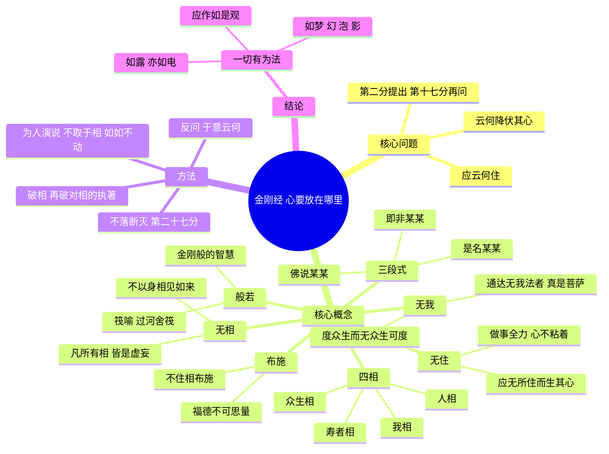
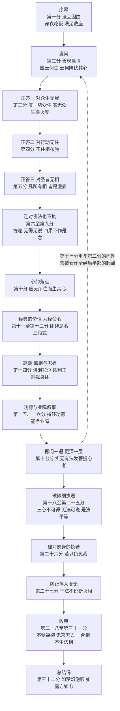
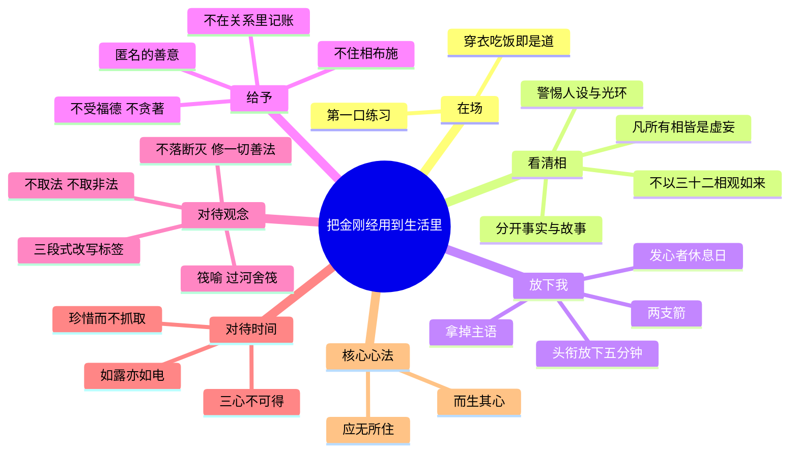

# 不住：《金刚经》原文与现代导读

> 一部五千多字的古经，只回答一个问题：心，要放在哪里，才能既全力以赴，又不被困住？

<!-- 本文件由脚本拼装，原文部分直接取自核对稿 金刚经_原文.txt -->

**底本说明**：本书经文采用姚秦鸠摩罗什译《金刚般若波罗蜜经》，以《大正新脩大藏经》第 8 册 No. 235（CBETA 电子版 T08n0235）为底本，按相传梁昭明太子所分的三十二分分段，繁体转为简体。校勘细节见书末[附录：底本与校勘说明](#附录底本与校勘说明)。

## 目录

- [开篇 这部经是什么](#开篇-这部经是什么)
- [全经思维导图](#全经思维导图)
  - [三十二分结构图](#三十二分结构图)
- [核心概念速查表](#核心概念速查表)
- 三十二分逐篇导读
   1. [第一分 法会因由分](#第一分-法会因由分)　最深的经，从最平常的一顿饭开始。
   2. [第二分 善现启请分](#第二分-善现启请分)　整部经的发动机：一个想做大事的人，心该放在哪里？
   3. [第三分 大乘正宗分](#第三分-大乘正宗分)　发最大的愿，却不留一个"救世主"的位置。
   4. [第四分 妙行无住分](#第四分-妙行无住分)　给予，但不在心里记账。
   5. [第五分 如理实见分](#第五分-如理实见分)　全经第一句"金句"：凡所有相，皆是虚妄。
   6. [第六分 正信希有分](#第六分-正信希有分)　筏喻：过了河，就把船放下——连佛法本身也是。
   7. [第七分 无得无说分](#第七分-无得无说分)　没有标准答案的答案。
   8. [第八分 依法出生分](#第八分-依法出生分)　一句话的价值，胜过满宇宙的珍宝？——第一次功德比较。
   9. [第九分 一相无相分](#第九分-一相无相分)　真正到达的人，不会在心里给自己颁奖。
   10. [第十分 庄严净土分](#第十分-庄严净土分)　应无所住而生其心——让六祖开悟的那一句。
   11. [第十一分 无为福胜分](#第十一分-无为福胜分)　恒河沙那么多条恒河里的沙——数字越大，越在提醒你别被数字迷住。
   12. [第十二分 尊重正教分](#第十二分-尊重正教分)　一句真话在哪里被说出，那里就值得尊重。
   13. [第十三分 如法受持分](#第十三分-如法受持分)　给经起名字的时候，顺便拆掉"名字"——"即非……是名……"的说明书。
   14. [第十四分 离相寂灭分](#第十四分-离相寂灭分)　全经的情感高潮：须菩提哭了，佛讲起了被割截身体的往事。
   15. [第十五分 持经功德分](#第十五分-持经功德分)　一天舍身三次、舍了无量劫，也不如"信心不逆"——如何理性地读功德叙事。
   16. [第十六分 能净业障分](#第十六分-能净业障分)　被人看不起，可能是一种"清账"？——业障叙事的语境与内核。
   17. [第十七分 究竟无我分](#第十七分-究竟无我分)　同一个问题，再问一遍——这一次，连"发心的人"也要放下。
   18. [第十八分 一体同观分](#第十八分-一体同观分)　过去心不可得，现在心不可得，未来心不可得。
   19. [第十九分 法界通化分](#第十九分-法界通化分)　福德"无"，所以说它"多"。
   20. [第二十分 离色离相分](#第二十分-离色离相分)　再完美的形象，也不是真相本身。
   21. [第二十一分 非说所说分](#第二十一分-非说所说分)　说法者，无法可说，是名说法。（附：本分"慧命须菩提"一段的版本问题）
   22. [第二十二分 无法可得分](#第二十二分-无法可得分)　最高的觉悟，是"连一点点都没有得到"。
   23. [第二十三分 净心行善分](#第二十三分-净心行善分)　是法平等，无有高下——然后，去做一切善事。
   24. [第二十四分 福智无比分](#第二十四分-福智无比分)　须弥山那么高的七宝，也比不上一句被真正理解的话。
   25. [第二十五分 化无所化分](#第二十五分-化无所化分)　度人而不觉得自己在度人，才是真的在度人。
   26. [第二十六分 法身非相分](#第二十六分-法身非相分)　若以色见我，以音声求我，是人行邪道，不能见如来。
   27. [第二十七分 无断无灭分](#第二十七分-无断无灭分)　空，不是什么都没有——全经的"安全阀"。
   28. [第二十八分 不受不贪分](#第二十八分-不受不贪分)　菩萨不要福德？——不是不要，是不贪。
   29. [第二十九分 威仪寂静分](#第二十九分-威仪寂静分)　如来者，无所从来，亦无所去。
   30. [第三十分 一合理相分](#第三十分-一合理相分)　把世界碾成灰，再问：世界在哪里？
   31. [第三十一分 知见不生分](#第三十一分-知见不生分)　连"无我"的见解也不要抓住。
   32. [第三十二分 应化非真分](#第三十二分-应化非真分)　一切有为法，如梦幻泡影，如露亦如电，应作如是观。
- [结语 把三十二分收成一句话](#结语-把三十二分收成一句话)
  - [实践清单](#把金刚经用到生活里实践清单)
  - [第二张思维导图](#第二张思维导图从经文到生活)
  - [哪些是本书的现代说法](#哪些是本书的现代说法哪些是经文本意)
- [延伸阅读](#延伸阅读)
- [附录：底本与校勘说明](#附录底本与校勘说明)

---

## 开篇 这部经是什么

### 一部写给"想做大事的人"的经

很多人第一次翻开《金刚经》，会被几样东西劝退：满篇的"须菩提！于意云何？"，不断重复的"恒河沙""三千大千世界七宝布施"，还有那句绕口令一样的"佛说……即非……是名……"。读两页，好像什么都说了，又好像什么都没说。

但如果把这些外壳轻轻拨开，你会发现它的骨架出奇地简单。全经由一个问题发动。弟子须菩提站起来，问了一句至今仍然戳心的话：

> 一个人发了最大的心愿，想要成就最好的自己、帮助所有人——那么，**他的心应该安住在哪里？当心乱了、起了妄念，又该怎么降伏它？**（"应云何住？云何降伏其心？"）

这不是一个只属于出家人的问题。一个刚创业的人、一个想把孩子养好的父母、一个想在工作里做出点名堂的年轻人、一个总在深夜刷手机刷到焦虑的普通人，都在以自己的方式问这个问题：我很想做好，可我总被"做好"这件事本身折磨——怕失败、怕别人怎么看、怕付出没有回报、怕自己不够好。

《金刚经》的回答，几乎可以压缩成一句话：**做事全力以赴，但心不要粘在任何一个"相"上——不粘在"我"上，不粘在"我做了好事"上，不粘在"结果"上，甚至不粘在"我懂了佛法"上。** 这就是经中最有名的那句"应无所住而生其心"。

### 名字：一把能切断执著的金刚

经名的梵文一般还原为 *Vajracchedikā Prajñāpāramitā Sūtra*。*Vajra* 可译"金刚"，指传说中最坚硬、能摧毁一切的东西（也常被理解为钻石或雷电，所以英文常译作 *The Diamond Sutra*）；*cchedikā* 是"能切断的"；*prajñā* 是"般若"，智慧；*pāramitā* 是"波罗蜜"，到彼岸、圆满。合起来大意是：**像金刚一样能切断（烦恼与执著）的、通往彼岸的智慧**。玄奘的译本干脆叫《能断金刚般若波罗蜜多经》，把"能断"二字译了出来。

它属于大乘佛教庞大的"般若经"系统。般若类经典的核心主题是"空"——不是"什么都没有"，而是"没有任何东西能独立、固定、永恒地自己存在"。《金刚经》篇幅短小，却是这一思想最精炼、最有文学张力的版本之一。

### 译本：为什么是鸠摩罗什

《金刚经》在汉地前后有六个主要译本：姚秦鸠摩罗什、元魏菩提流支、陈真谛、隋达摩笈多、唐玄奘、唐义净。其中流传最广、几乎成为"标准本"的，是鸠摩罗什在五世纪初（一般认为是后秦弘始四年，公元 402 年前后）于长安译出的这一本。

鸠摩罗什（344—413，一说 350—409）是龟兹人，通梵汉两种语言，译经讲究"达意"与文采。对比一下就知道他的功力：玄奘本的那首结尾偈列了九种譬喻，罗什本压缩成六个——"如梦、幻、泡、影，如露亦如电"——节奏铿锵，一读就记住。也正因为如此，罗什本的很多句子直接进入了汉语：

- "凡所有相，皆是虚妄"
- "应无所住而生其心"
- "过去心不可得，现在心不可得，未来心不可得"
- "一切有为法，如梦幻泡影，如露亦如电，应作如是观"

### 它在中国文化里有多重

几个小镜头：

**一个砍柴的年轻人。** 据《六祖坛经》（通行的宗宝本）记载，唐代岭南一个卖柴的年轻人惠能（后来的禅宗六祖），在集市上听到有人诵《金刚经》，"一闻经语，心即开悟"，于是北上黄梅求法。后来五祖弘忍夜里为他讲《金刚经》，讲到"应无所住而生其心"时，惠能"言下大悟"，说出"何期自性，本自清净"等一连串感叹。此后禅宗把《金刚经》奉为重要依据，"以心传心"的禅与"扫一切相"的般若在这里会合。（坛经的版本和史实细节，学界有许多讨论，这里依通行本叙述。）

**世界上最早的有明确纪年的印刷书。** 敦煌藏经洞出土的一卷雕版《金刚经》，卷末题有唐咸通九年（868）的日期，被公认为现存最早标有明确刊刻日期的印刷品，今藏大英图书馆。一部书能成为印刷史的起点，可见当年它被抄写、刊印、传诵的规模。

**文人与日常语言。** 苏轼、王维等诗人的作品中能看到般若思想的影子；"如梦幻泡影""一合相""不可说"等说法渗入了日常语言。今天你在书法作品、茶室墙上、甚至网络签名里，都能看到"应无所住"四个字。

### 这本书怎么读

1. **原文先行，但别被它吓住。** 每一分都完整保留罗什原文（放在引用块里），紧跟一段口语化的白话译文。第一遍读，你完全可以先看白话，再回头看原文。罗什的文字有一种节奏感，熟悉后会越读越有味道。
2. **抓住三个"钥匙"。** 全经反复出现三种句式，掌握它们，就掌握了八成：
   - **"于意云何？"**——佛不直接灌输，而是像苏格拉底一样反问，让须菩提自己说出答案。
   - **"……即非……是名……"**——先提出一个概念，再说它没有固定的实体，最后说"只是这样称呼它"。这是全经最重要的思维动作（后面第十三分会详细讲）。
   - **"若人以七宝布施……不如受持此经四句偈"**——功德比较。它们会反复出现，本书会解释它们在古代语境中的作用，并合并解读，不让你被重复拖垮。
3. **"现代视角"是桥，不是等号。** 本书会把经文与龙树中观、维特根斯坦、休谟与帕菲特的自我理论、认知科学、认知行为疗法与接纳承诺疗法、斯多葛主义、存在主义等联系起来。这些联系是为了帮你理解和使用，**它们是本书的现代说法，不是经文的原意**；凡是类比，我都会标出来，并说明哪里像、哪里不像。
4. **对功德、神通、宿世的内容，客观看待。** 经里有"受持此经福德不可思量""先世罪业则为消灭"之类的说法。本书不嘲笑，也不渲染：会说明它们在古代宗教传播中的语境和功能，再看看里面有没有可以拿来用的心理与哲学内核。信仰者可以按自己的理解读，非信仰者也能读得心安理得。
5. **每一分都有一个小练习。** 不必全做。挑一个最打动你的，用一个星期。《金刚经》本来就不是用来"读懂"的，而是用来"用"的。

### 出场人物与场景

- **佛（世尊、如来）**：释迦牟尼。经中他称自己为"如来"——"如实而来"的人。
- **须菩提**：佛的十大弟子之一，被称为"解空第一"，最懂"空"的人。由他发问，再合适不过。
- **舍卫国祇树给孤独园**：古印度憍萨罗国都城舍卫城外的一座园林，由给孤独长者买下、祇陀太子捐出树木，献给佛陀僧团，是佛陀说法最多的地方之一。
- **一千二百五十位比丘**：比丘即出家男众。这个数字是佛经常用的"标准听众"。

好，场景布置好了。一个普通的上午，佛去城里化缘吃饭，回来洗了脚，坐下——一场关于"心往哪里放"的谈话，就要开始了。

---

## 全经思维导图

先看全景。下面这张图，把《金刚经》压缩成"一个问题、一组概念、一套方法、一个结论"。

### 三十二分结构图

古人有许多科判方法（如把全经分为"前半部度众生、后半部断微细执"等）。下面是本书采用的一种便于现代读者把握的分法，**属于本书的阅读框架，不是经文自带的结构**。

---

## 核心概念速查表

读经时遇到卡住的词，回来查这里。"现代对应"一栏是帮助理解的**近似类比**，不是严格对等。

| 术语 | 白话解释 | 现代对应（类比，非等同） |
|---|---|---|
| 般若（prajñā） | 看清事物真实样子的智慧，不是知识量，而是"看法"的质量 | 元认知；看清自己的念头只是念头 |
| 波罗蜜 | 到彼岸、圆满完成 | 从"被情绪推着走"到"能选择怎么回应" |
| 菩萨 | 立志觉悟、并帮助一切众生觉悟的人 | 有使命感、想对他人有益的人 |
| 阿耨多罗三藐三菩提 | 音译，意为"无上正等正觉"，最高的觉悟 | 最彻底的清醒（经中的终极目标） |
| 发菩提心 | 立下"自己觉悟，也让众生觉悟"的大愿 | 立志；确立人生的根本方向 |
| 住 | 心停驻、粘着、依赖在某处 | 认知融合（ACT 术语）；执念 |
| 无所住 | 心不粘在任何对象上，但照样运作 | 认知解离；"心流"式的投入而不粘着 |
| 降伏其心 | 让散乱、执著的心安定下来 | 情绪调节；与念头拉开距离 |
| 相（lakṣaṇa / saṃjñā） | 事物呈现的外相，也指心中形成的"概念印象" | 心理表征；标签；刻板印象 |
| 四相 | 我相、人相、众生相、寿者相：执"我"为实有、执"他人/个体"、执"众生"、执"恒常的生命主体" | 固定的自我形象；把自我当作永恒不变的"本质" |
| 无我 | 没有一个独立、恒常、主宰的"我" | 休谟"知觉束"、帕菲特还原论、梅辛格自我模型（各有异同，见正文） |
| 空 | 一切依条件而生，没有独立自性；不是"没有" | 龙树：缘起即空；关系性的世界观 |
| 即非……是名…… | 某物没有固定实体（即非），但可以方便地称呼它（是名） | 概念是工具；"语词的意义在于使用"（维特根斯坦，类比） |
| 布施 | 给予：财物、知识、安全感 | 慷慨；利他行为 |
| 不住相布施 | 给予时不执著"我在给、他在收、我给了什么" | 不求回报的给予；保罗·布鲁姆所说"理性的同情"（类比） |
| 福德 / 功德 | 善行带来的好结果、内在的品质 | 积累；也承担宗教推广叙事的功能 |
| 七宝 | 金、银、琉璃等七种珍宝，代表世间财富的极致 | 你能想象的最大物质成就 |
| 三千大千世界 | 古印度宇宙观中的极大宇宙单位 | "整个宇宙"的修辞 |
| 恒河沙 | 恒河的沙粒，比喻多到无法计算 | "天文数字" |
| 四句偈 | 经中任意四句的短偈，泛指经文的核心要义 | 一句真正读懂并用上的话 |
| 筏喻 | 佛法像过河的木筏，过了河就要放下 | 维特根斯坦"爬上梯子后把梯子扔掉"（类比） |
| 如来 | 佛的称号，"无所从来，亦无所去，故名如来" | 不被任何形象定义的"真实本身" |
| 法 / 非法 | 法：教法、一切事物；非法：否定的观念 | 理论 / 反理论；都不要抓死 |
| 忍（无生法忍） | 对"一切法无我"的深刻认可与安住 | 接纳（ACT 的 acceptance） |
| 断灭 | 认为一切都没有、什么都无所谓的虚无主义 | 虚无主义；"躺平"式的消极 |
| 有为法 | 由因缘造作而成、会生灭变化的一切 | 一切过程性的事物 |
| 如梦幻泡影 | 有为法的六个比喻：梦、幻术、水泡、影子、露水、闪电 | 一切体验都是暂时的、建构的 |

---

# 三十二分逐篇导读

## 第一分 法会因由分

*最深的经，从最平常的一顿饭开始。*

> **【原文】**
>
> 如是我闻：
>
> 一时，佛在舍卫国祇树给孤独园，与大比丘众千二百五十人俱。尔时，世尊食时，著衣持钵，入舍卫大城乞食。于其城中，次第乞已，还至本处。饭食讫，收衣钵，洗足已，敷座而坐。

### 白话译文

这是我（阿难）亲耳听到的：

有一次，佛在舍卫国的祇树给孤独园，和一千二百五十位大比丘在一起。到了吃饭的时候，世尊穿好袈裟，拿着钵，走进舍卫大城去乞食。他在城里挨家挨户地依次乞食，乞完了，回到住处。吃完饭，收好衣和钵，洗了脚，铺好座位，坐了下来。

### 导读解析

"如是我闻"是几乎所有佛经的开头，相传是佛陀弟子阿难在结集经典时的口吻：我不是在发明，我是在转述。

这一分没有任何"道理"，只有一串动作：**穿衣、持钵、入城、乞食、回来、吃饭、收拾、洗脚、铺座、坐下。** 许多注家认为这恰恰是全经的"第一句法"：般若不在高处，就在穿衣吃饭里。佛不是先在台上展示神通，而是像一个普通修行人那样，认真地、不慌不忙地过完一个上午。

注意"次第乞已"四个字：挨家挨户依次乞食，不挑富家、不避穷户。这里已经暗含了后面"是法平等，无有高下"（第二十三分）的态度。

在全经结构里，第一分是"序分"——交代时间、地点、人物。但它也像电影的开场长镜头：先让你看见一个心不散乱的人怎样生活，然后再听他讲道理。

### 现代视角

- **现象学的"回到事情本身"（类比）。** 胡塞尔提出"悬置"（epoché）：暂时把关于世界的种种预设放进括号，只看经验本身如何呈现。第一分的叙述就有这种味道——没有评价、没有形容词、没有"他心中想到了什么"，只有动作本身。两者的相似点在于"先不加判断地看"；不同在于，胡塞尔的目的是为哲学奠基，而佛教的目的是解脱烦恼。
- **正念的日常化。** 当代正念训练（如乔·卡巴金推广的"正念减压"MBSR）常常从吃一颗葡萄干、洗碗、走路开始，强调"做一件事时就只做这件事"。第一分可以读作一个古老的示范：觉察不一定需要闭关打坐，日常程序本身就是练习场。

### 生活案例

小林是互联网公司的产品经理，午饭永远在工位上，一手筷子一手手机，眼睛盯着群消息。有一天她突然发现：她记不起昨天中午吃的是什么。不是记性差，是她根本"没在场"。

她试着做了一个很小的改变：每天中午的第一口饭，放下手机，只吃这一口。嚼，咽，感受温度和味道。只有一口，不到十秒。一个月后她说，最大的变化不是"更平静"，而是她开始注意到自己一天有多少时间是被"下一件事"拖着跑的。

佛陀那一上午的"洗足已，敷座而坐"，放在今天，也许就是吃饭时把手机扣过来。

### 马上可用的小练习

**"第一口"练习**：今天的每一餐，第一口饭只吃饭——不看屏幕、不说话，完整地嚼完再咽。问自己：此刻我在做什么？我真的在这里吗？

[↑ 回到目录](#目录)

---

## 第二分 善现启请分

*整部经的发动机：一个想做大事的人，心该放在哪里？*

> **【原文】**
>
> 时，长老须菩提在大众中即从座起，偏袒右肩，右膝著地，合掌恭敬而白佛言：“希有世尊！如来善护念诸菩萨，善付嘱诸菩萨。世尊！善男子、善女人，发阿耨多罗三藐三菩提心，应云何住？云何降伏其心？”
>
> 佛言：“善哉，善哉！须菩提！如汝所说：‘如来善护念诸菩萨，善付嘱诸菩萨。’汝今谛听，当为汝说。善男子、善女人，发阿耨多罗三藐三菩提心，应如是住，如是降伏其心。”
>
> “唯然。世尊！愿乐欲闻。”

### 白话译文

这时，长老须菩提在大众之中，从座位上站起来，袒露右肩，右膝跪地，合掌恭敬地对佛说：

"真是稀有啊，世尊！如来总是那样好好地护持、关照着各位菩萨，又那样好好地叮嘱、托付各位菩萨。世尊，如果有善男子、善女人，发起了追求无上正等正觉的心——**他的心应该怎样安住？当心起了妄念，又该怎样降伏它？**"

佛说："问得好，问得好！须菩提，正像你说的，如来善于护念、善于托付诸菩萨。你现在仔细听，我来为你说。善男子、善女人发起无上正等正觉之心，就应当**像这样**安住，**像这样**降伏他的心。"

须菩提说："是的，世尊！我们很乐意听。"

### 导读解析

**一、问题本身就是答案的一半。** 须菩提问了两件事："应云何住"——心往哪里放；"云何降伏其心"——心乱了怎么办。前者是积极的定位，后者是消极的处理。一个人立下宏愿之后，最容易遇到的恰恰是这两件事：方向感会被动摇，而私心杂念会混进来——"我这样做别人会怎么看""我付出了这么多为什么没回报""我是不是比别人更高尚"。

**二、"希有世尊"——须菩提看见了什么？** 佛刚刚只是吃饭、洗脚、坐下，须菩提却赞叹"希有"。古来注家多认为：他从这些平常动作中看出了佛"心无所住"的状态——这正是他想问的东西。也就是说，答案已经在第一分演示过了，第二分只是把它变成语言。

**三、"应如是住"——如是，是怎样？** 佛的回答很奇怪："就像这样住，像这样降伏。"有注家把"如是"理解为承上启下：指的是下文要讲的内容；也有禅门解读认为，"如是"就是指刚才那一上午平平常常的样子。两种读法不冲突：答案既在后面的语言里，也在前面的生活里。

**四、为什么问的是"发了大心的人"？** 注意问题的前提：不是"普通人怎么安心"，而是"已经发了无上菩提心的人怎么安心"。这很有意思——越有理想的人，越容易被理想绑架。《金刚经》不是给躺平者的安慰剂，它首先是写给"想做大事的人"的清醒剂。

**五、在全经中的位置。** 第二分是"正宗分"的起点，整部经都在回答这个问题。到第十七分，须菩提会几乎一字不差地再问一遍——那时答案会更深一层。

### 现代视角

**1. 好问题的力量：苏格拉底式对话。** 《金刚经》的大部分篇幅是问答，尤其是佛反问"于意云何"、让须菩提自己作答。这与柏拉图对话录中苏格拉底的方法有形式上的相似：通过提问让对方自己发现概念的问题。不同在于，苏格拉底常以"无知"告终（aporia），而《金刚经》的问答指向一种实践上的转变。

**2. 两个问题，对应心理学的两条路。** 如果借用当代心理治疗的语言（类比）：
- "云何降伏其心"接近**情绪调节**的问题：念头和情绪来了怎么办？
- "应云何住"更接近**价值与方向**的问题。接纳承诺疗法（ACT，由史蒂文·海斯等人发展）把"澄清价值"和"与念头保持距离（认知解离）"放在同等重要的位置——只会处理情绪而没有方向，人会空转；只有方向而被念头绑架，人会焦虑。

《金刚经》的独特之处在于，它给出的"住处"恰恰是"无所住"：方向是要有的（发菩提心），但心不能粘在方向的任何具体形象上。这一点，后面会一层层展开。

**3. "成就动机"的悖论。** 存在主义者常讨论一个困境：人需要意义来活，但对意义的执著又会变成新的牢笼。比如加缪在《西西弗神话》里，让西西弗在没有终点的推石中找到一种不依赖结果的清醒。这和佛教的进路不同（加缪没有解脱论，也不讲无我），但两者都在面对同一个问题：**如何投入而不被投入本身吞没。**

### 生活案例

**案例一：理想主义的社工。** 阿哲大学毕业后去了一家公益机构，做留守儿童项目。第一年他热血沸腾；第三年，他开始失眠。困扰他的不是累，而是一些说不出口的念头：捐赠方只看数据，同事抢功劳，有个孩子他帮了很久，最后还是辍学了。他开始怀疑："我到底在为谁做？"

这就是须菩提的问题。发了大心之后，心"住"在哪里？如果住在"孩子必须因为我变好"上，每一个辍学的孩子都是对自我的否定；如果住在"我是一个好人"上，同事抢功就成了对身份的威胁。阿哲需要的不是放弃理想，而是找到一种不把理想变成负担的方式。

**案例二：新手妈妈的"完美育儿"。** 小雨看了上百篇育儿文章，制定了精确到分钟的作息表。孩子哭闹不按表来，她就陷入深深的自责："我是不是一个失败的妈妈？"她的发心是好的——爱孩子；但心住在了"完美妈妈"这个相上，于是爱变成了自我审判。

### 马上可用的小练习

**"两个问题"自问**：选一件你最在意的事（工作、孩子、项目、关系），写下来回答：
1. 我做这件事，心真正想放在哪里？（我真正在乎的是什么？）
2. 当我焦虑、烦躁的时候，心实际上粘在了哪里？（是结果、是别人的评价、还是"我应该是什么样的人"？）

这两个答案之间的差距，就是《金刚经》要处理的地方。

[↑ 回到目录](#目录)

---

## 第三分 大乘正宗分

*发最大的愿，却不留一个"救世主"的位置。*

> **【原文】**
>
> 佛告须菩提：“诸菩萨摩诃萨应如是降伏其心：‘所有一切众生之类，若卵生、若胎生、若湿生、若化生，若有色、若无色，若有想、若无想、若非有想非无想，我皆令入无余涅槃而灭度之。’如是灭度无量、无数、无边众生，实无众生得灭度者。何以故？须菩提！若菩萨有我相、人相、众生相、寿者相，即非菩萨。

### 白话译文

佛告诉须菩提："各位大菩萨应当这样降伏自己的心——立下这样的愿：

'世上所有的生命，无论是卵生的、胎生的、湿生的、化生的；无论是有形体的、无形体的；无论是有念想的、无念想的、还是既非有念想又非无念想的——我都要让他们进入无余涅槃，得到彻底的解脱。'

可是，像这样让无量、无数、无边的众生得到解脱之后，**实际上并没有任何一个众生是被（我）度化的**。为什么呢？须菩提，如果一个菩萨心中还有'我相、人相、众生相、寿者相'，他就不是真正的菩萨。"

### 导读解析

**一、先发一个大到不可思议的愿。** 卵生、胎生、湿生、化生，有色、无色，有想、无想、非有想非无想——这是古印度对一切生命形态的完整分类，从鸡鸭鱼虫到只在禅定境界里存在的"无色界"众生，一个不落。菩萨的愿是：所有这些，我都要度。

**二、然后把"我在度他们"整个拿掉。** 紧接着一句"实无众生得灭度者"。这不是说"其实不用度"，也不是说"众生不存在"，而是：**度化这件事在发生，但没有一个"我"站在那里当救世主，也没有一群"他们"被我当成对象。** 一旦有了"我度了多少人"的念头，善行就变成了自我扩张。

所以本分叫"大乘正宗"——大乘佛教的根本宗旨：**愿要无限大，我要无限小。**

**三、四相是什么？** 这是全经最常出现的术语之一。传统解释不一，常见的一种是：
- **我相**：认为有一个实在、恒常、主宰的"我"。
- **人相**：执着于"人"（与他者相对的个体），由此生出人我之别、高下之比。
- **众生相**：执着于由五蕴聚合而成的"众生"是实有的。
- **寿者相**：执着于有一个从生到死、乃至跨越生死持续存在的生命主体。

学界对照梵文本指出，这四个词（ātman、sattva、jīva、pudgala）在古印度各派思想中，都是指某种"实在的自我/灵魂/个体"的不同说法。所以也可以简单理解为：**四相，是"我"的四种伪装。** 《金刚经》把它们一网打尽。

**四、降伏其心，从"降伏我"开始。** 须菩提问"云何降伏其心"，佛的第一个回答不是教你打坐、数息，而是：把"我"从你的大愿里拿出去。心之所以乱，归根结底是因为一切都在绕着"我"转——我的成绩、我的形象、我的付出、我的委屈。

### 现代视角

**1. 休谟：找不到的"我"。** 18 世纪英国哲学家大卫·休谟在《人性论》中写道，当他最深入地进入自己所谓的"自我"时，总是碰到某个特定的知觉——冷或热、明或暗、爱或恨——却从来抓不住一个没有知觉的"自我"本身。他因此提出，人不过是"一束（或一堆）不同知觉的集合"，这些知觉以不可思议的速度相续流动。这与佛教的"五蕴无我"在结论上相当接近：找不到一个独立于经验之外的"我"。不同点在于，休谟的立场主要是认识论的怀疑，佛教则把无我看作解脱的关键、并配有一整套修行方法。

**2. 帕菲特："重要的不是同一性"。** 德里克·帕菲特在《理与人》（*Reasons and Persons*，1984）中通过大量思想实验（如远程传送、大脑分裂）论证：人格同一性并不像我们以为的那样"要么全有、要么全无"，而且"同一性不是要紧的东西"。他坦言，接受这一观点后，他感到自己从一个"玻璃隧道"里走了出来，对死亡的恐惧减轻了，对他人的关心反而增加了。《理与人》的附录还专门讨论了佛陀的观点，认为与他的还原论颇为接近。——注意：帕菲特没有主张"度众生"，但他描述的心理效果（自我边界松动，关心他人变得更自然）与本分的精神有呼应。

**3. 梅辛格：自我是一个模型。** 德国哲学家托马斯·梅辛格在 *Being No One*（2003）和更通俗的 *The Ego Tunnel*（2009）中提出"自我模型理论"：大脑构建出一个"现象自我模型"，而这个模型是"透明的"——我们看不见它是一个模型，于是直接把它当成了"我"。按照他的说法，世界上并不存在"自我"这样的东西，存在的只是被体验为自我的模型。

这与"我相"有可比之处：**相，就是心中形成的那个形象；我相，就是被当作真实的"自我形象"**。区别在于：梅辛格是在认知科学与心灵哲学的框架里做描述，他并不承诺佛教的解脱论；而佛教的无我也不等于"只是大脑模型"，它还涉及缘起、业与修行等整个体系。

**4. 一个实用的翻译。** 把这三位放在一起，可以得到一个对现代人很友好的读法：**"我"更像一个动词，而不是名词**——是一个持续运作的过程，而不是藏在身体里的一件东西。当你把"我"看成过程，"我做了好事""我被冒犯了""我失败了"的重量都会变轻一点。

### 生活案例

**案例：团队里"最能干的那个人"。** 老周是一家创业公司的技术负责人，能力很强，项目十有八九是他力挽狂澜。但团队流动率很高，没人愿意跟他久干。一次离职面谈中，一位年轻工程师说："周哥，你帮了我很多，可我每次都觉得，你是在证明你比我们强。"

老周很委屈：我明明在帮你们。可他回想起来，每次救火之后，他都会在群里复盘"如果当时听我的就不会这样"。他确实在"度众生"，但心里一直站着一个"我在度你们"的形象——这就是我相、人相。别人感受到的不是帮助，而是被俯视。

后来他做了一个简单的改变：解决问题后，复盘时只讲"问题是怎么发生的、下次怎么避免"，不再讲"谁对谁错"。半年后，团队氛围明显变了。他说："我还是在帮忙，只是不再把功劳记在自己账上了。"——"实无众生得灭度者"，大概就是这个意思。

### 马上可用的小练习

**"拿掉主语"练习**：今天做完一件帮助别人的事之后，在心里复述一遍这件事，但把"我"字拿掉。比如不说"我帮同事改了方案"，而说"方案被改好了"。留意一下：拿掉"我"之后，有没有某种失落感？那份失落，就是我相的重量。

[↑ 回到目录](#目录)

---

## 第四分 妙行无住分

*给予，但不在心里记账。*

> **【原文】**
>
> “复次，须菩提！菩萨于法应无所住行于布施，所谓不住色布施，不住声、香、味、触、法布施。须菩提！菩萨应如是布施，不住于相。何以故？若菩萨不住相布施，其福德不可思量。
>
> “须菩提！于意云何？东方虚空可思量不？”
>
> “不也，世尊！”
>
> “须菩提！南、西、北方，四维、上、下虚空可思量不？”
>
> “不也，世尊！”
>
> “须菩提！菩萨无住相布施，福德亦复如是不可思量。须菩提！菩萨但应如所教住。

### 白话译文

"再者，须菩提，菩萨对于一切事物都不应有所执著，以这样的心去布施。也就是说：不执著于形色而布施，不执著于声音、香气、味道、触感和种种念头而布施。须菩提，菩萨应当这样布施——不执著于任何相。为什么呢？如果菩萨不执著于相而布施，他的福德是不可思量的。

须菩提，你觉得怎样？东方的虚空，可以思量它有多大吗？"

"不可以，世尊。"

"须菩提，南方、西方、北方，四维（东南、西南、东北、西北）、上方、下方的虚空，可以思量吗？"

"不可以，世尊。"

"须菩提，菩萨不执著于相的布施，它的福德也是这样不可思量。须菩提，菩萨只应当照我所教的这样安住。"

### 导读解析

**一、第三分讲"对人"，第四分讲"对事"。** 第三分处理的是"我与众生"的关系：度人而不执著于"我在度人"。第四分转到具体行动：布施。布施（dāna）是大乘"六度"（布施、持戒、忍辱、精进、禅定、般若）的第一项，也是最容易被"相"污染的一项——给了钱，就想要感谢；捐了款，就想要留名；对人好，就想要被记住。

**二、"不住色布施，不住声香味触法布施"。** 色、声、香、味、触、法，是佛教所说的"六尘"，即六种感官对象（眼见之色、耳闻之声……以及意识所想之"法"）。"不住六尘布施"，意思是给予的时候，心不粘在任何对象上：不粘在给出去的东西上（"那可是我辛辛苦苦挣的钱"），不粘在对方的反应上（"他怎么连句谢谢都没有"），也不粘在自己的形象上（"我真是个慷慨的人"）。

传统上常用"三轮体空"来概括：**施者、受者、所施之物，三者都不执为实有。**

**三、虚空的比喻：为什么"不住"反而"不可思量"？** 佛用虚空作比：住相的布施，就像在虚空中划出一个格子，格子有边界，福德就有边界；不住相的布施，就像虚空本身，没有边界。

这里需要客观地看一下"福德不可思量"这句话。在古代宗教语境中，"福德"包含了对来世、果报的信仰，也承担着鼓励人行善的功能——这本身无可厚非。但《金刚经》的有趣之处在于，**它一边用福德来激励人，一边又要求人"不住相"——也就是不要为了福德而布施。** 这是一种自我消解的激励：如果你真的为了"不可思量的福德"去布施，你就已经住相了，福德反而有限。到第二十八分，经文会明确说"菩萨不受福德"。

**四、"但应如所教住"——第一个关于"住"的正面回答。** 第二分问"应云何住"，到这里佛第一次给出了明确的说法：就照我教的这样住——也就是"无所住"地住。这是一个悖论式的回答：**住处，就是不住。**

### 现代视角

**1. 保罗·布鲁姆与"反对共情"。** 耶鲁大学心理学家保罗·布鲁姆在《反对共情》（*Against Empathy*，2016）中主张：共情（感受对方感受）像一盏聚光灯，会让我们偏向眼前的、可爱的、和我们相似的人，而忽略统计上更多但看不见的受苦者；共情也容易导致倦怠。他提倡一种"理性的同情"（rational compassion）——关心他人福祉，但不必陷入对方的情绪。

这与"不住相布施"有可类比之处：**不被某个特定的"相"（可爱的面孔、动人的故事、自己被感动的感觉）牵着走，给予反而更公平、更持久。** 但要注意差别：布鲁姆的论证是功利与道德心理学层面的，他关心的是行善的效果；而《金刚经》关心的是行善者的心——不住相首先是为了破除执著，其次才是效果。另外，佛教非常重视"悲心"，并不主张冷漠，"不住相"不等于"不动情"。

**2. 动机的"挤出效应"（谨慎的类比）。** 心理学中有关于外在奖励可能削弱内在动机的研究和讨论（如德西与瑞安的自我决定理论），即：当一件原本出于内在兴趣的事被附加上外在奖励，人可能会把动机归因到奖励上。这为"不住相"提供了一个现代注脚：**为了回报而给予，给予本身的意义会被稀释。** 但这类研究的结论有条件、有争议，这里只作启发，不作定论。

**3. 斯多葛的控制二分法。** 爱比克泰德在《手册》开篇就说：有些事在我们的控制之内（判断、意愿、行动），有些不在（身体、名声、别人的反应）。给予这个行为在你手里，对方是否感恩、是否回报、别人是否看见，不在你手里。把心放在前者，就少了许多怨气。这是一个实用上的相通点；但斯多葛并不讲"无我"，它保留了一个理性的主宰自我，这一点与佛教差别很大。

### 生活案例

**案例一：朋友圈里的捐款。** 小陈每次参加公益捐款，都会截图发朋友圈。他说是为了"带动更多人"，这也确实有效。但有一次，他发了一条捐款截图，只有三个人点赞，他整个晚上都很失落。他突然意识到：自己失落的不是"带动的人少"，而是"没人看见我"。

这不意味着他应该停止分享——带动他人本身是好事。"不住相"处理的不是行为，而是心：下次发之前，他可以问自己一句——如果这条没有一个赞，我还会捐吗？如果答案是"会"，那么点赞只是附带的；如果答案是"不会"，那他捐的是钱，买的是"被看见"。

**案例二：亲密关系里的"账本"。** 婚后第五年，小雅发现自己心里一直有一本账：我做了几次饭，他洗了几次碗；我记得他妈妈的生日，他忘了我爸的。每次吵架，账本就翻出来。她并不是小气，而是每一份付出都"住"在了"我付出了"这个相上，于是每一份付出都在等待回报，一旦没等到，就变成委屈。

她后来试着做一件事：每周做一件为对方好的事，**不告诉对方，也不在心里记下来**。刚开始很难受，好像吃了亏。几个月后，她说，那种"吃亏感"本身在变淡——她发现原来很多疲惫，不是来自付出，而是来自记账。

### 马上可用的小练习

**"匿名的善意"**：这一周，做一件对别人有益、但对方不会知道是你做的事——给同事的方案留一条有用的建议但不署名，给楼道换一个灯泡，悄悄给陌生人付一杯咖啡。做完之后，观察内心：有没有想说出去的冲动？那个冲动，就是"相"。不用压抑它，看见它就好。

[↑ 回到目录](#目录)

---

## 第五分 如理实见分

*全经第一句"金句"：凡所有相，皆是虚妄。*

> **【原文】**
>
> “须菩提！于意云何？可以身相见如来不？”
>
> “不也，世尊！不可以身相得见如来。何以故？如来所说身相，即非身相。”
>
> 佛告须菩提：“凡所有相，皆是虚妄；若见诸相非相，则见如来。”

### 白话译文

"须菩提，你觉得怎样？可以凭身体的样貌来认识如来吗？"

"不可以，世尊。不能凭身体的样貌认识如来。为什么呢？如来所说的身相，并不是（固定实在的）身相。"

佛告诉须菩提："凡是一切有形有相的东西，都是虚妄不实的。如果能看到一切相并非（固定实在的）相，就能见到如来。"

### 导读解析

**一、从"布施"转到"佛"：连最神圣的形象也要破。** 前面讲的是对自我、对行动不执著。这一分把刀口转向最不容易放下的东西——信仰的对象本身。佛教传统中，佛有"三十二相、八十种好"，是庄严圆满的身体。可佛自己却说：别凭这些来认我。

这在宗教史上是相当罕见的一步：**一个教主亲自叮嘱信徒，不要执著于他的形象。** 后面第二十六分会把这一点推到极致："若以色见我，以音声求我，是人行邪道，不能见如来。"

**二、"虚妄"不等于"不存在"。** "凡所有相，皆是虚妄"是全经流传最广的句子之一，也最容易被误读。"虚妄"的意思不是"假的、没有的"，而是"不像它看起来那样实在、独立、恒常"。一张桌子当然存在，你撞上去会疼；但"桌子"这个相，是木材、工艺、用途、语言习惯、你的视觉系统共同成就的。拿掉其中任何一样，"桌子"就松动了。相是有的，**但它不是自己撑起自己的。**

**三、"见诸相非相"——不是闭眼不看，而是看穿。** 这一句的关键动词是"见"。佛没有说"不要看相"，而是说"看见相的同时，看见它不是固定的相"。这是一种"双重视野"：你照样看见老板的脸、银行卡的余额、镜子里的自己，同时知道这些都是条件聚合、正在变化的东西。在这种视野里，"见如来"——见到真实。

**四、在全经中的位置。** 第三、四、五分是对第二分问题的三层回答：对众生无我（第三分），对行动无住（第四分），对圣者无相（第五分）。至此，"降伏其心"的基本框架已经完整：**心不住于我，不住于事，也不住于神圣。**

### 现代视角

**1. 预测加工：你看到的世界是大脑的"最佳猜测"。** 当代认知科学中的"预测加工"（predictive processing）理论认为，大脑不是被动接收外界信息，而是不断生成关于世界的预测，再用感官输入来修正。神经科学家阿尼尔·赛斯在 *Being You*（2021）一书中把知觉形容为一种"受控的幻觉"（controlled hallucination）——不是说世界不存在，而是说我们体验到的世界，是大脑在感官约束下建构出来的模型。

这为"凡所有相"提供了一个很有启发的类比：**我们直接体验到的"相"，本来就是一种建构。** 但要说明差别：预测加工是关于知觉机制的科学理论；"相是虚妄"在佛教中是关于存在方式（无自性）的主张，涉及的不只是知觉，还有一切概念与事物。科学并没有"证明"佛教，两者只是在"所见非如其所是"这一点上相互照亮。

**2. 建构情绪理论。** 心理学家丽莎·费德曼·巴瑞特在 *How Emotions Are Made*（2017）一书中提出建构情绪理论：情绪不是预装在大脑里、等待被触发的固定程序，而是大脑根据身体信号、情境和过去经验，用概念"建构"出来的。同样一阵心跳加速，在考场上被建构为"焦虑"，在约会时被建构为"心动"。

如果情绪也是"相"，那么"见诸相非相"就有了非常实际的含义：**你感受到的愤怒、焦虑是真实的体验，但它不是一个必须服从的"事实"，它是一次建构，可以被重新理解。** 这是类比，巴瑞特的理论本身也仍在学界讨论中。

**3. 认知行为疗法：想法不是事实。** CBT（由亚伦·贝克等人发展）的核心之一，是帮助人识别"自动化思维"并检验它：我觉得"大家都看不起我"，这是一个想法，不是一个事实。这与"凡所有相，皆是虚妄"在实践上有一致之处：先承认相在，再看清相不等于实相。

### 生活案例

**案例一：社交媒体上的"别人"。** 晚上十一点，小周刷到大学室友在朋友圈晒的照片：海边、跑车、升职宣言。他放下手机，心里一阵发闷：同样毕业五年，人家活成了那样，我却还在租房、加班。

这就是"住相"：他看到的是一张照片，心里却生成了一整个"别人过得比我好"的故事。照片是真的，但它是被选择、被构图、被滤镜处理过的"相"；它背后室友的房贷、加班、婚姻危机，统统不在画面里。"凡所有相，皆是虚妄"在这里不是玄学，而是一句非常朴素的提醒：**你在拿自己的后台，比较别人的前台。**

**案例二：对"成功人士"的崇拜。** 小王曾经非常崇拜一位创业明星，读遍他的演讲和传记，模仿他早起、冷水澡、极简穿搭。后来这位明星的公司暴雷，小王一度非常失落，觉得"信仰崩塌"。

第五分的智慧正好用在这里：**连佛都叮嘱不要凭外相认他，何况凡人？** 可以向一个人学习他的方法，但不要把一个人的形象当作真理本身。一旦把某个形象当作"如来"，形象崩塌时，你也会跟着崩塌。

### 马上可用的小练习

**"相与故事"分离**：下一次被某张图片、某条消息刺痛时，拿出纸或备忘录写两行：
- 第一行：我实际看到的是什么？（只写事实，比如"一张海边跑车照片"）
- 第二行：我心里生成的故事是什么？（比如"他比我成功，我很失败"）

看着这两行，在心里说一句："这是相。"

[↑ 回到目录](#目录)

---

## 第六分 正信希有分

*筏喻：过了河，就把船放下——连佛法本身也是。*

> **【原文】**
>
> 须菩提白佛言：“世尊！颇有众生，得闻如是言说章句，生实信不？”
>
> 佛告须菩提：“莫作是说。如来灭后后五百岁，有持戒修福者，于此章句能生信心，以此为实，当知是人不于一佛二佛、三、四、五佛而种善根，已于无量千万佛所种诸善根。闻是章句，乃至一念生净信者，须菩提！如来悉知悉见是诸众生得如是无量福德。何以故？是诸众生无复我相、人相、众生相、寿者相。
>
> “无法相，亦无非法相。何以故？是诸众生若心取相，则为著我、人、众生、寿者。
>
> “若取法相，即著我、人、众生、寿者。何以故？若取非法相，即著我、人、众生、寿者。是故不应取法，不应取非法。以是义故，如来常说：‘汝等比丘，知我说法，如筏喻者，法尚应舍，何况非法。’

### 白话译文

须菩提对佛说："世尊，会不会有众生，听到这样的言语章句，能够真正生起信心呢？"

佛告诉须菩提："不要这么说。在如来灭度之后的第五个五百年，会有持守戒律、修习福德的人，对这些章句能生起信心，认为它是真实的。要知道，这样的人不是只在一尊佛、两尊佛、三四五尊佛那里种下善根，而是早已在无量千万尊佛那里种下了种种善根。听到这些章句，哪怕只有一念生起清净信心的，须菩提，如来完全知道、完全看见，这些众生会得到如此无量的福德。

为什么呢？因为这些众生已经没有我相、人相、众生相、寿者相，**没有对'法'的执著，也没有对'非法'的执著**。

为什么呢？因为这些众生如果心里执取于相，就是执著于我、人、众生、寿者。如果执取于'法'的相，也就是执著于我、人、众生、寿者；为什么呢？如果执取于'非法'的相，同样是执著于我、人、众生、寿者。所以，既不应当执取'法'，也不应当执取'非法'。

正因为这个道理，如来常常说：'你们这些比丘，要知道我所说的法，就像一条渡河的木筏。佛法尚且应当舍弃，何况不是佛法的东西呢？'"

### 导读解析

**一、须菩提的担心：这么"反常识"的话，谁会信？** 前面几分说的都和常识相反：度众生却无众生可度，布施却不能想着布施，佛却不能凭形象认。须菩提担心：这样的话，后世的人能接受吗？

**二、"后五百岁"与"无量千万佛所种诸善根"：读懂这类话的语境。** 佛回答：会有人信，而且这些人早已在无量佛那里种过善根。这里有两个层面：

- **历史语境**："后五百岁"反映了佛教内部关于"正法、像法、末法"逐渐衰微的时间观；"在无量佛所种善根"反映了佛教的轮回与业力观。
- **叙事功能**：对于读到这部经、并且愿意相信的人来说，这句话是一种肯定和鼓励——"你能相信这些，说明你不简单"。这是许多宗教文本常见的、建立读者认同的修辞，经文在这里也在为自身的流传"背书"。

不论信与不信，这段话都有一个可以提炼的内核：**能接受一种反直觉的智慧，需要长时间的积累和准备，它不是一时聪明。** 一个从未经历过失败的人，很难真正听懂"不住于果"；一个从未被执念折磨过的人，也很难理解"放下"的分量。

**三、最关键的一转：连"法"也不能执。** 这一分最精彩的地方，在于把"无执"推到了自身。前面破的是我相、外相、佛相；这里破的是**对"佛法"本身的执著**——以及对"反佛法""什么都是空"的执著。

- 执著"法"：把佛法当成一套必须死守的教条、一个可以炫耀的身份（"我是学佛的"）。
- 执著"非法"：把"一切皆空"当作新的信条，变成"什么都无所谓"的虚无。

两边都是执著，都会把"我"又请回来。

**四、筏喻：全经最温柔的比喻。** "知我说法，如筏喻者，法尚应舍，何况非法。"这个比喻在早期佛典中就已出现（如巴利文《中部》的《蛇喻经》）：一个人要过河，扎了一条木筏，渡过河后，他不应该把木筏扛在肩上继续赶路，而应该把它留在岸边。

这并不是说"佛法没用"——没有筏你过不了河。而是说：**工具的价值在于用，不在于抱。** 一个把木筏扛在背上走路的人，比没有木筏的人更累。

### 现代视角

**1. 维特根斯坦的梯子（经典的类比）。** 维特根斯坦在《逻辑哲学论》的结尾（6.54）写道：读者理解了他的命题之后，会认识到这些命题是无意义的，就像爬上梯子之后，必须把梯子扔掉；他必须超越这些命题，才能正确地看世界。

梯子与木筏的结构非常相似：**一种用来带你抵达某处的东西，抵达后不应再被执著。** 但不同也很明显：维特根斯坦的梯子关乎语言的逻辑界限——那些命题试图说出"只能显示、不能言说"的东西；佛陀的木筏关乎解脱实践，佛法是有效的工具，只是不应被执为终极实在。另外，维特根斯坦后期在《哲学研究》中转向了"意义即使用"的观点，那与"筏喻"的实用精神也许更接近：语词和教法都是在使用中才显示意义的工具。

**2. 认知解离：别把地图当领土。** 接纳承诺疗法中有一个核心技术叫"认知解离"（cognitive defusion）：不再把念头当作现实本身，而是看见"我正在有一个念头"。一个常用的方法是在念头前加一句"我注意到我有一个想法：……"。

这一技术用在"信念"上，就是筏喻的现代版：你可以持有一套很好的理念（自律、正念、成长型思维、断舍离），但要看见它是一个"想法工具"，而不是"我是谁"。一旦把理念变成身份，理念就会开始反过来压迫你："我是自律的人，怎么能睡懒觉？"

另外，"地图不是领土"这一说法常被归于语义学家阿尔弗雷德·科日布斯基，也是一个很好的类比。

**3. 意识形态与身份政治的陷阱。** 在社交媒体时代，人们很容易把一套观点变成部落身份，然后为了维护身份去攻击他人。"不应取法，不应取非法"提供了一种冷静的姿态：可以有立场，但不把立场当作自我的一部分来防卫。

### 生活案例

**案例一：成为"正念警察"。** 阿凯读了很多心理学和佛学的书，开始练习冥想。半年后，他的女朋友抱怨："你现在动不动就说我'太执著''不够正念'，你比以前更难沟通了。"阿凯愣住了。他把"正念"当成了一个优越的身份，拿来衡量别人。

这就是"取法相"：法变成了新的我相。木筏没有被用来渡河，而是被扛在肩上，顺手拿来敲别人的头。

**案例二：创业"方法论"的崩塌。** 小林按照一本畅销书的方法创业：精益创业、快速迭代、用户访谈，一步不差。公司还是失败了。她陷入了两种极端情绪之间：要么"是我做得不够标准"，要么"这些方法论全是骗人的"。

第一种是"取法"，第二种是"取非法"。筏喻告诉她：方法论是木筏，它帮她做出了更快的试错，这本身已经是价值；它不保证一定能到岸，也不该为失败负全部责任。把筏留在岸边，带着学到的东西继续走。

**案例三：信仰与怀疑。** 一位读者在信仰中长大，后来上了大学，开始怀疑一切。他很痛苦：要么全信，要么全不信。《金刚经》的筏喻给了他一个出口——教法本身就允许被放下，它真正要的不是你"信这套说法"，而是你"过河"。

### 马上可用的小练习

**"我的木筏清单"**：写下三件你最坚信的理念或方法（比如"必须早起""要做一个善良的人""努力就有回报"）。对每一条问：
1. 它帮我渡过了什么河？
2. 它现在有没有变成我背上的负担，或者拿来评判别人的尺子？
3. 如果有一天它不再适用，我能不能感谢它，然后放下？

[↑ 回到目录](#目录)

---

## 第七分 无得无说分

*没有标准答案的答案。*

> **【原文】**
>
> “须菩提！于意云何？如来得阿耨多罗三藐三菩提耶？如来有所说法耶？”
>
> 须菩提言：“如我解佛所说义，无有定法名阿耨多罗三藐三菩提，亦无有定法如来可说。何以故？如来所说法，皆不可取、不可说、非法、非非法。所以者何？一切贤圣皆以无为法而有差别。”

### 白话译文

"须菩提，你觉得怎样？如来得到了无上正等正觉吗？如来有说过什么法吗？"

须菩提说："依我对佛所说道理的理解，并没有一个固定不变的法，叫作无上正等正觉；也没有一个固定不变的法，是如来可以说的。为什么呢？如来所说的法，都不可执取、不可言说；它既不是（固定的）法，也不是'非法'。为什么这样？一切贤人圣者，都是依于无为法，而有种种深浅的差别。"

### 导读解析

**一、佛在"考"须菩提。** 上一分说连法也不可执。佛顺势追问：那我"得到"的觉悟算什么？我说的那么多法又算什么？这是一个陷阱题：如果须菩提回答"佛得到了觉悟、说了很多法"，那就落入"有所得"；如果回答"佛什么都没得到、什么都没说"，又落入"非法"。

**二、须菩提的回答：没有"定法"。** 关键词是"定"——没有一个固定、标准、可以打包带走的觉悟，也没有一套固定的说辞是"唯一正确"的。佛法是应机而说的：对焦虑的人说放下，对懈怠的人说精进，对执著空的人说有，对执著有的人说空。**同一条河，不同的人在不同的位置过，需要的筏不一样。**

**三、"一切贤圣皆以无为法而有差别"。** "无为法"指不由因缘造作、不生不灭的真实（与后文"有为法"相对）。这句话常被解释为：所有圣者体悟的是同一个无为的真实，只是体悟深浅不同，因此有了阶位差别。差别在人，不在法。

### 现代视角

**维特根斯坦后期：意义在使用之中。** 维特根斯坦在《哲学研究》中说，对于很多词，"一个词的意义就是它在语言中的使用"（§43）。同一句"放下吧"，对一个死死抓住旧恋人的人，是解药；对一个习惯逃避责任的人，可能是毒药。这与"无有定法如来可说"在精神上相通：**话的价值，取决于它被说给谁、在什么处境中说。** 当然，维特根斯坦讨论的是语言哲学，并没有涉及"无为法"这样的形而上学主张。

**心理咨询里的"没有万能技术"。** 当代心理治疗的研究与实践中，有一种广泛讨论的观点：不同流派的疗效差异，常常不如治疗关系、个案特点等"共同因素"重要。这里不引具体数据，只取其启示：好的帮助是因人而异的，而不是把一套标准答案套在所有人身上。

### 生活案例

小许当了七年中学老师。她最大的体会是，"一招鲜"在教育里根本不存在：对有的孩子要严格，对有的孩子要多鼓励；同样一句"你可以更好"，对一个自信心爆棚的孩子是鞭策，对一个已经快崩溃的孩子是压垮他的最后一根稻草。

她说："新老师最喜欢问'有没有管住学生的方法'。我总说，方法当然有，但没有'定法'。"——这大概是对第七分最好的生活注脚。

### 马上可用的小练习

**"这句话对谁说"**：回想一句你最近常对自己或他人说的"大道理"（比如"要坚持""要想开点"）。问：这句话在什么情况下是对的？在什么情况下可能是伤人的？

[↑ 回到目录](#目录)

---

## 第八分 依法出生分

*一句话的价值，胜过满宇宙的珍宝？——第一次功德比较。*

> **【原文】**
>
> “须菩提！于意云何？若人满三千大千世界七宝以用布施，是人所得福德，宁为多不？”
>
> 须菩提言：“甚多，世尊！何以故？是福德即非福德性，是故如来说福德多。”
>
> “若复有人，于此经中受持乃至四句偈等，为他人说，其福胜彼。何以故？须菩提！一切诸佛及诸佛阿耨多罗三藐三菩提法，皆从此经出。须菩提！所谓佛法者，即非佛法。

### 白话译文

"须菩提，你觉得怎样？如果有人用堆满三千大千世界的七宝来布施，这个人所得的福德多不多？"

须菩提说："非常多，世尊。为什么呢？因为这种福德，并不是（具有真实自性的）福德本性，所以如来说它'多'。"

"如果另外有人，对这部经能受持，哪怕只是其中的四句偈，并为他人解说，他的福德胜过前面那个人。为什么呢？须菩提，一切诸佛，以及诸佛所证的无上正等正觉之法，都是从这部经中出生的。须菩提，所谓的佛法，也就不是（固定的）佛法。"

### 导读解析

**一、这是全经第一次"功德比较"。** 往后还会在第十一、十三、十五、十六、十九、二十四、二十八、三十二分等处反复出现，而且规模越来越大：从一个三千大千世界的七宝，到恒河沙数那么多个世界的七宝，再到用恒河沙数的生命来布施……最后都是"不如受持此经四句偈"。

**二、怎样看待这些比较？** 可以从三个层面理解：

1. **宗教传播的语境。** 在古代印度，许多大乘经典都有"赞叹本经"的段落，强调受持、书写、讲说本经的功德。这和当时的口传与抄写文化有关——一部经能否流传，依赖于有人愿意背诵、抄写、讲解。说"受持本经功德最大"，客观上起到了鼓励传承的作用，可以理解为经文自身的"推广叙事"。
2. **经文内部的自我消解。** 有趣的是，每次说"福德多"，《金刚经》都会立刻补一刀："是福德即非福德性"。也就是说，它在用福德激励你的同时，提醒你福德没有实体。这不像一般意义上的"营销"，更像一边递糖一边说"糖也是空的"。
3. **可以提炼的内核：认知的价值高于物质的积累。** 七宝再多，用完就没了，还可能让人更执著；一句真正理解并用上的话，可以改变一个人看世界的方式，进而影响他之后所有的选择。从这个角度看，"四句偈胜过七宝"可以被读作一个关于"智慧是元资源"的比喻。

**三、"一切诸佛……皆从此经出"，随即"所谓佛法者，即非佛法"。** 刚说完"佛都是从这部经里出来的"，马上又说"佛法也不是佛法"。这是防止读者把《金刚经》本身也变成执著对象——这一点完全符合筏喻的精神：连这部经也是筏。

### 现代视角

**"元技能"的类比。** 在现代学习理论里，人们常讨论"学会如何学习"比学会某个具体知识更重要。四句偈胜过七宝，可以被类比地理解为：改变"看法"的能力，比任何具体的收获都更根本。但请注意，这是本书的现代说法；经文本身是在宗教框架中谈福德的。

**享乐适应（hedonic adaptation）。** 心理学中常被讨论的"享乐适应"现象指出：人们对物质条件的改善会逐渐习惯，幸福感往往回落到原来的水平附近。如果七宝的快乐会被"适应"掉，那么更可持续的改变就来自看待经验的方式——这正是般若所关心的。

### 生活案例

老杨四十五岁那年，公司上市，财务自由了。半年后，他陷入了从未有过的空虚，每天开着豪车在城里转圈。他说："以前觉得赚到这个数就什么都解决了，结果发现什么都没解决。"

后来真正帮到他的，是一位老朋友的一句话："你一直在用钱回答一个不是钱的问题。"他把这句话写在手机备忘录的第一行。对他来说，这就是那"四句偈"。

### 马上可用的小练习

**找到你的"四句偈"**：你人生中，有没有一句话（来自书、来自某个人、来自某次经历），比你得到过的任何物质东西都更深地改变了你？把它写下来。如果还没有，就从这本书里留意，哪一句会成为你的那句。

[↑ 回到目录](#目录)

---

## 第九分 一相无相分

*真正到达的人，不会在心里给自己颁奖。*

> **【原文】**
>
> “须菩提！于意云何？须陀洹能作是念，‘我得须陀洹果’不？”
>
> 须菩提言：“不也，世尊！何以故？须陀洹名为入流，而无所入，不入色、声、香、味、触、法，是名须陀洹。”
>
> “须菩提！于意云何？斯陀含能作是念，‘我得斯陀含果’不？”
>
> 须菩提言：“不也，世尊！何以故？斯陀含名一往来，而实无往来，是名斯陀含。”
>
> “须菩提！于意云何？阿那含能作是念，‘我得阿那含果’不？”
>
> 须菩提言：“不也，世尊！何以故？阿那含名为不来，而实无来，是故名阿那含。”
>
> “须菩提！于意云何？阿罗汉能作是念，‘我得阿罗汉道’不？”
>
> 须菩提言：“不也，世尊！何以故？实无有法名阿罗汉。世尊！若阿罗汉作是念‘我得阿罗汉道’，即为著我、人、众生、寿者。世尊！佛说我得无诤三昧人中最为第一，是第一离欲阿罗汉。我不作是念：‘我是离欲阿罗汉。’世尊！我若作是念‘我得阿罗汉道’，世尊则不说须菩提是乐阿兰那行者。以须菩提实无所行，而名须菩提是乐阿兰那行。”

### 白话译文

"须菩提，你觉得怎样？须陀洹（初果圣者）会生起这样的念头——'我证得了须陀洹果'吗？"

须菩提说："不会，世尊。为什么呢？须陀洹的意思是'入流'（进入圣者之流），但实际上并没有进入什么地方；他不进入色、声、香、味、触、法，这才叫须陀洹。"

"须菩提，你觉得怎样？斯陀含（二果）会生起这样的念头——'我证得了斯陀含果'吗？"

须菩提说："不会，世尊。为什么呢？斯陀含的意思是'一往来'（还要在人间与天界往返一次），但实际上并没有往来，这才叫斯陀含。"

"须菩提，你觉得怎样？阿那含（三果）会生起这样的念头——'我证得了阿那含果'吗？"

须菩提说："不会，世尊。为什么呢？阿那含的意思是'不来'（不再回到欲界），但实际上并没有'来'这回事，所以叫阿那含。"

"须菩提，你觉得怎样？阿罗汉会生起这样的念头——'我证得了阿罗汉道'吗？"

须菩提说："不会，世尊。为什么呢？实际上并没有一个法叫作阿罗汉。世尊，如果阿罗汉生起'我证得了阿罗汉道'的念头，那就是执著于我、人、众生、寿者。世尊，佛说我证得'无诤三昧'，在众人中最为第一，是第一位离欲的阿罗汉。但我不会生起这样的念头：'我是离欲阿罗汉。'世尊，如果我有'我证得阿罗汉道'的念头，世尊就不会说须菩提是喜欢'阿兰那行'（寂静无诤之行）的人了。正因为须菩提实际上没有执著于任何所行，才被称为喜欢阿兰那行的人。"

### 导读解析

**一、四果是什么？** 须陀洹、斯陀含、阿那含、阿罗汉，是早期佛教（今天常说的"声闻乘"）修行的四个阶位，从初步见道到彻底断尽烦恼。经文逐一问：到达这些阶位的人，会不会想"我到了"？答案都是不会。

**二、"想'我到了'"本身就说明没到。** 道理很简单：四果的核心是逐步断除"我执"。如果一个人心里升起"我证得了"，那个"我"又回来了——"即为著我、人、众生、寿者"。这就像一个人说"我已经非常谦虚了"，这句话本身就不太谦虚。

**三、须菩提现身说法。** 最后须菩提以自己为例：佛称赞我是"无诤三昧第一"，是"第一离欲阿罗汉"，但我从不这样想。正因为不这样想，才配得上这个称号。"无诤"——不与人争，也不与自己争，连"我是不争的人"这个念头也不争。

**四、"名为……而无所……是名……"** 注意句式："须陀洹名为入流，而无所入……是名须陀洹。"这是"即非……是名……"三段式的变体：先承认一个名称（入流），再指出它没有实在的内容（无所入），最后说只是这样称呼（是名）。

### 现代视角

**"冒名顶替综合征"的反面：身份固化。** 心理学中常谈"冒名顶替现象"（impostor phenomenon）：明明有成就，却总觉得自己是骗子。第九分讲的是它的反面，同样是陷阱——把成就固化成身份："我是专家""我是成功人士""我是开悟者"。身份一旦固化，就需要维护，而维护身份是非常耗能的。

**存在主义：萨特的"自欺"。** 萨特在《存在与虚无》中描述过一个咖啡馆侍者：他的动作有点太像"一个侍者"了，仿佛在扮演"侍者"这个角色，把自己凝固为一种本质。萨特把这种把自己等同于固定角色的态度看作"自欺"（bad faith）的一种形式。这与"不作是念：我是离欲阿罗汉"有可类比之处——都拒绝把自己凝固成一个标签。不同的是，萨特强调的是人的绝对自由与责任，而佛教强调的是无我。

### 生活案例

小冯在一家咨询公司做到了合伙人。升职后的第一年，他非常不适应：开会时他觉得"我是合伙人，我必须给出最好的观点"，于是不敢说"我不知道"；客户质疑时，他觉得"合伙人怎么能被质疑"，于是过度辩护。

一位老合伙人跟他说："你最好的状态，是你还没当合伙人的时候——那时你只关心问题，不关心自己是什么。"这句话差不多就是"以须菩提实无所行，而名须菩提是乐阿兰那行"的白话版。

### 马上可用的小练习

**"头衔放下五分钟"**：在下一次开会或讨论前，默默把你的头衔、身份（"我是经理""我是妈妈""我是专家"）在心里放下五分钟，只问：此刻需要解决的问题是什么？讨论结束后，留意一下：没有身份撑腰，你是更紧张了，还是更轻松了？

[↑ 回到目录](#目录)

---

## 第十分 庄严净土分

*应无所住而生其心——让六祖开悟的那一句。*

> **【原文】**
>
> 佛告须菩提：“于意云何？如来昔在然灯佛所，于法有所得不？”
>
> “世尊！如来在然灯佛所，于法实无所得。”
>
> “须菩提！于意云何？菩萨庄严佛土不？”
>
> “不也，世尊！何以故？庄严佛土者，则非庄严，是名庄严。”
>
> “是故须菩提，诸菩萨摩诃萨应如是生清净心，不应住色生心，不应住声、香、味、触、法生心，应无所住而生其心。
>
> “须菩提！譬如有人，身如须弥山王，于意云何？是身为大不？”
>
> 须菩提言：“甚大，世尊！何以故？佛说非身，是名大身。”

### 白话译文

佛告诉须菩提："你觉得怎样？如来过去在然灯佛那里，对于法，有所得吗？"

"世尊，如来在然灯佛那里，对于法，实际上一无所得。"

"须菩提，你觉得怎样？菩萨会庄严佛土吗？"

"不会，世尊。为什么呢？所谓庄严佛土，就不是（固定实在的）庄严，只是称之为庄严。"

"所以，须菩提，诸位大菩萨应当这样生起清净心：**不应执著于形色而生心，不应执著于声音、香气、味道、触感和念头而生心；应当无所执著，而生起那颗心。**

须菩提，比如有一个人，身体像须弥山王那样高大，你觉得怎样？这个身体算不算大？"

须菩提说："非常大，世尊。为什么呢？佛说的不是（固定实在的）身体，只是称之为大身。"

### 导读解析

**一、然灯佛：佛陀的"前传"。** 据佛教的本生故事，释迦牟尼在很久远的过去世，曾是一位修行者，遇到然灯佛（燃灯佛），然灯佛为他"授记"——预言他将来会成佛，号释迦牟尼。这是佛传中非常重要的一个时刻。

佛在这里问："我在然灯佛那里，得到了什么法吗？"须菩提答："实无所得。"这个回答很要紧：**连佛陀一生最关键的"转折点"，也不是"得到"了什么东西。** 第十七分会更详细地讨论这一点：正因为无所得，然灯佛才为他授记。

**二、庄严佛土："把世界变好"也不能执著。** "庄严佛土"指菩萨通过修行，使自己所在的世界变得清净美好——用今天的话说，就是"让世界变得更好"。这是大乘菩萨的理想。可佛问：菩萨庄严佛土吗？须菩提说"不也"：庄严，即非庄严，是名庄严。

不是说不要去改变世界，而是：**不要在心里竖起一块"我正在改变世界"的牌坊。** 许多理想主义的悲剧，正是从"我在建设理想国"的自我感开始的——为了那座理想国，可以牺牲眼前活生生的人。

**三、"应无所住而生其心"：全经的心眼。** 这一句由两半组成：

- **"应无所住"**：心不粘着在任何对象上——色、声、香、味、触、法。
- **"而生其心"**：但心照样生起、照样运作，照样感受、思考、决断、行动。

两半缺一不可。只有前一半，会变成枯木死灰、冷漠麻木，这是后面第二十七分要警告的"断灭"；只有后一半，就是普通人的状态，心随境转，见好就贪、见坏就嗔。合起来，是一种很微妙的状态：**全然在场，又全然不粘。**

古人有许多比喻来形容这种心：像镜子照物，物来则现，物去不留；像雁过长空，影沉寒水，雁无留迹之意，水无留影之心（这类比喻常见于禅宗语录）。

**四、六祖惠能为何在这一句开悟？** 据《坛经》宗宝本记载，五祖弘忍为惠能讲《金刚经》，"至'应无所住而生其心'，惠能言下大悟，一切万法，不离自性"，随即说出"何期自性，本自清净；何期自性，本不生灭；何期自性，本自具足；何期自性，本无动摇；何期自性，能生万法"。

可以看出，惠能从这句话里读到的，不只是"不要执著"，更是"心本来就能生万法，又本来不被任何一法困住"。禅宗后来强调"无念为宗，无相为体，无住为本"（见《坛经》），"无住"成为禅宗修行的根本。

**五、须弥山王般的大身。** 最后用一个巨人作比：身体大如须弥山（古印度宇宙观中世界中心的大山），算大吗？算，但"佛说非身，是名大身"。这里通常被理解为：即使是最大最殊胜的果报身，也不是实有的身；也有注家理解为指"法身"不可以大小论。总之，又一次提醒：再大的相，也只是相。

### 现代视角

**1. 心流：全然投入而自我感消退。** 心理学家米哈里·契克森米哈赖提出"心流"（flow）概念：当人全情投入一项有挑战性的活动时，会出现时间感改变、自我意识暂时消退、行动与觉知融合的体验。很多运动员、音乐家、程序员都描述过这种状态。

这是对"应无所住而生其心"一个很贴切但需要谨慎的类比：心流中，"生其心"——心高度运作；同时"无所住"——不粘在"我做得好不好""别人怎么看"上。差别在于：心流通常依赖特定活动和条件，而且可能伴随对活动本身的强烈投入（甚至成瘾）；而"无所住"被设想为一种可以贯穿一切日常的心态，并且不粘着于任何对象，包括心流本身。

**2. ACT：认知解离 + 承诺行动。** 接纳承诺疗法的两个核心支柱，恰好可以对应这句话的两半：
- **认知解离与接纳** ≈ "应无所住"：念头、情绪来了，看见它们、允许它们，但不被它们抓住。
- **价值与承诺行动** ≈ "而生其心"：不是因此变得消极，而是朝着自己珍视的方向继续行动。

ACT 常用一个比喻：你的念头像一群坐在公交车上的乘客，有的吵闹、有的恐吓你，但方向盘在你手里。你不必把它们赶下车（压抑），也不必听它们指挥（融合），只需要继续开往你想去的地方。这个比喻很好地说明了"无所住而生其心"在日常中的样子。

**3. 斯多葛的"射手"比喻。** 西塞罗在《论目的》中记录了斯多葛派的一个比喻：射手尽力做好瞄准与射出的每一个动作，而箭是否命中，受风等外在因素影响，不完全在他掌握之中——射手的目标是"做好射箭这件事"。这与"无所住而生其心"在态度上相近：全力投入过程，但不把心粘在结果上。区别仍在于：斯多葛保留了一个以理性为核心的自我，而佛教连这个也要看透。

**4. 现象学的"悬置"（类比）。** 胡塞尔的悬置要求把关于对象的存在判断"放进括号"，只看它如何显现。"无所住"可以看作一种生活化的悬置：照样感知、照样回应，只是不急着下判断、不急着抓住。

### 生活案例

**案例一：演讲焦虑。** 小郑是个技术专家，每次上台演讲都手心出汗。她发现，她的焦虑从来不在"讲内容"上，而在"讲的时候脑子里另一个声音"：他们会不会觉得我很笨？我刚才是不是说错了？那个领导为什么皱眉？

教练教她一个方法：上台后，先感受脚踩在地上的感觉，然后把注意力放在"我要讲清楚的第一件事"上；当"他们会怎么看我"的念头冒出来时，不跟它争辩，只在心里说一声"嗯，这个念头来了"，然后回到内容。

几个月后，她说："念头还是会来，但我不住在它那里了。"——心照样生（讲得投入），只是不住（不粘在评价上）。

**案例二：创业失败后的再出发。** 阿华的第一家公司倒闭了，欠了一些债，也失去了几个朋友。之后一年，他陷入两种状态之间来回摆：一种是"住"在失败上，每天反刍"如果当时……"；另一种是彻底的"断灭"，觉得什么都没意义，躺着刷短视频。

后来他的转机，不是来自"想通了"，而是来自一次很小的行动：帮朋友的小店做了一个线上推广方案。他说那天晚上他做得很投入，做完才发现，几个小时里一次都没想到"我是个失败者"。他开始明白，**"无所住"不是先把心清空再行动，而是在行动中让心不再粘在旧的相上。**

**案例三：亲密关系中的"在场"。** 一对夫妻去做伴侣咨询。妻子说："他人在我身边，心永远在别处。"丈夫辩解："我一直在想怎么让家里过得更好啊。"咨询师说："你的心住在'更好的家'的图景里，所以看不见眼前这个真实的家。"

庄严佛土，即非庄严。为家庭奋斗没有错，但如果心一直住在"理想家庭"的相里，眼前的人反而被牺牲了。

### 马上可用的小练习

**"无住三步"**（随时可用，约一分钟）：
1. **觉察**：此刻，我的心粘在哪里？（一个人？一个结果？一个画面？一个"应该"？）
2. **松开**：给它命名，"这是对___的执著"，然后做一次深而慢的呼吸，让它在那里，但不再抓着它。
3. **生心**：问自己——此刻，这件事最需要我做的一件具体的事是什么？然后去做它。

[↑ 回到目录](#目录)

---

## 第十一分 无为福胜分

*恒河沙那么多条恒河里的沙——数字越大，越在提醒你别被数字迷住。*

> **【原文】**
>
> “须菩提！如恒河中所有沙数，如是沙等恒河，于意云何？是诸恒河沙宁为多不？”
>
> 须菩提言：“甚多，世尊！但诸恒河尚多无数，何况其沙。”
>
> “须菩提！我今实言告汝，若有善男子、善女人，以七宝满尔所恒河沙数三千大千世界以用布施，得福多不？”
>
> 须菩提言：“甚多，世尊！”
>
> 佛告须菩提：“若善男子、善女人于此经中，乃至受持四句偈等，为他人说，而此福德胜前福德。

### 白话译文

"须菩提，恒河中所有的沙子，假如每一粒沙都是一条恒河，你觉得怎样？所有这些恒河里的沙子，多不多？"

须菩提说："非常多，世尊。光是这些恒河就已经多得数不清了，更何况其中的沙子。"

"须菩提，我现在用真实的话告诉你：如果有善男子、善女人，用七宝装满像这么多恒河沙数的三千大千世界，用来布施，得到的福德多不多？"

须菩提说："非常多，世尊。"

佛告诉须菩提："如果善男子、善女人，对这部经，哪怕只受持其中的四句偈，并为他人解说，这份福德胜过前面的福德。"

### 导读解析

**功德比较的升级版。** 第八分是一个三千大千世界的七宝，这里是"恒河沙数那么多个三千大千世界"的七宝。数字被放大到了想象的极限。

本分题名"无为福胜"：有为的福（七宝布施）再大，也是有生有灭、有边有际的；无为的福（从般若智慧而来）超越了数量的比较。读这一分的要点，不在于具体的数字，而在于体会这种修辞：**它故意把世间价值推到极限，然后说：极限也比不上"看清"。**

按古印度修辞习惯，"恒河沙"是表示"不可计数"的常用说法——恒河是当时听众最熟悉的大河，用它的沙来比喻无量，就像今天我们说"天文数字"。

### 现代视角

**数字感的失灵。** 人对极大数字的感知能力很有限：一百万和十亿在直觉上都只是"很多"。经文这种层层叠加的数字修辞，与其说让人"算清楚"，不如说让人体验到计算的失效——当你发现计算失效时，你也许就会停下来，不再用"多少"来衡量价值。这是本书的一种读法。

### 生活案例

小吴做理财博主，每天盯着粉丝数和收益曲线。有一天他算了算：要达到他心中的"财务自由"，还要再翻三倍。可上次翻三倍之前，他也是这么想的。那天他在笔记里写："如果数字永远可以更大，那它就永远不是我真正要的东西。"

### 马上可用的小练习

**"再翻一倍"测试**：想一个你正在追求的数字目标（收入、粉丝、体重、成绩）。问：如果达到了，再翻一倍，我会更满足吗？如果答案是"大概还会想要更多"，那么问题就不在数字上。

[↑ 回到目录](#目录)

---

## 第十二分 尊重正教分

*一句真话在哪里被说出，那里就值得尊重。*

> **【原文】**
>
> “复次，须菩提！随说是经，乃至四句偈等，当知此处，一切世间天、人、阿修罗皆应供养，如佛塔庙，何况有人尽能受持读诵？须菩提！当知是人成就最上、第一、希有之法，若是经典所在之处，则为有佛，若尊重弟子。”

### 白话译文

"再者，须菩提，无论在哪里讲说这部经，哪怕只讲四句偈，要知道，那个地方一切世间的天、人、阿修罗都应当供养，就像供养佛塔和佛寺一样，更何况有人能完整地受持、读诵这部经呢？须菩提，要知道这个人成就了最上、第一、稀有的法。这部经典所在的地方，就等于有佛在，或者有佛的尊贵弟子在。"

### 导读解析

**一、"经在之处，即为有佛"。** 这一分把经典的地位提到与佛塔、佛本身同等的高度。在佛教史上，这反映了大乘早期一个重要的现象：**"经典崇拜"**——与崇拜佛陀遗骨的佛塔信仰并列，甚至有意与之竞争。抄写、供奉、讲说经典，成为一种重要的修行和信仰实践。敦煌出土的大量《金刚经》写本和刻本，正是这种信仰实践的见证。

**二、可以提炼的内核。** 剥去宗教仪式的层面，这一分可以读出一种对"真理所在之处"的尊重：一个地方之所以珍贵，不是因为它金碧辉煌，而是因为那里有人在说真话、在帮助他人看清。一间简陋的教室、一次深夜的倾心交谈，如果在那里有一句点亮人的话，那里就有"佛"。

**三、也要看到另一面。** 经典崇拜也可能走向它的反面：把经书当护身符、当法器，而不去读懂它。这恰恰违背了《金刚经》自己"不住于相""法尚应舍"的精神。经文这里的赞叹，和全经"破相"的主旨之间，有一种值得读者自己体会的张力。

### 现代视角

**"神圣性"的社会建构。** 社会学家涂尔干在《宗教生活的基本形式》中提出，"神圣"往往是群体赋予某些事物的特殊地位，神圣物承载着群体的共同价值。经书被供奉，在社会学意义上，是一个群体在标记"这是我们最珍视的东西"。这个视角不评判信仰的真伪，只帮助理解其社会功能。

### 生活案例

老刘退休后在社区开了一个免费的读书会，场地是居委会的旧会议室，椅子都不配套。有一次一位年轻妈妈在读书会上哭了，说那本书里的一句话让她第一次觉得自己产后的抑郁"不是我的错"。老刘说，那一刻他觉得那间破会议室"比什么殿堂都庄严"。

### 马上可用的小练习

**标记你的"道场"**：想一想，你生活里哪个地方、哪个时刻，让你最常听到真话、或者说出真话？可能是一位朋友的厨房，一个深夜的电话，一个日记本。这周去一次那里，或者做一次那样的交谈。

[↑ 回到目录](#目录)

---

## 第十三分 如法受持分

*给经起名字的时候，顺便拆掉"名字"——"即非……是名……"的说明书。*

> **【原文】**
>
> 尔时，须菩提白佛言：“世尊！当何名此经？我等云何奉持？”
>
> 佛告须菩提：“是经名为‘金刚般若波罗蜜’。以是名字，汝当奉持。所以者何？须菩提！佛说般若波罗蜜，则非般若波罗蜜。须菩提！于意云何？如来有所说法不？”
>
> 须菩提白佛言：“世尊！如来无所说。”
>
> “须菩提！于意云何？三千大千世界所有微尘是为多不？”
>
> 须菩提言：“甚多，世尊！”
>
> “须菩提！诸微尘，如来说非微尘，是名微尘。如来说世界，非世界，是名世界。
>
> “须菩提！于意云何？可以三十二相见如来不？”
>
> “不也，世尊！不可以三十二相得见如来。何以故？如来说三十二相，即是非相，是名三十二相。”
>
> “须菩提！若有善男子、善女人，以恒河沙等身命布施；若复有人，于此经中，乃至受持四句偈等，为他人说，其福甚多。”

### 白话译文

这时，须菩提对佛说："世尊，这部经应当叫什么名字？我们应该怎样奉持它？"

佛告诉须菩提："这部经名为'金刚般若波罗蜜'。你们就以这个名字来奉持它。为什么呢？须菩提，佛所说的般若波罗蜜，就不是（固定实在的）般若波罗蜜。

须菩提，你觉得怎样？如来有所说的法吗？"

须菩提对佛说："世尊，如来没有说什么。"

"须菩提，你觉得怎样？三千大千世界中所有的微尘，算多吗？"

须菩提说："非常多，世尊。"

"须菩提，这些微尘，如来说它们不是（实在的）微尘，只是称之为微尘。如来说的世界，也不是（实在的）世界，只是称之为世界。

须菩提，你觉得怎样？可以凭三十二种殊胜的身相来认识如来吗？"

"不可以，世尊。不能凭三十二相认识如来。为什么呢？如来所说的三十二相，就是非相，只是称之为三十二相。"

"须菩提，如果有善男子、善女人，用像恒河沙那么多的生命来布施；又有人对这部经，哪怕只受持四句偈，并为他人解说，后者的福德更多。"

### 导读解析

**一、"当何名此经"——一个仪式性的时刻。** 在许多佛经中，佛会在中途或结尾为经命名，标志着教法的阶段性完成。古来有些注家据此认为，《金刚经》到第十三分可以算"前半部"告一段落（也有不同分法）。

但《金刚经》命名的方式非常独特：刚给出名字"金刚般若波罗蜜"，立刻说"佛说般若波罗蜜，则非般若波罗蜜"。**起名字的同一刻，就提醒你不要被名字骗了。**

**二、详解三段式："佛说 A，即非 A，是名 A"。** 这是全经最重要、也最容易让人头晕的句式。不妨把它拆成三步：

| 步骤 | 句式 | 含义 | 例：微尘 |
|---|---|---|---|
| 第一步：肯定（俗） | 佛说 A | 在日常语言与经验中，A 是有用、有效的 | 我们确实说"灰尘很多" |
| 第二步：否定（空） | 即非 A | A 没有独立、固定、自己成立的本质 | 微尘可再分，没有一个"微尘本身" |
| 第三步：重新肯定（假名、中道） | 是名 A | 在看清它是缘起假名之后，照样可以使用这个名字 | 照样说"擦掉桌上的灰" |

这个结构与后来龙树中观学的"二谛"与"中道"思想高度相关（下文详述）。要点在于：**第三步不是回到第一步。** 第一步的"A"被当作实在；第三步的"A"被当作工具。表面上一样，看待它的方式完全不同——就像同样一句"我的"，一个三岁孩子抢玩具时说，和一个知道"一切终将流转"的老人说，分量完全不同。

**三、"如来无所说"。** 佛说了那么多，为什么"无所说"？因为没有一个固定的"法"被说出来、被交到你手里。语言只是指向月亮的手指（"指月"是佛教中著名的比喻，见《楞严经》等）——如果你盯着手指，就看不到月亮。

**四、微尘与世界：从最小到最大，都是"假名"。** 把世界碾成微尘，微尘多不多？很多。但微尘也不是实在的微尘，世界也不是实在的世界。古印度有一些学派认为存在不可再分的"极微"（原子），并以此为世界的实在基础。《金刚经》在这里对两头都不承认实体：大到世界，小到微尘，都是"是名"。第三十分会把这个话题展开为"一合相"。

**五、以身命布施。** 功德比较再度升级：前面用的是七宝（身外之物），这里用的是"恒河沙等身命"——生命本身。但仍然"不如"受持四句偈。可以提炼的意思是：**即使是最极端的自我牺牲，如果没有智慧，也可能只是执著的另一种形式。** 历史上不少以"献身"为名的狂热，恰恰说明了这一点。

### 现代视角

**1. 龙树中观：缘起、空、假名、中道。** 公元二世纪前后的印度哲学家龙树，在《中论》（*Mūlamadhyamakakārikā*）中系统阐发了般若思想。其第二十四品第十八颂常被概括为（汉译据鸠摩罗什本）："众因缘生法，我说即是无，亦为是假名，亦是中道义。"（后世常引作"因缘所生法，我说即是空……"）大意是：凡依条件而生起的，就说它是空（无自性）；空也只是假名施设；这就是中道。

把这首颂与"即非……是名……"对照：
- "佛说 A" ↔ 缘起的现象（因缘所生法）
- "即非 A" ↔ 空（无自性）
- "是名 A" ↔ 假名，中道

龙树还提出"二谛"：世俗谛（日常约定的真实）与胜义谛（究竟的真实），并说不依世俗谛，就无法表达胜义谛（《中论》第二十四品）。这就是为什么《金刚经》不会说"所以不要说世界"，而是说"是名世界"——**世俗的语言照样要用，只是不要把它当作终极的实在。**

需要说明：《金刚经》的成书年代学界一般认为早于龙树，或至少属于龙树所依据的般若经传统。说"龙树系统化了般若经的思想"是学界常见的看法；说《金刚经》"就是中观"则过于简化。

**2. 维特根斯坦：名字与实在（类比）。** 早期维特根斯坦在《逻辑哲学论》中设想语言的名称对应世界中的简单对象；后期在《哲学研究》中他反省了这种"名称—对象"的图像，指出很多词的意义在于它在"语言游戏"中的使用，并以"家族相似"说明许多概念并没有一个所有实例共有的本质（如"游戏"）。

这与"即非 A，是名 A"有可类比之处：一个名称（"世界""微尘""我"）在使用中运作良好，但如果你去找它背后那个"唯一的本质"，往往找不到。不同在于：维特根斯坦的关注点是语言如何运作、哲学问题如何因误用语言而产生；而般若的关注点是对概念的执著如何产生痛苦。

**3. 认知科学：概念是工具。** 当代认知科学普遍承认，概念是我们组织经验的工具，不同文化、不同语言会以不同方式切分世界（例如颜色词汇的差异，学界对其影响程度有争论）。这至少说明：我们用来理解世界的格子，有相当一部分是"是名"的。

### 生活案例

**案例："我是一个失败的人"。** 三十三岁的阿梅被裁员了。她反复对自己说："我就是一个失败的人。"

用三段式拆一下：
- **"佛说失败"**：她确实经历了一件失败的事——被裁员，这是真实的，需要面对（房租、简历、情绪）。
- **"即非失败"**："失败的人"不是她固定不变的本质。它是由一连串条件构成的：行业寒冬、部门调整、她过去的某些选择、她此刻的情绪……没有一个"失败本身"住在她身体里。
- **"是名失败"**：她仍然可以说"这次求职失败了"，并从中学习——这个词仍然有用，只是它不再是一个判决。

咨询师后来让她把"我是一个失败的人"改说成"我正在经历一次失败"。仅仅改了一个动词，压在她身上的东西就松了一些。这和 ACT 中的认知解离技术思路一致，也是三段式在生活中最直接的用法。

### 马上可用的小练习

**三段式改写**：挑一个你常用来形容自己或别人的标签（"我很懒""他就是个自私的人""我不擅长社交"），写成三行：
1. 佛说___：它指向的真实情况是什么？
2. 即非___：它由哪些条件构成？它一直如此吗？
3. 是名___：去掉判决的意味，我现在怎样用这个词才有帮助？

[↑ 回到目录](#目录)

---

## 第十四分 离相寂灭分

*全经的情感高潮：须菩提哭了，佛讲起了被割截身体的往事。*

> **【原文】**
>
> 尔时，须菩提闻说是经，深解义趣，涕泪悲泣，而白佛言：“希有世尊！佛说如是甚深经典，我从昔来所得慧眼，未曾得闻如是之经。世尊！若复有人得闻是经，信心清净，则生实相，当知是人，成就第一希有功德。世尊！是实相者，则是非相，是故如来说名实相。世尊！我今得闻如是经典，信解、受持不足为难，若当来世后五百岁，其有众生得闻是经，信解、受持，是人则为第一希有。何以故？此人无我相、人相、众生相、寿者相。所以者何？我相即是非相，人相、众生相、寿者相即是非相。何以故？离一切诸相，则名诸佛。”
>
> 佛告须菩提：“如是，如是！若复有人得闻是经，不惊、不怖、不畏，当知是人甚为希有。何以故？须菩提！如来说第一波罗蜜，非第一波罗蜜，是名第一波罗蜜。须菩提！忍辱波罗蜜，如来说非忍辱波罗蜜。何以故？须菩提！如我昔为歌利王割截身体，我于尔时，无我相、无人相、无众生相、无寿者相。何以故？我于往昔节节支解时，若有我相、人相、众生相、寿者相，应生瞋恨。须菩提！又念过去于五百世作忍辱仙人，于尔所世，无我相、无人相、无众生相、无寿者相。是故，须菩提！菩萨应离一切相，发阿耨多罗三藐三菩提心，不应住色生心，不应住声、香、味、触、法生心，应生无所住心。若心有住，则为非住。是故，佛说菩萨心不应住色布施。
>
> “须菩提！菩萨为利益一切众生，应如是布施。如来说：‘一切诸相，即是非相。’又说：‘一切众生，则非众生。’
>
> “须菩提！如来是真语者、实语者、如语者、不诳语者、不异语者。
>
> “须菩提！如来所得法，此法无实无虚。须菩提！若菩萨心住于法而行布施，如人入暗，则无所见；若菩萨心不住法而行布施，如人有目，日光明照，见种种色。
>
> “须菩提！当来之世，若有善男子、善女人，能于此经受持、读诵，则为如来以佛智慧悉知是人，悉见是人，皆得成就无量无边功德。

### 白话译文

这时，须菩提听佛说了这部经，深深领悟其中的义理，感动得流下眼泪，对佛说：

"真是稀有啊，世尊！佛说了如此深奥的经典，我自从过去以来得到慧眼，从没听过这样的经。世尊，如果有人能听到这部经，信心清净，就能生起'实相'（对真实的体认）。要知道这个人成就了第一稀有的功德。世尊，这所谓的'实相'，其实就是非相，所以如来称之为实相。

世尊，我今天能听到这样的经典，相信、理解、受持它并不算难。但如果在未来的世代，第五个五百年时，有众生听到这部经，能够相信、理解、受持，这个人才是第一稀有。为什么呢？因为这个人已经没有我相、人相、众生相、寿者相。为什么这样说？因为我相就是非相，人相、众生相、寿者相也都是非相。为什么呢？离开一切相，就称为诸佛。"

佛告诉须菩提："正是这样，正是这样。如果有人听到这部经，不惊慌、不恐怖、不畏惧，要知道这个人非常稀有。为什么呢？须菩提，如来说的第一波罗蜜（最高的波罗蜜，古注多解为般若，也有解为布施的），并不是（固定的）第一波罗蜜，只是称之为第一波罗蜜。

须菩提，忍辱波罗蜜，如来说它不是（固定的）忍辱波罗蜜。为什么呢？须菩提，就像我过去被歌利王割截身体，那时，我没有我相、没有人相、没有众生相、没有寿者相。为什么呢？我在过去被一节一节肢解的时候，如果有我相、人相、众生相、寿者相，就必定会生起嗔恨。

须菩提，我又回想过去五百世做忍辱仙人，在那么多世里，我都没有我相、人相、众生相、寿者相。

所以，须菩提，菩萨应当离开一切相，发起无上正等正觉之心：不应执著于形色而生心，不应执著于声音、香气、味道、触感和念头而生心，应当生起无所执著的心。**如果心有所执著，那就不是正确的安住。** 所以佛说，菩萨的心不应执著于形色而布施。

须菩提，菩萨为了利益一切众生，应当这样布施。如来说：一切诸相，就是非相；又说：一切众生，就不是（实在的）众生。

须菩提，如来是说真话的人，说实话的人，说如实之话的人，不说谎话的人，不说前后矛盾之话的人。

须菩提，如来所证得的法，这个法无实也无虚。须菩提，如果菩萨的心执著于法而行布施，就像人走进黑暗中，什么也看不见；如果菩萨的心不执著于法而行布施，就像人有眼睛，又有太阳光明照耀，能看见种种形色。

须菩提，在未来的世代，如果有善男子、善女人能对这部经受持、读诵，如来以佛的智慧完全知道这个人、完全看见这个人，他们都将成就无量无边的功德。"

### 导读解析

**一、须菩提为什么哭？** "解空第一"的须菩提，在这里"涕泪悲泣"。这是全经唯一一处写到强烈情感的地方。古来注家对此有不同体会：有人说是喜极而泣，终于听到如此深的法；有人说是悲悯，想到后世众生难以听闻。无论哪种，这个细节都很重要——**它说明"空"不是冷冰冰的理论，真正领悟时，人是会被深深触动的。** 般若不是让人变成石头。

**二、"实相者，则是非相"。** 须菩提说，听了这部经能"生实相"。但他马上补充：所谓实相，就是非相。真实不是另一个更高级的"相"，而是看透一切相之后的那份清明。不能把"实相"又变成一个要去追求、去抓住的东西。

**三、"不惊、不怖、不畏"。** 这三个词非常准确地描述了人第一次真正面对"无我""空"时可能的反应。如果"我"没有一个实在的核心，如果一切都是缘起、无常、无自性的——很多人的第一反应是恐慌：那我还剩下什么？人生还有什么意义？

佛说，能在这时"不惊不怖不畏"的人非常稀有。这句话也提醒我们：**无我的领悟可能伴随不安，这是正常的。** 现代的禅修指导者也常提醒，某些深入的冥想体验可能带来不适，需要适当的指导与支持（这是一个值得认真对待的实际问题，不应被浪漫化）。

**四、歌利王与忍辱仙人：怎样读这个故事？** 据佛教本生故事，佛陀前世为忍辱仙人，在山中修行，被歌利王（一般认为义为"恶王"）无端割截身体，却不起嗔恨。

读这个故事，可以有两层：
- **历史与信仰语境**：这是佛教本生故事（Jātaka）传统的一部分，讲述佛陀在过去无数世中的修行。对信仰者而言，它表达了对佛陀德行的敬仰和对轮回的信念。对现代读者而言，不必把它当作史实，也不必因此否定它的价值。
- **心理内核**：这个故事真正要说的是一个心理学命题：**"若有我相……应生瞋恨"——嗔恨的根，在于"我"被伤害了的感觉。** 痛是身体的；而"他竟敢这样对我""我不应该受到这种待遇"，是"我相"加上去的第二层痛。

**五、"忍辱波罗蜜，如来说非忍辱波罗蜜"。** 为什么忍辱也要"即非"？因为真正的忍辱不是咬牙硬忍——硬忍的时候，心里还有一个"我在忍受你""我真伟大"的我。那是把愤怒压进了地下室，迟早会爆发。真正的忍，是那个需要被保护的"我"松开了，愤怒失去了着力点。

需要特别说明：**这一教导是关于内心如何不被仇恨吞噬，而不是要求受害者容忍虐待。** 在现实中，面对家暴、霸凌、职场欺凌，离开、报警、维权、寻求帮助都是正当且必要的；"无我相"可以让人在保护自己的同时，不被仇恨毁掉自己——这两者并不矛盾。

**六、"若心有住，则为非住"。** 这句话回应了第二分"应云何住"。答案在这里说得极为透彻：**有所住的心，恰恰是没有"住"好的心。** 真正的安住，是无住。

**七、"如人入暗"与"如人有目"。** 这是全经少见的一组生动比喻：执著于法而布施，像走进黑屋子，什么也看不见——你只看见自己的执著；不执著而布施，像有眼睛又有阳光，能看清种种事物——你看得见眼前真实的人和真实的需要。**执著，让人失明；无住，让人看见。**

**八、"真语者、实语者、如语者、不诳语者、不异语者"。** 这五个"语者"是在为这部反常识的经作担保。从宗教语境看，这是在建立听众对教法的信任；从文本结构看，它出现在全经最"惊人"的一段话之后，正是为了回应"惊、怖、畏"的反应。

### 现代视角

**1. "第二支箭"：痛苦与苦难的区分。** 早期佛典中有一个著名的比喻（《箭经》，巴利《相应部》）：一个人中了一箭，又自己射了自己第二箭——第一箭是身体的痛，第二箭是心理上的抗拒、愤怒、哀叹。当代正念与心理治疗领域常引用这个比喻，并发展出"痛苦 = 疼痛 × 抗拒"之类的通俗说法（这是一种启发式的说法，不是严格的公式）。

歌利王故事的心理内核，就是"不射第二支箭"：割截之痛无法避免，但"我相"所产生的嗔恨，是可以不生的。

**2. ACT 与接纳。** 接纳承诺疗法中的"接纳"（acceptance）不是认命，而是愿意与痛苦的体验共处，不做无效的挣扎。ACT 的研究者常用"流沙"作比：越挣扎陷得越深，平躺下来增大接触面反而能慢慢脱身。这与"不惊、不怖、不畏"有相通之处。

**3. 斯多葛：别人能伤害你的身体，伤害不了你的判断。** 爱比克泰德常说，令人不安的不是事情本身，而是我们对事情的看法（《手册》第五节）。马可·奥勒留在《沉思录》里也反复提醒自己，别人的恶行伤害不了自己的"主导理性"。斯多葛对侮辱的态度与忍辱仙人有相似处，但出发点不同：斯多葛守护的是一个理性的自我，而《金刚经》要放下的正是"自我"本身。可以说，斯多葛的方法是"把城墙修得更高"，般若的方法是"发现根本没有需要守卫的城"。

**4. 宽恕研究。** 心理学中有关宽恕（forgiveness）的研究与干预（如罗伯特·恩莱特等人的工作）区分了"宽恕"与"和解""纵容"：宽恕是放下自己内心的怨恨，不等于原谅对方的行为、也不等于必须恢复关系。这与上文对"忍辱"的说明相互印证。

### 生活案例

**案例一：被当众羞辱的会议。** 小谭在季度会议上被总监当众批评："这种方案也敢拿出来？"会议室一片安静。之后三天，她脑子里一直在回放那一幕，想好了十几种反驳的话，失眠、食欲下降。

她后来试着区分两支箭：第一支箭是"方案确实有问题，被批评很难受"——这个痛是真实的，可以面对：改方案。第二支箭是"他凭什么这样对我""所有人都觉得我很差""我在这家公司完了"——这些是"我相"射出来的。她发现，那三天里，第二支箭造成的伤害远远大于第一支。

同时，她也决定，如果总监的言辞继续越界，她会找合适的场合直接沟通，必要时反映给人力。"不生嗔恨"和"保护自己"可以同时做到。

**案例二：网络暴力。** 一位小博主因为一句话被断章取义，评论区涌入几千条辱骂。她最初的反应是逐条回复、辩解，越回越崩溃。后来她做了三件事：关闭评论、把截图交给平台和律师处理、暂时离开网络一周。

一周后她说："我发现骂我的那些人，骂的其实是他们心里的一个'相'，不是我。我也不需要去捍卫那个'被骂的我'。"——这不是逆来顺受（她采取了法律行动），而是不再让"我相"被那些声音劫持。

**案例三：面对"无我"时的恐慌。** 一位读者在读了很多关于"自我是幻觉"的书后，有一段时间感到强烈的空虚和不真实感："如果没有我，那我现在在干嘛？"

这正是"惊、怖、畏"。需要说明的是：如果这种不真实感持续、严重、影响生活，应当寻求专业的心理健康帮助——人格解体/现实解体是需要被认真对待的体验，不应简单地以"开悟"来解释。在一般意义上，"无我"不是"我消失了"，而是"我不是一件固定的东西"：你依然可以吃饭、工作、爱人，只是少了那份"必须守住我"的紧张。

### 马上可用的小练习

**"两支箭"笔记**：下次被别人的话或行为刺痛时，写下：
- 第一支箭（事实与身体的痛）：发生了什么？我身体哪里不舒服？
- 第二支箭（"我相"加上的故事）：我对自己说了什么？"他凭什么……""这说明我……"
- 行动：针对第一支箭，我需要做什么（包括保护自己）？对于第二支箭，我能不能只是看着它，不再往下射？

[↑ 回到目录](#目录)

---

## 第十五分 持经功德分

*一天舍身三次、舍了无量劫，也不如"信心不逆"——如何理性地读功德叙事。*

> **【原文】**
>
> “须菩提！若有善男子、善女人，初日分以恒河沙等身布施，中日分复以恒河沙等身布施，后日分亦以恒河沙等身布施，如是无量百千万亿劫以身布施；若复有人，闻此经典，信心不逆，其福胜彼，何况书写、受持、读诵、为人解说。
>
> “须菩提！以要言之，是经有不可思议、不可称量、无边功德。如来为发大乘者说，为发最上乘者说。若有人能受持、读诵、广为人说，如来悉知是人，悉见是人，皆得成就不可量、不可称、无有边、不可思议功德，如是人等，则为荷担如来阿耨多罗三藐三菩提。何以故？须菩提！若乐小法者，著我见、人见、众生见、寿者见，则于此经，不能听受、读诵、为人解说。
>
> “须菩提！在在处处若有此经，一切世间天、人、阿修罗所应供养；当知此处则为是塔，皆应恭敬、作礼、围绕，以诸华香而散其处。

### 白话译文

"须菩提，如果有善男子、善女人，早晨用像恒河沙那么多的身体来布施，中午又用像恒河沙那么多的身体来布施，傍晚也用像恒河沙那么多的身体来布施，就这样经过无量百千万亿劫，一直以身体布施；另有一个人，听到这部经，信心不违逆，他的福德就胜过前者，更何况书写、受持、读诵、为人解说呢。

须菩提，简要地说，这部经有不可思议、不可称量、无边的功德。如来是为发大乘心的人说的，是为发最上乘心的人说的。如果有人能受持、读诵、广为人说，如来完全知道这个人、完全看见这个人，他们都将成就不可量、不可称、无边、不可思议的功德。这样的人，就是在承担如来的无上正等正觉。为什么呢？须菩提，如果是喜欢小法的人，执著于我见、人见、众生见、寿者见，那么对这部经就不能听受、读诵、为人解说。

须菩提，无论在哪里，只要有这部经，一切世间的天、人、阿修罗都应当供养。要知道这个地方就是佛塔，都应当恭敬、礼拜、绕行，用各种花和香散在那里。"

### 导读解析

**一、功德叙事的"顶峰"。** 这一分把功德比较推到了极致：一天三次、每次恒河沙数的身体，持续无量劫。紧接着是全经最集中的"赞经"段落：不可思议功德、荷担如来、此处即是塔、应以华香散其处。

**二、合并解读：如何理解全经的功德比较？** 到这里，读者已经见过好几轮"七宝/身命布施不如受持此经"。不妨在这里一并梳理（第十六、十九、二十四、二十八、三十二分的功德比较，也可参照此处）：

1. **历史语境：** 大乘经典在形成和传播期，需要与既有的信仰形态（如佛塔崇拜、供养僧团）并存乃至竞争，同时依赖信众的抄写、背诵、讲说来流传。"赞经"段落在这一背景下具有明显的推广功能。这是宗教史学者常见的分析，不必视为贬低：任何思想要流传，都需要说明"为什么值得传"。
2. **经文内部的"解药"：** 《金刚经》同时反复说"福德即非福德性""菩萨不受福德"。它允许你从"求福德"开始，却要求你最终放下对福德的执著——这与筏喻一致。
3. **"信心不逆"——一个值得注意的标准：** 这一分所说的最低门槛，不是苦修、不是巨额布施，而是"闻此经典，信心不逆"——听了以后，内心不抗拒。从心理层面看，**能够对"无我、无住"这种挑战自我感的观念不生抗拒，本身就是一种难得的心理弹性。**
4. **"乐小法者，著我见……不能听受"：** 经文说执著于我见的人难以接受此经。这句话可以有两种读法：一种是宗教性的（大乘对"小乘"的判教，带有一定的宗派色彩，现代读者应知道这是历史上的争论，今天的南传佛教并不认同"小乘"这一称呼）；另一种是心理性的——**一个人越把自我当作实在，越会觉得这部经刺耳。**

**三、"荷担如来"。** 受持、讲说此经的人"荷担如来阿耨多罗三藐三菩提"——像挑担子一样担起觉悟的事业。这个意象很有力量：理解不只是个人的事，还意味着传递与承担。

### 现代视角

**认知失调与"不惊不逆"。** 社会心理学家利昂·费斯廷格提出的认知失调理论指出：当新信息与已有信念（尤其是关于自我的信念）冲突时，人会感到不适，并倾向于拒绝或曲解新信息。"信心不逆"所说的，大概就是能够容纳这种失调、不急于抗拒。这是一个现代类比。

### 生活案例

小孟是个"自我提升"爱好者，书架上全是成功学和高效能。朋友推荐她读《金刚经》，她读了两页就丢开："什么无我无相，太消极了，我要的是实现自我！"

半年后，她因为长期焦虑去看心理咨询，咨询师给她做的第一个练习，是观察念头"只是念头"。她突然想起那本被丢开的经。她说："原来不是它消极，是我当时太需要一个'更强大的我'，听不进去任何松动'我'的话。"

### 马上可用的小练习

**留意你的"逆"**：读这本书到现在，哪一句话让你最不舒服、最想反驳？把它写下来。不急着接受或拒绝，只问：它触碰到了我关于自己的哪个信念？

[↑ 回到目录](#目录)

---

## 第十六分 能净业障分

*被人看不起，可能是一种"清账"？——业障叙事的语境与内核。*

> **【原文】**
>
> “复次，须菩提！善男子、善女人受持、读诵此经，若为人轻贱，是人先世罪业应堕恶道，以今世人轻贱故，先世罪业则为消灭，当得阿耨多罗三藐三菩提。
>
> “须菩提！我念过去无量阿僧祇劫，于然灯佛前，得值八百四千万亿那由他诸佛，悉皆供养承事，无空过者；若复有人，于后末世，能受持、读诵此经，所得功德，于我所供养诸佛功德，百分不及一，千万亿分乃至算数、譬喻所不能及。
>
> “须菩提！若善男子、善女人于后末世，有受持、读诵此经所得功德，我若具说者，或有人闻，心则狂乱，狐疑不信。须菩提！当知是经义不可思议，果报亦不可思议。”

### 白话译文

"再者，须菩提，善男子、善女人受持、读诵这部经，如果被人轻视、贱视，这个人前世的罪业本来应当堕入恶道，因为今世被人轻贱，前世的罪业就得以消灭，将来会证得无上正等正觉。

须菩提，我回想过去无量阿僧祇劫，在然灯佛之前，遇到过八百四千万亿那由他那么多的佛，我都一一供养、承事，没有一位空过。如果另外有人，在后来的末世，能受持、读诵这部经，他所得的功德，与我供养诸佛的功德相比，我的功德连他的百分之一都不到，千万亿分之一也不到，乃至无法用算数和比喻来形容。

须菩提，如果善男子、善女人在后来的末世，受持、读诵这部经所得的功德，我如果完整地说出来，有人听了，可能会心神狂乱、怀疑不信。须菩提，要知道这部经的义理不可思议，它的果报也不可思议。"

### 导读解析

**一、"业障"与"轻贱"：先看语境。** 这一分涉及佛教的业力与轮回观：前世的罪业，本应在来世以堕入恶道的方式偿还；但因为今生持经而受人轻贱，重业就被"轻受"了。这种"重罪轻报"的观念，在佛教中有一定传统。

对于不持轮回观的现代读者，可以这样理解它的功能：
- **安慰与解释功能：** 在古代，修行者（尤其是信奉新兴大乘经典的人）可能遭遇他人的轻视与排斥。这段经文为他们提供了一种意义框架：被轻视不是白白受苦，而是在"消业"。
- **需要警惕的误用：** 如果把这种叙事推广为"受苦都是你前世造的业""被欺负是你应得的"，就可能变成对受害者的指责，或为不公辩护。这既不符合现代伦理，也违背《金刚经》本身"无我相、无人相"的精神。

**二、可以提炼的心理内核。** 剥去轮回框架，这一分仍有一个值得保留的洞见：**被人轻视时，可以不把它变成对自我价值的判决。** 如果"我"不是一个需要被所有人尊敬的实体，那么别人的轻视就只是一阵风，不必把它刻进骨头里。甚至可以说：被轻视的经历，恰好是检验"我相"有多重的机会。

**三、"心则狂乱，狐疑不信"——经文自己预料到了怀疑。** 佛说，如果完整说出持经的功德，有人会"狂乱、狐疑不信"。这句话很有意思：经文似乎知道，过度的功德宣说会引起怀疑。最后落在"经义不可思议，果报亦不可思议"——把功德的问题交还给"不可思议"，而不是给出一个可以计算的账目。

**四、"八百四千万亿那由他诸佛"。** 那由他是古印度极大的数量单位。这是又一轮功德比较：佛自己供养无数诸佛的功德，也不及末世持经者。从修辞角度，这里的重点是把"自身的努力"与"般若的理解"做对比：**供养再多，如果没有理解，也只是在外面绕。**

### 现代视角

**"公正世界信念"的两面。** 社会心理学家梅尔文·勒纳提出"公正世界信念"（belief in a just world）：人们倾向于相信世界是公平的，好人有好报、坏人有坏报。这种信念能带来安全感，但也可能导致"责备受害者"——既然世界是公平的，那受苦的人一定做错了什么。读业力叙事时，这是一个值得放在心里的提醒：**把它用来安慰自己可以，用来评判别人要非常小心。**

**意义重构（reframing）。** 认知疗法中，"重构"是一种常见技术：在不否认事实的前提下，换一个框架理解经历。"被轻视 = 消业"可以看作一种古代的重构方式。现代人不一定接受这个框架，但可以找到自己的版本，比如"被轻视 = 一次看见我有多依赖他人认可的机会"。

### 生活案例

小葛辞职去做手工陶艺，父母亲戚都说她"不务正业""白读了大学"。每次家庭聚会都是一场审判。她一度非常痛苦，觉得自己"让家里丢脸"。

她不信轮回，但她给自己找了一个说法："每次被说一句，我就当是练习一次'不住于别人的评价'。"她开玩笑说这是她的"消业"。慢慢地，她发现那些话还是会刺耳，但已经伤不到她做陶艺的那份专注了。

### 马上可用的小练习

**轻视的"转译"**：回想最近一次被人看轻的经历。写下：
1. 这件事里，真正受伤的是什么？（"我"的哪个形象？）
2. 如果不需要所有人认可我，这件事还剩多少重量？
3. 有没有需要采取的实际行动（沟通、划界线），而不仅仅是"想开"？

[↑ 回到目录](#目录)

---

## 第十七分 究竟无我分

*同一个问题，再问一遍——这一次，连"发心的人"也要放下。*

> **【原文】**
>
> 尔时，须菩提白佛言：“世尊！善男子、善女人发阿耨多罗三藐三菩提心，云何应住？云何降伏其心？”
>
> 佛告须菩提：“善男子、善女人发阿耨多罗三藐三菩提者，当生如是心：‘我应灭度一切众生。灭度一切众生已，而无有一众生实灭度者。’何以故？须菩提！若菩萨有我相、人相、众生相、寿者相，则非菩萨。所以者何？须菩提！实无有法发阿耨多罗三藐三菩提者。
>
> “须菩提！于意云何？如来于然灯佛所，有法得阿耨多罗三藐三菩提不？”
>
> “不也，世尊！如我解佛所说义，佛于然灯佛所，无有法得阿耨多罗三藐三菩提。”
>
> 佛言：“如是，如是！须菩提！实无有法，如来得阿耨多罗三藐三菩提。须菩提！若有法，如来得阿耨多罗三藐三菩提者，然灯佛则不与我受记：‘汝于来世当得作佛，号释迦牟尼。’以实无有法得阿耨多罗三藐三菩提，是故然灯佛与我受记，作是言：‘汝于来世当得作佛，号释迦牟尼。’何以故？如来者，即诸法如义。
>
> “若有人言‘如来得阿耨多罗三藐三菩提’，须菩提！实无有法，佛得阿耨多罗三藐三菩提。须菩提！如来所得阿耨多罗三藐三菩提，于是中无实无虚，是故如来说：‘一切法皆是佛法。’须菩提！所言一切法者，即非一切法，是故名一切法。
>
> “须菩提！譬如人身长、大。”
>
> 须菩提言：“世尊！如来说人身长、大，则为非大身，是名大身。”
>
> “须菩提！菩萨亦如是，若作是言‘我当灭度无量众生’，则不名菩萨。何以故？须菩提！实无有法名为菩萨。是故，佛说：‘一切法无我、无人、无众生、无寿者。’须菩提！若菩萨作是言‘我当庄严佛土’，是不名菩萨。何以故？如来说庄严佛土者，即非庄严，是名庄严。须菩提！若菩萨通达无我、法者，如来说名真是菩萨。

### 白话译文

这时，须菩提对佛说："世尊，善男子、善女人发起无上正等正觉之心，应当怎样安住？怎样降伏他的心？"

佛告诉须菩提："善男子、善女人发起无上正等正觉之心，应当生起这样的心：'我应当度化一切众生。度化一切众生之后，却没有一个众生是真正被我度化的。'为什么呢？须菩提，如果菩萨有我相、人相、众生相、寿者相，就不是菩萨。这是什么缘故？须菩提，实际上并没有一个法，叫作'发无上正等正觉心'的人。

须菩提，你觉得怎样？如来在然灯佛那里，有一个法可以得到无上正等正觉吗？"

"没有，世尊。依我对佛所说道理的理解，佛在然灯佛那里，并没有一个法可以得到无上正等正觉。"

佛说："正是这样，正是这样。须菩提，实际上没有一个法，可以让如来得到无上正等正觉。须菩提，如果有一个法可以让如来得到无上正等正觉，然灯佛就不会为我授记说：'你在来世将会成佛，号释迦牟尼。'正因为实际上没有一个法可以得到无上正等正觉，所以然灯佛才为我授记，说：'你在来世将会成佛，号释迦牟尼。'为什么呢？所谓如来，就是一切法的'如'（真如本然）之义。

如果有人说'如来得到了无上正等正觉'，须菩提，实际上没有一个法，让佛得到无上正等正觉。须菩提，如来所得的无上正等正觉，其中无实也无虚。所以如来说：'一切法都是佛法。'须菩提，所说的一切法，就不是（固定的）一切法，所以称为一切法。

须菩提，比如一个人的身体高大。"

须菩提说："世尊，如来说人身高大，就不是（实在的）大身，只是称之为大身。"

"须菩提，菩萨也是这样。如果他说'我应当度化无量众生'，就不能称为菩萨。为什么呢？须菩提，实际上并没有一个法叫作菩萨。所以佛说：'一切法无我、无人、无众生、无寿者。'须菩提，如果菩萨说'我应当庄严佛土'，就不能称为菩萨。为什么呢？如来说庄严佛土，就不是（固定的）庄严，只是称之为庄严。须菩提，如果菩萨通达了'无我'之法，如来就说他是真正的菩萨。"

### 导读解析

**一、为什么要再问一遍？** 第十七分开头，须菩提几乎原封不动地重复了第二分的问题。很多读者会觉得奇怪：前面不是答过了吗？

传统注家对此有许多解释。一种常见的看法是：前半部破的是"粗执"——对外境、对布施、对佛相、对果位的执著；后半部破的是"细执"——对"我是发心者""我在修行""我有菩提可求"的执著。**第一次回答，是告诉你怎样对待外面的一切；第二次回答，是告诉你怎样对待"正在努力的你自己"。**

这就像一个人戒掉了对金钱和名声的执著，却开始执著于"我是一个不执著的人"——那是更隐蔽、更难察觉的执著。

**二、"实无有法发阿耨多罗三藐三菩提者"。** 这是本分最震撼的一句：**实际上没有一个"发菩提心的人"。** 第三分说"度众生而无众生可度"，破的是"所度"；这里破的是"能度"，连那个发心的主体也没有实在性。发心这件事在发生，但没有一个固定的"发心者"站在那里。

**三、然灯授记的悖论。** 佛又回到然灯佛的故事：如果我当时"得到了"某个法，然灯佛就不会为我授记；正因为"无所得"，才被授记。这是一个深刻的悖论：**最大的成就，恰恰发生在不再执取任何成就的时候。**

这让人想起很多领域的体验：一个演奏家，在技巧熟到"忘了技巧"时，才真正出神入化；一个写作者，在不再想着"写出惊人之作"时，才写出了好东西。

**四、"如来者，即诸法如义"。** 这是全经对"如来"一词的一个重要定义：如来不是一个"人"，而是诸法的"如"——一切事物如其本然的样子。后面第二十九分还会从另一个角度定义："无所从来，亦无所去，故名如来。"

**五、"一切法皆是佛法"。** 既然没有一个特殊的"法"叫作觉悟，那么一切法——吃饭、走路、工作、失败、爱与痛——都可以是佛法。这句话后来对禅宗影响极大，"平常心是道"的精神与此相通。但马上又说"一切法即非一切法"，防止你把"一切皆是佛法"变成"怎么做都行"的借口。

**六、"通达无我法者，如来说名真是菩萨"。** 本分的结论：真正的菩萨，不是"拥有很多功德的人"，而是**通达了"无我"（人无我）与"无法"（法无我）的人**。对于"无我法"的理解，古注多作"无我、无法"两层解（CBETA 的现代标点在此处亦作此理解）。

### 现代视角

**1. 帕菲特：没有"深层事实"。** 帕菲特在《理与人》中主张，关于人格同一性，除了身体与心理的连续性等事实之外，没有一个额外的"深层事实"。一个人的存在，就在于这些连续性的事件之中。"实无有法发菩提心者"可以对照着读：发心的事件在发生、修行的过程在延续，但不需要假定有一个独立于这一切之外的"发心者"。这是类比——帕菲特讨论的是形而上学与伦理学问题，并不涉及觉悟。

**2. 丹尼特："叙事重心"。** 哲学家丹尼尔·丹尼特把自我比作"叙事重心"（center of narrative gravity）：就像物体的重心是一个有用的抽象概念、但并不是物体里的某块物质一样，自我是我们讲述生活故事时形成的一个抽象中心。按照这个观点，"我"是有用的（是名），但不是一个实在的东西（即非）。这与"是名菩萨"的三段式结构有相当的可比性。

**3. 梅辛格：自我模型的"透明性"。** 梅辛格认为，自我模型之所以被体验为真实的"我"，是因为它是"透明的"——我们透过它看世界，却看不见它本身。第十七分要破的"细执"，可以类比为看见那层透明的玻璃：连"正在修行的我"也是模型的一部分。这是一个启发式类比，不应把佛教的无我直接等同于某个科学理论。

**4. 过程哲学：存在即生成（类比）。** 怀特海在《过程与实在》中主张，实在的基本单位不是静态的实体，而是"现实发生"（actual occasions）——不断生成、相互关联的经验事件。从过程哲学看，"发心者"不是一个先在的主体，而是在发心的过程中不断被构成的。这与佛教的缘起观在"反实体主义"上有相通处；但怀特海体系中有"神"与"永恒客体"等概念，与佛教有明显差异。

### 生活案例

**案例一：成为"更好的自己"的倦怠。** 阿琳是个"自我成长"达人：五点起床、冥想、写感恩日记、读书打卡、健身。三年后，她陷入了严重的倦怠，什么都不想做，并且因为"不想做"而深深自责。

她的问题，恰好是第十七分要处理的"细执"：她不再执著于物质，但执著于"一个不断进步的我"。每一个习惯，都在为这个"更好的我"添砖加瓦；一旦停下，那个形象就要崩塌。

咨询师问她："如果没有一个'更好的阿琳'需要被建成，你还想做哪些事？"她想了很久，说："我还是想冥想，也还想读书。但我想取消打卡。"——发心还在，只是放下了那个"发心者"的形象。

**案例二：创业者的"使命感"。** 小钟创办了一家教育公司，使命是"让每个乡村孩子都能上好课"。几年后，他变得越来越固执，听不进团队的任何反对意见，因为"我是为了孩子们"。他把使命当成了自我的盔甲：反对他的方案，就是反对孩子们。

"若菩萨作是言'我当庄严佛土'，是不名菩萨"——这句话放在今天，几乎是对理想主义者的精准提醒：**使命感本身没有错，错在让使命感变成"我"的扩张。** 一个通达无我的创业者，会更愿意听到"你错了"，因为他在乎的是孩子，而不是"为孩子奋斗的我"。

**案例三：照顾生病的家人。** 小聂照顾患阿尔茨海默症的母亲五年。她最累的时候，不是身体累，而是心里那个声音："我付出了这么多，她却连我是谁都不记得了。"有一天，母亲突然握着她的手说"谢谢你"，却叫错了她的名字。她哭了很久，然后忽然觉得释然：被记住的不是"我"，但照顾这件事是真实的。"度众生而无一众生实灭度者"，在那一刻，她似乎懂了一点。

### 马上可用的小练习

**"发心者"休息日**：选一件你一直在努力的事（自律、育儿、事业、修行），给自己放一天"发心者"的假：这一天照样做这件事，但不评估、不记录、不在心里说"我做得好/不好"。晚上问自己：没有那个"努力的我"监督，事情做得更差了吗？我感觉怎样？

[↑ 回到目录](#目录)

---

## 第十八分 一体同观分

*过去心不可得，现在心不可得，未来心不可得。*

> **【原文】**
>
> “须菩提！于意云何？如来有肉眼不？”
>
> “如是，世尊！如来有肉眼。”
>
> “须菩提！于意云何？如来有天眼不？”
>
> “如是，世尊！如来有天眼。”
>
> “须菩提！于意云何？如来有慧眼不？”
>
> “如是，世尊！如来有慧眼。”
>
> “须菩提！于意云何？如来有法眼不？”
>
> “如是，世尊！如来有法眼。”
>
> “须菩提！于意云何？如来有佛眼不？”
>
> “如是，世尊！如来有佛眼。”
>
> “须菩提！于意云何？恒河中所有沙，佛说是沙不？”
>
> “如是，世尊！如来说是沙。”
>
> “须菩提！于意云何？如一恒河中所有沙，有如是等恒河，是诸恒河所有沙数佛世界，如是宁为多不？”
>
> “甚多，世尊！”
>
> 佛告须菩提：“尔所国土中，所有众生若干种心，如来悉知。何以故？如来说诸心，皆为非心，是名为心。所以者何？须菩提！过去心不可得，现在心不可得，未来心不可得。

### 白话译文

"须菩提，你觉得怎样？如来有肉眼吗？"
"是的，世尊，如来有肉眼。"
"须菩提，你觉得怎样？如来有天眼吗？"
"是的，世尊，如来有天眼。"
"须菩提，你觉得怎样？如来有慧眼吗？"
"是的，世尊，如来有慧眼。"
"须菩提，你觉得怎样？如来有法眼吗？"
"是的，世尊，如来有法眼。"
"须菩提，你觉得怎样？如来有佛眼吗？"
"是的，世尊，如来有佛眼。"

"须菩提，你觉得怎样？恒河中所有的沙，佛说它是沙吗？"
"是的，世尊，如来说它是沙。"

"须菩提，你觉得怎样？如果一条恒河里有多少沙，就有多少条恒河，这些恒河里所有沙子的数目，每一粒沙就是一个佛世界，这样的世界多不多？"
"非常多，世尊。"

佛告诉须菩提："这么多的国土中，所有众生的种种心思，如来全都知道。为什么呢？如来说的种种心，都不是（实在的）心，只是称之为心。这是什么缘故？须菩提，**过去的心不可得，现在的心不可得，未来的心不可得。**"

### 导读解析

**一、五眼：从看见到看透。** 肉眼看见物质，天眼看见远方与细微，慧眼看见空性，法眼看见种种法门以便度人，佛眼圆满一切。这在佛教中被视为不同层次的"看见"能力。

对于"天眼"等带有神通色彩的说法，可以这样看：在古印度宗教文化中，修行者具有超常感知被普遍相信，佛教也吸收了这种观念，但早期佛典中佛陀常常不鼓励弟子炫耀神通。从本分的结构看，五眼的铺陈并不是为了讲神通，而是为了引出最后一句：如来能知众生一切心，但这些心"皆为非心"。**重点不是"佛能看见你的心"，而是"你的心本身没有一个可以被抓住的实体"。**

**二、"佛说是沙"：佛也说"沙"。** 夹在中间的这一问很有意思：佛是否也称沙为沙？是的。这是在说：觉悟者并不拒绝世俗语言，照样说"沙"、照样说"心"——"是名"。

**三、三心不可得：全经最适合焦虑者的一句话。**
- **过去心不可得**：过去的念头已经过去了，你抓不住它，它也不在任何地方等着你。
- **现在心不可得**：当你想抓住"现在"这个念头时，它已经变成过去。
- **未来心不可得**：未来的念头还没有生起，你为之焦虑的那个未来，只是此刻的一个想象。

这句话后来在禅宗留下了一个著名的故事：据禅宗灯录记载，精研《金刚经》的德山宣鉴禅师，路上遇到一位卖点心的老婆婆。婆婆问："《金刚经》说过去心不可得、现在心不可得、未来心不可得，不知上座要点（点心）哪个心？"德山无言以对。（故事见《五灯会元》等，细节各本略有差异。）

### 现代视角

**反刍与担忧。** 心理学研究中，"反刍"（rumination，反复咀嚼过去的负面事件）和"担忧"（worry，反复预想未来的负面结果）都被认为与抑郁和焦虑密切相关。三心不可得几乎是对这两种思维模式的精准诊断：反刍是在抓"过去心"，担忧是在抓"未来心"。

**正念与"现在"。** 当代正念训练强调回到当下的觉察，但"现在心不可得"提醒我们，连"现在"也不是一个可以抓住的东西。真正的正念不是"死死抓住此刻"，而是允许每一刻来、每一刻走。这比简单的"活在当下"要深一层。

### 生活案例

凌晨两点，小苏又睡不着了。她在反复回放下午和男朋友的争吵（过去心），又在预演明天见面时他会不会提分手（未来心），越想越清醒。

她想起了那个点心婆婆的故事，在黑暗里问自己："你现在要点哪个心？"过去的争吵已经过去了，明天的分手还没发生，此刻只有被子的温度和自己的呼吸。她没有立刻睡着，但那股绞紧的感觉松了一些。

### 马上可用的小练习

**"点哪个心"**：当你发现自己在反复想过去或担心未来时，问自己一句："我现在点的是哪个心？"然后把注意力放到三个此刻能感受到的身体感觉上（比如脚底、呼吸、手的温度）。

[↑ 回到目录](#目录)

---

## 第十九分 法界通化分

*福德"无"，所以说它"多"。*

> **【原文】**
>
> “须菩提！于意云何？若有人满三千大千世界七宝以用布施，是人以是因缘得福多不？”
>
> “如是，世尊！此人以是因缘得福甚多。”
>
> “须菩提！若福德有实，如来不说得福德多；以福德无故，如来说得福德多。

### 白话译文

"须菩提，你觉得怎样？如果有人用堆满三千大千世界的七宝来布施，这个人因为这样的因缘，得到的福德多不多？"

"是的，世尊，这个人因为这样的因缘，得到的福德非常多。"

"须菩提，如果福德是实有的，如来就不会说得到的福德多；正因为福德没有实体，如来才说得到的福德多。"

### 导读解析

**一、"以福德无故，如来说得福德多"。** 这一句非常精炼地说出了全经对待功德的态度：**福德是缘起的，没有固定的实体；正因为它不被固定，它才能无限地流动、增长。** 如果福德是一件"实在的东西"，它就有边界、会被用完；正因为它是"空"的，它才能"多"。

**二、与第八分对照。** 第八分说"是福德即非福德性，是故如来说福德多"，这里换了一种说法再说一遍。功德比较本身的语境与意义，请参看第十五分的合并解读。

**三、"法界通化"。** 本分题名的意思是：明白了福德无性，一切法界都可以通达教化。福德不再是个人的"存款"，而是在因缘网络中流动的东西。

### 现代视角

**关系性的价值观（类比）。** 现代社会中，人们越来越多地从"网络"的角度理解价值：一个开源项目、一条好的知识分享，价值不在于"谁拥有它"，而在于它被多少人使用和改进。福德"无实"所以"多"，可以类比为：**不被据为己有的善，流动得最远。** 这是本书的现代读法。

### 生活案例

小方是一名程序员，业余时间维护一个开源工具。有人问他：你不收钱，图什么？他说："我写的代码我自己用完了就没了。放出去，几万人在用，还有人帮我修 bug。它不是我的，所以它越来越大。"

### 马上可用的小练习

**让一个东西"流出去"**：这周分享一个你掌握的有用技能或知识——写一篇笔记、教一个人、回答一个问题——不要求署名和回报。

[↑ 回到目录](#目录)

---

## 第二十分 离色离相分

*再完美的形象，也不是真相本身。*

> **【原文】**
>
> “须菩提！于意云何？佛可以具足色身见不？”
>
> “不也，世尊！如来不应以具足色身见。何以故？如来说具足色身，即非具足色身，是名具足色身。”
>
> “须菩提！于意云何？如来可以具足诸相见不？”
>
> “不也，世尊！如来不应以具足诸相见。何以故？如来说诸相具足，即非具足，是名诸相具足。”

### 白话译文

"须菩提，你觉得怎样？可以凭圆满具足的色身来见佛吗？"

"不可以，世尊。不应该凭圆满具足的色身来见如来。为什么呢？如来所说的圆满色身，就不是（实在的）圆满色身，只是称之为圆满色身。"

"须菩提，你觉得怎样？可以凭种种圆满的身相来见如来吗？"

"不可以，世尊。不应该凭种种圆满的身相来见如来。为什么呢？如来说的诸相圆满，就不是（实在的）圆满，只是称之为诸相圆满。"

### 导读解析

本分与第五分（不以身相见如来）、第十三分（不以三十二相见如来）、第二十六分（不以三十二相观如来）一脉相承。为什么全经要反复强调"不以相见如来"？因为对神圣形象的执著，是宗教中最常见、也最难察觉的一种执著。

"具足色身"指佛圆满的报身，"具足诸相"指三十二相、八十种好。这里说：形象越是完美，越要小心——**越完美的东西，越容易让人把它当成终点。**

### 现代视角

**"完美"作为相。** 心理学对"完美主义"有大量讨论，通常区分适应性的高标准与不适应的完美主义（后者与对失败的过度担忧、自我批评相关）。在本书的读法里，不适应的完美主义可以理解为"住"在一个"具足诸相"的自我形象上——必须完美，否则就不是"我"。这是一个现代的引申，并非经文本意。

### 生活案例

小梁在社交媒体上经营"精致生活"人设：每张照片都要修过、每顿饭都要摆盘。有一天她生病了，邋遢地躺了三天，却焦虑地想着"三天没更新"。她说："我好像在给一个完美的我打工。"

### 马上可用的小练习

**允许一个"不具足"**：今天故意让一件不太重要的事保持"不完美"——一封没有精修的邮件、一张没修过的照片、一顿简单的饭。观察：天塌下来了吗？

[↑ 回到目录](#目录)

---

## 第二十一分 非说所说分

*说法者，无法可说，是名说法。（附：本分"慧命须菩提"一段的版本问题）*

> **【原文】**
>
> “须菩提！汝勿谓如来作是念，‘我当有所说法’。莫作是念，何以故？若人言‘如来有所说法’，即为谤佛，不能解我所说故。须菩提！说法者，无法可说，是名说法。”
>
> 尔时，慧命须菩提白佛言：“世尊！颇有众生于未来世，闻说是法生信心不？”
>
> 佛言：“须菩提！彼非众生，非不众生。何以故？须菩提！众生、众生者，如来说非众生，是名众生。”

### 白话译文

"须菩提，你不要认为如来会有这样的念头：'我应当说某种法。'不要这样想。为什么呢？如果有人说'如来有所说的法'，那就是在诽谤佛，因为他不理解我所说的道理。须菩提，所谓说法，其实没有什么法可以说，只是称之为说法。"

这时，慧命须菩提对佛说："世尊，会不会有众生在未来世，听到这样的法而生起信心？"

佛说："须菩提，他们不是（实在的）众生，也不是'不是众生'。为什么呢？须菩提，所谓众生、众生，如来说不是（实在的）众生，只是称之为众生。"

### 导读解析

**一、"如来有所说法，即为谤佛"。** 这句话相当激烈：说佛"说了法"，竟然是诽谤佛。意思是：如果你认为佛把某套固定的真理"交给"了你，你就误解了佛。佛的话是指向月亮的手指，不是月亮；是木筏，不是彼岸。"无法可说，是名说法"——真正的说法，是在言说中不留下任何可以被执取的"法"。

**二、"彼非众生，非不众生"。** 须菩提又担心后世众生能否信受。佛的回答非常精妙：那些众生"非众生"——不是实有的众生；"非不众生"——但也不是不存在。这是典型的中道表达：**既不说有，也不说无。**

**三、版本说明：这一段是后来补入的。** 从"尔时，慧命须菩提白佛言"到"是名众生"一段（共六十二字，旧称"冥世偈"），一般认为并非鸠摩罗什译本原有，而是后人据元魏菩提流支译本补入的。几条可以核对的线索：

- 本书核对过 CBETA 所收菩提流支译本（T0236a），这六十二字与魏译的相应文字完全相同。
- 唐代柳公权于长庆四年（824）所书《金刚经》（敦煌出有其拓本）、房山石经中的罗什本，据研究者介绍都没有这一段。
- 但补入的做法可能在唐代就已出现：有研究者指出，唐代窥基的《金刚经赞述》已引及这六十二字（《续藏经》本有"恐后人所补"的附注）。民国江味农居士在校勘中说"大约唐时或加或不加"。
- 民间流传的"唐代灵幽法师入冥、奉命补入此偈"等故事，带有明显的神异色彩，应视为宗教传说。

**本书底本《大正藏》T0235 收有这一段，且其校勘记未标出宋、元、明、宫诸本在此处有异。** 因此本书原文照录，并在此注明来历。民国江味农校定本以柳公权本为据，也特意保留了这六十二字（维基文库所录本即如此）。读者可以把它当作罗什本通行文本的一部分来读，同时知道它源出魏译。

**四、为什么叫"慧命"须菩提？** "慧命"是对比丘的尊称，意为以智慧为生命。菩提流支译本习惯用"慧命须菩提"，而罗什本通常用"长老须菩提"。这个称呼上的差别，本身就是这段文字来自魏译的一个旁证。

### 现代视角

**维特根斯坦："凡不可说的，必须保持沉默"——以及它的不同。** 《逻辑哲学论》最后一句是："凡是不可说的，必须保持沉默。"这常被拿来与"无法可说"相比。两者有相似：都承认语言有界限。但区别很大：维特根斯坦的结论是沉默；而佛陀说了四十多年的法——"无法可说，是名说法"——不是不说，而是说了却不留执著。佛教对语言的态度是"善用"，而不是"放弃"。

### 生活案例

小钱是一家公司的培训师，讲"沟通技巧"讲了十年。他说自己最好的一堂课，是一次投影仪坏了，他没有 PPT、没有框架，只是跟学员聊他自己搞砸过的几次沟通。那堂课结束后，很多人说"终于听懂了"。他说："原来我以前讲的是'法'，那天只是在说话。"

### 马上可用的小练习

**少说一句"道理"**：下一次朋友向你倾诉时，试着不给建议、不讲道理，只是听，最后问一句："你现在最需要的是什么？"

[↑ 回到目录](#目录)

---

## 第二十二分 无法可得分

*最高的觉悟，是"连一点点都没有得到"。*

> **【原文】**
>
> 须菩提白佛言：“世尊！佛得阿耨多罗三藐三菩提，为无所得耶？”
>
> “如是，如是！须菩提！我于阿耨多罗三藐三菩提乃至无有少法可得，是名阿耨多罗三藐三菩提。

### 白话译文

须菩提对佛说："世尊，佛证得无上正等正觉，是一无所得吗？"

"正是这样，正是这样。须菩提，我对于无上正等正觉，乃至连一丁点法都没有得到，这才称为无上正等正觉。"

### 导读解析

这一分极短，却是全经"无所得"思想的直接宣言。前面第十分、第十七分已经说过"于然灯佛所无所得"，这里由须菩提直接问出，佛直接确认：觉悟不是"得到"某个东西，而是"不再需要得到"。

可以这样体会：我们通常以为觉悟像是在原有的自己上**加**一样东西（智慧、平静、神通）；而《金刚经》的意思更像是**减**——减去那些多余的执著之后，本来的样子显露出来。所以"无有少法可得"。

### 现代视角

**"减法"的智慧。** 老子说"为学日益，为道日损"（《道德经》第四十八章），与此在"损""无所得"的方向上有相通之处，虽然道家与佛教的思想体系不同。现代人熟悉的"断舍离""极简主义"也有类似的直觉：幸福常常不是来自增加，而是来自减去。但也要注意，极简主义有时会变成另一种"占有"——占有"极简的生活方式"这个相，那就又回到第六分的"取法相"了。

### 生活案例

小乔练了三年瑜伽，一直在追求"更高级的体式"。有一天老师说："今天什么体式都不做，躺着，感受呼吸。"她躺了二十分钟，第一次觉得身体是"自己的"，而不是一个需要被训练的工具。她说："那天我什么都没练成，但好像得到了最多。"

### 马上可用的小练习

**"减一件事"**：今天从你的待办清单、日程或欲望清单里，删掉一件其实不必要的事。不用找别的事填补，就让那段时间空着。

[↑ 回到目录](#目录)

---

## 第二十三分 净心行善分

*是法平等，无有高下——然后，去做一切善事。*

> **【原文】**
>
> “复次，须菩提！是法平等，无有高下，是名阿耨多罗三藐三菩提；以无我、无人、无众生、无寿者，修一切善法，则得阿耨多罗三藐三菩提。须菩提！所言善法者，如来说非善法，是名善法。

### 白话译文

"再者，须菩提，这个法是平等的，没有高下之分，这就叫无上正等正觉。以无我、无人、无众生、无寿者的心，去修一切善法，就能证得无上正等正觉。须菩提，所说的善法，如来说不是（固定的）善法，只是称之为善法。"

### 导读解析

**一、"是法平等，无有高下"。** 觉悟不是金字塔的顶端，而是看见一切本来平等。没有谁的觉悟"更高级"，没有哪个众生"更低下"。这回应了第一分的"次第乞已"：佛乞食不分贫富。

**二、无我之后，修一切善法。** 这是本分最重要的一点，也是对"空"的一个关键纠偏：**明白了无我，不是从此什么都不做，而是"修一切善法"。** 很多人误以为"空"就是消极、就是看破红尘不问世事。《金刚经》在这里说得清清楚楚：无我是修善的方式，而不是不修善的理由。

**三、"善法即非善法，是名善法"。** 又是三段式：善事要做，但不要把"善"固化为一个让你自我感觉良好、或者拿来评判别人的标签。一旦"我是好人"变成了身份，善就可能变成傲慢，甚至变成伤害他人的理由。

### 现代视角

**道德许可效应（谨慎引用）。** 社会心理学中讨论过"道德许可"（moral licensing）现象：人在做了一件好事、或确认了自己是"好人"之后，有时会更容易放纵后续的不当行为。相关研究的稳健性仍有讨论，但这一现象提供了一个有意思的视角：**把"善"变成"我"的属性，可能反而让人松懈或自大。** "善法即非善法"可以看作一种预防。

### 生活案例

小戴是素食者，也是动物保护志愿者。有一段时间，他在聚餐时总忍不住对吃肉的朋友冷嘲热讽，朋友们渐渐不叫他了。他后来反思："我做的事是善的，但我的心里有了高下——我比他们'更好'。"他没有放弃素食和志愿活动，只是不再把它们当作评判别人的尺子。

### 马上可用的小练习

**善行的"去标签"**：做一件好事之后，在心里只描述这件事（"帮邻居提了菜"），不加评价（"我真是个好人"）。留意一下，那个想加评价的冲动有多强。

[↑ 回到目录](#目录)

---

## 第二十四分 福智无比分

*须弥山那么高的七宝，也比不上一句被真正理解的话。*

> **【原文】**
>
> “须菩提！若三千大千世界中所有诸须弥山王，如是等七宝聚，有人持用布施；若人以此《般若波罗蜜经》，乃至四句偈等，受持、读诵、为他人说，于前福德百分不及一，百千万亿分，乃至算数、譬喻所不能及。

### 白话译文

"须菩提，如果三千大千世界中所有的须弥山王，有人用跟它们一样多的七宝堆聚起来，拿去布施；另有人用这部《般若波罗蜜经》，哪怕只是其中的四句偈，受持、读诵、为他人解说，前者的福德比不上后者的百分之一、百千万亿分之一，乃至无法用算数和比喻来形容。"

### 导读解析

又一轮功德比较，而且明确说出了本经的名字——《般若波罗蜜经》。题名"福智无比"点出了核心：**福（物质与善行的积累）与智（般若智慧），不可同日而语。** 有福无智，福会变成执著的燃料；有智，福才能真正利益众生。

关于功德比较的历史语境与读法，请参看第十五分的合并解读。这里只补充一点：本分把"福"与"智"并列比较，可以看作对全经功德叙事的一个总结——**它真正想说的不是"念经比捐钱划算"，而是"看清比拥有重要"。**

### 现代视角

**"知道"与"做到"。** 这里的"受持、读诵、为他人说"不只是背诵。在现代学习科学中，"讲给别人听"（有时被称为"费曼学习法"，这一名称是后人的概括）被认为是检验和深化理解的有效方式。一句话能被你讲清楚、讲给别人并帮到对方，说明它已经进入了你的生活。

### 生活案例

老顾是位退休的工程师，他把自己一辈子"最值钱的一句话"送给了刚入职的徒弟："先搞清楚问题是什么，再去想答案。"十年后，徒弟成了总工，在一次采访里说，这句话比他拿过的任何奖金都重要。

### 马上可用的小练习

**讲给一个人听**：把这本书里对你最有用的一句话，用你自己的话讲给一个朋友听。讲完问问对方：听懂了吗？有用吗？

[↑ 回到目录](#目录)

---

## 第二十五分 化无所化分

*度人而不觉得自己在度人，才是真的在度人。*

> **【原文】**
>
> “须菩提！于意云何？汝等勿谓如来作是念：‘我当度众生。’须菩提！莫作是念。何以故？实无有众生如来度者，若有众生如来度者，如来则有我、人、众生、寿者。须菩提！如来说有我者，则非有我，而凡夫之人以为有我。须菩提！凡夫者，如来说则非凡夫。

### 白话译文

"须菩提，你觉得怎样？你们不要认为如来会有这样的念头：'我应当度化众生。'须菩提，不要这样想。为什么呢？实际上并没有众生是被如来度化的。如果有众生是被如来度化的，那如来就有了我、人、众生、寿者之相。须菩提，如来说'有我'，其实不是'有我'，而凡夫之人却以为有一个'我'。须菩提，所谓凡夫，如来说就不是（固定的）凡夫。"

### 导读解析

**一、回到第三分的主题，但换成了佛自己。** 第三分说菩萨"度众生而实无众生得灭度者"；这里佛说自己也是如此：如来不作"我度众生"之念。如果连佛都有"我在度你"的念头，那他就还在四相之中。

**二、"如来说有我者，则非有我"。** 佛在说法时也会用"我"字（"我念过去""我于尔时"）。但那只是语言的方便，不是承认有一个实在的我。凡夫则把这个"我"当真了。

**三、"凡夫者，即非凡夫"。** 这句话非常温暖：**所谓凡夫，也不是固定的凡夫。** 没有人被永远钉在"凡夫""失败者""普通人"的位置上。凡夫不是一个本质，而是一种状态——是可以转变的。（通行本此处还有"是名凡夫"四字，见附录。）

### 现代视角

**成长型思维（类比，须谨慎）。** 心理学家卡罗尔·德韦克提出"成长型思维"与"固定型思维"的区分：前者相信能力可以通过努力发展，后者认为能力是固定的。"凡夫即非凡夫"可以类比为一种最彻底的"成长型"观点——不仅能力不固定，连"我是谁"都不固定。不过需要提醒：德韦克的理论有其适用范围，相关干预研究的效果在学界也有争论；而佛教的"非凡夫"指的是本性上的可转化，而非努力就能提升成绩。

### 生活案例

小葛（不是第十六分那位）在监狱做志愿者，教服刑人员读书。有人问她："你不怕他们吗？你真觉得自己能改变他们？"她说："我不觉得是我在改变他们。我只是在那里。真正变的人，是他们自己。"她说这句话时很平静——没有救世主的姿态，也没有对"罪犯"这个标签的恐惧。

### 马上可用的小练习

**撕下一个标签**：想一个你给自己贴的"凡夫"式标签（"我就是普通人""我这辈子就这样了"）。对自己说一遍："凡夫者，即非凡夫。"然后写下一件这周可以做的、与这个标签不相符的小事。

[↑ 回到目录](#目录)

---

## 第二十六分 法身非相分

*若以色见我，以音声求我，是人行邪道，不能见如来。*

> **【原文】**
>
> “须菩提！于意云何？可以三十二相观如来不？”
>
> 须菩提言：“如是，如是！以三十二相观如来。”
>
> 佛言：“须菩提！若以三十二相观如来者，转轮圣王则是如来。”
>
> 须菩提白佛言：“世尊！如我解佛所说义，不应以三十二相观如来。”
>
> 尔时，世尊而说偈言：
>
> “若以色见我，　以音声求我，
>
> 是人行邪道，　不能见如来。

### 白话译文

"须菩提，你觉得怎样？可以凭三十二种殊胜的身相来观见如来吗？"

须菩提说："是的，是的，可以凭三十二相观见如来。"

佛说："须菩提，如果凭三十二相就能观见如来，那么转轮圣王也就是如来了。"

须菩提对佛说："世尊，依我对佛所说道理的理解，不应当凭三十二相观见如来。"

这时，世尊说了一首偈：

"如果凭形色来见我，
凭声音来求我，
这个人走的是邪路，
见不到如来。"

### 导读解析

**一、须菩提"答错了"？** 这一分非常特别：全经中一向答得极准的"解空第一"须菩提，这次居然说"如是如是，以三十二相观如来"——可以凭三十二相观如来。佛随即反驳：照这么说，转轮圣王也是如来了。须菩提立刻改口。

为什么"解空第一"会答错？历代注家有不同看法：
- 一种看法认为，须菩提是"故意"答错，代后世众生设问，以引出佛的偈语。
- 另一种看法注意到"观"与"见"的区别：前面问"可以三十二相**见**如来不"，须菩提答不可；这里问"可以三十二相**观**如来不"，"观"可以理解为观想、观修——在修行中观想佛的相好，是许多佛教传统认可的方法。须菩提可能在这个意义上回答"可以"，佛则进一步指出：即使观想，也不能以相为实。

无论哪种解释，这个情节都让经文更像一场真实的对话——**连最聪明的弟子也会在细微处滑倒，而这恰恰是最需要警惕的地方。**

**二、转轮圣王：为什么是一记重拳？** 在古印度传说中，转轮圣王是以正法统治天下的理想君主，同样具有三十二相。佛的意思是：如果三十二相就是如来，那么一个世俗的帝王也可以是如来了。**外在的庄严，可以出现在觉悟者身上，也可以出现在权力者身上。** 形象本身，不能证明真理。

**三、这首偈：全经最"狠"的四句话。** "若以色见我，以音声求我，是人行邪道，不能见如来。"

注意它的力度：不是"不够好"，而是"行邪道"。佛对执著于他的形象和声音的人，用了全经最严厉的词。这意味着：
- 不能凭佛像的庄严来见佛；
- 不能凭诵经的声音、念佛的音声来求佛（如果把声音本身当作目的）；
- 推而广之，不能凭任何感官上的形象、仪式、氛围来确认"我找到了真理"。

需要公正地补充：这首偈并不是在否定佛像、诵经等宗教实践本身——佛教各宗派至今都保留这些实践，许多修行者把它们当作"方便"、当作通向内心的路径。偈语否定的是**把方便当作终点**、把形象当作如来本身的那种执著。（据学者对照，玄奘等其他译本在这首偈后面还有说明"应观佛法性"的后半偈，罗什本只译了前四句。）

**四、第五、十三、二十、二十六分的递进。** 全经四次谈"不以相见如来"：
- 第五分：不以身相见如来——凡所有相，皆是虚妄。
- 第十三分：不以三十二相见如来——三十二相即是非相。
- 第二十分：不以具足色身、具足诸相见——圆满也是非圆满。
- 第二十六分：不以三十二相观如来——连观想也不能执，并以偈语收束。

一层比一层细，一层比一层彻底。

### 现代视角

**1. 偶像与权威：认知的捷径。** 社会心理学研究广泛讨论过"权威效应""光环效应"：人们容易因为一个人的外表、头衔、某方面的成就，而高估他在其他方面的可信度。转轮圣王的比喻正好戳破了这一点——外在的光环，帝王也有，骗子也可以有。**在信息爆炸、人人都在打造"人设"的时代，"若以色见我……是人行邪道"几乎是一句媒介素养的箴言。** 这是本书的现代引申。

**2. 现象学：显现与存在。** 现象学关心事物如何"显现"。一个看似完美的显现，并不保证其背后的存在如其所显。这个思路与"不以三十二相观如来"可以互相映照，但佛教要说的更彻底：不是在显现背后找一个"真实的存在"，而是连"背后有一个实体"的设想也要放下。

**3. 维特根斯坦：不要找"背后的东西"（类比）。** 维特根斯坦后期反复提醒，哲学的混乱常常来自我们以为每个词背后都有一个隐藏的本质。佛说如来不在相中，但也不是说如来藏在相的背后某处——这一点上，二者都在拆解"表象/本质"的二分。注意这只是方法上的类比。

**4. 艺术与"指向"。** 很多宗教艺术家都意识到这个张力：佛像越精美，越容易让人停在佛像上。禅宗"丹霞烧木佛"的公案（见《五灯会元》等）——丹霞天然禅师在寒天里烧木佛取暖，被人质问时说"我烧取舍利"，对方说木佛哪有舍利，他说"既无舍利，更取两尊烧"——就是对这首偈最极端也最戏剧化的演绎。当然，这是禅门特有的表达，不是让人去破坏宗教器物。

### 生活案例

**案例一：追星与"人设崩塌"。** 小月追了某位偶像六年，买专辑、做应援、为他和别人吵架。偶像被爆出丑闻后，她整整一周没法正常上班，觉得"青春都被骗了"。

她后来对朋友说："我爱的其实是我心里的一个形象，那个形象让我觉得自己有希望、有力量。偶像是真的人，可那个形象是我造的。"——"以色见我，以音声求我"，不只是宗教的问题，也是每个把希望寄托在某个形象上的人的问题。她没有因此变得冷漠，而是开始把那份力量感放回到自己的生活里。

**案例二：选择导师与"大师滤镜"。** 小冷在找心理咨询师时，特意选了一位名气最大、书最畅销的。几次咨询下来，她发现这位咨询师根本没认真听她说话。她换了一位没什么名气、但很用心的年轻咨询师，反而得到了真正的帮助。她说："原来名气是三十二相，真正帮人的东西不在那里。"

**案例三：品牌与消费。** 很多人买奢侈品，买的不是物品，而是"色"与"音声"：logo、广告里的光影、别人的羡慕。这本身无可厚非，但如果你发现自己的价值感需要靠这些"相"来确认，那么偈语也许值得多读几遍。

### 马上可用的小练习

**"转轮圣王"测试**：你最近崇拜、信任或想成为的一个人（或品牌、机构）——问自己：
1. 我被吸引的是他的"三十二相"（外形、头衔、名气、包装）还是他实际做的事？
2. 如果一个骗子也具备同样的"相"，我能分辨吗？靠什么分辨？

[↑ 回到目录](#目录)

---

## 第二十七分 无断无灭分

*空，不是什么都没有——全经的"安全阀"。*

> **【原文】**
>
> “须菩提！汝若作是念：‘如来不以具足相故，得阿耨多罗三藐三菩提。’须菩提！莫作是念：‘如来不以具足相故，得阿耨多罗三藐三菩提。’
>
> “须菩提！汝若作是念：‘发阿耨多罗三藐三菩提者，说诸法断灭相。’莫作是念。何以故？发阿耨多罗三藐三菩提心者，于法不说断灭相。

### 白话译文

"须菩提，你如果这样想：'如来不是因为具足了种种相，才证得无上正等正觉。'须菩提，不要这样想：'如来不是因为具足相，才证得无上正等正觉。'

须菩提，你如果这样想：'发起无上正等正觉之心的人，会说一切法都是断灭的。'不要这样想。为什么呢？发起无上正等正觉之心的人，对于一切法，不说断灭相。"

### 导读解析

**一、为什么需要这一分？** 经过前面二十六分层层"破相"——不以身相见如来，不以三十二相观如来，凡所有相皆是虚妄——读者很可能走到另一个极端：既然一切都是空、一切相都是虚妄，那么修行没有意义，善恶没有区别，什么都无所谓。

这就是佛教所说的**"断灭见"**——一种虚无主义。第二十七分专门堵住了这条路：**发菩提心的人，"于法不说断灭相"。**

**二、两个"莫作是念"。** 第一个"莫作是念"有些绕。它的意思大致是：不要因为我说"不以相见如来"，就以为如来的觉悟与"相"毫无关系、相可以被完全抛弃。（古注对这一句的解释有分歧，有的版本和注家认为句中"不"字的理解是关键：经文告诫的是"不要认为如来是不具足相而得菩提"，即不要走向否定一切相的极端。）第二个"莫作是念"就很直接了：不要以为发心修行的人主张一切断灭。

合起来说：**"破相"不是"毁相"。** 不执著于相，不等于否定相、抛弃相、看不起相。

**三、在全经中的位置。** 这是全经最重要的"纠偏"之一。从第六分"不应取法，不应取非法"，到第十分"而生其心"，到第二十三分"修一切善法"，再到这里的"不说断灭相"，《金刚经》一再提醒：**空是中道，不是虚无。**

### 现代视角

**1. 龙树对"空见"的警告。** 龙树在《中论》中说，诸佛说空，是为了让人离开种种见解；如果有人又执著于"空"这个见解，那就无可救药了（见《中论·观行品》第十三品第八颂，鸠摩罗什译为"大圣说空法，为离诸见故，若复见有空，诸佛所不化"）。他还在第二十四品指出，错误地理解空，就像不善于捉蛇的人反被蛇咬。这与第二十七分完全同调。

**2. 存在主义对虚无主义的回应。** 尼采诊断了"上帝死了"之后的虚无主义危机；加缪在《西西弗神话》中直面荒诞，却拒绝以自杀或"哲学自杀"（逃入超越的希望）来回避它，主张在荒诞中清醒地活下去。佛教与存在主义的出发点不同，但在"看清意义不是固定给定的之后，依然不放弃生活"这一点上，有着有意思的呼应。

**3. "躺平"与"佛系"。** 当代网络流行语中的"佛系"，常常被理解为"无所谓、不争、随便"。从第二十七分来看，这其实恰恰是一种被经文明确警告的误读：**真正的"佛系"不是断灭，而是"无住而生心"——不执著，但照样全力以赴。**

### 生活案例

大学生小韩读了不少关于"空性""无我"的书，开始对一切失去兴趣："既然一切都是空的，考试有什么意义？努力有什么意义？"他逃课、熬夜打游戏，还用"一切都是虚妄"来安慰自己。

他的室友问他："那你打游戏输了，为什么还会生气？"小韩愣住了。他发现自己并不是"看空了"，而是在用"空"作为逃避的借口——那正是"断灭相"。真正的不执著，应该让他在考试和游戏里都能投入、都能放下，而不是两边都不投入。

**提醒**：如果"什么都没有意义"的感觉持续存在，并伴随情绪低落、兴趣丧失、睡眠和饮食改变，这可能是抑郁的表现，应当寻求专业帮助，而不要简单地把它当作"悟空"。

### 马上可用的小练习

**"空"的自检**：当你用"无所谓""都是空""随缘"来描述自己对某件事的态度时，问一句：我是放下了，还是逃避了？一个简单的检验标准：放下之后，人通常更有力气去做该做的事；逃避之后，人通常更没力气。

[↑ 回到目录](#目录)

---

## 第二十八分 不受不贪分

*菩萨不要福德？——不是不要，是不贪。*

> **【原文】**
>
> “须菩提！若菩萨以满恒河沙等世界七宝布施；若复有人知一切法无我，得成于忍，此菩萨胜前菩萨所得功德。须菩提！以诸菩萨不受福德故。”
>
> 须菩提白佛言：“世尊！云何菩萨不受福德？”
>
> “须菩提！菩萨所作福德，不应贪著，是故说不受福德。

### 白话译文

"须菩提，如果有菩萨用装满恒河沙数世界的七宝来布施；另有人明白一切法无我，并在这种认识上成就了'忍'（安住不动），那么这位菩萨胜过前面那位菩萨所得的功德。须菩提，因为诸菩萨不领受福德。"

须菩提对佛说："世尊，为什么说菩萨不领受福德？"

"须菩提，菩萨所做的福德，不应当贪恋执著，所以说不领受福德。"

### 导读解析

**一、"知一切法无我，得成于忍"。** 这里的"忍"不是忍气吞声，而是佛教所说的"法忍"——对真理的深刻认可与安住，常被理解为"无生法忍"：彻底接受了一切法无我、不生不灭的实相，心不再动摇。**理解无我，还要能"忍"得住无我**——在日常的风吹雨打中，仍然安住在这种理解里。

**二、"菩萨不受福德"：全经功德叙事的"答案"。** 读到这里，前面所有的功德比较终于有了一个明确的落点：菩萨做了无量的福德，但"不受"——不领受、不据为己有、不贪著。

须菩提追问：为什么不受？佛的回答非常朴实："所作福德，不应贪著，是故说不受福德。"**不是不做福德，也不是福德不存在，而是不贪著。** 这正呼应了第四分的"不住相布施"，全经的功德叙事至此完成了一个循环：从"福德不可思量"开始，到"不受福德"结束。

### 现代视角

**接纳承诺疗法的"接纳"与"忍"（类比）。** ACT 强调的接纳，是愿意与不舒服的内在体验共处，而不是试图消除它。"得成于忍"可以类比为一种更深层的接纳：不只是接纳某个情绪，而是接纳"一切都没有固定的我"这一事实本身。两者的方向相近，深度与框架不同。

**斯多葛与"偏好的中性物"。** 斯多葛学派把财富、健康、名声称为"偏好的中性物"——可以追求、可以拥有，但不是真正的善，不应让内心依赖它们。这与"不受福德"在态度上有相似之处：好的结果来了可以接受，但不贪著、不依赖。

### 生活案例

小郝的公司做到了行业第一，媒体争相采访，称他"年度企业家"。他说他最清醒的一个时刻，是领奖那晚回到家，女儿问他："爸爸，你得了奖，明天还要早起送我上学吗？"他笑了："要啊。"那一刻他意识到，奖是给公司的、给团队的，也是给"那段时间的因缘"的——他可以开心，但不需要把它扛在身上。

### 马上可用的小练习

**"不受"练习**：下一次被夸奖时，真诚地说"谢谢"，然后在心里加一句："这是许多因缘一起成就的。"不推辞，也不揣进兜里。

[↑ 回到目录](#目录)

---

## 第二十九分 威仪寂静分

*如来者，无所从来，亦无所去。*

> **【原文】**
>
> “须菩提！若有人言‘如来若来若去、若坐若卧’，是人不解我所说义。何以故？如来者，无所从来，亦无所去，故名如来。

### 白话译文

"须菩提，如果有人说'如来是有来有去、有坐有卧的'，这个人就是不理解我所说的道理。为什么呢？所谓如来，没有从什么地方来，也没有到什么地方去，所以称为如来。"

### 导读解析

**一、回到第一分的画面。** 第一分里，佛"入舍卫大城乞食……还至本处……敷座而坐"——有来、有去、有坐。这里却说：说如来有来去坐卧的人，不理解我。这是一个精彩的首尾呼应：**来去坐卧的身体动作是真实的，但"如来"不是这个身体。**

**二、"如来"的第二个定义。** 第十七分说"如来者，即诸法如义"；这里说"无所从来，亦无所去，故名如来"。两个定义合起来看：如来不是一个在时空中移动的个体，而是一切事物如其本然的样子——它不来，也不走，因为它本来就在。本分题为"威仪寂静"：外在的威仪（行住坐卧）照常，内在本来寂静。

### 现代视角

**过程哲学与"无来无去"（类比）。** 如果从过程哲学的角度看世界，事物不是在空间中移动的"东西"，而是连续生成的事件之流。一朵浪花从哪里来、到哪里去？它不过是海水在某一刻的形态。越南的一行禅师在讲解佛法时就常用"浪与水"的比喻来说明"无来无去"。这类比喻有助于理解，但要注意：怀特海的过程哲学是一套西方形而上学体系，与佛教的"如来"概念并不等同。

**关系性量子力学（只能作为远距离类比）。** 物理学家卡洛·罗韦利在《赫尔戈兰》（*Helgoland*，2020）等著作中阐述"关系性量子力学"的诠释：物理对象的属性只有在相互作用、相互关系中才有意义。他在《赫尔戈兰》里明确提到过龙树对他的启发。但必须强调：这是量子力学诸多诠释中的一种，并非物理学共识；而且物理学讨论的是物理系统，佛教讨论的是心与解脱。**本书只把它作为"关系先于实体"这一思路的远距离类比，绝不意味着"量子力学证明了佛法"。**

### 生活案例

小凡的奶奶去世了。整理遗物时，她找到奶奶年轻时抄的一页《金刚经》，上面这一句被画了圈："无所从来，亦无所去。"她哭了很久。后来她说，这句话没有让她不难过，但让她觉得，奶奶并不是"去了某个很远的地方"——奶奶教她包的饺子、说话的口头禅、看人的方式，都还在。

### 马上可用的小练习

**"浪与水"冥想**（三分钟）：闭上眼，观察一个念头或情绪的升起与消失。它从哪里来？到哪里去？不必找答案，只是观察那个"来"和"去"有多模糊。

[↑ 回到目录](#目录)

---

## 第三十分 一合理相分

*把世界碾成灰，再问：世界在哪里？*

> **【原文】**
>
> “须菩提！若善男子、善女人以三千大千世界碎为微尘，于意云何？是微尘众宁为多不？”
>
> “甚多，世尊！何以故？若是微尘众实有者，佛则不说是微尘众。所以者何？佛说微尘众，则非微尘众，是名微尘众。世尊！如来所说三千大千世界，则非世界，是名世界。何以故？若世界实有者，则是一合相。如来说一合相，则非一合相，是名一合相。”
>
> “须菩提！一合相者，则是不可说，但凡夫之人贪著其事。

### 白话译文

"须菩提，如果善男子、善女人，把三千大千世界碾碎成微尘，你觉得怎样？这些微尘多不多？"

"非常多，世尊。为什么呢？如果这些微尘是真实存在的，佛就不会说它们是'微尘众'。这是什么缘故？佛说的微尘众，就不是（实在的）微尘众，只是称之为微尘众。世尊，如来所说的三千大千世界，就不是（实在的）世界，只是称之为世界。为什么呢？如果世界是真实存在的，那就是一个'一合相'。如来说一合相，就不是（实在的）一合相，只是称之为一合相。"

"须菩提，所谓一合相，就是不可言说的，只是凡夫之人贪恋执著这件事。"

### 导读解析

**一、什么是"一合相"？** "一合相"指由众多部分和合而成的一个整体相——比如世界由无数微尘合成，身体由无数细胞合成，"我"由无数经验合成。凡夫看到这样的整体，就认为它是一个实在的、统一的东西。

**二、两头都拆。** 这一分像一次思想实验：
- 往小处拆：把世界碾成微尘——那么"世界"在哪里？
- 往大处看：把微尘合成世界——那么"微尘"还在吗？
- 结论：微尘是"是名微尘"，世界是"是名世界"，一合相是"是名一合相"。**没有哪一个层次是最终实在的。**

这与古印度一些学派主张"极微（原子）实有"、以原子为最终实在的思想形成对照。《金刚经》既不承认整体是实体，也不承认部分是实体。

**三、"一合相者，则是不可说，但凡夫之人贪著其事"。** 这是全经极有力量的一句。整体与部分的关系，最终无法用语言说清楚；但凡夫偏偏"贪著其事"——执著于"这是一个东西""这是我的"。

### 现代视角

**1. 部分与整体：忒修斯之船。** 古希腊有一个著名的悖论：忒修斯的船，木板一块一块被替换，全部换完后，它还是原来那条船吗？如果把旧木板重新拼起来，哪一条才是"真正的"忒修斯之船？这个悖论至今仍在形而上学中被讨论。它与"一合相"的问题异曲同工：**当我们说"一个东西"时，我们指的到底是什么？** 帕菲特关于人格同一性的讨论，也与这类问题紧密相关。

**2. 中观的"七相推求"。** 后来的中观论师（如月称）提出过著名的"车喻"分析：车不是轮子，不是车轴，不是零件的总和，也不在零件之外——找不到一个"车本身"，但"车"作为假名完全可用。这是对"一合相，即非一合相，是名一合相"的系统化论证。

**3. 涌现（类比）。** 现代科学中常谈"涌现"：整体会表现出部分所没有的性质（如水的湿润、意识的产生）。涌现的概念在一定程度上可以帮助理解"一合相"——整体是真实起作用的，但不是一个独立于部分之外的额外实体。不过，涌现理论本身仍有许多哲学争论，这里仅作类比。

### 生活案例

阿凯和女朋友分手了，他说："我失去的是'我们'。"朋友问他："'我们'是什么？"他想了很久：是那些周末的早餐，是某首歌，是吵架后的和好，是对未来的想象……他发现，"我们"不是一个可以被拿走的东西，而是无数时刻的和合。那些时刻真实发生过，也真实地结束了；而"我们"这个一合相，曾经让他觉得一切都牢不可破。

### 马上可用的小练习

**拆解一个"一合相"**：选一个让你焦虑的大词——"我的事业""我的家庭""我的人生"。把它拆成具体的组成部分（列 5–10 项）。看一看：让你焦虑的，是哪一个部分？还是那个"一合相"本身？

[↑ 回到目录](#目录)

---

## 第三十一分 知见不生分

*连"无我"的见解也不要抓住。*

> **【原文】**
>
> “须菩提！若人言‘佛说我见、人见、众生见、寿者见’，须菩提！于意云何？是人解我所说义不？”
>
> “世尊！是人不解如来所说义。何以故？世尊说我见、人见、众生见、寿者见，即非我见、人见、众生见、寿者见，是名我见、人见、众生见、寿者见。”
>
> “须菩提！发阿耨多罗三藐三菩提心者，于一切法，应如是知，如是见，如是信解，不生法相。须菩提！所言法相者，如来说即非法相，是名法相。

### 白话译文

"须菩提，如果有人说'佛说了我见、人见、众生见、寿者见'，须菩提，你觉得怎样？这个人理解我所说的道理吗？"

"世尊，这个人不理解如来所说的道理。为什么呢？世尊说的我见、人见、众生见、寿者见，就不是（实在的）我见、人见、众生见、寿者见，只是称之为我见、人见、众生见、寿者见。"

"须菩提，发起无上正等正觉之心的人，对于一切法，应当这样知、这样见、这样信解：不生起对'法'的执著之相。须菩提，所说的法相，如来说就不是（实在的）法相，只是称之为法相。"

### 导读解析

**一、从"相"到"见"。** 前面多次说"四相"，这里说"四见"。"相"偏重于心中形成的形象，"见"偏重于观点、见解。佛的意思是：我讲"我见、人见"，是为了让你破除它们；如果你把"佛讲过四见"本身又变成了一套需要牢牢抓住的理论，你就又误解了。

**二、"不生法相"。** 全经的最后一个教导，落在"知、见、信解"三个层面：怎样认识、怎样看、怎样相信理解——都"不生法相"。这是第六分"不应取法，不应取非法"的回响。**连"无我"这个见解，也只是一条筏。**

### 现代视角

**元认知：对思维的思维。** 心理学中的"元认知"指对自己认知过程的觉察与调节。第三十一分可以看作一种最高层次的元认知：不只是觉察到"我有一个念头"，还觉察到"我有一个关于'没有我'的念头"，并且不抓住它。ACT 中的认知解离，也同样适用于"好的"念头——包括"我很正念""我已经放下了"。

### 生活案例

老马练习冥想多年，在一个禅修营里，他向老师描述了自己"无我"的体验，并问老师自己是不是"开悟"了。老师笑着说："很好。现在把'无我'也放下，去吃饭吧。"老马说，那句话比他所有的体验都重要。

### 马上可用的小练习

**检查你的"好念头"**：你有没有一个让你感觉很好的关于自己的想法（"我比以前通透多了""我已经不在乎别人看法了"）？试着把它也当作一个念头来看：在前面加一句"我注意到我有一个想法：……"

[↑ 回到目录](#目录)

---

## 第三十二分 应化非真分

*一切有为法，如梦幻泡影，如露亦如电，应作如是观。*

> **【原文】**
>
> “须菩提！若有人以满无量阿僧祇世界七宝持用布施，若有善男子、善女人发菩萨心者，持于此经乃至四句偈等，受持、读诵、为人演说，其福胜彼。云何为人演说？不取于相，如如不动。何以故？
>
> “一切有为法，　如梦、幻、泡、影，
>
> 如露亦如电，　应作如是观。”
>
> 佛说是经已，长老须菩提及诸比丘、比丘尼、优婆塞、优婆夷，一切世间天、人、阿修罗，闻佛所说，皆大欢喜，信受奉行。

### 白话译文

"须菩提，如果有人用装满无量阿僧祇世界的七宝来布施；另有善男子、善女人发起菩萨心，受持这部经，哪怕只是其中的四句偈，受持、读诵、为人演说，他的福德胜过前者。

怎样为人演说呢？不执取于相，如如不动。为什么呢？

'一切因缘造作的事物，
就像梦、幻术、水泡、影子，
像露水，也像闪电，
应当这样去观照。'"

佛说完这部经，长老须菩提，以及各位比丘、比丘尼、优婆塞（在家男居士）、优婆夷（在家女居士），一切世间的天、人、阿修罗，听了佛所说的，都非常欢喜，信受并奉行。

### 导读解析

**一、最后一次功德比较，以及"怎样为人演说"。** 全经最后一次功德比较，规模最大："无量阿僧祇世界"的七宝。而佛紧接着问了一个此前从未问过的问题：**"云何为人演说？"**——前面说了那么多次"为人演说其福胜彼"，到底怎样才算真正的演说？

答案只有八个字：**"不取于相，如如不动。"**

- **不取于相**：说法时不执著于"我在说法""我说得好""听众是谁""这是佛法"。
- **如如不动**："如如"是真如本然；"不动"是心不被境界所转。说法者自己安住在真实里，不被任何相牵动。

这是全经的一个精彩收束：**最好的"演说"，不是口若悬河，而是自己活成了那个样子。** 你怎样生活，就是在怎样说法。

**二、六如偈：全经最后的"四句偈"。** "一切有为法，如梦幻泡影，如露亦如电，应作如是观。"

全经反复说"受持四句偈"，很多人认为最后这首就是最好的候选（当然，经中并未指定是哪四句）。"有为法"是一切由因缘造作、有生有灭的事物——包括你的身体、情绪、关系、工作、财富、名声、思想。六个比喻各有侧重（以下是常见的解读）：

| 比喻 | 特点 | 生活中的对应 |
|---|---|---|
| 梦 | 身在其中时千真万确，醒后才知是梦 | 被情绪淹没时的"真实感" |
| 幻 | 幻术师变出的东西，看得见，却非实有 | 广告、人设、滤镜 |
| 泡 | 水上的泡沫，刹那生灭 | 热搜、流量、一时的成败 |
| 影 | 随形而有，自身没有实体 | 别人眼中的"我" |
| 露 | 清晨晶莹，日出即干 | 青春、健康、美好时光 |
| 电 | 一闪即逝 | 一个念头、一次冲动 |

据 CBETA 校勘记所附的梵文，这首偈在梵本中有九个比喻：星、翳（眼病所见的幻影）、灯、幻、露、泡、梦、电、云。罗什删繁就简，只取六个，节奏与意境却胜过了原文的铺陈，这也是罗什译笔的一个例证。

**三、"应作如是观"：不是悲观，是看清。** 很多人读这首偈，第一感觉是伤感：一切都像泡影，那还有什么意思？

但请注意最后三个字："应作如是**观**。"这是一种观看的方式，不是一个悲观的结论。而且结合全经来读——第十分"而生其心"、第二十三分"修一切善法"、第二十七分"不说断灭相"——这首偈的意思不是"一切都没意义，所以放弃吧"，而是：

> **正因为一切都如露如电，所以更值得认真对待每一刻；正因为一切都如梦如幻，所以不必被任何一刻困住。**

梦是假的，但做梦时的你可以选择做一个温柔的梦；露水会干，但它在阳光下闪耀的时候是真实的。

**四、"皆大欢喜，信受奉行"。** 全经以"欢喜"结束。这一点很值得体会：一部讲"空""无我""如梦幻泡影"的经，结尾不是叹息，而是欢喜。**看清无常与无我，最终带来的不是虚无，而是轻松与喜悦。**

### 现代视角

**1. 无常与"预测的世界"。** 预测加工理论认为，大脑持续地预测和更新对世界的模型。从这个角度看，我们体验到的一切，都是一个不断被修正的模型——"如梦""如幻"在这里有了一种非常现代的回响。但再次强调：这是类比，科学理论描述的是认知机制，不是在论证佛教的形而上学。

**2. 斯多葛的"死亡练习"与"预先设想"。** 斯多葛学派有"预想逆境"（premeditatio malorum）的练习：提前设想失去的可能，以减少执著、增加珍惜。马可·奥勒留在《沉思录》中反复提醒自己万物的短暂。这与"如露亦如电"在实践上有相通处：觉察无常，让人更珍惜。差别在于，斯多葛的落点是顺应宇宙理性（逻各斯），佛教的落点是解脱于执著。

**3. 存在主义与"向死而生"（类比）。** 海德格尔在《存在与时间》中认为，对死亡的本真领会，可以把人从"常人"的沉沦中唤醒，让人本真地承担自己的存在。这与"如露亦如电"一样，都是借由对有限性的觉察来唤醒人；但海德格尔强调的是"本真的此在"，佛教则要看破"此在"的实体性。

**4. 正念与"无常观"。** 当代正念练习中常有观察念头、感受生灭的练习，这与佛教传统中的无常观（vipassanā 中的一部分）有渊源关系。初学者可以从观察呼吸的起伏、声音的来去开始体会"有为法"的生灭。

### 生活案例

**案例一：创业失败之后。** 阿杰的公司在融资前夜倒闭了。三年心血、几百万投资、二十多个跟着他的员工。他在最低谷时，在朋友圈只发了一句话："一切有为法，如梦幻泡影。"

朋友们以为他看破红尘了。半年后，他开了第二家公司，规模更小，节奏更稳。他说："那句话不是让我放弃，是让我不再把公司当成'我'本身。公司是一个泡，我不是那个泡。泡破了，我还在；我还可以再吹一个。"

**案例二：社交媒体上的一夜爆红。** 小鹿的一条视频突然爆了，一夜涨粉二十万。接下来一个月她疯狂地想复制那次成功，却再也没有爆过，焦虑到失眠。后来她把"如露亦如电"贴在电脑屏幕旁边："流量是露水，来了很美，走了也正常。我要做的是继续做我喜欢的内容。"

**案例三：在病床边。** 一位护士在安宁病房工作了十年。她说她见过很多人在生命最后的时刻，放下了一辈子放不下的东西——一次争吵、一笔钱、一个心结。她说："他们好像终于明白了'如梦幻泡影'。可我总在想，如果能早一点明白就好了，就不用把一辈子都花在那些泡泡上。"

**案例四：亲密关系里的"如露"。** 一对结婚二十年的夫妻，每年结婚纪念日都会读一遍这首偈。丈夫说："不是为了提醒我们会分开，而是为了提醒我们，今天还在一起，这是露水在太阳下的那一刻。"

### 马上可用的小练习

**"如是观"晚间练习**（五分钟）：睡前回顾今天让你最开心和最烦恼的一件事，对每件事轻轻说一句："如梦、如幻、如泡、如影、如露、如电。"然后问自己：
1. 如果这件事是露水，我此刻还想抓住它吗？
2. 如果明天这件事已经过去，今天我最想珍惜的是什么？

[↑ 回到目录](#目录)

---

## 结语 把三十二分收成一句话

读完三十二分，不妨回到开头那个问题："应云何住？云何降伏其心？"

《金刚经》给出的答案，可以分成四层，一层比一层深：

1. **对外，不住于相。** 布施不住色声香味触法；看人看事，知道"凡所有相，皆是虚妄"。别人的光鲜、自己的失败、偶像的完美、数字的大小，都是相，都不是全部的真实。
2. **对己，不住于我。** 度众生而无众生可度，发心而无发心者。做好事不记账，有成就不立碑，被羞辱时不射第二支箭。
3. **对法，不住于法。** 连佛法、连"空"、连"无我"、连这本书，都是木筏。过了河，就放下。不取法，也不取非法；不执有，也不落断灭。
4. **然后，生其心。** 在这一切"不住"之后，心照样生起：照样爱、照样做事、照样修一切善法。不住，不是退出生活，而是更轻、更清醒、更自由地进入生活。

用一句现代的话来说：**全力以赴，但不抓不放；认真对待，但不当真。** 这里的"不当真"不是轻浮，而是知道一切都是缘起的、流动的、可以被重新理解的——包括你此刻的痛苦，也包括你此刻的骄傲。

《金刚经》的结尾是"皆大欢喜"。愿这份欢喜，也属于读到这里的你。

### 把金刚经用到生活里：实践清单

下面这张清单，从全书各分的练习中挑出最常用的十二个，可以打印出来，每周挑一个练：

| # | 练习 | 来自 | 什么时候用 |
|---|---|---|---|
| 1 | **第一口**：每餐第一口只吃饭 | 第一分 | 日常，训练"在场" |
| 2 | **两个问题**：我的心想放在哪里？实际粘在哪里？ | 第二分 | 方向迷失、焦虑时 |
| 3 | **拿掉主语**：复述善行时去掉"我" | 第三分 | 帮助他人之后 |
| 4 | **匿名的善意**：做一件对方不知道的好事 | 第四分 | 每周一次 |
| 5 | **相与故事**：分开"看到的"与"想到的" | 第五分 | 被社交媒体刺痛时 |
| 6 | **木筏清单**：我的理念是在渡河，还是压在背上？ | 第六分 | 固执、评判他人时 |
| 7 | **无住三步**：觉察—松开—生心 | 第十分 | 任何时候，一分钟 |
| 8 | **三段式改写**：佛说 A，即非 A，是名 A | 第十三分 | 给自己贴负面标签时 |
| 9 | **两支箭**：区分事实之痛与"我相"之痛 | 第十四分 | 被批评、被冒犯时 |
| 10 | **点哪个心**：过去心、现在心、未来心 | 第十八分 | 反刍、失眠时 |
| 11 | **"空"的自检**：我是放下了，还是逃避了？ | 第二十七分 | 想说"无所谓"时 |
| 12 | **如是观**：睡前对一喜一忧说"如露亦如电" | 第三十二分 | 每晚 |

### 第二张思维导图：从经文到生活

### 哪些是本书的现代说法，哪些是经文本意？

为了对经文和读者都诚实，这里做一个区分：

| 本书的说法 | 性质 | 说明 |
|---|---|---|
| "四相是'我'的四种伪装" | 简化概括 | 基于学界对梵文四词的研究，但传统注疏对四相各有更细的区分 |
| 把"应无所住而生其心"类比为心流、ACT 的解离与承诺行动 | 现代类比 | 经文本意是菩萨修行中的心之安住，指向解脱；心理学技术指向心理健康，目标与框架不同 |
| 把无我与休谟、帕菲特、梅辛格、丹尼特对照 | 哲学比较 | 这些哲学家都没有主张佛教的解脱论；佛教的无我也不等于任何一种西方理论 |
| 把"凡所有相，皆是虚妄"与预测加工、建构情绪理论对照 | 科学类比 | 科学并未"证明"佛法；两者只在"所见非如其所是"一点上相互照亮 |
| 把"即非……是名……"与维特根斯坦对照 | 方法类比 | 维特根斯坦讨论语言与意义；般若讨论执著与解脱 |
| 把"无来无去"与过程哲学、关系性量子力学对照 | 远距离类比 | 关系性量子力学只是量子力学的诠释之一，不是共识 |
| 把功德比较读作"推广叙事"与"智慧是元资源"的比喻 | 历史与心理读法 | 对信仰者而言，福德与果报有其宗教意义，本书不否定，只是提供另一种读法 |
| 把"先世罪业则为消灭"读作意义重构 | 心理读法 | 经文本意基于业力与轮回观；本书不讨论其真伪 |
| 把"忍辱"解释为"不被仇恨吞噬，但可以保护自己" | 伦理补充 | 经文讲的是修行者内心的无嗔；"保护自己、维护权益"是本书基于现代伦理的补充，并非经文原话 |
| 所有"生活案例" | 虚构故事 | 为说明道理而编写的典型场景，人物均为虚构 |
| 三十二分结构图中的分段 | 本书的阅读框架 | 古代科判方法多种多样，本书的分法只是其中一种便于现代读者的方式 |

**经文本身更明确的意思**（相对而言争议较少的部分）是：菩萨应发度一切众生之愿而不执众生相；布施不住于相；不以身相见如来；法与非法皆不应取；应无所住而生其心；一切法无我；于法不说断灭相；一切有为法应作如梦幻泡影露电之观。

---

## 延伸阅读

以下书目均为真实存在的出版物。中文译本的书名、版本可能不止一种，请以实际出版信息为准。

**《金刚经》原典与注释**

- CBETA 中华电子佛典协会：《金刚般若波罗蜜经》T0235（在线免费阅读，含校勘记），以及其他五种汉译本（T0236–T0239，T0220 第九会）。
- 江味农：《金刚经讲义》。民国居士的详细讲解，也包含校勘工作。
- 印顺：《般若经讲记》（收《金刚般若波罗蜜经讲记》与《般若波罗蜜多心经讲记》）。学术性与可读性兼顾。
- 南怀瑾：《金刚经说什么》。通俗、生动的讲记，带有作者个人风格。
- 《六祖坛经》（宗宝本等），了解惠能与《金刚经》的因缘。
- Edward Conze, *Buddhist Wisdom Books: The Diamond Sutra and the Heart Sutra*（1958）。英语世界的经典研究与翻译。
- Red Pine（赤松）, *The Diamond Sutra: The Perfection of Wisdom*（2001）。译者参照梵本与多家注释，注释丰富。
- Thich Nhat Hanh（一行禅师）, *The Diamond That Cuts Through Illusion*（1992）。从修行角度的讲解。

**中观与佛教哲学**

- 龙树：《中论》（鸠摩罗什译，CBETA T1564）。
- Jay L. Garfield, *The Fundamental Wisdom of the Middle Way: Nāgārjuna's Mūlamadhyamakakārikā*（1995）。《中论》的英译与哲学解读。
- Evan Thompson, *Waking, Dreaming, Being*（2015）；*Why I Am Not a Buddhist*（2020）。一位认知科学哲学家对佛教与科学关系的深入讨论，后者也批评了"佛教就是科学"的简单化说法，可与本书的类比互为制衡。
- Robert Wright, *Why Buddhism Is True*（2017）。从进化心理学角度解读佛教，观点有争议，适合对照阅读。

**自我与心灵哲学**

- 大卫·休谟：《人性论》（*A Treatise of Human Nature*），第一卷第四章第六节"论人格同一性"。
- Derek Parfit, *Reasons and Persons*（1984）。第三部分讨论人格同一性。
- Thomas Metzinger, *Being No One*（2003）；*The Ego Tunnel*（2009）。后者更通俗。
- Anil Seth, *Being You: A New Science of Consciousness*（2021）。
- Lisa Feldman Barrett, *How Emotions Are Made*（2017）。

**语言哲学与其他哲学传统**

- 路德维希·维特根斯坦：《逻辑哲学论》；《哲学研究》。
- 爱比克泰德：《手册》（*Enchiridion*）；马可·奥勒留：《沉思录》。
- 阿尔贝·加缪：《西西弗神话》。
- Carlo Rovelli, *Helgoland*（2020）。关系性量子力学诠释，书中提到龙树。

**心理学与实践**

- Steven C. Hayes（与 Spencer Smith 合著）, *Get Out of Your Mind and Into Your Life*（2005）。接纳承诺疗法的自助读本。
- Jon Kabat-Zinn, *Full Catastrophe Living*（1990）。正念减压（MBSR）的经典读本。
- Paul Bloom, *Against Empathy: The Case for Rational Compassion*（2016）。
- Mihaly Csikszentmihalyi, *Flow: The Psychology of Optimal Experience*（1990）。

---

## 附录：底本与校勘说明

### 底本与核对来源

- **底本**：《大正新脩大藏经》第 8 册 No. 235《金刚般若波罗蜜经》，姚秦鸠摩罗什译。电子文本取自 CBETA（中华电子佛典协会）：
  - CBETA XML P5 源文件（GitHub `cbeta-org/xml-p5`，`T/T08/T08n0235.xml`）；
  - CBETA API（cbdata.dila.edu.tw）所出 HTML。两者逐字一致。
- **核对来源一**：东京大学 SAT 大正新脩大藏经文本数据库（SAT 2018）T0235。逐字比对后，除日式字形（如"徳/德""歳/岁""喩/喻""縁/缘"等）外，仅有三处小异：第八分 SAT 作"即非復福性"、第十分 SAT 作"所所沙數"、第二十七分 SAT 作"若作是念"（CBETA 作"汝若作是念"）。前两处疑为录入问题，本书从 CBETA。
- **核对来源二**：维基文库所录《金刚般若波罗蜜经（鸠摩罗什）》，系民国江味农居士校定本（依唐柳公权书本，并加魏译六十二字）。此本与大正藏属于不同的流传系统，异文见下表；三十二分的分段与分名据此本核对。
- **繁简转换**：使用 OpenCC（t2s）转换，引号由「」『』改为“”‘’；保留"著"（如"著衣""贪著"）等传统用字。
- **不收部分**：大正藏本经末附有"真言"三十五字（那谟婆伽跋帝……），校勘记注明宋、元、明三本无此真言，非经文正文，本书未收。经前常见的"开经偈""净口业真言"等亦属后世仪轨，不收。
- **分段**：大正藏原文不分三十二分；三十二分相传为梁昭明太子萧统所分（此说是否属实，学界有疑问），本书按通行分法切分，未改动任何经文。

### 大正藏本与通行本（江味农校定本）的主要异文

以下列出两本之间有实际意义的异文（不含"恒/恆""然灯/燃灯""钵/缽""绕/遶"等纯字形差异）。本书原文一律依大正藏。

| 分 | 大正藏本（本书所用） | 江味农校定本（维基文库） |
|---|---|---|
| 第五分 | 若见诸相非相，**则**见如来 | ……**即**见如来 |
| 第八分 | 所谓佛法者，即非佛法 | ……即非佛法，**是名佛法** |
| 第九分 | 而实无来 | 而实无**不**来 |
| 第九分 | 我不作是念 | **世尊！**我不作是念 |
| 第十分 | 世尊！如来在然灯佛所…… | **不也，**世尊！…… |
| 第十三分 | 则非般若波罗蜜 | 即非般若波罗蜜，**是名般若波罗蜜** |
| 第十四分 | 此人无我相、人相、众生相、寿者相 | 此人无我相、**无**人相、**无**众生相、**无**寿者相 |
| 第十四分 | 第一波罗蜜，非第一波罗蜜 | ……**即**非第一波罗蜜 |
| 第十四分 | 如来说非忍辱波罗蜜 | ……非忍辱波罗蜜，**是名忍辱波罗蜜** |
| 第十四分 | 为利益一切众生，应如是布施 | 为利益一切众生**故**…… |
| 第十七分 | 发阿耨多罗三藐三菩提者（两处） | ……三菩提**心**者 |
| 第十七分 | 受记 | 授记 |
| 第十八分 | 恒河中所有沙 / 有如是等恒河 | **如**恒河中所有沙 / 有如是**沙**等恒河 |
| 第二十一分 | 收"尔时，慧命须菩提……是名众生"六十二字 | 同（江本据魏译补入） |
| 第二十二分 | "如是，如是！…… | **佛言：**"如是，如是！…… |
| 第二十三分 | 如来说非善法 | 如来说**即**非善法 |
| 第二十五分 | 凡夫者，如来说则非凡夫 | ……则非凡夫，**是名凡夫** |
| 第二十七分 | 发阿耨多罗三藐三菩提者，说诸法断灭**相** | ……三菩提**心**者，说诸法断灭 |
| 第二十八分 | 七宝布施 / 须菩提！以诸菩萨不受福德故 | 七宝**持用**布施 / **何以故？**须菩提！…… |
| 第三十分 | "甚多，世尊！ | **须菩提言：**"甚多，世尊！ |
| 第三十一分 | "世尊！是人不解…… | "**不也，**世尊！…… |
| 第三十二分 | 发菩**萨**心者 | 发菩**提**心者（大正藏校勘记：明本作"提"） |

另，大正藏校勘记中值得一提的还有：第二分"应云何住"，明本作"云何应住"；第十七分须菩提的再问，大正藏即作"云何应住"。

这些异文多数是"是名……"等三段式的补足、或"不也"等对话词的增减，不影响全经大义。
